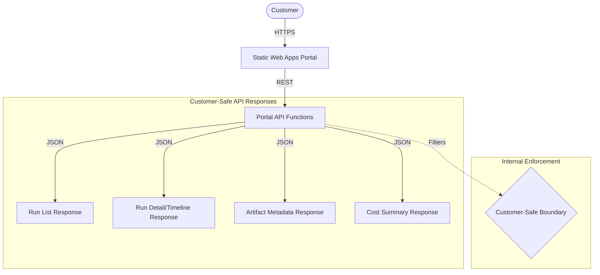

# Static Status Portal Shell Contract

Customer-facing portal reference for tracking AI pipeline executions using Azure Static Web Apps.

## Purpose

Expose business-friendly status for AI pipelines without requiring the customer to access Azure Portal, Functions logs, Foundry, or technical dashboards. This module defines the contract and UI shell for a React application hosted on Azure Static Web Apps.

## Portal Responsibilities

- **Authentication Handling**: Leverage Azure Static Web Apps built-in authentication (EasyAuth) to identify the customer.
- **Data Presentation**: Map technical JSON responses from the Portal API to human-readable UI components.
- **Security Enforcement**: Ensure no technical internals are displayed by strictly adhering to the customer-safe boundary.
- **State Management**: Provide real-time or polling-based updates for active pipeline runs.

## Architecture Boundary

The following Mermaid diagram represents the flow from the customer to the underlying status responses, mediated by the Portal API.

## UI Surface Contract

The portal defines the following primary UI surfaces. Implementation must use the fields provided by the `shared/contracts/` schemas.

### 1. Run List (Dashboard)
- **Source**: `GET /runs`
- **Fields**: `id`, `pipeline_type`, `status`, `created_at`.
- **Behavior**: Displays a table or list of recent executions. Status should be color-coded (e.g., green for `completed`, red for `failed`).

### 2. Run Detail & Timeline
- **Source**: `GET /runs/{id}`
- **Fields**: `business_summary`, `progress_percent`, `friendly_error`, `started_at`, `finished_at`.
- **Timeline Components**: Displays a list of `PipelineStep` objects showing `name` (Friendly Name), `status`, and `output_summary`.

### 3. Artifacts List
- **Source**: `GET /runs/{id}/artifacts`
- **Fields**: `id`, `safe_name`, `kind`, `size_bytes`, `created_at`.
- **Behavior**: Lists files available for download.
- **Download Action**: Must use an opaque, customer-safe proxied route (e.g., `GET /api/artifacts/{id}/download`).
- **Constraint**: The `storage_ref` field is **internal-only metadata** and must never be exposed or used by the frontend to construct direct storage URLs or SAS links.

### 4. Cost Summary
- **Source**: `GET /runs/{id}/cost`
- **Fields**: `estimated_amount`, `currency`.
- **Behavior**: Displays the aggregated estimate for the specific run.

### 5. Friendly Error Panel
- **Trigger**: Displayed when `PipelineRun.status` is `failed` or a step fails.
- **Field**: `PipelineRun.friendly_error`.
- **Constraint**: Must NEVER display `internal_log` or `stack_trace`.

### 6. Start Run Placeholder
- **Source**: `POST /runs/start`
- **Behavior**: A "New Processing Run" button that initiates a pipeline and redirects to the new Run Detail page.

## API Contract Usage

The portal consumes the [Portal API Functions](../../functions/portal-api-functions/) contract.

| Endpoint | Method | Response Schema | Description |
|----------|--------|-----------------|-------------|
| `/api/runs` | GET | `PipelineRun[]` | List recent runs. |
| `/api/runs/{id}` | GET | `PipelineRun` | Detailed status and steps. |
| `/api/runs/{id}/artifacts` | GET | `Artifact[]` | List customer-visible artifacts. |
| `/api/artifacts/{id}/download` | GET | `Stream` | Opaque download route (proxied by API). |
| `/api/runs/{id}/cost` | GET | `number` (Aggregate) | Get total estimated cost. |
| `/api/runs/start` | POST | `PipelineRun` | Manually trigger a new run. |

## Customer-Safe Status Boundary

This portal strictly enforces the [Customer-Safe Status Boundary](../../security/customer-safe-status-boundary/).

### Forbidden Data (Internal-Only)
The following items **must never** be exposed in the UI or stored in the portal's local state:
- **Raw Logs**: No technical stdout/stderr or function execution logs.
- **Prompts**: No LLM system prompts, instructions, or grounding text.
- **Provider Payloads**: No raw JSON from Document Intelligence or OpenAI.
- **Azure Resource IDs**: No Azure Subscription IDs, Tenant IDs, or Resource Group names.
- **Tenant IDs**: No technical tenant identifiers.
- **Subscription IDs**: No technical subscription identifiers.
- **Secrets**: No storage keys, SAS tokens, or connection strings.
- **Storage Internals**: No `storage_ref` or raw container/blob names.
- **Internal Exceptions**: No stack traces, file paths, or line numbers.
- **Stack Traces**: No internal code execution details.

## Local / Demo Flow

1. **Mock Data**: Use the schemas in `shared/contracts/` to generate mock JSON files.
2. **Local Development**: Run a React dev server (e.g., Vite) and proxy `/api` requests to a local instance of `portal-api-functions` or a mock server.
3. **SWA CLI**: Use `swa start http://localhost:5173 --api-location http://localhost:7071` to test the integrated experience.

## Deployment Assumptions

- **Host**: Azure Static Web Apps (SWA).
- **API Integration**: Linked Azure Functions (Flex Consumption) providing the Portal API.
- **Authentication**: SWA Built-in authentication (EasyAuth).

## Known Limits

- **Read-Only Focus**: The primary purpose is status monitoring; complex data mutation is out of scope.
- **Latency**: UI updates are subject to the polling interval or the latency of the underlying status store.
- **Authentication Scope**: Assumes `customer_id` is derived from the SWA authentication header and handled by the API.
