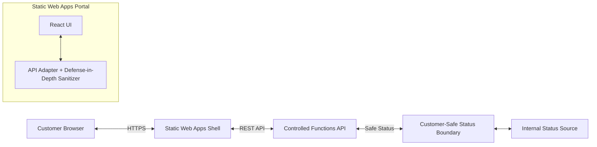

# Static Status Portal Shell

A minimal, locally testable, and customer-safe status portal shell for Azure Static Web Apps.

## Purpose

The Static Status Portal provides a read-only, business-level view of pipeline runs and outcomes. It implements the [Static Status Portal Contract](./README_CONTRACT.md) and enforces the [Customer-Safe Status Boundary](../../security/customer-safe-status-boundary/README.md).

This shell is designed to be hosted as an Azure Static Web App, consuming a controlled API that returns only allowlisted fields.

## Portal Responsibilities

- **Authentication:** Authentication is outside the scope of this bounded version. In a production deployment, this would leverage Azure Static Web Apps built-in authentication.
- **Presentation:** Provides a React-based interface for tracking pipeline progress and outcomes.
- **Sanitization:** Implements client-side defense-in-depth to prevent any technical leakage.
- **Mocking:** Supports a local fixture mode for rapid development and testing without Azure dependencies.

## Architecture Boundary



## Deployment / IaC Decision

- **Platform:** Azure Static Web Apps (SWA).
- **Reasoning:** SWA provides a simplified, scalable, and secure hosting model for static React applications. It integrates well with Azure Functions for a serverless backend and provides built-in support for custom domains and SSL.
- **Infrastructure:** Managed via module-local Terraform in `infra/terraform/`.
- **Authentication:** Intentionally omitted in this version to focus on the presentation and security boundary; will be added in a future track using SWA built-in auth.

## Known Limits & Trade-offs

- **Read-Only:** The portal is currently read-only; the "Start New Run" button is a placeholder.
- **Static Fixtures:** Local development defaults to static fixtures instead of a real API.
- **Download Forbidden:** Artifact download is explicitly forbidden to maintain the security boundary.
- **Manual Authentication:** Authentication must be configured separately at the SWA service level if needed before Track 5.

## UI Surface Contract

The portal shell provides the following functional components:

### 1. Run List
Displays a list of recent pipeline runs.
- **Fields:** Opaque ID, Status, Created Date, Summary.
- **Constraint:** Must never display internal database keys or subscription identifiers.

### 2. Run Detail & Timeline
A detailed view of a single pipeline run showing its execution path.
- **Behavior:** Renders high-level stages and their completion status as a timeline.
- **Constraint:** Forbidden to show raw logs, internal step IDs, or technical stack traces.

### 3. Artifacts List
Lists safe, customer-facing artifact metadata produced by the pipeline.
- **Fields:** Friendly Name, Type, Size.
- **Constraint:** Must never provide download links, expose SAS tokens, storage account keys, or internal storage paths (storage_ref).

### 4. Cost Summary
Optional high-level cost or resource consumption summary.
- **Behavior:** Shows business-level units (e.g., "Credits used").
- **Constraint:** Must never show raw Azure billing details or currency unless explicitly safe.

### 5. Friendly Error Panel
A dedicated UI component for rendering non-technical failures.
- **Behavior:** Translates technical error codes into human-readable guidance.
- **Constraint:** Must never render provider payloads, internal exceptions, or stack traces.

### 6. Start Run Placeholder
A UI shell for future pipeline triggers.
- **Behavior:** Displays a disabled "+ Start New Run" button as a placeholder for future functionality.

## API Contract Usage

The portal consumes the `CustomerSafeStatus` schema. All interactions with the backend are brokered through the API adapter which enforces the safety boundary by sanitizing inputs and failing closed on invalid data.

## Customer-Safe Status Boundary

This module strictly adheres to the repository security standards.

### Forbidden Data (Internal-Only)
The following information is strictly forbidden from being displayed in the UI or contained in the API responses reaching the portal:
- **Raw Logs** and technical debug output.
- **Prompts** used for AI grounding or system instructions.
- **Provider Payloads** from internal services (Azure DevOps, GitHub).
- **Azure Resource IDs**, Tenant IDs, and Subscription IDs.
- **Secrets**, tokens, SAS tokens, storage keys, and connection strings.
- **Internal Exceptions** and technical stack traces.
- **storage_ref** or internal storage paths.

## Getting Started

### Prerequisites
- Node.js 18+
- npm

### Installation
```bash
cd building-blocks/portals/static-status-portal
npm install
```

### Local Development
The portal uses built-in fixtures by default.
```bash
npm run dev
```

### Testing
```bash
npm run test
```

### Linting
```bash
npm run lint
```

### Build
```bash
npm run build
```

## Infrastructure

The infrastructure is located in `infra/terraform/`. It provisions a basic Azure Static Web App.

### Deployment Assumptions & Cost Drivers
- **Azure Static Web Apps:** Standard tier is used by default for production features.
- **Bandwidth:** Standard data transfer rates apply.
- **Authentication:** Uses built-in SWA authentication.

### Deployment Proof
```bash
cd infra/terraform
terraform init -backend=false
terraform validate
```

## References
- [Azure Static Web Apps documentation](https://learn.microsoft.com/en-us/azure/static-web-apps/)
- [Customer-Safe Status Boundary](../../security/customer-safe-status-boundary/README.md)
