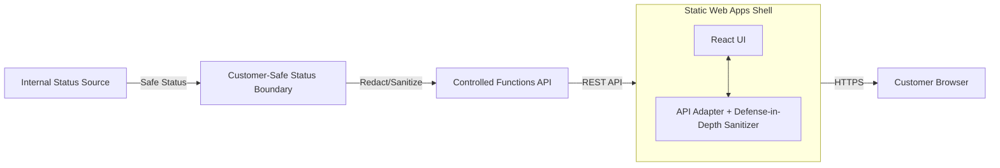

# Static Status Portal Shell

A minimal, locally testable, and customer-safe status portal shell for Azure Static Web Apps.

## Purpose

The Static Status Portal provides a read-only, business-level view of pipeline runs and outcomes. It implements the [Static Status Portal Contract](./README_CONTRACT.md) and enforces the [Customer-Safe Status Boundary](../../security/customer-safe-status-boundary/README.md).

This shell is designed to be hosted as an Azure Static Web App, consuming a controlled API that returns only allowlisted fields.

## Features

- **P0 Views:** Run list, progress tracking, friendly failures, and safe artifact metadata.
- **Security First:** Explicit client-side sanitization in the adapter acts as **Defense in Depth**; the primary security boundary is enforced at the API level.
- **Fixture Support:** Built-in mock data for local development without Azure dependencies.
- **SWA Ready:** Includes `staticwebapp.config.json` with authenticated routes and security headers.
- **Infrastructure:** Minimal Terraform for `azurerm_static_web_app`.

## Architecture



## Security Policy

The primary security boundary is the **Controlled Functions API**, which must only return allowlisted `CustomerSafeStatus` and `FriendlyFailure` fields.

The frontend API adapter provides **Defense in Depth** by explicitly sanitizing all incoming JSON to ensure technical internals never reach the React UI state, even if the backend returns unexpected fields.

This portal **never** renders:
- Raw Logs or stack traces.
- AI system prompts.
- Internal Azure Resource IDs or Subscription IDs.
- Secrets, tokens, or IaC data.

## Getting Started

### Prerequisites
- Node.js 18+
- npm

### Installation
```bash
cd building-blocks/portals/static-status-portal
npm install
```

### Local Development
The portal uses built-in fixtures by default.
```bash
npm run dev
```

### Testing
```bash
npm run test
```

### Build
```bash
npm run build
```

## Infrastructure

The infrastructure is located in `infra/terraform/`. It provisions a basic Azure Static Web App.

### Deployment Proof
```bash
cd infra/terraform
terraform init
terraform validate
```

## References
- [Azure Static Web Apps documentation](https://learn.microsoft.com/en-us/azure/static-web-apps/)
- [Customer-Safe Status Boundary](../../security/customer-safe-status-boundary/README.md)
