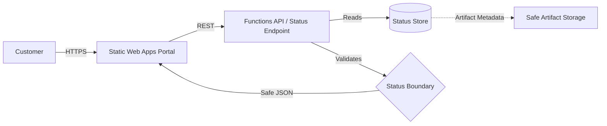

# Static Status Portal

Customer-facing portal reference for tracking AI pipeline executions.

## Purpose

Expose business-friendly status for AI pipelines without requiring the customer to access Azure Portal, Functions logs, Foundry, or technical dashboards. This module defines the contract and scaffold for a React application hosted on Azure Static Web Apps.

## Scenario

A customer initiates a long-running AI task (e.g., "Analyze Legal Document"). Instead of waiting for an email or checking technical logs, they are directed to this portal to:
1. Track real-time progress of the analysis steps.
2. View a business-level summary of the findings.
3. Download generated artifacts (e.g., a summary PDF).
4. See an estimate of the execution cost.
5. Understand any failures through friendly, non-technical error messages.

## Architecture

The portal follows a serverless architecture, separating the presentation layer from the status storage through a controlled API boundary.

## Expected UI Sections

- **Run List:** A dashboard view showing recent pipeline executions with their status (`running`, `completed`, `failed`), start time, and pipeline type.
- **Run Detail:** A focused view for a specific run showing the `business_summary`, total `progress_percent`, and `estimated_cost`.
- **Step Timeline:** A vertical or horizontal timeline representing `PipelineStep` objects. Each step shows its `name` (as a business-friendly step name), status, and `output_summary`.
- **Artifact List:** A section within the detail view listing available `Artifact` objects (using `safe_name`) marked as `is_customer_visible: true`.
- **Friendly Error Panel:** A prominent alert shown when a run or step fails, using the `friendly_error` field instead of technical stack traces.

## API Contract

The portal expects a backend API (typically Azure Functions) to expose the following endpoints, returning data that strictly adheres to the `shared/contracts/` schemas.

| Endpoint | Method | Response Schema | Description |
|----------|--------|-----------------|-------------|
| `/api/runs` | GET | `PipelineRun[]` | List recent runs for the authenticated customer. |
| `/api/runs/{id}` | GET | `PipelineRun` | Detailed status of a specific run. |
| `/api/runs/{id}/steps` | GET | `PipelineStep[]` | List of steps for a specific run. |
| `/api/runs/{id}/artifacts` | GET | `Artifact[]` | List of customer-visible artifacts. |

## Security and Status Boundary

This portal strictly enforces the **SEC-001 Customer-Safe Status Boundary**.

### Explicitly Forbidden Fields
The portal and its supporting API **must not** expose:
- **Raw Logs:** No technical stdout/stderr or function execution logs.
- **Prompts:** No LLM system prompts or few-shot examples.
- **Secrets:** No API keys, SAS tokens (unless short-lived for download), or connection strings.
- **Stack Traces:** No code-level error details or file paths.
- **Internal Payloads:** No raw JSON responses from Azure AI Foundry or DevOps APIs.
- **Resource IDs:** No raw Azure Subscription or Resource Group IDs.

## Local and Demo Assumptions

- **Mock API:** For local development without a backend, the portal can consume static JSON files matching the schemas in `shared/contracts/`.
- **Auth:** Authentication is assumed to be handled by Azure Static Web Apps (EasyAuth) or Entra External ID, providing a `customer_id` header to the backend API.

## Deployment Notes

- **Host:** Azure Static Web Apps (Standard or Free tier).
- **API:** Integrated Azure Functions (Managed or Linked).
- **CI/CD:** Deployed via GitHub Actions or Azure Pipelines using the standard SWA deployment task.

## Known Limits

- **Read-Only:** This scaffold focus is on status visibility. It does not include pipeline triggering or mutation tools by default.
- **Latency:** Status updates depend on the underlying pipeline (e.g., Durable Functions) updating the status store.
