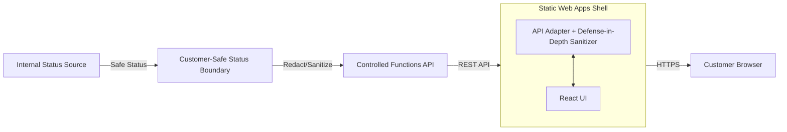

# Static Status Portal Contract

Reference documentation and contract for a customer-safe static status portal.

## Purpose

The Static Status Portal provides a read-only, business-level view of pipeline runs and outcomes. It is designed to be hosted as an Azure Static Web App, consuming a controlled API that enforces the [Customer-Safe Status Boundary](../../security/customer-safe-status-boundary/README.md).

The goal of this portal is to keep customers informed of progress without exposing any technical internals, logs, or cloud resource details.

## Architecture

- **Internal Status Source:** The backend system (e.g., Durable Functions, Azure DevOps) that holds the raw, technical execution state.
- **Customer-Safe Status Boundary:** A security layer that ensures only allowlisted fields are returned.
- **Controlled Functions API:** An Azure Functions backend that acts as the primary gateway and security boundary.
- **Static Web Apps Shell:** A React/TypeScript frontend that handles presentation and includes client-side sanitization as defense in depth.

## Minimum Portal Views

The portal must implement at least the following views:

1. **Run List / Lookup:**
   - Displays a list of recent runs for the authenticated customer.
   - Allows lookup of a specific run by a safe, opaque ID.
2. **Business Status & Progress:**
   - Shows the current high-level status (`pending`, `running`, `completed`, `failed`, `cancelled`).
   - Displays a visual progress bar based on `progress_percent`.
   - Displays the `business_summary` providing a friendly description of the current state.
3. **Friendly Failure:**
   - When a run fails, displays a non-technical `friendly_error`.
   - Forbids the display of stack traces or raw provider error messages.
4. **Safe Artifact Metadata:**
   - Lists output artifacts that are marked as customer-visible.
   - Displays safe names, sizes, and content types.

## API Contract

The portal consumes the `CustomerSafeStatus` schema defined in the [Security Boundary](../../security/customer-safe-status-boundary/README.md).

### Consumed Fields (Display-Only)

| Field | Type | Description | Source Schema |
|-------|------|-------------|---------------|
| `id` | string | Opaque, safe identifier. | `CustomerSafeStatus` |
| `status` | enum | Business-level status. | `CustomerSafeStatus` |
| `business_summary` | string | Friendly progress/outcome summary. | `CustomerSafeStatus` |
| `progress_percent` | integer | 0-100 completion percentage. | `CustomerSafeStatus` |
| `created_at` | string | ISO-8601 creation time. | `CustomerSafeStatus` |
| `safe_artifacts` | array | List of safe artifact metadata. | `CustomerSafeStatus` |
| `friendly_error` | string | Mapped, non-technical error message. | `CustomerSafeStatus` (via derived presentation) |

### Forbidden Data

The following technical and internal data **must never reach the browser or the portal API response**:

- **Raw Logs:** No execution traces, debug output, or stdout/stderr.
- **Prompts:** No AI model system prompts or grounding instructions.
- **Tokens/Secrets:** No API keys, bearer tokens, or connection strings.
- **Stack Traces:** No internal code paths, line numbers, or raw exception details.
- **Provider Payloads:** No raw JSON from Azure DevOps, GitHub, or Azure AI services.
- **Internal IDs:** No Azure Resource IDs, Subscription IDs, or Tenant IDs.
- **IaC State:** No Terraform state files or deployment plans.

## UI States and Behavior

| State | Portal Behavior |
|-------|-----------------|
| **Loading** | Displays a skeleton screen or non-technical loading indicator. |
| **Empty** | Displays a "No runs found" message for the customer. |
| **Not Found** | Displays a friendly 404 page for invalid or unauthorized IDs. |
| **Failed** | Displays the `friendly_error` and a way to contact support or retry. |
| **Completed** | Displays the final summary and links to safe artifacts. |
| **Unavailable** | Displays a maintenance or service disruption message. |

## Authentication and Security

- **Authentication:** Required for all views. The portal must use Azure Static Web Apps built-in authentication (Microsoft Entra ID or GitHub).
- **Authorization:** Data must be scoped to the authenticated user's `customer_id`.
- **Encryption:** All traffic must be over HTTPS.
- **Write API:** This module does not define or allow an unauthenticated write API. All pipeline triggers must be handled through a separate, secure process.

## References

- [Azure Static Web Apps overview](https://learn.microsoft.com/en-us/azure/static-web-apps/overview)
- [Azure Static Web Apps configuration](https://learn.microsoft.com/en-us/azure/static-web-apps/configuration)
- [Azure Static Web Apps authentication](https://learn.microsoft.com/en-us/azure/static-web-apps/authentication-authorization)
- [Customer-Safe Status Boundary](../../security/customer-safe-status-boundary/README.md)
