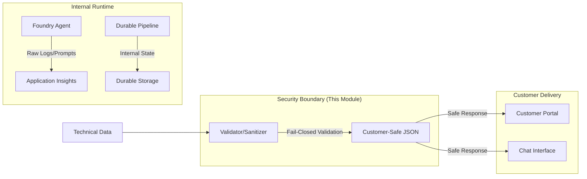

# Customer-Safe Status Boundary

Reference security building block defining the boundary between internal technical telemetry and customer-safe business status.

## Purpose

This module provides formal JSON schemas and Python validation/sanitization helpers to ensure that technical details (like stack traces, prompts, or secrets) are never exposed to customers. It defines the stable boundary that portals, agents, and pipelines must use when returning data to a user.

## Architecture Boundary



## Data Boundary Policy

### Allowed Fields (Customer-Safe)
- **Business Status:** `pending`, `running`, `completed`, `failed`, `cancelled`.
- **Friendly Summaries:** High-level progress or outcome descriptions.
- **Safe Artifact Metadata:** Public filenames, sizes, and content types.
- **Cost Estimates:** Aggregated costs in standard units.
- **Opaque Identifiers:** Safe UUIDs or names (no raw Azure resource IDs).
- **Friendly Errors:** Pre-mapped error codes and messages.

### Forbidden Fields (Internal-Only)
- **Raw Logs:** Verbose execution details or internal debug info.
- **Prompts:** System instructions or model grounding text.
- **Secrets/Tokens:** API keys, connection strings, or bearer tokens.
- **Stack Traces:** Error details, file paths, or line numbers.
- **Provider Payloads:** Raw JSON responses from Azure AI, OpenAI, or DevOps APIs.
- **Internal IDs:** Azure subscription IDs, tenant IDs, or raw resource URIs.

## Usage

### Validation
Use `validate_status` to ensure an object is customer-safe before returning it. It will raise a `ValidationError` if unknown or forbidden fields are present.

```python
from src.validator import validate_status

safe_status = {
    "id": "run-123",
    "status": "completed",
    "created_at": "2026-07-03T12:00:00Z"
}

validate_status(safe_status)  # Success
```

### Sanitization
Use `sanitize_status` to automatically strip unknown fields from a dictionary.

```python
from src.validator import sanitize_status

raw_data = {
    "id": "run-123",
    "status": "completed",
    "internal_log": "DEBUG: connect to db"
}

clean_data = sanitize_status(raw_data)
# clean_data = {"id": "run-123", "status": "completed"}
```

## Local Validation

```bash
# Run tests
pytest tests/

# Linting
ruff check .
```

## Known Limits
- **Shallow Sanitization:** Sanitization currently handles top-level fields and nested `safe_artifacts`. It does not recurse into arbitrary nested objects.
- **Content Inspection:** This module validates structure and field names. It does not perform deep content inspection (e.g., PII scanning or secret detection inside a business summary string).

## References
- [Microsoft Foundry Agent Service overview](https://learn.microsoft.com/en-us/azure/foundry/agents/overview)
- [OWASP Logging Cheat Sheet](https://cheatsheetseries.owasp.org/cheatsheets/Logging_Cheat_Sheet.html)
