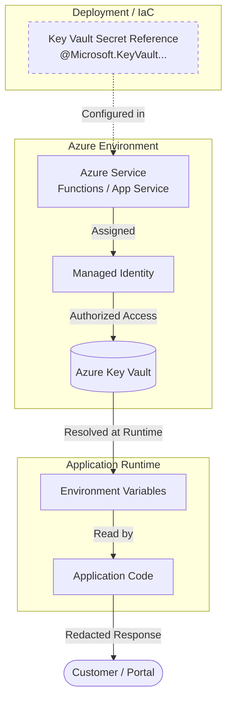

# Key Vault Secret Handling Reference

Practical guidance for using Azure Key Vault, managed identity, secret references, and customer-safe redaction in Azure Reference Kit modules.

## Purpose

This building block defines the standard for handling sensitive configuration (secrets, keys, certificates) in Azure. It prioritizes **Identity-first** access and **Secret-less** application code to prevent credential leakage and ensure customer-facing interfaces remain secure.

## When to Use

- When an Azure service (Function, Web App, Container) needs to access a secret (API key, third-party token, certificate).
- To centralize secret management and auditing.
- To implement automated secret rotation (outside the scope of this reference, but supported by the pattern).
- To maintain a "no-secrets-in-code" posture across the repository.

## When Not to Use

- For **Identity-supported services:** If a service (like Azure Storage or Azure OpenAI) supports Entra ID Managed Identity, use [Managed Identity and RBAC](../managed-identity-rbac/) instead of storing keys in Key Vault.
- For non-sensitive configuration: Use standard environment variables or App Configuration for non-sensitive values.
- As a primary database: Key Vault is for small, sensitive secrets, not application data.

## Service-Level Mermaid Diagram

This diagram shows how secrets flow from Key Vault to the application runtime via Managed Identity and platform-level references, ensuring the application code only interacts with environment variables.



## Practical Guidance

### Azure Functions (Flex Consumption & Dedicated)

The preferred way to use Key Vault secrets in Azure Functions is through **Key Vault References**. This allows the platform to fetch the secret and inject it as an environment variable before your code starts.

**Pattern:** Use the `@Microsoft.KeyVault(SecretUri=...)` syntax in your App Settings.

- **Flex Consumption:** Supports Key Vault references using the System-Assigned or User-Assigned identity. Ensure the identity has the `Key Vault Secrets User` role.
- **Identity-based lookup:** For Flex Consumption, set `AZURE_CLIENT_ID` if using User-Assigned identity to ensure the reference resolver uses the correct identity.

### App Service / Web App for Containers

Similar to Functions, App Service supports Key Vault references in Application Settings. This keeps your container image agnostic of secret retrieval logic.

### Agents and Tools (Foundry / MCP)

Agents should never handle raw secrets.
- **Tools:** If a tool (Function or API) needs a secret to call a third-party service, it should fetch it from its own environment variables (resolved via Key Vault references).
- **Redaction:** Any sensitive value retrieved by a tool must be redacted or transformed into a friendly status before being returned to the Agent.

### Pipelines (Durable Functions)

Orchestrators and activities should use identity-based connections for Azure services. If a legacy third-party API requires a key, use the same environment variable pattern as Functions.

### Terraform / OpenTofu Outputs

**Forbidden:** Never output raw secrets, connection strings, or sensitive URIs in Terraform outputs.
- Use `sensitive = true` for variables and outputs that might contain sensitive data, but avoid outputting the secret value itself.
- Prefer outputting the **Secret Name** or **Vault URI** (if safe) rather than the value.

### Local Development

Developers should **not** have the actual production secrets on their local machines.
- Use **Placeholder Names** in `local.settings.json` or `.env` (e.g., `THIRD_PARTY_API_KEY=PLACEHOLDER_FOR_LOCAL_DEV`).
- If local access to a development Key Vault is required, use `DefaultAzureCredential` to authenticate as the developer identity.

## Allowed vs. Forbidden Patterns

### Allowed Patterns (Recommended)
- **Managed Identity:** Using `Key Vault Secrets User` RBAC role for the service identity.
- **Key Vault References:** `@Microsoft.KeyVault(SecretUri=...)` in App Settings.
- **Environment Variables:** Application code reading `os.environ["MY_SECRET"]`.
- **Local Placeholders:** Using descriptive placeholder values for local runs.
- **Customer-Safe Redaction:** Mapping technical errors or sensitive values to friendly messages.

### Forbidden Patterns (STRICTLY FORBIDDEN)
- **Committed Secrets:** No secrets in `main.tf`, `src/`, or any file committed to Git.
- **Unsafe Files:** No `.env` or `local.settings.json` with real secrets committed.
- **Connection Strings:** Do not use Shared Access Keys (SAK), SAS tokens, PATs, bearer tokens, or connection strings if identity is supported.
- **Raw Secret Values in Logs:** Never log the value of a secret.
- **Secret URIs in Responses:** Never return a Key Vault Secret URI to a customer-facing API.
- **Infrastructure Exposure:** No Tenant IDs, Subscription IDs, or Managed Identity Object IDs in customer responses.
- **IaC Artifacts:** Never commit Terraform state files or plans to source control.

## Copyable Documentation Snippets

### Snippet: Secrets and Configuration (for README.md)
```markdown
### Secrets and Configuration
This module uses Azure Key Vault to manage sensitive values.
- **Production:** Secrets are resolved via [Key Vault References](https://learn.microsoft.com/en-us/azure/app-service/app-service-key-vault-references) and injected as environment variables.
- **Identity:** The service identity must be granted the `Key Vault Secrets User` role on the vault.
- **Environment Variables:**
  - `EXTERNAL_SERVICE_API_KEY`: The secret value (resolved at runtime).
```

### Snippet: Local Development (for README.md)
```markdown
### Local Development
To run this module locally, create a `local.settings.json` (for Functions) or `.env` (for APIs) using placeholders:
```json
{
  "Values": {
    "EXTERNAL_SERVICE_API_KEY": "PLACEHOLDER_FOR_LOCAL_DEV"
  }
}
```
> [!WARNING]
> Never commit real secrets to source control.
```

### Snippet: Customer-Safe Redaction
```python
import os
import logging

def get_safe_status(internal_error):
    # Mapping sensitive errors to customer-safe messages
    # Reference: building-blocks/security/customer-safe-status-boundary/
    logging.error(f"Internal technical error: {internal_error}") # Logged to App Insights (Internal)
    return "The service is currently unavailable. Please try again later." # Returned to Customer
```

### Snippet: Terraform Outputs
```markdown
### Infrastructure Outputs
To maintain security, this module does not output raw secrets or connection strings.
- **Vault URI:** The URI of the Key Vault is provided for reference in other modules.
- **Secret Names:** Only the names of the secrets are output to allow for Key Vault reference construction.
- **Security:** All sensitive Terraform variables are marked with `sensitive = true` to prevent accidental logging.
```

## Deployment/IaC Decision

**No-IaC**: This building block is a **Security Reference Note**.

- **Why:** Provisioning a Key Vault is a platform-level concern. This kit provides guidance on how *other* modules should consume secrets once a vault exists.
- **Implementation:** Reusable modules should document their secret requirements in `module.yaml` and their READMEs.

## Known Limits

- **Latency:** Key Vault references are resolved at startup/scaling. Very frequent secret rotation may require application-level SDK usage with caching.
- **Size:** Individual secrets are limited to 25KB.
- **Regionality:** Key Vault is a regional resource. High-availability scenarios should consider multi-region vaults or replication.

## References

- [Azure Key Vault overview](https://learn.microsoft.com/en-us/azure/key-vault/general/overview)
- [App Service and Azure Functions Key Vault references](https://learn.microsoft.com/en-us/azure/app-service/app-service-key-vault-references)
- [Azure Key Vault security features](https://learn.microsoft.com/en-us/azure/key-vault/general/security-features)
- [Managed identities for Azure resources](https://learn.microsoft.com/en-us/entra/identity/managed-identities-azure-resources/overview)
