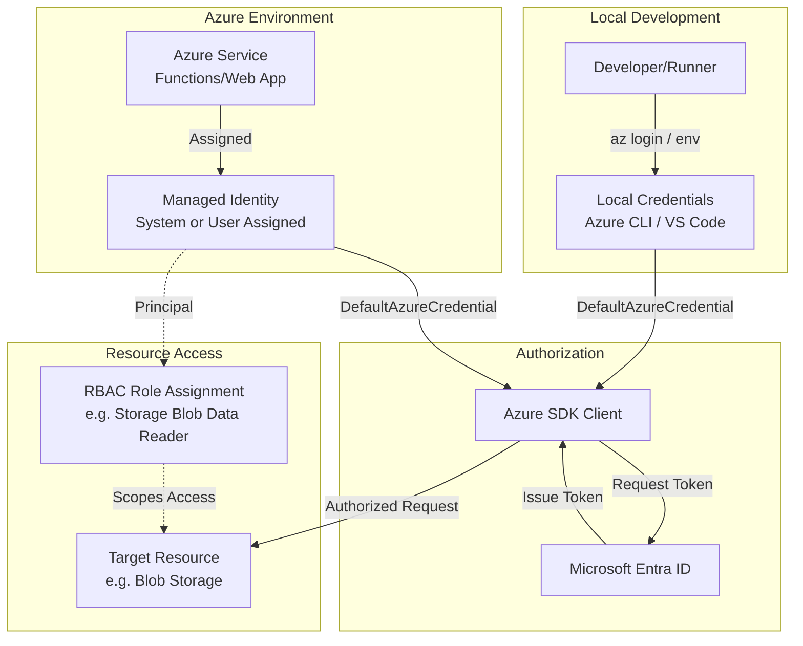

# Managed Identity and RBAC Reference Pattern

Reference pattern for implementing least-privilege service-to-service authentication and authorization in Azure.

## Purpose

Managed identities eliminate the need for developers to manage credentials. This building block defines the standard for using identities and Role-Based Access Control (RBAC) to secure Azure resources without hardcoded secrets or broad permissions.

## When to Use

- When an Azure service (Function, Web App, Container) needs to access another Azure service that supports Entra ID (Storage, Key Vault, AI Services, etc.).
- To eliminate the risk of credential leakage in source code or configuration.
- To implement least-privilege access using specific Data Plane roles.
- To simplify the local-to-cloud development experience using `DefaultAzureCredential`.

## When Not to Use

- When connecting to services that do not support Microsoft Entra ID authentication (e.g., legacy third-party APIs, some on-premises databases).
- For public, unauthenticated access to static content (though identity is still preferred for managing that content).
- For simple personal scripts where a short-lived SAS token is explicitly required and justified.

## Scenarios

- **Serverless Tools:** Azure Functions calling Blob Storage or AI Services.
- **Pipeline Orchestration:** Durable Functions managing state in Storage Tables/Blobs.
- **Agent Integration:** AI Foundry Agents accessing search indexes or tool APIs.
- **Modular Infrastructure:** Sharing a single identity across multiple related microservices.

## Identity Choice Guidance

Selecting the right type of managed identity depends on your workload's lifecycle and sharing requirements.

| Type | Lifecycle | Sharing | Recommendation / Use Case |
| :--- | :--- | :--- | :--- |
| **System-assigned** | Tied to the resource. | Cannot be shared. | **Recommended for simple, single-resource workloads.** Use when the identity should only exist as long as the service (e.g., a standalone background worker). |
| **User-assigned** | Standalone resource. | Can be shared across resources. | **Recommended for modularity and complex deployments.** Use when multiple resources need the same access (e.g., a Web App and a Function App) or when you need to pre-authorize the identity in IaC before the compute resource is created. |

## RBAC Scope Guidance

Always assign roles at the **lowest possible scope** to minimize the "blast radius" of a compromised identity.

1. **Resource Scope (Best):** Assign the role directly on the specific Blob Container, Queue, or AI Project.
2. **Resource Group Scope (Good):** Assign at the RG level if the identity needs access to all resources of that type within the group.
3. **Subscription Scope (Avoid):** Only use if the identity must manage resources across the entire subscription (rare for runtime identities).

## Forbidden Practices

To maintain a secure environment, the following practices are strictly forbidden:

- **Wildcard Permissions:** Never use `*` or `Owner` roles for runtime identities.
- **Committed Secrets:** Do not commit API keys, connection strings, or service principal secrets to source control.
- **Hardcoded Identifiers:** Do not hardcode Tenant IDs, Subscription IDs, or Managed Identity Object IDs in application code.
- **Raw Token Exposure:** Do not log, store, or return raw Entra ID access tokens to client-facing interfaces.
- **Connection Strings:** Prefer identity-based connections over Shared Access Keys (SAK) or connection strings for supported services.

## Local Development Fallback

It is critical to separate the credentials used during local development from the identity used in the Azure runtime.

- **Local Development Identity:** Developers use their own Entra ID identity (via Azure CLI, VS Code, or Azure PowerShell). This identity typically has broader "Contributor" or "Developer" access to the development environment.
- **Azure Runtime Identity:** The deployed service uses a **Managed Identity** (System or User Assigned) with strictly limited **Data Plane** RBAC roles (e.g., `Storage Blob Data Reader`). The service should never use the developer's personal credentials or a broad-privilege service principal in production.

For a seamless transition, use the `DefaultAzureCredential` class from the `azure-identity` SDK, which handles the fallback logic automatically by checking for the presence of a managed identity environment and falling back to local tools if not found.

### Python Implementation
```python
import os
from azure.identity import DefaultAzureCredential
from azure.storage.blob import BlobServiceClient

# Best practice: Check for an explicit Client ID if using User-Assigned Identity
client_id = os.environ.get("AZURE_CLIENT_ID")
credential = DefaultAzureCredential(managed_identity_client_id=client_id) if client_id else DefaultAzureCredential()

# Initialize client using identity, not a connection string
blob_service_client = BlobServiceClient(
    account_url="https://<account_name>.blob.core.windows.net",
    credential=credential
)
```

## Concrete Implementation Examples

### Example 1: Azure Function to Storage (Identity-Based)

In this pattern, the Function App is granted `Storage Blob Data Contributor` and `Storage Queue Data Message Processor` access to a specific storage account. No connection string is stored in App Settings.

**Configuration (App Settings):**
- `STORAGE_CONNECTION__accountName = "mystorageaccount"`
- `STORAGE_CONNECTION__credential = "managedidentity"`
- `STORAGE_CONNECTION__clientId = "<client-id>"` (Optional for User-Assigned)

**Code:**
```python
import os
from azure.identity import DefaultAzureCredential
from azure.storage.queue import QueueClient

# Azure Functions can use identity-based triggers and bindings
# For manual client initialization:
account_name = os.environ["STORAGE_CONNECTION__accountName"]
client_id = os.environ.get("STORAGE_CONNECTION__clientId")

# Pass client_id to ensure the correct User-Assigned identity is used
credential = DefaultAzureCredential(managed_identity_client_id=client_id) if client_id else DefaultAzureCredential()

queue_url = f"https://{account_name}.queue.core.windows.net/my-task-queue"
client = QueueClient(queue_url, credential=credential)

def send_task(message):
    client.send_message(message)
```

### Example 2: Web App for Containers to Key Vault

When a containerized API needs to retrieve a configuration secret, it uses its identity to access Key Vault directly.

**Configuration (Environment Variables):**
- `KEYVAULT_URL = "https://my-vault.vault.azure.net/"`
- `AZURE_CLIENT_ID = "<client-id>"` (Optional for User-Assigned)

**Code:**
```python
import os
from azure.identity import DefaultAzureCredential
from azure.keyvault.secrets import SecretClient

vault_url = os.environ["KEYVAULT_URL"]
client_id = os.environ.get("AZURE_CLIENT_ID")
credential = DefaultAzureCredential(managed_identity_client_id=client_id) if client_id else DefaultAzureCredential()
client = SecretClient(vault_url=vault_url, credential=credential)

def get_config_secret(name):
    # Returns only the specific secret value
    secret = client.get_secret(name)
    return secret.value
```

### Example 3: AI Foundry Agent Tool Boundary

When an AI Foundry Agent calls a tool (e.g., an Azure Function), the Function should use its own Managed Identity to access backend data, ensuring the agent itself never touches raw data or secrets.

**Infrastructure (Conceptual):**
1. Agent Identity: `id-foundry-agent`
2. Tool Identity: `id-search-tool`
3. Role Assignment: `id-search-tool` is granted `Search Index Data Reader` on the AI Search index.

**Code (Tool Side):**
```python
import os
from azure.identity import DefaultAzureCredential
from azure.search.documents import SearchClient

# The tool uses its own identity to perform the action
endpoint = os.environ["SEARCH_ENDPOINT"]
index_name = os.environ["SEARCH_INDEX_NAME"]
client_id = os.environ.get("AZURE_CLIENT_ID")

credential = DefaultAzureCredential(managed_identity_client_id=client_id) if client_id else DefaultAzureCredential()
search_client = SearchClient(endpoint, index_name, credential=credential)

def perform_search(query):
    # Returns only safe, business-level results to the Agent
    results = search_client.search(query)
    return [r['content'] for r in results] # Minimal sanitization example
```

## Architecture Flow



## Deployment/IaC Decision

This building block is a **Security Reference Pattern**.

- **Implementation:** Other modules and solutions (Functions, Web Apps) must implement these patterns when provisioning their own identities and RBAC assignments.
- **Reference Code:** See [infra/terraform/](infra/terraform/) for illustrative Terraform patterns showing how to create identities, assign roles, and configure services for identity-based access.

## Azure Deployment Assumptions

- **Entra ID Integration:** The target resource must support Microsoft Entra authentication.
- **Identity Support:** The hosting platform (e.g., Azure Functions, ACA) must support Managed Identity.
- **RBAC Propagation:** Role assignments can take up to 10-15 minutes to propagate across all Azure regions.

## Known Limits

- **System-Assigned Limits:** A resource can only have one system-assigned identity.
- **User-Assigned Limits:** There are limits on the number of user-assigned identities per resource (typically 20-50).
- **Scope Limits:** Subscription-level role assignments are capped (typically 2000-4000 per subscription).

## Validation Notes

To verify this pattern in a new module:
1. Ensure `module.yaml` defines the required RBAC roles in the `security_boundary`.
2. Check that `DefaultAzureCredential` is used in the source code.
3. Verify that no secrets or connection strings are present in App Settings or environment variables.

## References

- [Managed identities for Azure resources overview](https://learn.microsoft.com/en-us/entra/identity/managed-identities-azure-resources/overview)
- [Azure role-based access control (Azure RBAC) overview](https://learn.microsoft.com/en-us/azure/role-based-access-control/overview)
- [Azure RBAC best practices](https://learn.microsoft.com/en-us/azure/role-based-access-control/best-practices)
- [Azure built-in roles](https://learn.microsoft.com/en-us/azure/role-based-access-control/built-in-roles)
- [Azure Functions identity-based connections](https://learn.microsoft.com/en-us/azure/azure-functions/functions-reference?tabs=blob&pivots=programming-language-python#configure-an-identity-based-connection)
