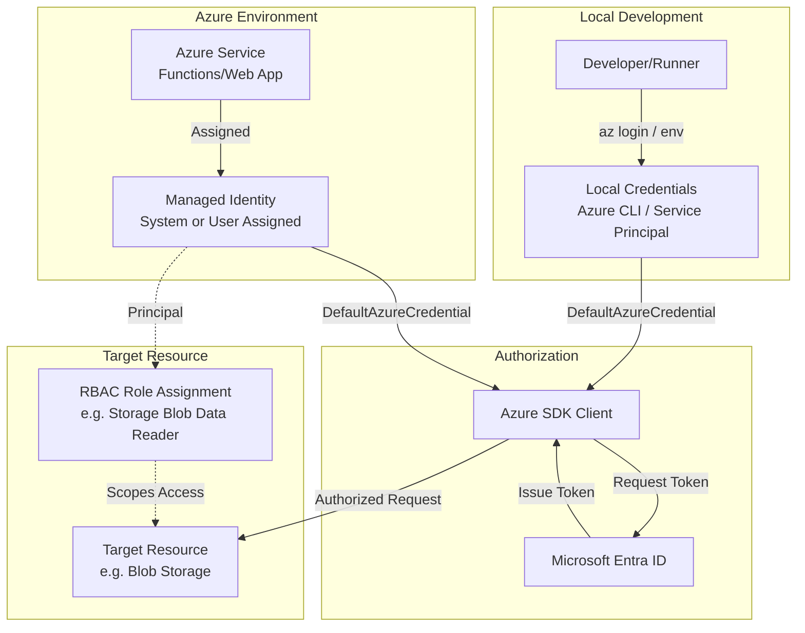

# Managed Identity and RBAC Reference Pattern

Reference pattern for implementing least-privilege service-to-service authentication and authorization in Azure.

## Purpose

Managed identities eliminate the need for developers to manage credentials. This building block defines the standard for using identities and Role-Based Access Control (RBAC) to secure Azure resources without hardcoded secrets or broad permissions.

## Scenarios

- **Serverless Tools:** Azure Functions calling Blob Storage or AI Services.
- **Pipeline Orchestration:** Durable Functions managing state in Storage Tables/Blobs.
- **Agent Integration:** AI Foundry Agents accessing search indexes or tool APIs.
- **Modular Infrastructure:** Sharing a single identity across multiple related microservices.

## Identity Choice Guidance

| Type | Lifecycle | Sharing | Recommendation |
| :--- | :--- | :--- | :--- |
| **System-assigned** | Tied to the resource. | Cannot be shared. | Use for simple, single-resource workloads where the identity should die with the service. |
| **User-assigned** | Standalone resource. | Can be shared across resources. | **Recommended** for modularity, pre-authorization in IaC flows, and workloads spanning multiple resources (e.g., a Function App and a Web App sharing access). |

## RBAC Scope Guidance

Always assign roles at the **lowest possible scope** to minimize the "blast radius" of a compromised identity.

1. **Resource Scope (Best):** Assign the role directly on the specific Blob Container, Queue, or AI Project.
2. **Resource Group Scope (Good):** Assign at the RG level if the identity needs access to all resources of that type within the group.
3. **Subscription Scope (Avoid):** Only use if the identity must manage resources across the entire subscription (rare for runtime identities).

## Local Development Fallback

For a seamless transition between local development and Azure hosting, utilize the `DefaultAzureCredential` class from the `azure-identity` SDK.

- **Local:** Uses Azure CLI, VS Code, or environment variables (`AZURE_CLIENT_ID`, `AZURE_TENANT_ID`, `AZURE_CLIENT_SECRET`).
- **Azure:** Automatically utilizes the assigned Managed Identity.

### Python Example
```python
from azure.identity import DefaultAzureCredential
from azure.storage.blob import BlobServiceClient

# Standard pattern for all Azure Reference Kit modules
credential = DefaultAzureCredential()
blob_service_client = BlobServiceClient(account_url, credential=credential)
```

## Least-Privilege Role Examples

| Service | Target Resource | Recommended Built-in Role |
| :--- | :--- | :--- |
| **Functions / Web Apps** | Blob Storage | `Storage Blob Data Reader` (Read-only) or `Storage Blob Data Contributor` (Read/Write) |
| **Functions / Web Apps** | Storage Queues | `Storage Queue Data Message Processor` or `Storage Queue Data Message Sender` |
| **Functions / Web Apps** | Key Vault | `Key Vault Secrets User` |
| **Functions / Web Apps** | AI Services | `Cognitive Services User` |
| **AI Foundry Agent** | AI Foundry Project | `Foundry User` |

## Architecture Flow

The following diagram shows the separation between local development credentials and the Azure Managed Identity flow.



## Azure Deployment Assumptions

- **Entra ID Integration:** The target resource must support Microsoft Entra authentication.
- **Identity Support:** The hosting platform (e.g., Azure Functions, ACA) must support Managed Identity.
- **RBAC Propagation:** Role assignments can take up to 10-15 minutes to propagate across all Azure regions.

## Known Limits

- **System-Assigned Limits:** A resource can only have one system-assigned identity.
- **User-Assigned Limits:** There are limits on the number of user-assigned identities per resource (typically 20-50).
- **Scope Limits:** Subscription-level role assignments are capped (typically 2000-4000 per subscription).
- **Service Support:** Some legacy Azure services or specific features (like some Azure Files SMB flows) may still require connection strings or secrets.

## Validation Notes

To verify this pattern in a new module:
1. Ensure `module.yaml` defines the required RBAC roles in the `security_boundary`.
2. Check that `DefaultAzureCredential` is used in the source code.
3. Verify that no secrets or connection strings are present in `appsettings.json` or environment variables (excluding `AzureWebJobsStorage` if not using Flex Consumption identity-based connections).

## References

- [Managed identities for Azure resources overview](https://learn.microsoft.com/en-us/entra/identity/managed-identities-azure-resources/overview)
- [Azure role-based access control (Azure RBAC) overview](https://learn.microsoft.com/en-us/azure/role-based-access-control/overview)
- [Azure built-in roles](https://learn.microsoft.com/en-us/azure/role-based-access-control/built-in-roles)
- [Azure Functions identity connections](https://learn.microsoft.com/en-us/azure/azure-functions/functions-identity-based-connections-tutorial)
