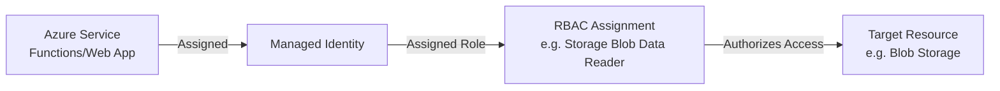

# Managed Identity and RBAC Reference Pattern

Reference pattern for implementing least-privilege service-to-service authentication and authorization in Azure.

## Purpose

Managed identities eliminate the need for developers to manage credentials. This building block defines the standard for using identities and Role-Based Access Control (RBAC) to secure Azure resources without hardcoded secrets or broad permissions.

## Managed Identity Types

| Type | Lifecycle | Sharing | Recommendation |
| :--- | :--- | :--- | :--- |
| **System-assigned** | Tied to the resource. | Cannot be shared. | Use for single-resource workloads. |
| **User-assigned** | Standalone resource. | Can be shared across resources. | **Recommended** for modularity and pre-authorization. |

## Local Development Fallback

For a seamless transition between local development and Azure hosting, utilize the `DefaultAzureCredential` class from the `azure-identity` SDK.

- **Local:** Uses Azure CLI, VS Code, or environment variables (`AZURE_CLIENT_ID`, `AZURE_TENANT_ID`, `AZURE_CLIENT_SECRET`).
- **Azure:** Automatically utilizes the assigned Managed Identity.

### Python Example
```python
from azure.identity import DefaultAzureCredential
from azure.storage.blob import BlobServiceClient

# Standard pattern for all Azure Reference Kit modules
credential = DefaultAzureCredential()
blob_service_client = BlobServiceClient(account_url, credential=credential)
```

## Least-Privilege Guidance

Always prefer specific **Data Plane** roles over broad Management Plane roles (like Contributor).

| Service | Target Resource | Recommended Built-in Role |
| :--- | :--- | :--- |
| **Functions / Web Apps** | Blob Storage | `Storage Blob Data Reader` or `Storage Blob Data Contributor` |
| **Functions / Web Apps** | Storage Queues | `Storage Queue Data Message Processor` or `Storage Queue Data Message Sender` |
| **Functions / Web Apps** | Key Vault | `Key Vault Secrets User` |
| **Functions / Web Apps** | App Configuration | `App Configuration Data Reader` |
| **AI Foundry Agent** | AI Foundry Project | `Foundry User` |
| **AI Foundry Agent** | AI Services / OpenAI | `Cognitive Services OpenAI User` |
| **Containers (ACA/AKS)** | Container Registry | `AcrPull` |
| **All Services** | Application Insights | `Monitoring Metrics Publisher` |

## Architecture Flow



## Guardrails

- **No Wildcards:** Never use `*` actions in custom roles or broad roles like `Owner`/`Contributor` when a specific data role exists.
- **No Committed Secrets:** Never commit `.env` files, client secrets, or connection strings to source control.
- **Scope Limitation:** Assign roles at the lowest possible scope (Resource level) rather than Subscription or Resource Group level whenever possible.

## References

- [Managed identities for Azure resources overview](https://learn.microsoft.com/en-us/entra/identity/managed-identities-azure-resources/overview)
- [Azure role-based access control (Azure RBAC) overview](https://learn.microsoft.com/en-us/azure/role-based-access-control/overview)
- [Azure built-in roles](https://learn.microsoft.com/en-us/azure/role-based-access-control/built-in-roles)
