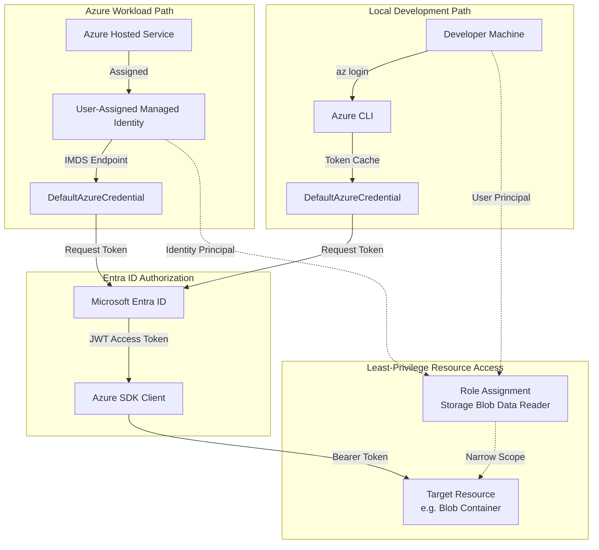

# Managed Identity and RBAC Reference Pattern

Reference pattern for implementing least-privilege service-to-service authentication and authorization in Azure.

## Purpose

Managed identities eliminate the need for developers to manage credentials. This building block defines the standard for using identities and Role-Based Access Control (RBAC) to secure Azure resources without hardcoded secrets or broad permissions.

## When to Use

- When an Azure service (Function, Web App, Container) needs to access another Azure service that supports Entra ID (Storage, Key Vault, AI Services, etc.).
- To eliminate the risk of credential leakage in source code or configuration.
- To implement least-privilege access using specific Data Plane roles.
- To simplify the local-to-cloud development experience using `DefaultAzureCredential`.

## When Not to Use

- When connecting to services that do not support Microsoft Entra ID authentication (e.g., legacy third-party APIs, some on-premises databases).
- For public, unauthenticated access to static content (though identity is still preferred for managing that content).
- For simple personal scripts where a short-lived SAS token is explicitly required and justified.

## Scenarios

- **Serverless Tools:** Azure Functions calling Blob Storage or AI Services.
- **Pipeline Orchestration:** Durable Functions managing state in Storage Tables/Blobs.
- **Agent Integration:** AI Foundry Agents accessing search indexes or tool APIs.
- **Modular Infrastructure:** Sharing a single identity across multiple related microservices.

## Identity Choice Guidance

Selecting the right type of managed identity depends on your workload's lifecycle and sharing requirements.

| Type | Lifecycle | Sharing | Recommendation / Use Case |
| :--- | :--- | :--- | :--- |
| **System-assigned** | Tied to the resource. | Cannot be shared. | **Recommended for simple, single-resource workloads.** Use when the identity should only exist as long as the service (e.g., a standalone background worker). |
| **User-assigned** | Standalone resource. | Can be shared across resources. | **Recommended for modularity and complex deployments.** Use when multiple resources need the same access (e.g., a Web App and a Function App) or when you need to pre-authorize the identity in IaC before the compute resource is created. |

## RBAC Scope Guidance

Always assign roles at the **lowest possible scope** to minimize the "blast radius" of a compromised identity.

1. **Resource Scope (Best):** Assign the role directly on the specific Blob Container, Queue, or AI Project.
2. **Resource Group Scope (Good):** Assign at the RG level if the identity needs access to all resources of that type within the group.
3. **Subscription Scope (Avoid):** Only use if the identity must manage resources across the entire subscription (rare for runtime identities).

## Forbidden Practices

To maintain a secure environment, the following practices are strictly forbidden:

- **Wildcard & Owner Roles:** Never use `*`, `Owner`, `Contributor`, or `User Access Administrator` roles for runtime identities.
- **Broad Scopes:** Avoid subscription-wide or management-group-wide assignments by default.
- **Secrets & Account Keys:** Do not use Shared Access Keys (SAK), account keys, connection strings, or API keys where identity-based access is supported.
- **Committed Credentials:** Never commit client secrets, certificates, or `.env` files to source control.
- **Hardcoded Identifiers:** Do not hardcode Tenant IDs, Subscription IDs, or Managed Identity Object IDs in application code.
- **Raw Token Exposure:** Do not log, store, or return raw Entra ID access tokens to client-facing interfaces.
- **Unintended Fallback:** Do not allow the Azure production environment to fall back to developer credentials (e.g., Azure CLI) if the managed identity fails. Use `exclude_cli_credential=True` or similar SDK options in production if needed.

## Local Development Fallback

It is critical to separate the credentials used during local development from the identity used in the Azure runtime.

- **Local Development Identity:** Developers use their own Entra ID identity (via Azure CLI, VS Code, or Azure PowerShell). This identity typically has broader "Contributor" or "Developer" access to the development environment.
- **Azure Runtime Identity:** The deployed service uses a **Managed Identity** (System or User Assigned) with strictly limited **Data Plane** RBAC roles (e.g., `Storage Blob Data Reader`). The service should never use the developer's personal credentials or a broad-privilege service principal in production.

For a seamless transition, use the `DefaultAzureCredential` class from the `azure-identity` SDK, which handles the fallback logic automatically by checking for credentials in the following order:
1.  **Environment Variables:** `AZURE_CLIENT_ID`, `AZURE_TENANT_ID`, `AZURE_CLIENT_SECRET`.
2.  **Workload Identity:** Federated identity for AKS/GitHub Actions.
3.  **Managed Identity:** System or User Assigned identity in Azure runtime.
4.  **Local Tools:** Azure CLI, Azure PowerShell, VS Code, or IntelliJ if found.

### Python Implementation
The recommended way to initialize credentials is using the provided `get_default_credential` helper, which correctly handles the transition between local development and Azure runtime (including User-Assigned Identity support via `AZURE_CLIENT_ID`).

> **Note:** When using this module locally, ensure the `src` directory is in your `PYTHONPATH` or use relative imports within your project structure.

```python
from src.identity import get_default_credential
from azure.storage.blob import BlobServiceClient

# Initialize credential (handles local fallback and User-Assigned Identity)
credential = get_default_credential()

# Initialize client using identity, not a connection string
blob_service_client = BlobServiceClient(
    account_url="https://<account_name>.blob.core.windows.net",
    credential=credential
)
```

## Concrete Reference Example

This building block uses a **User-Assigned Managed Identity** for the concrete reference.

**Rationale for User-Assigned Identity:**
- **Lifecycle Independence:** The identity can be created, managed, and authorized before the compute resource (e.g., Function App) is even provisioned.
- **Modularity:** The same identity can be shared across multiple related resources (e.g., a producer and a consumer) without duplicating role assignments.
- **Clean IaC:** Avoids circular dependencies in Terraform where the compute resource needs the identity, but the identity "belongs" to the compute resource (as in system-assigned).

### Authorization Model

| Component | Value | Justification |
| :--- | :--- | :--- |
| **Workload Identity** | `id-storage-reader` (User-Assigned) | Distinct identity for the data-reading task. |
| **Target Resource** | `blob-container-shared-data` | **Resource-level scope.** Access is granted only to a specific container, not the entire storage account or resource group. |
| **Built-in Role** | `Storage Blob Data Reader` | **Least privilege.** Provides read-only data plane access without management permissions or write access. |

**Scope Justification:**
Subscription or Resource Group scopes are intentionally avoided. Broad scopes increase the blast radius; a compromised identity with RG-level access could read data from *all* storage accounts in that group. Resource-level scope ensures the identity only sees what it absolutely needs.

### Implementation Pattern

**Environment Variables:**
- `AZURE_CLIENT_ID`: The Client ID of the User-Assigned Identity (required in Azure).
- `STORAGE_ACCOUNT_URL`: `https://mystorage.blob.core.windows.net`
- `BLOB_CONTAINER_NAME`: `shared-data`

**Python Code:**
```python
import os
from src.identity import get_default_credential
from azure.storage.blob import BlobClient

# 1. Initialize credential using the helper.
credential = get_default_credential()

# 2. Initialize the client using identity
blob_url = f"{os.environ['STORAGE_ACCOUNT_URL']}/{os.environ['BLOB_CONTAINER_NAME']}/data.json"
client = BlobClient.from_blob_url(blob_url, credential=credential)

# 3. Use the client (requires 'Storage Blob Data Reader' role)
def get_data():
    return client.download_blob().readall()
```

## Local Development Configuration

When developing locally, you use your personal developer credentials. The code remains the same because `DefaultAzureCredential` handles the complexity.

### Excluding Unsuitable Credentials
In some environments (e.g., CI runners with ambient service principals), you may need to strictly control which credentials are attempted.

```python
from azure.identity import DefaultAzureCredential

# Ensure we don't accidentally pick up environment variables or
# older token caches that might have broader permissions than intended.
credential = DefaultAzureCredential(
    exclude_environment_credential=True,
    exclude_workload_identity_credential=True,
    managed_identity_client_id=os.environ.get("AZURE_CLIENT_ID")
)
```

## Architecture Flow



## Deployment/IaC Decision

This building block provides a **Modular Reference Pattern** for Azure Managed Identity.

- **Choice:** **User-Assigned Managed Identity (UAMI)**.
- **Rationale:** UAMIs offer a decoupled lifecycle from the compute resource, allowing for cleaner infrastructure-as-code (IaC) and sharing identities across multiple services within a security boundary.
- **Implementation:** Other modules and solutions (Functions, Web Apps, Agent Services) should implement these patterns when provisioning their own identities and RBAC assignments.
- **Reference Code:** See [infra/terraform/](infra/terraform/) for illustrative Terraform patterns showing how to create identities, assign roles, and configure services for identity-based access.

## Azure Deployment Assumptions

- **Entra ID Integration:** The target resource must support Microsoft Entra authentication.
- **Identity Support:** The hosting platform (e.g., Azure Functions, ACA) must support Managed Identity.
- **RBAC Propagation:** Role assignments can take up to 10-15 minutes to propagate across all Azure regions.

## Known Limits

- **System-Assigned Limits:** A resource can only have one system-assigned identity.
- **User-Assigned Limits:** There are limits on the number of user-assigned identities per resource (typically 20-50).
- **Scope Limits:** Subscription-level role assignments are capped (typically 2000-4000 per subscription).

## Validation

### Contract and Implementation Tests
Run the provided contract tests to verify that `module.yaml`, README, and Terraform variables adhere to the security pattern.

```bash
python3 -m pytest building-blocks/security/managed-identity-rbac/tests/test_contract.py
```

### Infrastructure Validation
Validate the Terraform reference implementation.

```bash
terraform fmt -check -recursive building-blocks/security/managed-identity-rbac/infra/terraform
terraform init -backend=false building-blocks/security/managed-identity-rbac/infra/terraform
terraform validate building-blocks/security/managed-identity-rbac/infra/terraform
```

## Validation Notes

To verify this pattern in a new module:
1. Ensure `module.yaml` defines the required RBAC roles in the `security_boundary`.
2. Check that `DefaultAzureCredential` or the `get_default_credential` helper is used in the source code.
3. Verify that no secrets or connection strings are present in App Settings or environment variables.

## References

- [Managed identities for Azure resources overview](https://learn.microsoft.com/en-us/entra/identity/managed-identities-azure-resources/overview)
- [Azure role-based access control (Azure RBAC) overview](https://learn.microsoft.com/en-us/azure/role-based-access-control/overview)
- [Azure RBAC best practices](https://learn.microsoft.com/en-us/azure/role-based-access-control/best-practices)
- [Azure built-in roles](https://learn.microsoft.com/en-us/azure/role-based-access-control/built-in-roles)
- [Azure Functions identity-based connections](https://learn.microsoft.com/en-us/azure/azure-functions/functions-reference?tabs=blob&pivots=programming-language-python#configure-an-identity-based-connection)
