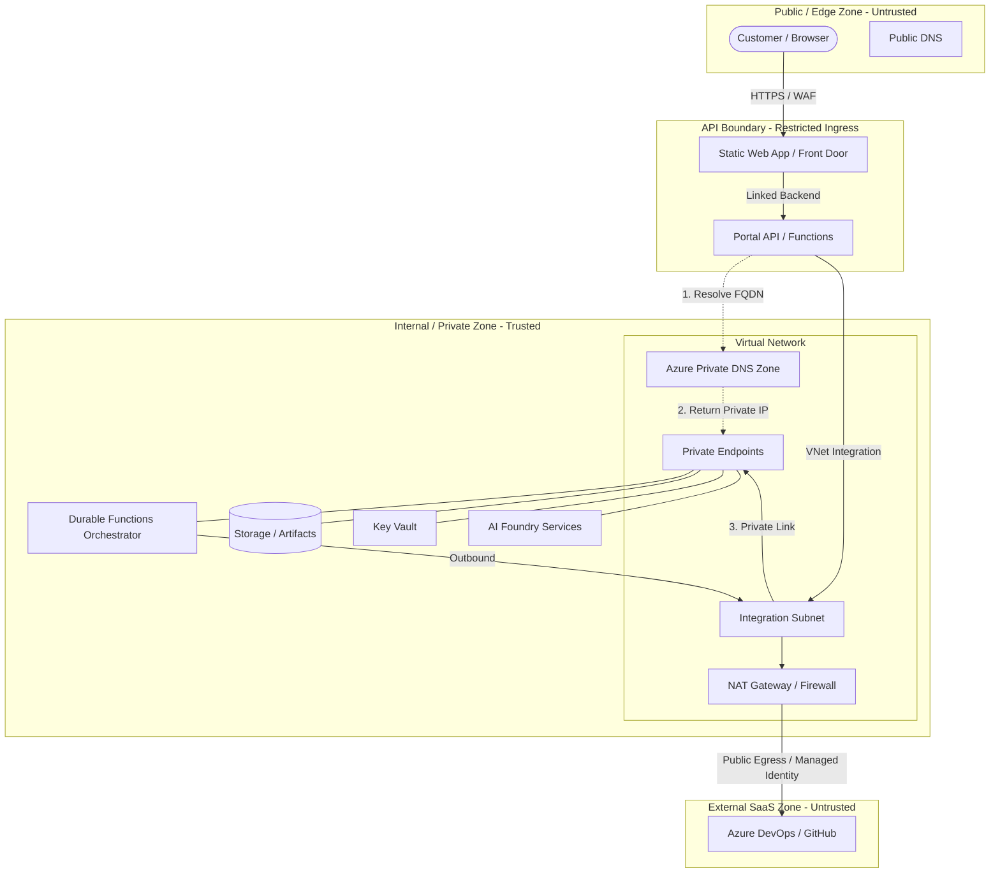

# Network Boundary Notes

## Purpose
Practical network boundary notes for customer-facing APIs, agents, tools, and Azure services. This module provides guidance on implementing network isolation in Azure solutions while maintaining architectural minimalism and security-first principles.

## Key Principles
- **Identity First**: Private endpoints and network boundaries provide defense-in-depth but **do not replace identity/authentication**. All services must still enforce strong Entra ID or equivalent authentication.
- **Fail-Safe Connectivity**: Public access should not be disabled for a service until a **validated connectivity path** (VPN, ExpressRoute, or integrated Jumpbox) is confirmed. Disabling public access without this often leads to permanent lockout or broken deployment pipelines.
- **Minimalist Scope**: Start with restricted ingress (service tags/IP rules) before moving to full Private Link complexity unless strict regulatory or security requirements mandate it.
- **Customer/Internal Separation**: Always maintain a clear logical and physical (where possible) separation between customer-facing endpoints (SWA/APIs) and internal-only backend services (Durable Orchestrators, internal storage, etc.).

## Service-Level Mermaid Diagram
This diagram shows the logical separation between the public edge, the API boundary, internal private services, and external SaaS dependencies, including DNS resolution.



## Boundary Model
The solution follows a multi-tier boundary model to isolate the core business logic from the public internet.

### Customer-Facing / API Separation Notes
The customer-facing portal (e.g., Static Web App) must be strictly separated from the backend API and internal state.
- The portal only interacts with the **Restricted Ingress** endpoint.
- All technical details, raw logs, and internal identifiers are redacted at the API boundary.
- For more details on data-level separation, see [Customer-Safe Status Boundary](../customer-safe-status-boundary/).

## Connectivity Decision Matrix

| Requirement | Connectivity Pattern | Best For | Complexity |
| :--- | :--- | :--- | :--- |
| **Public Authenticated** | Public IP + Entra ID Auth | Portals, authenticated user APIs | Low |
| **Restricted Ingress** | Service Tags / SWA Link / IP Rules | API-to-API communication, protecting known origins | Low/Medium |
| **Internal Ingress** | VNet-only access (no Private Link) | Communication between services in the same VNet | Medium |
| **Private Endpoint** | Private Link + Private DNS | Securing PaaS (Storage, SQL, AI) from any public exposure | High |

## Restricted Ingress Guidance
Public-facing services (like Azure Functions or App Service) must be protected against direct unauthorized access. Supported restriction methods include:
- **Service Endpoints**: Restrict inbound traffic to specific subnets within your Azure Virtual Network.
- **Explicit IP Rules**: Allow only a well-defined set of public IP addresses (e.g., your corporate egress or a specific external partner).
- **Static Web App Link**: Use the built-in SWA backend link to automatically restrict Function access to the SWA origin.
- **Azure Front Door Restriction**: Use the `AzureFrontDoor.Backend` service tag combined with an `X-Azure-FDID` header check.
- **WAF**: Deploy a Web Application Firewall (WAF) for Layer 7 protection.

## Private Endpoint Notes
Use Private Endpoints to bring PaaS services into your private network:
- **Private Link**: Ensures traffic between your compute and services (Storage, Key Vault, AI) never traverses the public internet.
- **Sub-resources**: Create private endpoints for each required sub-resource (e.g., `blob`, `queue`, `table` for storage).

### DNS and Private Resolution
When a private endpoint is used, your network must resolve the service FQDN (e.g., `mystorage.blob.core.windows.net`) to the private IP address.
- **Azure Private DNS Zones**: The recommended way to handle resolution. Link the zone (e.g., `privatelink.blob.core.windows.net`) to your VNet.
- **Flex Consumption Note**: Flex Consumption apps automatically use the DNS settings of the integrated VNet.
- **Warning**: If DNS is not configured, traffic will continue to route via the public internet even if a private endpoint exists.

### Local-Development Limitations
- **VPN Requirement**: You cannot reach private endpoints from your local machine without a VPN or ExpressRoute to the VNet.
- **DNS Hurdles**: Local `hosts` file entries or a local DNS forwarder are often required to resolve `privatelink` FQDNs to private IPs during development.
- **Mocking**: For minimalist development, it is often preferred to use public authenticated access with IP restrictions to your developer workstation until deployment to a shared environment.

## Forbidden Exposures
To maintain a secure customer-facing surface, the following technical details must **NEVER** be exposed:
- **Raw Provider Payloads**: Untransformed responses from OpenAI, Azure AI, or DevOps APIs.
- **Raw Logs and Stack Traces**: Internal execution details, file paths, or line numbers.
- **Prompts and System Instructions**: Model grounding text or few-shot examples.
- **Secrets and Tokens**: API keys, SAS URLs, or bearer tokens.
- **Admin Endpoints**: Management interfaces or technical debugging paths (e.g., `/scm` or `/kudu`).
- **Internal Resource IDs**: Subscription IDs, Tenant IDs, or Managed Identity Object IDs.
- **Private IP Addresses**: Internal `10.x.x.x` or `172.x.x.x` ranges.

## Concrete Examples

### 1. Static Web App to Functions API Boundary
- **Entry Point**: A Static Web App (SWA) frontend.
- **API Access**: Backend Azure Functions linked to the SWA.
- **Access Restriction**: Function App configured to only allow traffic from the SWA's linked backend mechanism.

### 2. Functions API to Private Backend Service Boundary
- **Compute**: Azure Functions (Flex Consumption) with VNet integration.
- **Integration Subnet**: Dedicated subnet delegated to `Microsoft.App/environments`.
- **Private Endpoint**: Storage account with `public_network_access_enabled = false` and a Private Endpoint in the VNet.

### 3. Key Vault and Application Insights Boundaries
- **Key Vault**: Secure secrets using a Private Endpoint.
- **Application Insights**: Use **Azure Monitor Private Link Scope (AMPLS)** to ensure telemetry stays within the private network boundary.

## When to Use It
| Feature | Use Case | Recommendation |
| :--- | :--- | :--- |
| **Restricted Ingress** | Protecting public APIs | Always use for any service with a public IP. |
| **Private Endpoints** | Securing PaaS services | Use for Storage, Key Vault, AI Services in production. |
| **VNet Integration** | Compute-to-VNet access | Required for serverless compute reaching Private Endpoints. |

## When Not to Use It
- **Enterprise Network Platforms**: This is not a reference for Hub-Spoke, Centralized Firewalls, or global DNS management.
- **Public Prototypes**: For unauthenticated, non-sensitive public prototypes, the complexity of VNets may be avoided.

## Operational Cost & Complexity
- **Cost**: Private Endpoints and NAT Gateways incur hourly charges regardless of traffic volume.
- **Complexity**: VNet integration and DNS zones significantly increase the difficulty of troubleshooting "cannot connect" errors.

## Customer-Safe Network/Status Checklist
- [ ] No Private IPs are exposed in API responses or portal UI.
- [ ] No internal resource IDs (Subscription, Tenant, Managed Identity) are visible to the customer.
- [ ] `public_network_access_enabled` is set to `false` for backend PaaS in production.
- [ ] API ingress is restricted to allowed origins (SWA, Front Door).
- [ ] VNet integration is configured for all compute accessing private resources.
- [ ] DNS resolution for private endpoints is verified (Linked Private DNS Zones).

## Recommended Boundary Notes Snippets
Copy and adapt these snippets into your module or solution documentation.

```markdown
### Security Boundary
This module uses a restricted ingress boundary. In production, public access is disabled, and connectivity is maintained via Private Link. DNS resolution is handled via Azure Private DNS Zones.
```

## Validation Notes
- **Design Review**: Verify network diagrams show the API boundary and private zones.
- **Compliance Check**: Ensure `public_network_access_enabled = false` for all backend PaaS in IaC.
- **Connectivity Check**: Use `tcpping` or `nameresolver` from a Kudu console within the VNet to verify private link resolution.

## Deployment/IaC Decision
**No-IaC**: This module is documentation/pattern-only. Implementation is deferred to concrete reference solutions to avoid speculative infrastructure.

## Production-Grade Infrastructure Note
This reference describes logical isolation and is **not** a full Enterprise Landing Zone (ELZ). It focuses on the application-level security boundary rather than organizational network architecture.

## References
- [Azure Private Link overview](https://learn.microsoft.com/en-us/azure/private-link/private-endpoint-overview)
- [App Service access restrictions](https://learn.microsoft.com/en-us/azure/app-service/overview-access-restrictions)
- [Azure Functions networking options](https://learn.microsoft.com/en-us/azure/azure-functions/functions-networking-options)
- [Azure Architecture Center network security](https://learn.microsoft.com/en-us/azure/architecture/framework/security/networking)
- [Terraform on Azure overview](https://learn.microsoft.com/en-us/azure/developer/terraform/overview)
