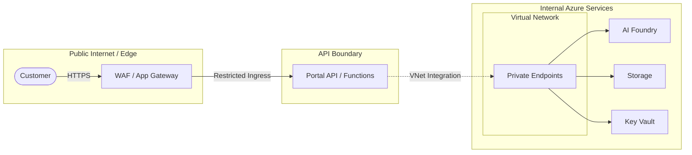

# Network Boundary Notes

## Purpose

Practical network boundary notes for customer-facing APIs, agents, tools, and Azure services. This module provides guidance on implementing network isolation in Azure solutions while maintaining architectural minimalism.

## Network Architecture Overview

This diagram shows the logical separation between the public edge, the API boundary, and internal Azure services.

## Boundary Definitions

### Customer-Facing Boundary (North-South)
The perimeter where external users or systems interact with the solution.
- **Restricted Ingress**: Public-facing services (like Azure Functions or App Service) should utilize "Access Restrictions" (IP filtering or Service Tags) to allow traffic only from a trusted gateway (e.g., Azure Front Door or Application Gateway).
- **Edge Protection**: Deploy a Web Application Firewall (WAF) to inspect incoming HTTP/S traffic for common vulnerabilities (OWASP Top 10).
- **TLS Enforcement**: Always enforce HTTPS and minimum TLS 1.2 at the edge.

### Internal Service Boundary (East-West)
Communication between internal components of the solution.
- **Private Endpoints**: Utilize Azure Private Link to provide private IP addresses (from a VNet) to PaaS services like Azure Storage, Key Vault, and AI Foundry. This removes the need for public internet access to these resources.
- **VNet Integration**: Configure compute resources (Functions, Containers, Web Apps) with "Regional VNet Integration" so they can reach Private Endpoints and other VNet-local resources securely.
- **Service Firewalls**: Enable service-level firewalls (e.g., Storage Firewalls and Virtual Networks) to block all public network access, permitting only traffic from designated VNets or Private Endpoints.

## Key Considerations

### Outbound Dependencies
- **DNS Resolution**: Private Endpoints require proper DNS configuration, typically using Azure Private DNS Zones, to ensure FQDNs resolve to private IPs.
- **Egress Control**: Use Network Security Groups (NSGs) or Azure Firewall to restrict outbound traffic from the VNet to only known, required dependencies.

### Local Development Exceptions
- **Direct Access**: During prototyping, adding developer workstation IP addresses to service firewalls is a common exception.
- **Bypass Patterns**: When a VNet is not yet provisioned, managed identity and RBAC should remain the primary security layer while network boundaries are gradually tightened.
- **VPN/Bastion**: For secure access to VNet-isolated resources, use a VPN or Azure Bastion.

## Production-Grade Infrastructure Note
**IMPORTANT**: These notes describe a reference pattern for logical isolation and architectural guidance. They are **not** a production-ready Enterprise Landing Zone (ELZ). For production deployments:
- Consult with corporate network security for hub-spoke alignment.
- Implement centralized egress through Azure Firewall.
- Apply rigorous Azure Policy for network compliance.
- Specialize the networking design based on the specific data classification and compliance requirements of the solution.

## References
- [Azure Private Endpoint Overview](https://learn.microsoft.com/en-us/azure/private-link/private-endpoint-overview)
- [Well-Architected Framework: Design Network Segmentation](https://learn.microsoft.com/en-us/azure/architecture/framework/security/design-network-segmentation)
- [Securing Azure Functions](https://learn.microsoft.com/en-us/azure/azure-functions/security-concepts)
