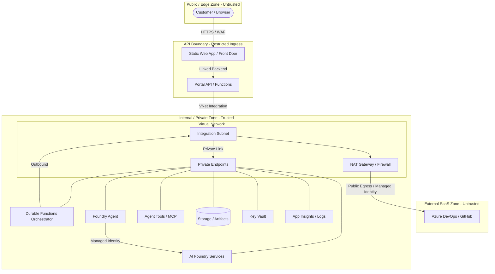

# Network Boundary Notes

## Purpose
Practical network boundary notes for customer-facing APIs, agents, tools, and Azure services. This module provides guidance on implementing network isolation in Azure solutions while maintaining architectural minimalism and security-first principles.

## Service-Level Mermaid Diagram
This diagram shows the logical separation between the public edge, the API boundary, internal private services, and external SaaS dependencies.



## Boundary Model
The solution follows a multi-tier boundary model:
1.  **Public Edge**: Untrusted traffic from the internet, typically terminating at a Static Web App or Azure Front Door.
2.  **Restricted Ingress Boundary**: Controlled entry point for APIs, restricted to specific frontend origins or service tags.
3.  **Internal Private Boundary**: Backend services isolated within a Virtual Network, reached via Private Link.

### Customer-Facing / API Separation Notes
The customer-facing portal (e.g., Static Web App) must be strictly separated from the backend API and internal state.
- The portal only interacts with the **Restricted Ingress** endpoint.
- All technical details, raw logs, and internal identifiers are redacted at the API boundary.
- For more details on data-level separation, see [Customer-Safe Status Boundary](../customer-safe-status-boundary/).

## Decision Table

| Service | Public Ingress | VNet Integration (Outbound) | Private Link (Inbound) | Baseline Recommendation | Hardened Recommendation |
| :--- | :--- | :--- | :--- | :--- | :--- |
| **Static Web Apps** | Enabled (Public) | N/A | Supported (Standard SKU) | Public edge with Entra Auth | Private Endpoint + Restricted Ingress |
| **Azure Functions** | Restricted | Supported (Flex/Premium) | Supported | Restricted to SWA origin | Private Endpoint + VNet Integration |
| **App Service** | Restricted | Supported | Supported | Access Restrictions (IP/VNet) | Private Endpoint + VNet Integration |
| **Azure Storage** | Disabled | N/A | Supported | Firewalled to trusted IPs/Subnets | Private Endpoint + Public Access Disabled |
| **Key Vault** | Disabled | N/A | Supported | Firewalled to trusted services | Private Endpoint + Public Access Disabled |
| **AI Foundry** | Disabled | N/A | Supported | Firewalled to compute subnets | Private Endpoint + Public Access Disabled |
| **Azure DevOps** | N/A | Supported (FQDN/IP) | N/A | Managed Identity + RBAC | FQDN Filtering + Managed Identity + NAT Gateway |

## Outbound Access Boundary
When an internal service (e.g., a Durable Functions Orchestrator) needs to reach external SaaS dependencies like Azure DevOps or GitHub, it must cross the outbound boundary. Unlike internal PaaS, these services do not support Private Link for standard consumption.

### Egress Control Options
| Method | Use Case | Implementation Note |
| :--- | :--- | :--- |
| **FQDN Filtering** | URL-level restriction | Use Azure Firewall (Premium/Standard) to allow egress only to `dev.azure.com` and related endpoints. |
| **IP Allowlisting** | Narrowing Azure egress | Filter outbound traffic to the published Azure DevOps IP ranges (see Microsoft docs for current XML/JSON). |
| **NAT Gateway** | Static Egress IPs | Provides a fixed public IP for your VNet, allowing the external SaaS to allowlist your specific origin. |
| **Web Proxy** | Application-level audit | Route all outbound traffic through a proxy for deep packet inspection and logging. |

### Least-Privilege Identity Pattern
Security at the network boundary must be reinforced by identity-based security:
- **Managed Identity**: Use System-Assigned or User-Assigned Managed Identities for all Azure-to-DevOps communication.
- **Service Principal Integration**: The managed identity must be **explicitly added** as a user or service principal within the Azure DevOps Organization. Access is not granted automatically by Azure; you must assign specific permissions (e.g., `Build Read`) to the identity in the DevOps portal or via API.
- **Token Handling**: Avoid long-lived PATs or secrets; prefer Entra ID-based authentication for Azure DevOps where supported by the client library.

## Restricted Ingress Guidance
Public-facing services (like Azure Functions or App Service) must be protected against direct unauthorized access. Supported restriction methods include:
- **Service Endpoints**: Restrict inbound traffic to specific subnets within your Azure Virtual Network.
- **Explicit IP Rules**: Allow only a well-defined set of public IP addresses (e.g., your corporate egress or a specific external partner).
- **Static Web App Link**: Use the built-in SWA backend link to automatically restrict Function access to the SWA origin.
- **Azure Front Door Restriction**: Use the `AzureFrontDoor.Backend` service tag combined with an `X-Azure-FDID` header check.
- **WAF**: Deploy a Web Application Firewall (WAF) for Layer 7 protection.

## Private Endpoint Notes
Use Private Endpoints to bring PaaS services into your private network:
- **Private Link**: Ensures traffic between your compute and services (Storage, Key Vault, AI) never traverses the public internet.
- **Sub-resources**: Create private endpoints for each required sub-resource (e.g., `blob`, `queue`, `table` for storage).

### DNS and Private Resolution
When a private endpoint is used, your network must resolve the service FQDN (e.g., `mystorage.blob.core.windows.net`) to the private IP address.
- **Azure Private DNS Zones**: The recommended way to handle resolution. Link the zone (e.g., `privatelink.blob.core.windows.net`) to your VNet.
- **Flex Consumption Note**: Flex Consumption apps automatically use the DNS settings of the integrated VNet.
- **Warning**: If DNS is not configured, traffic will continue to route via the public internet even if a private endpoint exists.

## Forbidden Exposures
To maintain a secure customer-facing surface, the following technical details must **NEVER** be exposed:
- **Raw Provider Payloads**: Untransformed responses from OpenAI, Azure AI, or DevOps APIs.
- **Raw Logs and Stack Traces**: Internal execution details, file paths, or line numbers.
- **Prompts and System Instructions**: Model grounding text or few-shot examples.
- **Secrets and Tokens**: API keys, SAS URLs, or bearer tokens.
- **Admin Endpoints**: Management interfaces or technical debugging paths (e.g., `/scm` or `/kudu`).
- **Internal Resource IDs**: Subscription IDs, Tenant IDs, or raw ARM URIs.

## Concrete Examples

### 1. Static Web App to Functions API Boundary
- **Entry Point**: A Static Web App (SWA) frontend.
- **API Access**: Backend Azure Functions linked to the SWA.
- **Access Restriction**: Function App configured to only allow traffic from the SWA's linked backend mechanism.

### 2. Functions API to Private Backend Service Boundary
- **Compute**: Azure Functions (Flex Consumption) with VNet integration.
- **Integration Subnet**: Dedicated subnet delegated to `Microsoft.App/environments`.
- **Private Endpoint**: Storage account with `public_network_access_enabled = false` and a Private Endpoint in the VNet.

### 3. Key Vault and Application Insights Boundaries
- **Key Vault**: Secure secrets using a Private Endpoint.
- **Application Insights**: Use **Azure Monitor Private Link Scope (AMPLS)** to ensure telemetry stays within the private network boundary.

## Customer-Safe Network/Status Checklist
- [ ] No Private IPs are exposed in API responses or portal UI.
- [ ] No internal resource IDs (Subscription, Tenant, Managed Identity) are visible to the customer.
- [ ] `public_network_access_enabled` is set to `false` for backend PaaS in production.
- [ ] API ingress is restricted to allowed origins (SWA, Front Door).
- [ ] VNet integration is configured for all compute accessing private resources.
- [ ] DNS resolution for private endpoints is verified (Linked Private DNS Zones).

## Recommended Boundary Notes Snippets
Copy and adapt these snippets into your module or solution documentation.

### For API Modules (README.md)
```markdown
### Security Boundary
This API implements a restricted ingress boundary. It is designed to be deployed behind a SWA backend link or restricted to specific origins. It redacts all internal technical details before returning a response.
```

## When to Use It
| Feature | Use Case | Recommendation |
| :--- | :--- | :--- |
| **Restricted Ingress** | Protecting public APIs | Always use for any service with a public IP. |
| **Private Endpoints** | Securing PaaS services | Use for Storage, Key Vault, AI Services in production. |
| **VNet Integration** | Compute-to-VNet access | Required for serverless compute reaching Private Endpoints. |

## When Not to Use It
- **Enterprise Network Platforms**: This is not a reference for Hub-Spoke, Centralized Firewalls, or global DNS management.
- **Public Prototypes**: For unauthenticated, non-sensitive public prototypes, the complexity of VNets may be avoided.

## Validation Notes
- **Design Review**: Verify network diagrams show the API boundary and private zones.
- **Compliance Check**: Ensure `public_network_access_enabled = false` for all backend PaaS in IaC.

## Deployment/IaC Decision
**No-IaC**: This module is documentation/pattern-only. Implementation is deferred to concrete reference solutions to avoid speculative infrastructure.

## Production-Grade Infrastructure Note
This reference describes logical isolation and is **not** a full Enterprise Landing Zone (ELZ).

## References
- [Azure Private Link overview](https://learn.microsoft.com/en-us/azure/private-link/private-link-overview)
- [Azure Functions networking options](https://learn.microsoft.com/en-us/azure/azure-functions/functions-networking-options)
- [App Service networking features](https://learn.microsoft.com/en-us/azure/app-service/networking-features)
- [Azure Static Web Apps networking](https://learn.microsoft.com/en-us/azure/static-web-apps/private-endpoint)
- [Azure Storage network security](https://learn.microsoft.com/en-us/azure/storage/common/storage-network-security)
