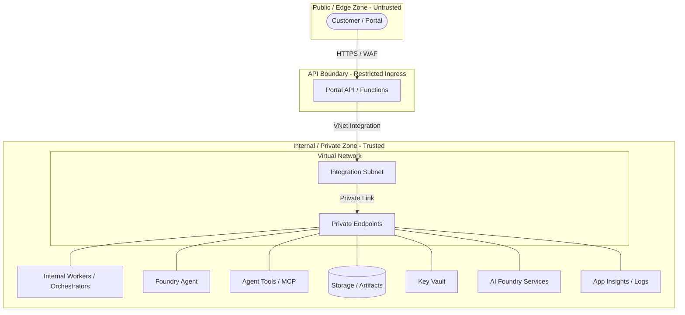

# Network Boundary Notes

## Purpose

Practical network boundary notes for customer-facing APIs, agents, tools, and Azure services. This module provides guidance on implementing network isolation in Azure solutions while maintaining architectural minimalism and security-first principles.

## Network Architecture Overview

This diagram shows the logical separation between the public edge, the API boundary, and internal Azure services, highlighting the public vs. private trust zones.

## Boundary Definitions

### Customer-Facing Boundary (North-South)
The perimeter where external users or systems interact with the solution.
- **Restricted Ingress**: Public-facing services (like Azure Functions or App Service) should utilize "Access Restrictions" (IP filtering or Service Tags) to allow traffic only from a trusted gateway (e.g., Azure Front Door or Application Gateway).
- **Edge Protection**: Deploy a Web Application Firewall (WAF) to inspect incoming HTTP/S traffic for common vulnerabilities (OWASP Top 10).
- **TLS Enforcement**: Always enforce HTTPS and minimum TLS 1.2 at the edge.

### Internal API Boundary
The interface between the public-facing API and internal services.
- **VNet Integration**: Configure compute resources (Functions, Containers, Web Apps) with "Regional VNet Integration" so they can reach Private Endpoints and other VNet-local resources securely.
- **Private Link**: Use Private Endpoints to ensure that the API communicates with backend services (Storage, Database, AI) over a private IP, never leaving the Microsoft backbone.

### Storage and Artifact Boundary
Isolating data at rest and in transit.
- **Storage Firewalls**: Enable "Enabled from selected virtual networks and IP addresses" and allow only the specific VNet/Subnet used by the application.
- **Private Endpoints**: Access storage accounts via Private Endpoints (blob, queue, table, file) to ensure data stays within the network boundary.
- **Disable Public Access**: Explicitly set `allow_public_access_to_storage` (or equivalent) to `false`.

### Agent and Tool Boundary
Securely connecting AI agents to their execution environment and tools.
- **Remote MCP Servers**: Host MCP servers on Azure Functions with VNet integration and Private Endpoints.
- **Tool Access Control**: Ensure agents call tools over private network paths. Avoid exposing tool endpoints to the public internet.
- **Managed Identity**: Complement network boundaries with Managed Identity for service-to-service authentication, ensuring that even if a network is breached, an identity is still required.

### Observability and Log Boundary
Ensuring technical telemetry remains internal.
- **Private Link for Monitor**: Use Azure Monitor Private Link Scopes (AMPLS) to ensure that logs and metrics from your application are sent to Log Analytics/Application Insights via private network paths.
- **Redaction at Source**: Ensure [Customer-Safe Status Boundary](../customer-safe-status-boundary/) principles are applied before data leaves the internal zone for any (rare) external reporting.

## Practical Guidance: When to Use

| Feature | Use Case | Recommendation |
| :--- | :--- | :--- |
| **Restricted Ingress** | Protecting public APIs | Always use for any service with a public IP. |
| **Private Endpoints** | Securing PaaS services | Use for Storage, Key Vault, AI Services in production or high-security prototypes. |
| **VNet Integration** | Compute-to-VNet access | Required for any serverless compute (Functions) needing to reach Private Endpoints. |
| **Service Firewalls** | Basic PaaS isolation | Use as a first layer of defense, even if Private Endpoints are not yet fully configured. |

## Defense in Depth
Network boundaries are only one layer of the security strategy. They must be used in conjunction with:
1. **[Managed Identity and RBAC](../managed-identity-rbac/)**: For least-privilege authorization.
2. **[Customer-Safe Status Boundary](../customer-safe-status-boundary/)**: For data-level filtering and redaction.

## Production-Grade Infrastructure Note
**IMPORTANT**: These notes describe a reference pattern for logical isolation and architectural guidance. They are **not** a production-ready Enterprise Landing Zone (ELZ). This reference does **not** implement:
- Full VNet Hub-Spoke topology.
- Centralized Firewall (NVA) for egress.
- Private DNS Zone management at scale.
- Production-grade DDoS protection.
- Fake or placeholder Private Endpoint Terraform code.

## References
- [Azure Private Link overview](https://learn.microsoft.com/en-us/azure/private-link/private-link-overview)
- [Azure Functions networking options](https://learn.microsoft.com/en-us/azure/azure-functions/functions-networking-options)
- [Azure App Service networking features](https://learn.microsoft.com/en-us/azure/app-service/networking-features)
- [Azure Storage network security](https://learn.microsoft.com/en-us/azure/storage/common/storage-network-security)
