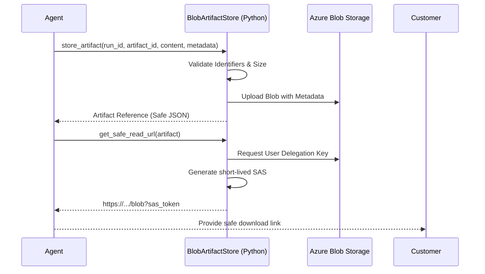

# Blob Artifact Store

Reference storage pattern for pipeline files and generated outputs using Azure Blob Storage.

## Purpose

Store raw inputs, intermediate files, generated reports, and customer-downloadable artifacts securely. This module enforces a secure boundary by providing customer-safe artifact metadata and short-lived, read-only signed URLs.

## Service Flow



## When to Use Blob Storage
- Storing unstructured files (PDFs, images, logs).
- Large artifacts that exceed database/table limits.
- When you need secure, direct-to-browser downloads via SAS.

## When NOT to Use Blob Storage
- High-frequency transactional state (use Table Storage or Cosmos DB).
- Complex relational data.

## Local Run & Test
Install dependencies:
```bash
pip install -r requirements.txt
```

Run tests:
```bash
PYTHONPATH=. pytest tests/
```

## Environment Variables
- `ARTIFACT_STORE_BLOB_ENDPOINT`: Primary blob service endpoint (e.g., `https://<account>.blob.core.windows.net`).
- `ARTIFACT_CONTAINER_NAME`: Name of the blob container (default: `artifacts`).
- `ARTIFACT_MAX_SIZE_BYTES`: Maximum allowed artifact size (default: 100MB).

## Security Boundary
- **Managed Identity**: Uses `DefaultAzureCredential` for all Azure service calls.
- **No Keys**: Storage account keys are disabled in Terraform; all access is via Microsoft Entra ID (RBAC).
- **Short-lived SAS**: Downloads use User-Delegation SAS tokens valid for 1 hour by default.
- **Redaction**: Internal exceptions and technical identifiers (account names, connection strings) are redacted from business-level outputs.

## Azure Hosting Notes
The module is designed to run within Azure Functions, Container Apps, or App Service using a System-Assigned Managed Identity.

### Required RBAC Roles:
- **Storage Blob Data Owner**: To upload artifacts and generate user delegation keys.
- **Storage Blob Data Reader**: (Minimal requirement for read-only consumers).

## Known Limits
- User Delegation SAS requires Entra ID authentication and cannot be generated using account keys.
- Maximum artifact size is enforced client-side before upload.
