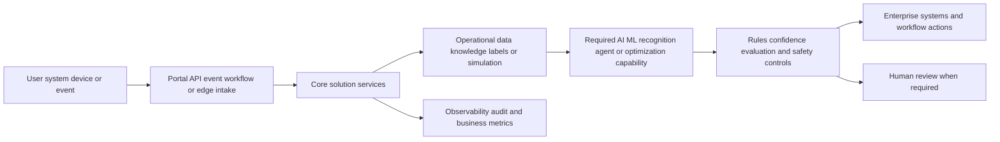

# [OPP-ID] Opportunity title

## Classification

- **Segment:**
- **Primary market / jurisdiction:** Brazil by default; state another market only with explicit Brazil applicability.
- **Evidence reference date:** current watcher execution date plus the main data, publication, update, and rule-effective dates used.
- **Index summary:** one concrete sentence, up to roughly 40 words, describing the problem, proposed solution, and material intelligent capability for `opportunity-index.yaml` and `opportunity-index.md`.
- **Company profile / size:**
- **Opportunity type:** quick-win | product | platform | integration | automation | data | optimization | operations | security | industry-solution | research-bet
- **Status:** hypothesis
- **Confidence:** low | medium | high
- **Complexity:** small | medium | large | research
- **Horizon:** short | medium | long
- **Risk:** low | medium | high | regulated
- **Azure fit:** none | low | medium | high
- **AI dependency:** supporting | core
- **Intelligent capability:** concise name for the required model-based capability
- **Repository alignment:** reuse-existing | extend-kit | new-solution | outside-current-kit

`AI dependency: none` and `optional` are invalid. The intelligent capability must materially contribute to the solution rather than decorate a conventional application.

## Problem

Describe the actor, current process, recurring pain, frequency, consequence, and why the problem matters.

## Brazil applicability and current context

Explain why the problem and solution are relevant to Brazilian organizations at the current execution date.

Include:

- current Brazilian market or operating evidence;
- current Brazilian regulatory, supervisory, standards, procurement, or policy context when applicable;
- material differences between Brazil and foreign examples;
- assumptions that still need local validation.

At least one load-bearing Brazilian source must have been published or materially updated within the previous 18 months. A foreign regulation or liability regime must never be presented as applicable to Brazil.

## Evidence

Separate confirmed evidence from inference.

### Confirmed

- [source-backed fact]

### Inference

- [reasoned implication]

### Sources

For each important source, record publication or update date, data reference period when relevant, rule effective date when relevant, jurisdiction, and why it supports the opportunity.

- [source title](URL) — jurisdiction; publication/update date; data period/effective date; relevance

## Current process

## Proposed solution

Explain the process change before naming technologies. State what remains deterministic, where the intelligent capability changes the process or decision, where humans approve decisions, and what systems must integrate.

## Intelligent capability

- **Technique / model family:**
- **Why it is necessary:** explain the value lost if this capability is removed.
- **Inputs:** data, documents, audio, video, events, telemetry, context, labels, feedback, or simulation state consumed.
- **Outputs:** prediction, extraction, classification, recommendation, generated artifact, ranked queue, action policy, or other result produced.
- **Training / grounding / optimization:** describe training, fine-tuning, RAG grounding, prompt/evaluation data, simulation, reward signal, or inference-only assumptions.
- **Evaluation:** define model, retrieval, recognition, ranking, policy, or business-quality metrics.
- **Fallback and controls:** deterministic validation, human review, abstention threshold, rollback, safe default, or manual process.

Reject the opportunity if this section can only say that AI summarizes, chats about, or optionally assists a workflow that remains equally valuable without it.

## Macro architecture

## Capabilities and possible technologies

- Application and workflow capabilities:
- Data capabilities:
- Integration capabilities:
- Required AI / ML capabilities:
- Training, fine-tuning, grounding, recognition, or optimization capabilities:
- Evaluation and model-operations capabilities:
- Security and governance capabilities:
- Azure services that may fit:
- Non-Azure or open-source alternatives worth considering:

## Possible gains

Do not invent percentages. Describe plausible outcomes:

- [possible gain]
- [possible gain]

## Metrics for validation

### Business and operational metrics

- [baseline and target metric]
- [quality or risk metric]
- [operational or financial metric]

### Intelligent-capability metrics

- [accuracy, precision/recall, extraction quality, ranking quality, groundedness, policy reward, false-positive rate, abstention rate, or another appropriate metric]
- [human acceptance, override, correction, or escalation metric]

## Risks, limits, and controls

- Privacy and sensitive data:
- Brazilian regulatory or policy constraints:
- Human decision boundaries:
- Model, retrieval, recognition, or policy failure modes:
- Bias, drift, weak labels, or insufficient feedback:
- Integration and data availability risks:
- Adoption and change-management risks:

## Fit score

| Dimension | Score | Rationale |
| --- | ---: | --- |
| Problem evidence and relevance | /20 | Include current Brazilian evidence and penalize foreign-only or stale support. |
| Business or operational value | /20 | |
| Technical feasibility | /20 | Include data, evaluation, integration, and model-operability realism in Brazil. |
| Reuse potential | /20 | |
| Strategic differentiation | /20 | Explain the material contribution of the intelligent capability. |
| **Total** | **/100** | |

## Repository relationship

- Existing references that may be reused:
- Missing capabilities exposed by this opportunity:
- Potential building blocks:
- Potential composed solution:
- Reasons to keep it outside the current kit, when applicable:

## Duplicate control

- **Problem keys:**
- **Capability keys:** include the intelligent technique and required model behavior.
- **Research queries used:** include Brazil-specific queries.
- **Related opportunities:**
- **Uniqueness statement:**

## Next decision

Choose one:

- continue research;
- shortlist for review;
- approve for implementation planning;
- park until a dependency or market signal changes;
- reject with reason.