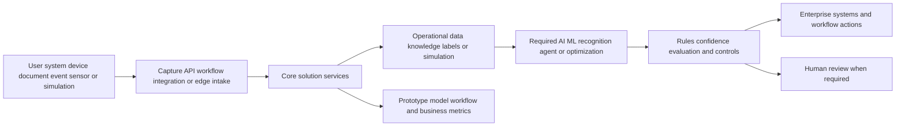

# [OPP-ID] Opportunity title

## Classification

- **Segment:**
- **Primary market / jurisdiction:** Brazil by default; state another market only with explicit Brazil applicability.
- **Evidence reference date:** current watcher date plus main publication, data-period, update, and rule-effective dates.
- **Index summary:** one concrete sentence, roughly 40 words or fewer.
- **Company profile / size:**
- **Opportunity type:** quick-win | product | platform | integration | automation | data | optimization | operations | security | industry-solution | research-bet
- **Status:** hypothesis | researched
- **Confidence:** low | medium | high
- **Complexity:** small | medium | large | research
- **Horizon:** short | medium | long
- **Risk:** low | medium | high | regulated
- **Solution evidence level:** conceptual | prototype | pilot | production | repeated-production
- **Operational maturity:** unvalidated | early | proven
- **Azure fit:** none | low | medium | high
- **AI dependency:** supporting | core
- **Intelligent capability:** concise required model-based capability
- **Repository alignment:** reuse-existing | extend-kit | new-solution | outside-current-kit

New opportunities normally start as `hypothesis`. Production proof is not required to publish. Use `confidence: high` or `operational maturity: proven` only with credible production evidence.

## Problem

Describe the actor, current process, recurring pain, frequency, consequence, and why it matters.

## Brazil applicability and current context

Explain why the problem is currently relevant to Brazilian organizations.

Include:

- current Brazilian market or operating evidence;
- current Brazilian regulatory or official operating context when applicable;
- material differences from foreign examples;
- assumptions requiring local validation.

At least one load-bearing Brazilian source must have been published or materially updated within the previous 18 months.

## Evidence

### Confirmed problem evidence

- [source-backed fact proving the pain, cost, delay, risk, or interruption]

### Favorable solution evidence

- [technical research, prototype, pilot, production case, benchmark, mature implementation pattern, or other evidence supporting plausibility]

### Counter-evidence and limitations

- [failed comparable, cancellation, accuracy limitation, false-alert burden, adoption issue, unexpected cost, or strong conventional alternative]
- [how this changes scope, confidence, design, human controls, or prototype validation]

Counter-evidence is normally a design input. Reject only when it invalidates the central mechanism and no credible bounded mitigation remains.

### Inference

- [reasoned implication not directly proven]

### Unknowns

- [fact requiring customer data, prototype, experiment, pilot, integration test, or legal review]

### Sources

For each important source, record jurisdiction, publication/update date, data period or effective date when relevant, and whether it supports the problem, solution plausibility, or a limitation.

- [source title](URL) — jurisdiction; date; relevance

## Current process

## Baseline without AI

- **Current baseline:**
- **Strongest realistic non-AI alternative:**
- **Baseline strengths:**
- **Baseline limitations:**
- **Context where intelligence may add incremental value:**
- **Condition where the non-AI baseline should be preferred:**

The existence of a strong baseline does not reject the opportunity. It defines what the prototype must beat or complement.

## Proposed solution

Describe the process change before naming technology. State what remains deterministic, where intelligence adds value, where humans decide, what systems integrate, and how known limitations affect scope.

## Intelligent capability

- **Technique / model family:**
- **Why it is necessary:**
- **Inputs:**
- **Outputs:**
- **Training / grounding / optimization assumptions:**
- **Evaluation:** model or policy quality and comparison against baseline
- **Fallback and controls:** deterministic validation, human review, abstention, rollback, or manual process

Reject decorative AI that leaves the workflow equally valuable without the model-based capability.

## Data and integration assumptions

- **Data owners and access path:**
- **Expected volume, history, frequency, and coverage:**
- **Labels, outcomes, feedback, or simulation available:**
- **Known quality, imbalance, missingness, and leakage risks:**
- **Brazilian or local-context representativeness:**
- **Privacy, retention, consent, surveillance, or sharing constraints:**
- **Integration and synchronization assumptions:**
- **Drift and change sources:**
- **Minimum viable data for a prototype:**

Unknown labels, integration effort, adoption, or operating cost reduce confidence but do not automatically invalidate a prototype hypothesis.

## Prototype validation plan

Define a bounded experiment rather than assuming rollout.

- **Prototype scope / process slice:**
- **Users, sites, assets, documents, events, or simulated cases:**
- **Baseline or comparison:**
- **Required data and integrations:**
- **Model-quality metrics:**
- **Business or workflow metrics:**
- **Human acceptance, correction, or override metrics:**
- **Safety and compliance boundaries:**
- **Failure or redesign criteria:**
- **Evidence required before a pilot or broader implementation:**

Do not invent ROI. Cost drivers may be listed as assumptions, not publication gates.

## Macro architecture

## Capabilities and possible technologies

- Application and workflow capabilities:
- Data capabilities:
- Integration capabilities:
- Required AI / ML capabilities:
- Training, grounding, recognition, or optimization capabilities:
- Evaluation and model-operations capabilities:
- Security and governance capabilities:
- Azure services that may fit:
- Non-Azure or open-source alternatives worth considering:

## Possible gains

Do not invent percentages.

- [possible gain]
- [possible gain]

## Metrics for validation

### Business and operational metrics

- [baseline comparison]
- [quality, risk, time, capacity, cost, or outcome metric]

### Intelligent-capability metrics

- [accuracy, precision/recall, ranking quality, groundedness, reward, false-positive, abstention, or appropriate metric]
- [human acceptance, override, correction, or escalation]

## Risks, limits, and controls

- Privacy and sensitive data:
- Brazilian regulatory or policy constraints:
- Human decision boundaries:
- Model or policy failure modes:
- Comparable failures and applicable lessons:
- Bias, drift, weak labels, or insufficient feedback:
- Integration and data risks:
- Adoption and change-management risks:
- Prototype cost or operational assumptions:

## Fit score

Technical feasibility means **whether a bounded prototype can be built and meaningfully tested**, not whether production success is already proven.

| Dimension | Score | Rationale |
| --- | ---: | --- |
| Problem evidence and relevance | /20 | Current Brazilian evidence and specificity. |
| Business or operational value | /20 | Plausible value if the hypothesis succeeds. |
| Technical feasibility | /20 | Prototype testability, obtainable data or simulation, model plausibility, integration scope, controls, and counter-evidence. |
| Reuse potential | /20 | |
| Strategic differentiation | /20 | Material advantage created by intelligence beyond deterministic automation. |
| **Total** | **/100** | |

## Repository relationship

- Existing references that may be reused:
- Missing capabilities exposed by this opportunity:
- Potential building blocks:
- Potential composed solution:
- Reasons to keep it outside the current kit, when applicable:

## Duplicate control

- **Problem keys:**
- **Capability keys:**
- **Research queries used:** include Brazil-specific and counter-evidence queries
- **Related opportunities:**
- **Uniqueness statement:**

## Next decision

Choose one:

- continue research;
- prototype candidate;
- shortlist for review;
- park until a dependency or signal changes;
- reject with reason.

Implementation approval remains an explicit human decision.