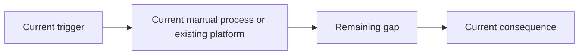
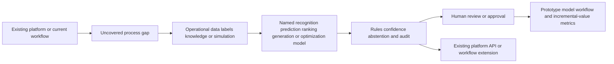

# [OPP-ID] Opportunity title

## Classification

- **Segment:**
- **Primary market / jurisdiction:** Brazil by default
- **Evidence reference date:**
- **Index summary:** one concrete sentence, roughly 40 words or fewer
- **Company profile / size:**
- **Opportunity type:** quick-win | product | platform | integration | automation | data | optimization | operations | security | industry-solution | research-bet
- **Status:** hypothesis | researched
- **Confidence:** low | medium | high
- **Complexity:** small | medium | large | research
- **Horizon:** short | medium | long
- **Risk:** low | medium | high | regulated
- **Solution evidence level:** conceptual | prototype | pilot | production | repeated-production
- **Operational maturity:** unvalidated | early | proven
- **Existing-solution disposition:** build | extend | integrate | adopt | no-new-fit
- **Azure fit:** none | low | medium | high
- **AI dependency:** supporting | core
- **Primary AI role:** recognition | extraction | classification | anomaly-detection | prediction | ranking-recommendation | optimization | reinforcement-learning | generative-ai | rag | agent-tool-use | multimodal | other
- **Intelligent capability:**
- **Repository alignment:** reuse-existing | extend-kit | new-solution | outside-current-kit

New opportunities normally start as `hypothesis`. Production proof is not required. Existing-solution research and material differentiation are required.

## Problem

Describe the actor, process, recurring pain, frequency, consequence, and measurable outcome.

## Brazil applicability and current context

Include:

- current Brazilian problem evidence;
- current regulation or official operating context when applicable;
- publication, update, launch, roadmap, data-period, and effective dates;
- material differences from foreign examples;
- assumptions requiring local validation.

At least one load-bearing Brazilian problem source must have been published or materially updated within the previous 18 months.

## Existing solutions and differentiation

Research what already exists before proposing architecture.

### Existing solutions reviewed

| Solution / platform | Owner or vendor | Current capabilities | Evidence date | Coverage overlap |
| --- | --- | --- | --- | --- |
| [name] | [owner] | [what it already performs] | [date] | [actor, process, capability, integration, outcome] |

Include current official platforms, commercial products, sector systems, announced roadmap capabilities, public tenders, APIs, and mature open-source solutions when relevant.

### Gap and disposition

- **What is already solved:**
- **Material uncovered gap:**
- **Underserved actor, context, integration, or outcome:**
- **Disposition:** build | extend | integrate | adopt | no-new-fit
- **Why changing vendor, cloud, model, UI, or architecture is insufficient:**
- **Differentiation statement:**

Do not publish as `new-solution` when an existing solution already covers the same actor, process, central capability, and outcome. Generic clustering, dashboards, RAG, agents, or ranking are not differentiation by themselves.

When adoption or a minor configuration of an existing platform is sufficient, use `no-new-fit`.

## Evidence

### Confirmed problem evidence

- [source-backed fact]

### Existing-solution evidence

- [official product, platform, API, release, roadmap, procurement, or repository evidence]

### Favorable evidence for the uncovered gap

- [research, prototype, implementation pattern, benchmark, pilot, or production evidence]

### Counter-evidence and limitations

- [failure, cancellation, accuracy limitation, false-alert burden, adoption issue, cost, or strong alternative]
- [how it changes scope, confidence, design, controls, or prototype]

### Inference

- [reasoned implication not directly proven]

### Unknowns

- [fact requiring data, experiment, prototype, integration test, or legal review]

### Sources

- [source title](URL) — jurisdiction; date; problem, existing-solution, favorable, contrary, or contextual relevance

## Current process and current solution

## Baseline

- **Current manual or system baseline:**
- **Existing product or platform baseline:**
- **Strongest realistic non-AI alternative:**
- **Baseline strengths:**
- **Baseline limitations:**
- **Exact context where the proposed intelligence adds incremental value:**
- **Condition where adoption or the baseline should be preferred:**

## Proposed solution or extension

Describe the process change before naming technology. Make clear whether this is a new build, extension, integration, or adoption recommendation. State what remains deterministic, what existing platform is reused, where intelligence adds differentiated value, and where humans decide.

## Where AI enters

### AI role map

| Process stage | AI component | AI type / model family | Inputs | What it does | Runtime mode | Output | Human or deterministic control |
| --- | --- | --- | --- | --- | --- | --- | --- |
| [stage] | [component] | [classical ML, graph ML, time series, vision, speech, embeddings, LLM, multimodal model, RL, agent] | [inputs] | [specific responsibility] | [batch, online, real-time, edge, asynchronous] | [prediction, extraction, ranking, generated text, action proposal] | [rule, threshold, abstention, approval, rollback] |

### Required distinctions

- **Primary AI role:**
- **Model family:**
- **Training requirement:** pretrained inference | prompt and grounding | supervised training | fine-tuning | self-supervised training | simulation | reinforcement learning | no custom training
- **Training location and cadence:**
- **Inference location:** cloud | edge | device | batch pipeline | real-time service
- **Agent role:** state goal, tools, permissions, memory, planning boundary, and permitted actions, or `not used`
- **LLM role:** state exact generation, extraction, classification, reasoning, or tool-selection responsibility, or `not used`
- **Non-LLM intelligence:**
- **Not AI:** rules, APIs, databases, calculations, workflow, queues, dashboards, orchestration, and approvals

Do not use `AI`, `agent`, `LLM`, and `model` as synonyms.

## Intelligent capability details

- **Why it is necessary for the uncovered gap:**
- **Inputs:**
- **Outputs:**
- **Training / grounding / optimization assumptions:**
- **Evaluation against existing product and non-AI baselines:**
- **Fallback and controls:**

Reject decorative AI that does not create material incremental value beyond existing solutions.

## Data and integration assumptions

- **Data owners and access path:**
- **Expected volume, history, frequency, and coverage:**
- **Labels, outcomes, feedback, or simulation:**
- **Quality, imbalance, missingness, and leakage risks:**
- **Brazilian or local-context representativeness:**
- **Privacy, retention, consent, surveillance, or sharing constraints:**
- **Existing platform APIs, exports, extension points, and limits:**
- **Integration and synchronization assumptions:**
- **Drift and change sources:**
- **Minimum viable data for a prototype:**

## Prototype validation plan

- **Prototype scope / process slice:**
- **Users, sites, assets, documents, events, or simulated cases:**
- **Existing solution baseline:**
- **Non-AI baseline:**
- **Required data and integrations:**
- **Model-quality metrics:**
- **Incremental-value metrics beyond the existing solution:**
- **Business or workflow metrics:**
- **Human acceptance, correction, or override metrics:**
- **Safety and compliance boundaries:**
- **Failure or redesign criteria:**
- **Evidence required before pilot or broader implementation:**

Do not invent ROI. Cost drivers and benefits may be hypotheses.

## Macro architecture

Add an agent node only when a real governed agent exists.

## Capabilities and possible technologies

- Existing platform capabilities reused:
- Application and workflow capabilities:
- Data capabilities:
- Integration and extension capabilities:
- Required AI / ML capabilities:
- Training, grounding, recognition, or optimization capabilities:
- Agent and tool-use capabilities, or `not used`:
- LLM / foundation-model capabilities, or `not used`:
- Evaluation and model-operations capabilities:
- Security and governance capabilities:
- Azure services that may fit:
- Non-Azure or open-source alternatives:

## Possible gains

- [possible incremental gain beyond existing solution]
- [possible incremental gain]

## Metrics for validation

### Business and operational metrics

- [baseline comparison]
- [incremental process or outcome metric]

### Intelligent-capability metrics

- [accuracy, precision/recall, ranking quality, groundedness, reward, false-positive, abstention, or appropriate metric]
- [human acceptance, override, correction, or escalation]

## Risks, limits, and controls

- Existing-solution overlap and roadmap risk:
- Privacy and sensitive data:
- Brazilian regulatory or policy constraints:
- Human decision boundaries:
- Model or policy failure modes:
- Agent or tool-execution failure modes, when applicable:
- LLM hallucination, grounding, or prompt-injection risks, when applicable:
- Comparable failures and lessons:
- Bias, drift, weak labels, or insufficient feedback:
- Integration and vendor/platform dependency risks:
- Adoption and change-management risks:
- Prototype cost or operational assumptions:

## Fit score

Technical feasibility means whether a bounded differentiated prototype can be built and tested. Strategic differentiation must be scored against current solutions, not only against manual work.

| Dimension | Score | Rationale |
| --- | ---: | --- |
| Problem evidence and relevance | /20 | Current Brazilian evidence and specificity. |
| Business or operational value | /20 | Incremental value beyond existing solutions and baselines. |
| Technical feasibility | /20 | Prototype testability, data, model, integration, extension points, controls, and counter-evidence. |
| Reuse potential | /20 | |
| Strategic differentiation | /20 | Material uncovered capability or outcome beyond current products, platforms, and roadmaps. |
| **Total** | **/100** | |

## Repository relationship

- Existing references that may be reused:
- Missing capabilities exposed by the differentiated gap:
- Potential building blocks:
- Potential composed solution or extension:
- Reasons to keep it outside the current kit:

## Duplicate control

- **Problem keys:**
- **Capability keys:**
- **Existing solutions reviewed:**
- **Research queries used:** include Brazil-specific, existing-solution, roadmap, product, API, open-source, and counter-evidence queries
- **Related repository opportunities:**
- **External overlap statement:**
- **Uniqueness statement:**

## Next decision

Choose one:

- continue research;
- prototype candidate;
- shortlist for review;
- adopt existing solution;
- extend or integrate existing solution;
- park;
- reject with reason.

Implementation approval remains an explicit human decision.