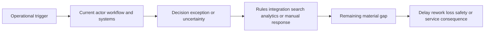
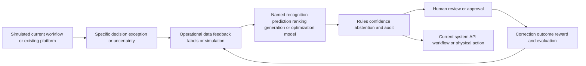

# [OPP-ID] Opportunity title

## Classification

- **Segment:**
- **Primary market / jurisdiction:** Brazil by default
- **Evidence reference date:**
- **Index summary:** one concrete sentence, roughly 40 words or fewer
- **Organization archetype / size:**
- **Primary actor:**
- **Simulated process:**
- **Opportunity type:** quick-win | product | platform | integration | automation | data | optimization | operations | security | industry-solution | research-bet
- **Status:** hypothesis | researched
- **Confidence:** low | medium | high
- **Complexity:** small | medium | large | research
- **Horizon:** short | medium | long
- **Risk:** low | medium | high | regulated
- **Solution evidence level:** conceptual | prototype | pilot | production | repeated-production
- **Operational maturity:** unvalidated | early | proven
- **Existing-solution disposition:** build | extend | integrate | adopt | no-new-fit
- **Azure fit:** none | low | medium | high
- **AI dependency:** supporting | core
- **Primary AI role:** recognition | extraction | classification | anomaly-detection | prediction | ranking-recommendation | optimization | reinforcement-learning | generative-ai | rag | agent-tool-use | multimodal | other
- **Intelligent capability:**
- **Repository alignment:** reuse-existing | extend-kit | new-solution | outside-current-kit

New opportunities normally start as `hypothesis`. Operational simulation generates the candidate; research validates the problem, novelty, plausibility, and limits.

## Operational simulation

Simulate the work before proposing architecture or searching broadly for products.

### Operating archetype

- **Organization type and approximate size:**
- **Primary actor and authority:**
- **Process trigger:**
- **Actor objective and completion condition:**
- **Inputs, systems, documents, devices, or physical context:**
- **Rules, deadlines, safety, cost, and compliance constraints:**
- **Upstream and downstream handoffs:**

### Assumptions

Clearly separate assumptions from known facts.

- **Known operating facts already available:**
- **Simulation assumptions requiring validation:**
- **Synthetic events or cases introduced:**

### Workflow simulation

| Stage | Trigger / available information | Actor and system action | Decision or uncertainty | Current handling | Friction, risk, or missed outcome | Feedback signal |
| --- | --- | --- | --- | --- | --- | --- |
| [stage] | [inputs known now] | [what happens] | [judgment, prediction, recognition, prioritization, or choice] | [manual, rules, system, workaround] | [delay, rework, error, loss, safety, service] | [correction, result, label, reward, audit] |

### Scenario variants

#### Normal flow

Describe the routine path, expected inputs, decisions, handoffs, and outcome.

#### Exception flow

Introduce incomplete, contradictory, ambiguous, unusual, or high-risk inputs and trace how the process changes.

#### Peak or degraded flow

Introduce volume spike, staff shortage, system delay, asset degradation, deadline pressure, disrupted communication, or another operational stressor.

### Opportunity points derived from the simulation

| Decision, exception, or uncertainty | Strongest deterministic response | Remaining gap | Candidate intelligent role | Expected incremental outcome | Main risk |
| --- | --- | --- | --- | --- | --- |
| [specific point] | [rules, form, integration, search, analytics, workflow] | [what remains difficult] | [recognition, extraction, prediction, ranking, optimization, generation, retrieval, agent/tool use] | [measurable process or outcome change] | [failure or misuse] |

Generate multiple candidates before selecting one. Reject candidates where normal software, integration, process redesign, rules, search, forms, or dashboards are sufficient.

## Selected problem and opportunity hypothesis

Explain:

- the actor and bounded process;
- the load-bearing problem exposed by the simulation;
- frequency or conditions under which it matters;
- current consequence;
- exact decision, exception, uncertainty, or coordination gap selected;
- why it is a plausible opportunity rather than merely an interesting AI use.

## Brazil applicability and current context

Research after the initial simulation.

Include:

- current Brazilian evidence supporting the load-bearing problem;
- current regulation or official operating context when applicable;
- publication, update, launch, roadmap, data-period, and effective dates;
- which simulation assumptions were confirmed, contradicted, narrowed, or left unknown;
- material differences from foreign examples.

At least one load-bearing Brazilian problem source must have been published or materially updated within the previous 18 months.

## Existing solutions and differentiation

Existing-solution research is a novelty and positioning check, not the idea-generation step.

### Existing solutions reviewed

| Solution / platform | Owner or vendor | Current capabilities | Evidence date | Coverage overlap |
| --- | --- | --- | --- | --- |
| [name] | [owner] | [what it already performs] | [date] | [actor, process, inputs, outputs, intelligent capability, integration, authority, outcome] |

Review official platforms, commercial products, sector systems, roadmap capabilities, releases, APIs, public tenders, and mature open source when relevant.

### Gap and disposition

- **What is already solved:**
- **Overlap with the simulated candidate:**
- **Material uncovered gap:**
- **Underserved actor, scenario, exception, integration, decision, or outcome:**
- **Disposition:** build | extend | integrate | adopt | no-new-fit
- **Why changing vendor, cloud, model, UI, or architecture is insufficient:**
- **Differentiation statement:**

Do not publish as `new-solution` when an existing solution covers the same actor, process, central capability, and outcome. When adoption or configuration is sufficient, use `no-new-fit`.

## Evidence map

### Simulated observations

- [workflow-derived observation, explicitly labeled as simulated]

### Confirmed problem evidence

- [source-backed current fact]

### Existing-solution evidence

- [official product, platform, API, release, roadmap, procurement, or repository evidence]

### Favorable evidence for the uncovered gap

- [technical research, implementation pattern, benchmark, prototype, pilot, or production evidence]

### Counter-evidence and limitations

- [failure, accuracy limitation, false-alert burden, adoption issue, cost, or strong alternative]
- [how it changes scope, confidence, controls, or prototype]

### Inference

- [reasoned implication not directly proven]

### Unknowns

- [fact requiring customer data, observation, experiment, prototype, integration test, or legal review]

### Sources

- [source title](URL) — jurisdiction; date; problem, existing-solution, favorable, contrary, or contextual relevance

## Current process and remaining gap

## Baselines

- **Current manual or system baseline:**
- **Existing product or platform baseline:**
- **Strongest realistic non-AI alternative:**
- **Baseline strengths:**
- **Baseline limitations:**
- **Exact simulated condition where intelligence may add incremental value:**
- **Condition where adoption, process redesign, or deterministic automation should be preferred:**

## Proposed solution or extension

Describe the process change before naming technology.

State:

- whether this is build, extension, or integration;
- which current steps and systems remain;
- which decision, exception, or uncertainty changes;
- what remains deterministic;
- where intelligence adds differentiated value;
- what action is proposed or executed;
- where humans retain authority.

## Where AI enters

### AI role map

| Process stage | AI component | Primary role and model family | Inputs | What it does | Training / grounding | Runtime | Output | Deterministic or human control |
| --- | --- | --- | --- | --- | --- | --- | --- | --- |
| [stage] | [component] | [role; classical ML, graph ML, time series, vision, speech, embeddings, LLM, multimodal, RL, agent] | [inputs] | [specific responsibility] | [pretrained, supervised, fine-tuned, simulation, optimization, cadence] | [batch, online, real-time, edge, asynchronous] | [prediction, extraction, ranking, generation, proposal] | [rule, threshold, abstention, approval, rollback] |

### Required distinctions

- **Primary AI role:**
- **Model family:**
- **Training requirement and cadence:**
- **Inference location and runtime:**
- **Agent role:** exact goal, tools, permissions, memory, planning boundary, and actions, or `not used`
- **LLM role:** exact generation, extraction, reasoning, grounding, or tool-selection responsibility, or `not used`
- **Non-LLM intelligence:**
- **Not AI:** rules, APIs, databases, calculations, workflow, queues, dashboards, orchestration, and approvals

Do not use `AI`, `agent`, `LLM`, and `model` as synonyms.

## Intelligent capability details

- **Why it is necessary for the selected simulation gap:**
- **Inputs:**
- **Outputs:**
- **Training, grounding, simulation, or optimization assumptions:**
- **Evaluation against existing-product and non-AI baselines:**
- **Fallback, abstention, rollback, and human controls:**

Reject decorative AI that does not change a material decision, exception, coordination point, or measurable outcome.

## Data, feedback, and integration assumptions

- **Data owners and access path:**
- **Expected volume, history, frequency, and coverage:**
- **Labels, outcomes, reviewer corrections, rewards, or simulation available:**
- **Quality, imbalance, missingness, and leakage risks:**
- **Brazilian or local-context representativeness:**
- **Privacy, retention, consent, surveillance, or sharing constraints:**
- **Existing platform APIs, exports, extension points, and limits:**
- **Integration and synchronization assumptions:**
- **Drift and change sources:**
- **Minimum viable data, observation, or simulation for a prototype:**

## Prototype validation plan

- **Prototype scope and simulated process slice:**
- **Users, sites, assets, documents, events, or synthetic cases:**
- **Normal, exception, and degraded scenarios included:**
- **Existing-solution baseline:**
- **Non-AI baseline:**
- **Required data, observation, simulation, and integrations:**
- **Model-quality metrics:**
- **Incremental-value metrics beyond the existing solution:**
- **Business or workflow metrics:**
- **Human acceptance, correction, or override metrics:**
- **Safety and compliance boundaries:**
- **Failure or redesign criteria:**
- **Scale criteria:**
- **Evidence required before pilot or broader implementation:**

Do not invent ROI. Cost drivers and gains may be hypotheses.

## Macro architecture

Add an agent node only when a real governed agent exists.

## Capabilities and possible technologies

- Existing platform capabilities reused:
- Application and workflow capabilities:
- Data, feedback, and simulation capabilities:
- Integration and extension capabilities:
- Required AI / ML capabilities:
- Training, grounding, recognition, optimization, or RL capabilities:
- Agent and tool-use capabilities, or `not used`:
- LLM / foundation-model capabilities, or `not used`:
- Evaluation and model-operations capabilities:
- Security and governance capabilities:
- Azure services that may fit:
- Non-Azure or open-source alternatives:

## Possible gains

- [possible incremental gain derived from the simulated workflow]
- [possible incremental gain beyond existing and deterministic baselines]

## Metrics for validation

### Business and operational metrics

- [baseline comparison]
- [delay, rework, throughput, loss, safety, service, quality, or capacity metric]

### Intelligent-capability metrics

- [accuracy, precision/recall, ranking quality, groundedness, reward, false-positive, calibration, or abstention]
- [human acceptance, override, correction, escalation, or automation-bias measure]

## Risks, limits, and controls

- Simulation assumption risk:
- Existing-solution overlap and roadmap risk:
- Privacy and sensitive data:
- Brazilian regulatory or policy constraints:
- Human decision boundaries:
- Model or policy failure modes:
- Agent or tool-execution failure modes, when applicable:
- LLM hallucination, grounding, or prompt-injection risks, when applicable:
- Comparable failures and lessons:
- Bias, drift, weak labels, or insufficient feedback:
- Integration and vendor/platform dependency risks:
- Adoption and change-management risks:
- Prototype cost or operational assumptions:

## Fit score

Technical feasibility means whether a bounded prototype can be built and tested. Strategic differentiation is scored against current solutions. Process-opportunity fit is scored from the operational simulation and the strength of the remaining decision or exception gap.

| Dimension | Score | Rationale |
| --- | ---: | --- |
| Process-opportunity fit | /20 | Specificity and materiality of the decision, exception, uncertainty, or coordination gap exposed by simulation. |
| Business or operational value | /20 | Plausible measurable value if the intervention works. |
| Technical feasibility | /20 | Prototype testability, data, feedback, simulation, model, integration, controls, and counter-evidence. |
| Reuse potential | /20 | Applicability across repeated workflows or organizations. |
| Strategic differentiation | /20 | Material uncovered capability or outcome beyond current products, platforms, roadmaps, and deterministic automation. |
| **Total** | **/100** | |

## Repository relationship

- Existing references that may be reused:
- Missing capabilities exposed by the simulated gap:
- Potential building blocks:
- Potential composed solution or extension:
- Reasons to keep it outside the current kit:

## Duplicate control

- **Actor and process keys:**
- **Decision, exception, or uncertainty keys:**
- **Capability keys:**
- **Existing solutions reviewed:**
- **Simulation variants used:**
- **Research queries used:**
- **Related repository opportunities:**
- **External overlap statement:**
- **Uniqueness statement:**

## Next decision

Choose one:

- continue observation or simulation;
- prototype candidate;
- shortlist for review;
- adopt existing solution;
- extend or integrate existing solution;
- park;
- reject with reason.

Implementation approval remains an explicit human decision.
