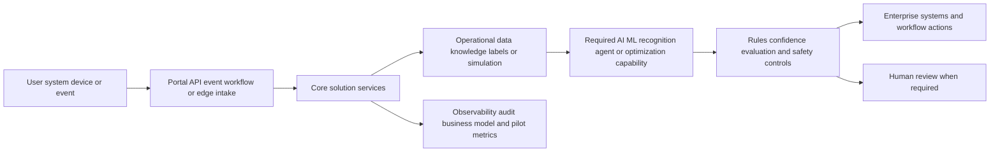

# [OPP-ID] Opportunity title

## Classification

- **Segment:**
- **Primary market / jurisdiction:** Brazil by default; state another market only with explicit Brazil applicability.
- **Evidence reference date:** current watcher execution date plus the main data, publication, update, and rule-effective dates used.
- **Index summary:** one concrete sentence, up to roughly 40 words, describing the problem, proposed solution, and material intelligent capability for `opportunity-index.yaml` and `opportunity-index.md`.
- **Company profile / size:**
- **Opportunity type:** quick-win | product | platform | integration | automation | data | optimization | operations | security | industry-solution | research-bet
- **Status:** hypothesis
- **Confidence:** low | medium | high
- **Complexity:** small | medium | large | research
- **Horizon:** short | medium | long
- **Risk:** low | medium | high | regulated
- **Solution evidence level:** conceptual | prototype | pilot | production | repeated-production
- **Operational maturity:** unvalidated | early | proven
- **Azure fit:** none | low | medium | high
- **AI dependency:** supporting | core
- **Intelligent capability:** concise name for the required model-based capability
- **Repository alignment:** reuse-existing | extend-kit | new-solution | outside-current-kit

`AI dependency: none` and `optional` are invalid. The intelligent capability must materially contribute to the solution rather than decorate a conventional application.

`Confidence: high` requires comparable production evidence, realistic data readiness, and no unresolved failure of the same central capability. Problem magnitude alone cannot justify high confidence.

## Problem

Describe the actor, current process, recurring pain, frequency, consequence, and why the problem matters.

## Brazil applicability and current context

Explain why the problem and solution are relevant to Brazilian organizations at the current execution date.

Include:

- current Brazilian market or operating evidence;
- current Brazilian regulatory, supervisory, standards, procurement, or policy context when applicable;
- material differences between Brazil and foreign examples;
- assumptions that still need local validation.

At least one load-bearing Brazilian source must have been published or materially updated within the previous 18 months. A foreign regulation or liability regime must never be presented as applicable to Brazil.

## Evidence

Separate evidence that the problem exists from evidence that the proposed solution works. Record both supportive and contrary findings.

### Confirmed problem evidence

- [source-backed fact proving the pain, cost, delay, risk, or interruption]

### Favorable solution evidence

- [comparable implementation, measured pilot, production deployment, technical benchmark, or operational result]

### Counter-evidence and failed comparables

- [failed pilot, cancelled or discontinued deployment, rollback, accuracy limitation, false-alert burden, adoption problem, unexpected cost, or effective simpler baseline]
- [concrete mitigation, or explain why the failure still applies]

If no public comparable or counter-evidence was found, state that explicitly and record the searches performed. Absence of negative evidence is not evidence of success.

### Inference

- [reasoned implication that is not directly proven]

### Unknowns

- [material fact requiring customer data, experiment, pilot, legal review, or operational validation]

### Sources

For each important source, record publication or update date, data reference period when relevant, rule effective date when relevant, jurisdiction, and why it supports or challenges the opportunity.

- [source title](URL) — jurisdiction; publication/update date; data period/effective date; favorable, contrary, or contextual relevance

## Current process

## Baseline without AI

Describe the current manual process and the best realistic deterministic, rules-based, analytics, integration, workflow, or conventional-software alternative.

- **Current baseline:**
- **Stronger non-AI alternative:**
- **Baseline cost or effort drivers:**
- **Baseline quality and limitations:**
- **Why intelligence should materially outperform it:**
- **Condition under which the non-AI baseline should be preferred:**

Reject or record `no-new-fit` when the non-AI baseline is likely cheaper, safer, and sufficiently effective for the target process.

## Proposed solution

Explain the process change before naming technologies. State what remains deterministic, where the intelligent capability changes the process or decision, where humans approve decisions, what systems must integrate, and how the design addresses relevant failed comparables.

## Intelligent capability

- **Technique / model family:**
- **Why it is necessary:** explain the value lost if this capability is removed.
- **Inputs:** data, documents, audio, video, events, telemetry, context, labels, feedback, or simulation state consumed.
- **Outputs:** prediction, extraction, classification, recommendation, generated artifact, ranked queue, action policy, or other result produced.
- **Training / grounding / optimization:** describe training, fine-tuning, RAG grounding, prompt/evaluation data, simulation, reward signal, or inference-only assumptions.
- **Evaluation:** define model, retrieval, recognition, ranking, policy, or business-quality metrics and compare against the non-AI baseline.
- **Fallback and controls:** deterministic validation, human review, abstention threshold, rollback, safe default, or manual process.

Reject the opportunity if this section can only say that AI summarizes, chats about, or optionally assists a workflow that remains equally valuable without it.

## Data readiness

Assess whether the required data can realistically support the proposed capability.

- **Data owners and access path:**
- **Volume, history, frequency, and coverage:**
- **Labels or outcome feedback available:**
- **Known quality, missingness, imbalance, and leakage risks:**
- **Brazilian or local-context representativeness:**
- **Privacy, retention, consent, surveillance, or data-sharing constraints:**
- **Integration and synchronization risks:**
- **Drift and change sources:**
- **Minimum viable dataset for a pilot:**

Do not assume that operational systems contain clean labels merely because they contain transactions, images, documents, or events.

## Pilot, economics, and kill criteria

Define a bounded experiment rather than assuming full rollout.

- **Pilot population / process slice:**
- **Duration or event volume:**
- **Baseline or control group:**
- **Required integrations and human effort:**
- **Principal cost drivers:** capture, hardware, integration, inference, storage, model operations, support, and human review as applicable.
- **Business success criteria:**
- **Model-quality success criteria:**
- **Adoption and workflow success criteria:**
- **Safety or compliance stop conditions:**
- **Kill criteria:** explicit thresholds that end or redesign the pilot when performance, cost, adoption, or risk is unacceptable.
- **Scale decision:** what evidence is required before expanding stores, users, processes, regions, or automation authority.

Do not invent ROI. State hypotheses, cost drivers, measurement methods, and decision thresholds.

## Macro architecture

## Capabilities and possible technologies

- Application and workflow capabilities:
- Data capabilities:
- Integration capabilities:
- Required AI / ML capabilities:
- Training, fine-tuning, grounding, recognition, or optimization capabilities:
- Evaluation and model-operations capabilities:
- Security and governance capabilities:
- Azure services that may fit:
- Non-Azure or open-source alternatives worth considering:

## Possible gains

Do not invent percentages. Describe plausible outcomes:

- [possible gain]
- [possible gain]

## Metrics for validation

### Business and operational metrics

- [baseline and target metric]
- [quality or risk metric]
- [operational or financial metric]
- [cost per reviewed, detected, prevented, generated, or optimized outcome]

### Intelligent-capability metrics

- [accuracy, precision/recall, extraction quality, ranking quality, groundedness, policy reward, false-positive rate, abstention rate, or another appropriate metric]
- [human acceptance, override, correction, or escalation metric]
- [incremental value versus the non-AI baseline]

## Risks, limits, and controls

- Privacy and sensitive data:
- Brazilian regulatory or policy constraints:
- Human decision boundaries:
- Model, retrieval, recognition, or policy failure modes:
- Comparable deployment failures and applicability:
- Bias, drift, weak labels, or insufficient feedback:
- Integration and data availability risks:
- Adoption and change-management risks:
- Cost, latency, infrastructure, and operational-support risks:

## Fit score

Apply all hard caps from `radar-config.yaml` before publishing. Strong problem evidence, business value, reuse potential, or differentiation cannot compensate for weak technical feasibility.

| Dimension | Score | Rationale |
| --- | ---: | --- |
| Problem evidence and relevance | /20 | Include current Brazilian evidence and penalize foreign-only or stale support. |
| Business or operational value | /20 | Evaluate measurable value against the current and non-AI baseline. |
| Technical feasibility | /20 | Include solution evidence, counter-evidence, comparable failures, data readiness, integration, evaluation, operating cost, and model-operability realism in Brazil. |
| Reuse potential | /20 | |
| Strategic differentiation | /20 | Explain the material contribution of the intelligent capability beyond deterministic alternatives. |
| **Raw total** | **/100** | Sum before configured caps. |
| **Applied cap** | **none or value** | Name the exact guardrail from `radar-config.yaml`. |
| **Final total** | **/100** | Score after all caps. |

## Repository relationship

- Existing references that may be reused:
- Missing capabilities exposed by this opportunity:
- Potential building blocks:
- Potential composed solution:
- Reasons to keep it outside the current kit, when applicable:

## Duplicate control

- **Problem keys:**
- **Capability keys:** include the intelligent technique and required model behavior.
- **Research queries used:** include Brazil-specific and counter-evidence queries.
- **Related opportunities:**
- **Uniqueness statement:**

## Next decision

Choose one:

- continue research;
- shortlist for review;
- approve for implementation planning;
- park until a dependency or market signal changes;
- reject with reason.

`Approve for implementation planning` requires explicit human decision and cannot be inferred from a high score.