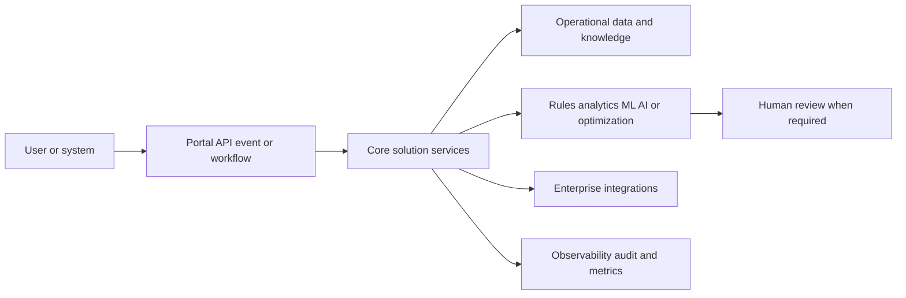

# [OPP-ID] Opportunity title

## Classification

- **Segment:**
- **Company profile / size:**
- **Opportunity type:** quick-win | product | platform | integration | automation | data | optimization | operations | security | industry-solution | research-bet
- **Status:** hypothesis
- **Confidence:** low | medium | high
- **Complexity:** small | medium | large | research
- **Horizon:** short | medium | long
- **Risk:** low | medium | high | regulated
- **Azure fit:** none | low | medium | high
- **AI dependency:** none | optional | supporting | core
- **Repository alignment:** reuse-existing | extend-kit | new-solution | outside-current-kit

## Problem

Describe the actor, current process, recurring pain, frequency, consequence, and why the problem matters.

## Evidence

Separate confirmed evidence from inference.

### Confirmed

- [source-backed fact]

### Inference

- [reasoned implication]

### Sources

- [source title](URL) — relevance and date

## Current process

## Proposed solution

Explain the process change before naming technologies. State what remains deterministic, what may use AI or ML, where humans approve decisions, and what systems must integrate.

## Macro architecture

## Capabilities and possible technologies

- Application and workflow capabilities:
- Data capabilities:
- Integration capabilities:
- Analytics / ML / AI capabilities:
- Security and governance capabilities:
- Azure services that may fit:
- Non-Azure or open-source alternatives worth considering:

## Possible gains

Do not invent percentages. Describe plausible outcomes:

- [possible gain]
- [possible gain]

## Metrics for validation

- [baseline and target metric]
- [quality or risk metric]
- [operational or financial metric]

## Risks, limits, and controls

- Privacy and sensitive data:
- Regulatory or policy constraints:
- Human decision boundaries:
- Model or automation failure modes:
- Integration and data availability risks:
- Adoption and change-management risks:

## Fit score

| Dimension | Score | Rationale |
| --- | ---: | --- |
| Problem evidence and relevance | /20 | |
| Business or operational value | /20 | |
| Technical feasibility | /20 | |
| Reuse potential | /20 | |
| Strategic differentiation | /20 | |
| **Total** | **/100** | |

## Repository relationship

- Existing references that may be reused:
- Missing capabilities exposed by this opportunity:
- Potential building blocks:
- Potential composed solution:
- Reasons to keep it outside the current kit, when applicable:

## Duplicate control

- **Problem keys:**
- **Capability keys:**
- **Research queries used:**
- **Related opportunities:**
- **Uniqueness statement:**

## Next decision

Choose one:

- continue research;
- shortlist for review;
- approve for implementation planning;
- park until a dependency or market signal changes;
- reject with reason.
