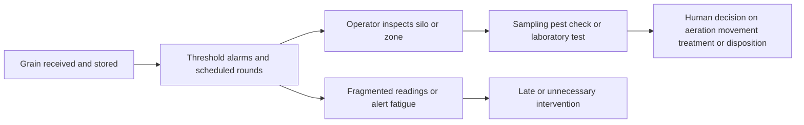
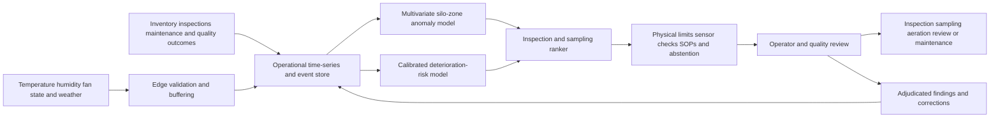

# AGRI-001 AI-assisted grain-storage condition and spoilage-risk assurance

## Classification

- **Segment:** agriculture
- **Primary market / jurisdiction:** Brazil
- **Evidence reference date:** 2026-07-19; Brazilian storage-capacity data published 2026-06-11 for the second half of 2025; Embrapa post-harvest event published 2025-10-23.
- **Index summary:** Brazilian grain-storage operators can combine temperature, humidity, aeration, inventory, weather, and inspection data to predict deterioration risk and rank human-approved inspection and aeration actions without replacing sampling or laboratory confirmation.
- **Company profile / size:** cooperatives, cereal warehouses, farms with on-site silos, grain traders, and storage operators, initially at one facility and one grain family.
- **Opportunity type:** industry-solution
- **Status:** hypothesis
- **Confidence:** medium
- **Complexity:** large
- **Horizon:** medium
- **Risk:** regulated
- **Solution evidence level:** prototype
- **Operational maturity:** unvalidated
- **Azure fit:** high
- **AI dependency:** core
- **Primary AI role:** prediction
- **Intelligent capability:** multivariate grain-condition anomaly detection, deterioration-risk forecasting, and inspection or aeration priority ranking
- **Repository alignment:** new-solution

## Problem

Grain-storage operators monitor silo temperature, humidity, aeration, inventory movements, pest evidence, and periodic quality samples to preserve commodity quality. Readings are often fragmented across controllers, spreadsheets, inspections, and laboratory results. Local hot spots, sensor faults, moisture migration, insects, or fungal development can emerge between manual rounds, while conservative alarms can generate unnecessary inspections or aeration.

The recurring decision is not simply whether a limit was crossed. Operators must determine which silo, zone, or lot is changing abnormally, whether the signal is credible, what evidence is missing, and which bounded action deserves attention first. Late detection may increase quality loss, energy use, infestation, contamination risk, reclassification, or rejection; excessive alerts create fatigue and operating cost.

## Brazil applicability and current context

Brazil had 233.8 million tonnes of agricultural storage capacity in the second half of 2025 across 9,668 establishments. Silos represented 124.7 million tonnes, or 53.3% of capacity. This creates a large operating surface where condition monitoring and timely intervention matter.

In October 2025, an Embrapa-supported post-harvest symposium emphasized early detection and identification of infestations, integrated pest management, safe storage, and correct application of registered controls. The evidence supports the problem and the need for earlier detection; it does not prove that a particular predictive model improves outcomes.

The prototype must reflect Brazilian crops, climates, silo designs, operating practices, residue limits, customer specifications, and laboratory procedures. Foreign model results can support technical plausibility but cannot define Brazilian acceptance, release, or disposal decisions.

## Evidence

### Confirmed problem evidence

- IBGE reported 233.8 million tonnes of available agricultural storage capacity in the second half of 2025, including 124.7 million tonnes in silos.
- Embrapa's 2025 post-harvest symposium highlighted early infestation detection, grain quality, storage safety, and integrated pest-management practices as current operating concerns.
- Embrapa guidance identifies temperature, moisture, insects, fungi, and mycotoxins as important storage-quality factors and recommends sensor-based monitoring while retaining physical controls and sampling.

### Favorable solution evidence

- Multivariate time-series models can identify combinations and trajectories that fixed thresholds miss, such as localized heating, abnormal humidity movement, ineffective aeration, or sensor disagreement.
- Machine-learning literature on mycotoxin screening shows technical promise for combining optical or environmental signals, but also supports using models as screening tools rather than laboratory substitutes.
- Existing temperature, humidity, fan-state, weather, inventory, inspection, and laboratory records provide a plausible bounded data path without requiring autonomous control.

### Counter-evidence and limitations

- Fixed thresholds, cable-temperature maps, scheduled sampling, pest traps, and expert inspection are strong conventional controls and may be sufficient for small or stable facilities.
- Sensor drift, dead zones, grain movement, different silo geometry, seasonal changes, and management interventions can resemble deterioration and create false alerts.
- Mycotoxin presence cannot be reliably inferred from environmental telemetry alone. A model may rank where to sample, but laboratory or validated rapid tests remain authoritative.
- Published machine-learning reviews report inconsistent datasets, limited reproducibility, and weak external validation. The prototype therefore starts in replay and shadow mode, uses abstention, and evaluates each facility separately.

### Inference

- The highest-value intelligence is likely to be risk-ranked inspection and sampling, not direct contamination diagnosis or autonomous fan control.
- Combining spatial sensor behavior with operating context may reduce missed local deterioration while keeping the deterministic alarm system as fallback.

### Unknowns

- Whether each target facility has sufficiently dense and calibrated sensor coverage.
- Whether inspection, quality, pest, aeration, and laboratory outcomes are linked to silo zones and timestamps.
- The practical lead time available before a condition becomes operationally material.
- Whether ranked alerts improve inspection yield, quality preservation, or energy use after accounting for normal seasonal operation.

### Sources

- [IBGE: Capacidade de armazenagem agrícola cresce 1,1% e chega a 233,8 milhões de toneladas no segundo semestre de 2025](https://agenciadenoticias.ibge.gov.br/agencia-sala-de-imprensa/2013-agencia-de-noticias/releases/47075-capacidade-de-armazenagem-agricola-cresce-1-1-e-chega-a-233-8-milhoes-de-toneladas-no-segundo-semestre-de-2025) — Brazil; 2026-06-11; current scale and storage-capacity evidence.
- [Embrapa: Simpósio sobre pós-colheita debate qualidade dos grãos e segurança no armazenamento](https://www.embrapa.br/busca-de-noticias/-/noticia/103937747/simposio-pos-colheita-de-grãos-debate-qualidade-dos-graos-e-seguranca-no-armazenamento) — Brazil; 2025-10-23; current operational problem and early-detection context.
- [Embrapa: Armazenamento](https://portaldxp-h.sede.embrapa.br/en/web/agencia-de-informacao-tecnologica/cultivos/arroz/pos-producao/pos-colheita/armazenamento) — Brazil; stable technical guidance; storage conditions and sensor monitoring.
- [Machine Learning Applied to the Detection of Mycotoxin in Food: A Review](https://arxiv.org/abs/2404.15387) — international; 2024; technical plausibility and reproducibility limitations.
- [Survey of mycotoxins in Southern Brazilian wheat and evaluation of immunoassay methods](https://revistas.usp.br/sa/article/view/132802) — Brazil; 2017; historical limitation evidence for screening false positives and laboratory confirmation.

## Current process

## Baseline without AI

- **Current baseline:** controller alarms, cable-temperature visualization, fixed moisture and temperature limits, scheduled inspections, pest traps, manual sampling, laboratory tests, and operator experience.
- **Strongest realistic non-AI alternative:** unified telemetry dashboard with calibrated sensors, rule-based rate-of-change alerts, maintenance checks, scheduled risk-based sampling, and explicit operating playbooks.
- **Baseline strengths:** transparent, auditable, inexpensive, familiar, and directly tied to known physical and quality limits.
- **Baseline limitations:** thresholds treat signals independently, adapt poorly to seasonal and facility-specific patterns, and do not consistently rank competing inspections.
- **Context where intelligence may add incremental value:** facilities with many silos or zones, dense telemetry, variable operating regimes, limited inspection capacity, and enough historical outcomes for replay evaluation.
- **Condition where the non-AI baseline should be preferred:** sparse or unreliable sensors, few assets, stable conditions, no linked outcomes, or where calibrated rules already produce timely and manageable alerts.

## Proposed solution

Create a condition-assurance layer that ingests silo-zone telemetry, aeration state, ambient weather, grain type, lot age, inventory movements, maintenance status, inspection findings, pest observations, and quality or laboratory outcomes. Deterministic validation first rejects impossible readings, detects missing sensors, preserves regulatory and product limits, and keeps existing alarms active.

A multivariate anomaly model identifies abnormal spatial and temporal behavior relative to the same silo, grain family, and operating regime. A deterioration-risk model estimates the probability of a confirmed inspection or quality exception within a bounded horizon. A ranking component prioritizes where operators should inspect, sample, or review aeration performance.

The system presents evidence, contributing signals, uncertainty, and recommended review steps. Operators retain authority over inspection, aeration, grain movement, treatment, release, rejection, and disposal. Laboratory or validated rapid testing remains mandatory for contamination conclusions.

## Where AI enters

### AI role map

| Process stage | AI component | AI type / model family | What it does | Runtime mode | Output | Human or deterministic control |
| --- | --- | --- | --- | --- | --- | --- |
| Telemetry review | Silo-zone condition anomaly detector | multivariate time-series anomaly detection | Detects unusual temperature, humidity, spatial-gradient, fan-response, and sensor-consistency patterns | batch or near-real-time | anomaly score, affected zone, contributing signals | sensor-validation rules, physical limits, existing alarms, abstention |
| Inspection planning | Deterioration-risk forecaster | gradient boosting or temporal forecasting model | Estimates bounded-horizon risk of a confirmed quality, pest, moisture, or heating exception | scheduled batch | calibrated risk and confidence | no contamination conclusion; low-confidence cases return to baseline |
| Work prioritization | Inspection and sampling ranker | learning-to-rank or calibrated rules plus model scores | Orders silos and zones by expected review value, urgency, and evidence completeness | asynchronous human-in-the-loop | ranked review queue and reason codes | operator capacity, safety rules, SOPs, and supervisor approval |

### Required distinctions

- **Primary AI role:** anomaly detection, prediction, and ranking/recommendation.
- **Model family:** multivariate time-series models, gradient boosting, and optional learning-to-rank.
- **Training requirement:** self-supervised normal-pattern learning initially; supervised training when adjudicated inspection and quality outcomes are sufficient.
- **Training location and cadence:** offline per facility or compatible silo family; seasonal review and retraining only after drift and replay evaluation.
- **Inference location:** edge preprocessing with private cloud or on-premises batch and near-real-time scoring.
- **Agent role:** Agent: not used.
- **LLM role:** LLM: not used.
- **Non-LLM intelligence:** time-series anomaly detection, risk prediction, calibration, and ranking.
- **Not AI:** sensor acquisition, controller alarms, physical limits, product specifications, laboratory testing, SOPs, dashboards, work queues, approvals, and equipment control.

## Intelligent capability details

- **Technique / model family:** robust multivariate anomaly detection plus calibrated gradient-boosted prediction; ranking may begin as a deterministic combination of model scores and operational constraints.
- **Why it is necessary:** the material value comes from recognizing cross-sensor trajectories and facility-specific patterns that independent fixed thresholds cannot express consistently.
- **Inputs:** temperature and humidity by zone, ambient weather, aeration state, fan response, grain type, lot age, inventory movement, sensor health, maintenance, inspections, pest observations, quality and laboratory outcomes.
- **Outputs:** anomaly score, deterioration-risk estimate, confidence, contributing signals, missing evidence, and ranked inspection or sampling queue.
- **Training / grounding / optimization assumptions:** at least one storage cycle of usable telemetry for unsupervised baselining and adjudicated events for supervised evaluation; synthetic sensor faults may supplement but not replace real outcomes.
- **Evaluation:** event-level precision and recall, calibration, warning lead time, ranking precision at inspection capacity, false alerts per silo-week, and comparison against calibrated rules.
- **Fallback and controls:** existing alarms and manual rounds remain active; invalid or out-of-distribution cases abstain; operators can reject, correct, and annotate every recommendation.

## Data and integration assumptions

- **Data owners and access path:** storage operations, quality, maintenance, laboratory, agronomy, and IT/OT teams through controllers, historian, SCADA, spreadsheets, LIMS, CMMS, or APIs.
- **Expected volume, history, frequency, and coverage:** minute-to-hour telemetry across multiple zones; at least one full storage cycle; linked event and inspection timestamps.
- **Labels, outcomes, feedback, or simulation available:** confirmed hot spots, moisture exceptions, pest findings, spoilage, quality downgrades, aeration interventions, sensor faults, and laboratory results; synthetic faults only for engineering tests.
- **Known quality, imbalance, missingness, and leakage risks:** rare failures, delayed labels, undocumented intervention, sensor replacement, uneven spatial coverage, and leakage from post-event actions.
- **Brazilian or local-context representativeness:** models require local calibration by crop, region, season, silo design, and operating practice.
- **Privacy, retention, consent, surveillance, or sharing constraints:** limited personal data; protect commercially sensitive inventory, quality, supplier, and operating information.
- **Integration and synchronization assumptions:** reliable timestamps, silo-zone identity, telemetry-quality flags, and event linkage are required.
- **Drift and change sources:** crop and moisture profile, season, weather, silo loading, sensor replacement, aeration strategy, and maintenance.
- **Minimum viable data for a prototype:** three to ten silos or zones, one grain family, one complete storage cycle, telemetry, fan state, manual findings, and known quality exceptions.

## Prototype validation plan

- **Prototype scope / process slice:** replay and shadow-mode prioritization for one facility, one grain family, and selected silos; no equipment control.
- **Users, sites, assets, documents, events, or simulated cases:** storage operators, quality analysts, and maintenance staff; three to ten silos; historical and live shadow data.
- **Baseline or comparison:** existing controller alerts plus a strengthened rate-of-change and sensor-consistency rule set.
- **Required data and integrations:** historian or controller export, weather, aeration state, inspection log, sensor-maintenance log, and quality outcomes.
- **Model-quality metrics:** precision-recall, calibration error, median warning lead time, false alerts per silo-week, ranking precision at top-k, and out-of-distribution abstention.
- **Business or workflow metrics:** inspections yielding confirmed actionable findings, time from signal to review, unnecessary aeration or inspection burden, and quality events detected before current baseline.
- **Human acceptance, correction, or override metrics:** recommendation acceptance, corrected reason codes, alert dismissal reasons, and operator-reported usefulness.
- **Safety and compliance boundaries:** no autonomous fan control, fumigation, grain movement, release, rejection, treatment, or contamination declaration.
- **Failure or redesign criteria:** no improvement over calibrated rules; excessive false-alert burden; insufficient lead time; unstable performance between seasons or silos; sensor coverage too weak; or operators cannot verify explanations.
- **Evidence required before a pilot or broader implementation:** stable shadow-mode performance, facility-specific calibration, documented sensor quality, human acceptance, and confirmed ability to preserve existing safety and laboratory controls.

## Macro architecture

## Capabilities and possible technologies

- Application and workflow capabilities: silo dashboard, evidence timeline, ranked review queue, reason codes, operator feedback, and audit trail.
- Data capabilities: time-series ingestion, sensor-quality metadata, event normalization, feature store, and outcome linkage.
- Integration capabilities: MQTT or OPC UA gateway, historian or SCADA export, weather feed, LIMS or quality records, and maintenance system.
- Required AI / ML capabilities: anomaly detection, calibrated prediction, ranking, drift monitoring, and out-of-distribution checks.
- Training, grounding, recognition, or optimization capabilities: offline feature pipelines, temporal validation, model registry, replay evaluation, and seasonal recalibration.
- Agent and tool-use capabilities, or `not used`: not used.
- LLM / foundation-model capabilities, or `not used`: not used.
- Evaluation and model-operations capabilities: Azure Machine Learning or MLflow, batch endpoints, monitoring, and data-quality checks.
- Security and governance capabilities: private networking, managed identity, least privilege, encryption, OT isolation, model versioning, and audit logs.
- Azure services that may fit: Azure IoT Operations or IoT Hub, Event Hubs, Azure Data Explorer, Azure Machine Learning, Functions, Container Apps, Monitor, and Managed Grafana.
- Non-Azure or open-source alternatives worth considering: MQTT, OPC UA, TimescaleDB, InfluxDB, MLflow, Feast, scikit-learn, PyTorch, Grafana, and on-premises Kubernetes.

## Possible gains

- Earlier and more targeted inspection of developing hot spots or sensor failures.
- Better use of limited sampling, quality, and maintenance capacity.
- Reduced alert fatigue by ranking evidence instead of adding another unprioritized alarm stream.
- More consistent documentation of why an inspection or aeration review was prioritized.

## Metrics for validation

### Business and operational metrics

- Actionable findings per inspection compared with the current and strengthened rule baselines.
- Warning lead time, review latency, unnecessary inspections, unnecessary aeration reviews, and quality events detected before current alarms.

### Intelligent-capability metrics

- Event-level precision, recall, calibration, false alerts per silo-week, ranking precision at top-k, and seasonal stability.
- Human acceptance, override, correction, abstention, and escalation rates.

## Risks, limits, and controls

- Privacy and sensitive data: protect commercially sensitive inventory, supplier, customer, and quality information.
- Brazilian regulatory or policy constraints: preserve applicable grain classification, food or feed safety, residue, storage, labor, and environmental obligations; obtain specialist legal and quality review for the target commodity.
- Human decision boundaries: humans retain all authority over sampling, treatment, aeration, movement, release, rejection, and disposal.
- Model or policy failure modes: false hot spots, missed localized deterioration, sensor drift interpreted as risk, seasonal shift, and overconfidence outside trained silo types.
- Agent or tool-execution failure modes, when applicable: not applicable; no agent is used.
- LLM hallucination, grounding, or prompt-injection risks, when applicable: not applicable; no LLM is used.
- Comparable failures and applicable lessons: screening methods can overestimate contamination; telemetry cannot replace laboratory confirmation; published ML studies often lack external validation.
- Bias, drift, weak labels, or insufficient feedback: rare events, inconsistent inspection practice, delayed laboratory outcomes, and intervention-altered labels require temporal evaluation and abstention.
- Integration and data risks: unreliable timestamps, undocumented sensor changes, missing fan-state data, and weak silo-zone identity can invalidate the prototype.
- Adoption and change-management risks: operators may ignore opaque or frequent alerts; expose evidence and preserve familiar alarms and SOPs.
- Prototype cost or operational assumptions: sensor installation or calibration may dominate model cost; start where telemetry already exists.

## Fit score

| Dimension | Score | Rationale |
| --- | ---: | --- |
| Problem evidence and relevance | 18/20 | Current IBGE scale and Embrapa operating evidence establish a material Brazilian storage-quality problem. |
| Business or operational value | 18/20 | Earlier targeted inspection could preserve quality and focus scarce operating capacity, but gains require local testing. |
| Technical feasibility | 18/20 | A bounded replay and shadow prototype is testable with existing telemetry and inspections while retaining strong fallback controls. |
| Reuse potential | 17/20 | Time-series assurance, sensor-quality, anomaly, ranking, and human-review components generalize to other agricultural and industrial storage assets. |
| Strategic differentiation | 17/20 | Cross-sensor prediction and calibrated ranking add material value beyond dashboards and isolated thresholds when data quality is sufficient. |
| **Total** | **88/100** | Strong prototype hypothesis with meaningful data, transfer, and validation risks. |

## Repository relationship

- Existing references that may be reused: event ingestion, time-series storage, Azure Machine Learning evaluation, monitoring, private networking, and human-review workflow patterns.
- Missing capabilities exposed by this opportunity: OT-safe sensor-quality layer, time-series replay harness, spatial silo-zone modeling, calibrated alert ranking, and seasonal drift evaluation.
- Potential building blocks: telemetry-normalization, sensor-health validation, temporal anomaly evaluation, ranked human-review queue, and model-abstention control.
- Potential composed solution: agricultural storage condition-assurance reference solution.
- Reasons to keep it outside the current kit, when applicable: none; it fits as a future reference hypothesis, not approved implementation.

## Duplicate control

- **Problem keys:** grain storage, post-harvest quality, silo hot spots, moisture migration, infestation, spoilage, sampling prioritization.
- **Capability keys:** multivariate time-series anomaly detection, deterioration forecasting, sensor validation, inspection ranking, human-in-the-loop assurance.
- **Research queries used:** Brasil 2025 perdas pós-colheita armazenamento grãos umidade micotoxinas Embrapa; Brasil 2025 pecuária detecção precoce mastite sensores pesquisa; Brasil 2025 agricultura aplicação defensivos deriva pulverização precisão; Brazil agriculture AI grain storage mycotoxin detection limitations false positives.
- **Related opportunities:** MANUF-001 condition monitoring uses industrial equipment signals, but AGRI-001 addresses biological commodity deterioration, spatial grain-mass behavior, sampling, and quality controls.
- **Uniqueness statement:** This opportunity targets stored-grain condition and quality-assurance decisions rather than field crop prediction, machinery maintenance, or direct contamination diagnosis.

## Next decision

Prototype candidate. Implementation approval remains an explicit human decision.