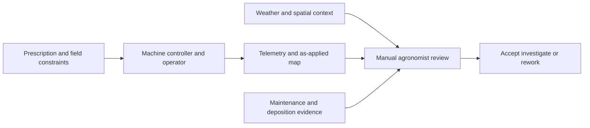
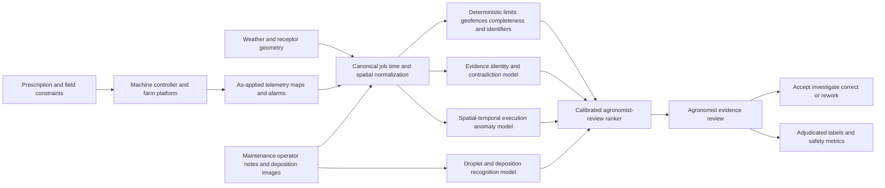

# AGRI-002 AI-assisted spray-application evidence assurance

## Classification

- **Segment:** agriculture
- **Primary market / jurisdiction:** Brazil
- **Evidence reference date:** 2026-07-25
- **Index summary:** Brazilian crop operations can reconcile prescription, weather, machine telemetry, field boundaries, nozzle evidence, and post-application observations to flag likely unsafe or ineffective spray execution before agronomist sign-off.
- **Company profile / size:** Medium and large grain, sugarcane, cotton, citrus, and horticulture operations using shared or contractor-operated sprayers
- **Opportunity type:** operations
- **Status:** hypothesis
- **Confidence:** medium
- **Complexity:** large
- **Horizon:** medium
- **Risk:** regulated
- **Solution evidence level:** prototype
- **Operational maturity:** unvalidated
- **Existing-solution disposition:** integrate
- **Azure fit:** high
- **AI dependency:** core
- **Primary AI role:** multimodal
- **Intelligent capability:** Multimodal spray-execution reconciliation, drift-risk anomaly detection, deposition-quality recognition, and agronomist-review ranking
- **Repository alignment:** extend-kit

## Operational simulation

The following workflow is simulated to expose operational opportunity points. Farm size, staffing, incident frequencies, equipment mix, and scenario events are explicit assumptions rather than sourced facts.

### Organization and actor

- **Organization archetype:** Brazilian agricultural group operating approximately 20,000 hectares across several farms, with owned and contractor-operated ground sprayers.
- **Primary actor:** Application-quality agronomist who authorizes the job plan, reviews execution evidence, and decides whether to accept, investigate, or repeat an application.
- **Other actors:** Field scout, machine operator, operations dispatcher, environmental or safety lead, contractor supervisor, and farm manager.
- **Trigger:** A crop-protection recommendation is converted into a scheduled field application.
- **Objective:** Apply the authorized product, mixture, rate, target area, and operating conditions while preserving safety, environmental buffers, traceability, and agronomic effectiveness.
- **Completion condition:** The agronomist confirms that prescription, weather window, machine execution, field coverage, exceptions, and available deposition evidence are coherent enough to close the operation or request corrective action.

### Inputs, systems, and constraints

- Agronomic prescription, product label and authorized use, target crop and growth stage, rate, carrier volume, adjuvant, and application window.
- Field boundary, exclusion zones, water bodies, neighboring sensitive crops, dwellings, roads, and other protected or operationally restricted areas.
- Weather observations and forecasts, including wind speed and direction, temperature, humidity, and precipitation.
- Machine and controller telemetry: GPS track, speed, pressure, commanded and actual rate, section control, tank events, alarms, and operator actions.
- Nozzle type and condition, calibration record, maintenance evidence, and optional images of nozzles or water-sensitive paper.
- Operations-center, farm-management, prescription, weather, and compliance systems that may use different identifiers and timestamps.
- Brazilian product-use, exposure-risk, occupational-safety, environmental, recordkeeping, and application-specific requirements.

### Scenario 1 — normal flow

1. The agronomist approves a prescription and operating window.
2. Dispatch assigns a calibrated sprayer and operator.
3. The prescription and field boundary are transferred to the machine controller.
4. The operator confirms product, mixture, nozzles, tank, and field.
5. Telemetry records path, rate, speed, pressure, section state, and alarms.
6. Weather remains within the local operating limits defined by the agronomist and product requirements.
7. FieldView, an operations platform, or the machine controller creates an as-applied map and report.
8. The agronomist compares planned and actual application, checks alarms and gaps, and closes the job.

**Decision points:** whether small deviations are operationally acceptable; whether coverage gaps require reapplication; whether sensor anomalies are real or instrumentation noise.

**Potential feedback:** accepted job, confirmed gap, confirmed sensor fault, rework area, operator correction, nozzle replacement, and agronomist override reason.

### Scenario 2 — exception flow

Synthetic event: the operation report is technically complete, but evidence conflicts.

- The controller reports the expected rate while pressure oscillates during one section of the field.
- Wind from a local station remains acceptable, but an on-machine sensor records short gusts toward a neighboring sensitive area.
- The machine path stays inside the field polygon, yet the boom and spray plume extend beyond the centerline near the boundary.
- The product and prescription identifiers match, but the uploaded nozzle-maintenance photo may belong to another machine or date.
- Water-sensitive paper images show sparse or uneven deposition, but lighting and capture distance vary.

The agronomist must decide whether this is an instrumentation issue, a real drift or coverage risk, a localized rework case, or insufficient evidence. Existing dashboards expose each signal separately but do not reliably reconcile their meaning, provenance, and uncertainty.

**Failure consequences:** ineffective treatment, unnecessary repeat application, off-target exposure, weak audit evidence, dispute with a contractor, or delayed intervention while the agronomic window closes.

**Potential labels:** confirmed drift concern, acceptable transient gust, telemetry clock mismatch, wrong evidence attachment, deposition below target, false alert, and localized corrective action.

### Scenario 3 — peak or degraded flow

Synthetic event: a narrow weather window opens after prolonged rain, creating a large queue of applications.

- Several machines and contractors operate simultaneously.
- Connectivity is intermittent and telemetry arrives late or duplicated.
- One weather station is unavailable, and jobs rely on machine sensors plus nearby observations.
- Operators substitute a nozzle or update a mixture after a blockage, but the event is recorded inconsistently.
- Agronomists must review dozens of completed jobs before the next shift and cannot inspect every map, alarm, and image in detail.

Rules can identify missing files or hard threshold violations. They are weaker when multiple individually plausible signals form a suspicious combination, when timestamps or identities disagree, or when the consequence depends on spatial direction, crop sensitivity, equipment state, and evidence quality.

### Opportunity points derived from simulation

| Opportunity point | Deterministic response first | Remaining material gap |
| --- | --- | --- |
| Prescription-to-machine transfer | Schema validation, signed prescription, identifier checks | Semantic mismatch among product, crop stage, mixture notes, and machine setup can remain despite valid schemas |
| Weather-window control | Hard limits, alerts, automatic pause | Conflicting sensors, short gusts, spatial direction, and evidence quality require calibrated uncertainty rather than a single threshold |
| Boundary and buffer control | Geofences and section control | Centerline compliance does not necessarily represent boom extent, plume direction, or sensitive receptor context |
| Application-quality review | As-applied maps and summary statistics | Distributed anomalies across rate, pressure, speed, sections, maintenance, and deposition evidence are difficult to reconcile manually |
| Deposition verification | Manual water-sensitive-paper inspection | Capture variability and large review volume make consistent droplet-coverage assessment difficult |
| Contractor evidence | Mandatory checklist and attachments | Correct-looking evidence can be attached to the wrong machine, field, time, or prescription |

## Problem

Agricultural application platforms already produce prescriptions, telemetry, as-applied maps, weather context, alarms, and reports. The remaining assurance problem is not basic data collection. It is deciding whether evidence from different systems, sensors, spatial frames, machines, and field observations is mutually coherent enough to support agronomist acceptance.

A job can appear complete while containing localized rate instability, weak deposition, evidence identity mismatch, uncertain weather exposure, or boundary risk. Manual review becomes difficult during narrow application windows and multi-machine operations. Conversely, over-sensitive alerting can delay work, waste agronomist attention, and trigger unnecessary reapplication.

## Brazil applicability and current context

Brazil maintains active federal oversight and recordkeeping expectations for pesticide and agricultural-application operations. The MAPA pesticide-inspection page was materially updated on 23 October 2025. MAPA's aviation-agriculture inspection guidance, updated on 19 February 2026, describes protected-distance controls and requires operational records to remain available for inspection. Anvisa's current occupational, resident, and bystander exposure-risk guidance was updated on 2 June 2026, following RDC 998/2025, which established clearer national exposure-risk evaluation rules. These sources support the load-bearing need for traceable, risk-aware application evidence, without implying that the proposed model is required by regulation.

The first prototype should focus on ground spraying. Aerial application, ARP operations, and jurisdiction-specific restrictions may be separate validation tracks because equipment, spatial effects, legal controls, and evidence requirements differ.

## Existing solutions and differentiation

### Existing solutions reviewed

| Solution / platform | Owner or vendor | Current capabilities | Evidence date | Coverage overlap |
| --- | --- | --- | --- | --- |
| Climate FieldView | Bayer / The Climate Corporation | Creates prescriptions, collects machine data, and generates maps and reports for rate, mixture, product, speed, and machine coverage | Current help pages accessed 2026-07-25; Brazil product article dated 2025-07-29 | Prescription, telemetry collection, as-applied mapping, reports, and operational review |
| Solinftec platform and ALICE AI | Solinftec | Connects operational, machine, logistics, agronomic, and climate data and reports continuous optimization across large agricultural operations | Current product site accessed 2026-07-25 | Real-time operational monitoring, anomaly identification, recommendations, and workflow coordination |
| DropLeaf research application | Brazilian academic research | Uses smartphone image analysis to measure spray deposition on water-sensitive paper | Published research and follow-on work | Deposition-image measurement and portable quality inspection |
| Machine controllers and farm-management systems | Multiple vendors | Geofencing, section control, rate control, alarms, machine records, and compliance exports | Current market baseline | Deterministic execution control and traceability |

### Gap and disposition

- **What is already solved:** Prescription creation, machine-data capture, as-applied mapping, basic operational alerts, variable-rate execution, and isolated deposition analysis.
- **Material uncovered gap:** Evidence-level reconciliation across prescription, field geometry, sensitive receptors, weather uncertainty, machine telemetry, setup and maintenance evidence, and optional deposition images, with calibrated abstention and source provenance.
- **Underserved actor, context, integration, or outcome:** Agronomists reviewing mixed fleets and contractors during compressed weather windows, where no single platform owns all evidence and acceptance authority remains human.
- **Disposition:** integrate.
- **Why changing vendor, cloud, model, UI, or architecture is insufficient:** The value depends on connecting evidence across existing platforms and producing an auditable review case, not replacing their mapping or machine-control capabilities.
- **Differentiation statement:** The proposed layer does not prescribe chemicals, operate the sprayer, or replace farm-management platforms. It identifies cross-system contradictions and risk combinations that may make an apparently complete application unfit for immediate human acceptance.

## Evidence

### Simulated observations

- Narrow weather windows may concentrate review volume and make exhaustive manual inspection impractical.
- Individually plausible telemetry, weather, and evidence records may conflict when aligned by machine, field, time, and prescription.
- Geofence compliance based on the vehicle path may not fully describe boom extent or potential plume direction.

These are prototype assumptions requiring operational observation.

### Confirmed problem evidence

- MAPA maintains federal inspection of pesticides and related products, with its inspection page updated in October 2025.
- Current MAPA aviation-agriculture guidance includes protected-distance controls and operational record retention, demonstrating the materiality of spatial controls and evidence in regulated application contexts.
- Anvisa's current exposure-risk framework explicitly addresses workers, residents, and bystanders and was updated in June 2026.

### Existing-solution evidence

- FieldView records detailed application maps including rates, products, mixtures, speed, and machine coverage.
- Solinftec markets continuous integration of machine, operational, agronomic, logistics, and climate data with real-time decision support.
- DropLeaf demonstrates that smartphone analysis of water-sensitive paper can estimate spray deposition, supporting a bounded visual prototype path.

### Favorable evidence for the uncovered gap

- Multimodal models can compare images, structured telemetry, spatial context, and text evidence rather than treating each source independently.
- Temporal and spatial anomaly models can evaluate combinations such as pressure oscillation, speed change, section state, wind direction, and boundary proximity.
- Synthetic fault injection can create controlled examples of clock drift, duplicated telemetry, sensor disagreement, wrong attachments, rate instability, and deposition defects before sufficient adjudicated field labels exist.

### Counter-evidence and limitations

- Existing platforms may already support customer-specific rules, alerts, and data integration beyond publicly documented capabilities.
- Local weather and machine sensors can be noisy; an intelligent layer may amplify weak data into false concern.
- Water-sensitive paper samples only selected points and can be affected by placement, handling, lighting, and image capture.
- Spray drift cannot be proven solely from telemetry, proximity, or model output; field investigation and applicable technical methods remain necessary.
- Cross-farm transfer may be weak because crop structure, equipment, nozzles, products, climate, terrain, and operating practice differ.
- Therefore, the prototype must be read-only, expose evidence and uncertainty, abstain when inputs are insufficient, and compare against rules plus expert review.

### Inference

A cross-platform assurance layer may add value where the main failure is not missing data but fragmented evidence and inconsistent interpretation under time pressure.

### Unknowns

- Actual frequency of disputed or rejected application records.
- Data access and export quality across machine brands, contractors, weather stations, and farm-management systems.
- Whether deposition images are collected consistently enough to improve decisions.
- Local false-alert tolerance and the economic trade-off among delay, reapplication, missed defects, and agronomist effort.

### Sources

- [Fiscalização de Agrotóxicos e Afins](https://www.gov.br/agricultura/pt-br/assuntos/insumos-agropecuarios/insumos-agricolas/agrotoxicos/sobre-a-fiscalizacao) — Brazil; updated 2025-10-23; current inspection context.
- [Fiscalização — Aviação Agrícola](https://www.gov.br/agricultura/pt-br/assuntos/insumos-agropecuarios/aviacao-agricola/fiscalizacao) — Brazil; updated 2026-02-19; protected distances and operational records.
- [Avaliação do Risco da Exposição Ocupacional, Residentes e Transeuntes aos Agrotóxicos](https://www.gov.br/anvisa/pt-br/assuntos/agrotoxicos/risco-ocupacional) — Brazil; updated 2026-06-02; current exposure-risk context.
- [Anvisa publica norma que regulamenta avaliação de risco ocupacional e de exposição a agrotóxicos](https://www.gov.br/anvisa/pt-br/assuntos/noticias-anvisa/2025/anvisa-publica-norma-que-regulamenta-avaliacao-de-risco-ocupacional-e-de-exposicao-a-agrotoxicos) — Brazil; 2025-11-25/26; RDC 998/2025 context.
- [Como FieldView Drive mapeia sua aplicação](https://climate.com/pt-br/ajuda-rapida/aplicacao-pulverizacao/como-cab-mapeia-aplicacao.html) — Brazil product documentation; accessed 2026-07-25; existing platform capabilities.
- [Solinftec AgTech Solutions](https://www.solinftec.com/pt-br/) — Brazil product documentation; accessed 2026-07-25; existing operational platform.
- [A smartphone application to measure the quality of pest control spraying machines via image analysis](https://arxiv.org/abs/1711.07828) — Brazilian research; technical plausibility and limitations.
- [Robotic System with AI for Real Time Weed Detection, Canopy Aware Spraying, and Droplet Pattern Evaluation](https://arxiv.org/abs/2507.05432) — international research; 2025; edge vision and deposition evaluation, with limited indoor validation.

## Current process and current solution

## Baseline

- **Current manual or system baseline:** Prescription plus machine controller, weather monitoring, as-applied maps, alarms, checklist, and agronomist review.
- **Existing product or platform baseline:** FieldView, Solinftec, OEM controllers, farm-management systems, and specialist deposition tools.
- **Strongest realistic non-AI alternative:** Canonical identifiers, time synchronization, mandatory evidence capture, hard weather and buffer rules, geofences, rule-based anomaly checks, and standardized review queues.
- **Baseline strengths:** Transparent, auditable, fast, and reliable for hard violations and complete structured data.
- **Baseline limitations:** Weak on conflicting sensors, uncertain evidence quality, semantic mismatch, attachment identity, spatial combinations, and large cross-platform review volume.
- **Exact context where proposed intelligence adds incremental value:** Jobs that pass schema and threshold checks but contain interacting weak signals or heterogeneous evidence requiring judgment.
- **Condition where adoption or baseline should be preferred:** Single-platform operations with stable equipment, complete telemetry, low volume, and effective existing alerting.

## Proposed solution or extension

Integrate a read-only assurance service after the existing as-applied reporting process. The service normalizes job identities, timestamps, spatial references, prescription versions, machine telemetry, weather observations, alarms, maintenance evidence, and optional deposition images. Deterministic controls identify hard violations and missing evidence. Model-based components evaluate cross-source consistency, spatial-temporal risk combinations, deposition quality, and review priority.

The output is an evidence packet, not an application decision. It contains source-linked findings, confidence, uncertainty, alternatives, missing evidence, and the reason the system abstained or ranked the job. Agronomists accept, reject, investigate, or correct findings. The service never selects a pesticide, changes a rate, controls a machine, or declares legal compliance.

## Where AI enters

### AI role map

| Process stage | AI component | AI type / model family | Inputs | What it does | Runtime mode | Output | Human or deterministic control |
| --- | --- | --- | --- | --- | --- | --- | --- |
| Evidence intake | Evidence identity and contradiction model | Embeddings, cross-encoder, multimodal model | Prescription, job metadata, maintenance images, operator notes, machine and field IDs | Detects likely wrong-job attachments and semantic mismatch among setup evidence and prescription | Asynchronous batch | Contradiction candidates, evidence links, confidence | Canonical IDs, hashes, timestamps, allowlists, agronomist confirmation |
| Execution review | Spatial-temporal anomaly model | Time-series ML, gradient boosting, spatial features | GPS, speed, rate, pressure, section state, wind, boundary and receptor geometry | Detects unusual combinations associated with coverage, drift-risk, or equipment-execution concerns | Post-job batch or near-real-time shadow mode | Ranked anomaly intervals with contributing factors | Hard rules remain authoritative; model abstains on missing or low-quality inputs |
| Deposition check | Droplet and coverage recognizer | Computer vision / multimodal vision | Water-sensitive-paper or approved deposition images plus capture metadata | Estimates coverage and image quality and identifies inconsistent samples | Mobile capture plus asynchronous inference | Coverage estimate, capture-quality warning, uncertain regions | Standard capture guide, manual sample validation, no claim of whole-field coverage |
| Review queue | Application-review ranker | Calibrated learning-to-rank | Rule findings, model findings, job importance, evidence completeness, agronomic window | Prioritizes jobs for human review | Hourly batch | Review priority, reason codes, uncertainty | Queue policy, protected cases, manager override, random control sampling |

### Required distinctions

- **Primary AI role:** multimodal recognition, anomaly detection, contradiction classification, and ranking.
- **Model family:** computer vision or multimodal model, embeddings and cross-encoder, time-series or tabular ML, spatial feature models, and calibrated learning-to-rank.
- **Training requirement:** pretrained inference for document/image components; supervised calibration using adjudicated findings; synthetic fault injection for early anomaly testing.
- **Training location and cadence:** private offline training per operating group; seasonal or drift-triggered review rather than automatic continuous retraining.
- **Inference location:** optional mobile or edge image-quality check; private cloud batch and near-real-time shadow processing.
- **Agent role:** not used.
- **LLM role:** optional restricted extraction and contradiction classification with source evidence; not used for prescription, legal interpretation, or machine control.
- **Non-LLM intelligence:** computer vision, embeddings, cross-encoder, time-series anomaly detection, gradient boosting, spatial features, calibration, and ranking.
- **Not AI:** prescription authoring, product authorization, calculations, identifiers, geofences, hard thresholds, APIs, databases, queues, dashboards, machine control, record retention, and human approval.

## Intelligent capability details

- **Why it is necessary for the uncovered gap:** Rules identify explicit threshold or completeness failures but do not consistently reconcile interacting weak signals and heterogeneous evidence across platforms.
- **Inputs:** Prescription version, product and mixture metadata, crop and field, boundaries and receptors, machine/controller telemetry, weather observations, alarms, calibration and maintenance evidence, operator notes, and optional deposition images.
- **Outputs:** Source-linked contradiction findings, suspicious intervals, deposition-quality estimate, uncertainty, abstention reason, and prioritized review case.
- **Training / grounding / optimization assumptions:** Historical jobs can be linked to agronomist dispositions; synthetic faults can be introduced; model outputs remain secondary to rules and technical judgment.
- **Evaluation against existing product and non-AI baselines:** Compare with FieldView or operations-platform reports plus hard rules and normal agronomist review.
- **Fallback and controls:** Rule-only review, manual evidence packet, abstention, version rollback, random sampling, source display, and no write-back to machine control.

## Data and integration assumptions

- **Data owners and access path:** Producer or agricultural group, equipment owner, contractor, agronomy team, and platform vendors through authorized export or API.
- **Expected volume, history, frequency, and coverage:** Hundreds to thousands of applications per season; second-level or sub-minute telemetry depending on equipment.
- **Labels, outcomes, feedback, or simulation:** Agronomist acceptance, confirmed defect, rework polygon, sensor fault, wrong evidence, contractor dispute, and false alert; synthetic clock, sensor, identity, and coverage defects.
- **Quality, imbalance, missingness, and leakage risks:** Rare true incidents, inconsistent clocks, missing sensors, vendor-specific fields, operator note leakage, and labels based on incomplete investigations.
- **Brazilian or local-context representativeness:** Calibration must reflect local crops, equipment, products, climate, terrain, operating policy, and applicable restrictions.
- **Privacy, retention, consent, surveillance, or sharing constraints:** Minimize operator-identifying data; define legitimate operational purpose; prevent the tool from becoming generalized worker surveillance.
- **Existing platform APIs, exports, extension points, and limits:** Start with exported reports, telemetry files, and images; API availability and contractual rights require validation.
- **Integration and synchronization assumptions:** Canonical job ID and time normalization can be established without changing machine control.
- **Drift and change sources:** New products, labels, nozzles, machines, firmware, crops, contractors, seasons, weather patterns, and operating policies.
- **Minimum viable data for a prototype:** 200–500 historical jobs with telemetry and prescriptions, 30–50 expert-adjudicated exceptions, plus synthetic fault cases and a controlled deposition-image set.

## Prototype validation plan

- **Prototype scope / process slice:** One crop, one ground-sprayer family, one farm, and one application type; read-only retrospective replay followed by shadow mode.
- **Users, sites, assets, documents, events, or simulated cases:** Two agronomists, 2–4 sprayers, one weather-data source, 200–500 jobs, and synthetic exception library.
- **Existing solution baseline:** Current as-applied map and platform alerts.
- **Non-AI baseline:** Canonical IDs, hard limits, geofence checks, missing-evidence rules, and standardized review checklist.
- **Required data and integrations:** Prescription export, telemetry, field geometry, weather, alarms, maintenance records, agronomist disposition, and optional deposition images.
- **Model-quality metrics:** Precision and recall on confirmed exceptions, calibration error, false alerts per 100 jobs, interval localization, attachment-mismatch accuracy, deposition-image agreement, and abstention rate.
- **Incremental-value metrics beyond existing solution:** Confirmed material findings missed by platform alerts and rules, review minutes per accepted finding, and proportion of ranked cases judged useful.
- **Business or workflow metrics:** Review backlog age, time to decide rework, unresolved contractor evidence cases, repeated application caused by weak evidence, and agronomist workload.
- **Human acceptance, correction, or override metrics:** Confirmation, correction, override reason, source-inspection behavior, inter-reviewer agreement, and automation-bias sampling.
- **Safety and compliance boundaries:** No product selection, rate recommendation, machine actuation, legal-compliance determination, worker discipline, or autonomous reapplication.
- **Failure or redesign criteria:** No useful findings beyond rules; intolerable false alerts; unstable performance by equipment or field; unreliable time alignment; deposition images too inconsistent; reviewers cannot verify findings; or integration effort exceeds the process value.
- **Evidence required before pilot or broader implementation:** Stable time-split results, successful shadow operation, documented data rights, privacy and safety review, agronomist-approved evidence display, rollback, and measured incremental value over platform plus rules.

## Macro architecture

## Capabilities and possible technologies

- **Existing platform capabilities reused:** Prescription, telemetry capture, as-applied maps, machine control, weather feeds, and farm workflow.
- **Application and workflow capabilities:** Evidence packet, source links, abstention, review queue, correction capture, and audit.
- **Data capabilities:** Geospatial and time-series normalization, canonical identity, lineage, quality scoring, and retention policy.
- **Integration and extension capabilities:** Export/API adapters for controllers, farm platforms, weather, GIS, and image capture.
- **Required AI / ML capabilities:** Multimodal evidence matching, computer vision, time-series and spatial anomaly detection, calibrated classification, and ranking.
- **Training, grounding, recognition, or optimization capabilities:** Synthetic fault generation, offline supervised calibration, temporal evaluation, and drift monitoring.
- **Agent and tool-use capabilities, or `not used`:** not used.
- **LLM / foundation-model capabilities, or `not used`:** optional restricted evidence extraction and contradiction classification only.
- **Evaluation and model-operations capabilities:** Model registry, data and model versioning, batch replay, shadow deployment, and per-equipment monitoring.
- **Security and governance capabilities:** Managed identity, least privilege, encryption, private networking, audit, and separation from machine actuation.
- **Azure services that may fit:** Azure Data Explorer or Fabric for telemetry, Azure Machine Learning, Azure AI Vision or custom vision models, Azure Functions or Container Apps, Azure Maps, Blob Storage, PostgreSQL, Entra ID, Key Vault, and Monitor.
- **Non-Azure or open-source alternatives:** PostgreSQL/PostGIS, TimescaleDB, MLflow, OpenCV, PyTorch, scikit-learn, FastAPI, and geospatial Python tooling.

## Possible gains

- Focus agronomist review on applications with cross-source evidence concerns rather than every complete report.
- Identify wrong attachments, weak deposition evidence, and interacting execution anomalies before records are accepted.
- Improve contractor discussions by preserving a source-linked timeline and uncertainty rather than a single opaque score.
- Create governed feedback on sensor quality, operating practice, and alert usefulness.

## Metrics for validation

### Business and operational metrics

- Review effort and queue age versus platform plus rules.
- Confirmed exception resolution time, localized rework decisions, and unresolved evidence disputes.

### Intelligent-capability metrics

- Precision/recall, calibration, false-alert burden, interval localization, deposition agreement, ranking quality, abstention, and human correction.

## Risks, limits, and controls

- **Existing-solution overlap and roadmap risk:** FieldView, Solinftec, OEMs, or farm platforms may add equivalent assurance; validate APIs and current customer capabilities before implementation.
- **Privacy and sensitive data:** Operator telemetry must not become unrestricted performance surveillance.
- **Brazilian regulatory or policy constraints:** Current product requirements, technical responsibility, environmental controls, occupational safety, and official guidance remain authoritative.
- **Human decision boundaries:** Agronomists and authorized operational roles own acceptance, investigation, and corrective action.
- **Model or policy failure modes:** False drift concern, missed localized defect, sensor-noise amplification, weak cross-farm transfer, and misleading deposition extrapolation.
- **Agent or tool-execution failure modes:** Agent not used.
- **LLM hallucination, grounding, or prompt-injection risks:** Any LLM extraction must remain source-linked; operator notes and attachments are untrusted content.
- **Comparable failures and lessons:** Small controlled vision results do not prove field robustness; evaluate real capture variation and seasonal drift.
- **Bias, drift, weak labels, or insufficient feedback:** Investigated jobs are not a random sample and can bias models toward familiar equipment or operators.
- **Integration and vendor/platform dependency risks:** Incomplete exports, proprietary schemas, clock differences, and contractual API limits.
- **Adoption and change-management risks:** Agronomists may over-trust a ranked queue or reject it if explanations do not match field practice.
- **Prototype cost or operational assumptions:** Primary costs are telemetry normalization, geospatial alignment, expert adjudication, image-capture discipline, and integration.

## Fit score

| Dimension | Score | Rationale |
| --- | ---: | --- |
| Process-opportunity fit | 18/20 | The simulation exposes a specific acceptance decision under conflicting spatial, temporal, machine, and visual evidence. |
| Business or operational value | 17/20 | Avoiding missed defects, unnecessary reapplication, and exhaustive review is plausibly valuable, but local frequency is unknown. |
| Technical feasibility | 16/20 | A read-only replay prototype is buildable with exports and synthetic faults; sensor quality and data rights remain material risks. |
| Reuse potential | 17/20 | The evidence-reconciliation pattern can extend across crops, fleets, contractors, and other regulated field operations. |
| Strategic differentiation | 16/20 | Differentiation is cross-platform evidence assurance, not mapping or machine control; existing vendors may close the gap. |
| **Total** | **84/100** | Strong prototype hypothesis with significant integration, label, and field-validation uncertainty. |

## Repository relationship

- **Existing references that may be reused:** Document and image extraction, anomaly detection, telemetry pipelines, geospatial processing, human review, evaluation, and audit patterns.
- **Missing capabilities exposed by the differentiated gap:** Multimodal operational-evidence reconciliation and spatial-temporal assurance across existing platforms.
- **Potential building blocks:** `time-series-quality-normalizer`, `geospatial-risk-context`, `evidence-identity-matcher`, `multimodal-deposition-review`, and `human-review-ranking`.
- **Potential composed solution or extension:** `spray-application-evidence-assurance`.
- **Reasons to keep it outside the current kit:** Product-specific agronomy, legal requirements, and machine integrations should remain configurable adapters.

## Duplicate control

- **Problem keys:** crop-protection application, spray execution, drift-risk evidence, deposition quality, contractor application, agronomist sign-off
- **Capability keys:** spatial-temporal anomaly detection, multimodal evidence matching, deposition computer vision, contradiction detection, review ranking
- **Existing solutions reviewed:** Climate FieldView, Solinftec, OEM controllers, farm-management systems, DropLeaf
- **Research queries used:** `site:gov.br 2025 deriva aplicação agrotóxicos Brasil fiscalização pulverização`; `site:embrapa.br 2025 tecnologia aplicação defensivos deriva pulverização Brasil`; `Brasil software gestão aplicação defensivos telemetria pulverização plataforma 2025`; `crop spraying drift detection AI computer vision platform 2025`; `Solinftec pulverização telemetria aplicação defensivos plataforma Brasil`; `Climate FieldView aplicação defensivos mapa aplicação taxa variável Brasil`
- **Related repository opportunities:** AGRI-001 grain-storage condition assurance; MANUF-002 allergen changeover release assurance; LOG-001 pharmaceutical cold-chain assurance
- **External overlap statement:** Existing platforms cover prescription, execution data, mapping, alerts, and some optimization; they do not publicly establish the complete cross-platform evidence-assurance outcome defined here.
- **Uniqueness statement:** This opportunity addresses post-execution acceptance under conflicting multimodal and spatial-temporal evidence, not agronomic prescription, selective spraying, generic farm telemetry, or grain-storage monitoring.

## Next decision

- prototype candidate

Implementation approval remains an explicit human decision.
