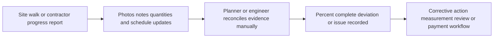
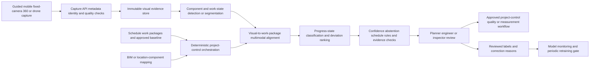

# CONST-001 AI-assisted construction progress and deviation assurance

## Classification

- **Segment:** construction-real-estate
- **Primary market / jurisdiction:** Brazil
- **Evidence reference date:** 2026-07-19; Brazilian sector evidence from 2025-2026; technical evidence from 2024-2026
- **Index summary:** Brazilian construction teams can compare guided site imagery with schedule and BIM baselines to estimate progress, flag likely deviations, and assemble review evidence without automating measurement approval or payment certification.
- **Company profile / size:** Mid-sized and large builders, developers, infrastructure contractors, project-management firms, and owners operating repeatable projects with digital schedules and at least partial BIM or structured work-package data
- **Opportunity type:** operations
- **Status:** hypothesis
- **Confidence:** medium
- **Complexity:** large
- **Horizon:** medium
- **Risk:** medium
- **Solution evidence level:** prototype
- **Operational maturity:** unvalidated
- **Azure fit:** high
- **AI dependency:** core
- **Primary AI role:** multimodal
- **Intelligent capability:** Visual work-state recognition, schedule/BIM alignment, progress estimation, and deviation-priority ranking
- **Repository alignment:** new-solution

## Problem

Project engineers, planners, owners, and inspectors commonly reconcile site walks, photographs, contractor reports, schedules, quantities, and BIM models to determine whether work packages are complete, delayed, blocked, or inconsistent with plan. The process is labor-intensive, evidence is fragmented, photographs are not consistently tied to locations or activities, and reported completion may lag reality or use incompatible definitions.

The consequence is not merely reporting effort. Late recognition of deviation can delay corrective action, distort look-ahead planning, weaken payment and claim evidence, and increase rework or coordination cost. The opportunity is strongest in recurring work packages where visual state is observable and linked to a structured schedule or BIM element set.

## Brazil applicability and current context

Brazilian construction remains economically material and operationally pressured. CBIC reported that the sector exceeded three million formal workers in 2025 and projected a third consecutive year of growth in 2026. The same 2026 outlook reported that construction costs remained pressured in 2025, with INCC increasing 5.92% and labor costs 8.98%, increasing the value of earlier deviation detection and more disciplined field evidence.

Brazilian adoption cannot assume mature digital twins or complete BIM. A previous radar round found current Brazilian evidence of low digital maturity across much of the sector. Therefore, this opportunity is deliberately bounded to projects with structured work packages, controlled image capture, and either a BIM baseline or a schedule-location-component mapping. It is not a generic platform for every construction company.

No foreign payment-certification, liability, safety, or contractual rule is imported. Measurement acceptance, payment approval, engineering responsibility, labor safety, and contractual notices remain governed by Brazilian contracts, professional responsibility, applicable standards, and human approval.

## Evidence

### Confirmed problem evidence

- CBIC reported more than three million formal construction workers in 2025, indicating a large operating base with substantial field-coordination and reporting activity.
- CBIC's February 2026 outlook projected continued sector growth while reporting that 2025 construction and labor costs rose faster than general inflation, increasing pressure on productivity, schedule control, and rework avoidance.
- Current technical literature continues to characterize manual construction-progress monitoring as slow, labor-intensive, and error-prone.

### Favorable solution evidence

- A 2025 PLOS One study demonstrated construction-progress recognition using YOLOv8, supporting the technical plausibility of bounded work-state recognition.
- A March 2025 study on concrete pouring reported real-time visual progress tracking with 90.85% segmentation precision in its evaluated project, showing that narrow, repetitive process slices can be measured meaningfully.
- A 2026 study proposed closed-loop progress monitoring using captured imagery and explicit deviation alerts, supporting the architecture pattern of capture, model inference, deterministic comparison, and governed workflow.
- A systematic synthesis published in 2025 cataloged 51 public visual construction datasets, supporting prototype development while also documenting representativeness and annotation limitations.

### Counter-evidence and limitations

- Occlusion, changing viewpoints, lighting, temporary materials, visually similar components, and incomplete capture can produce false progress or missed work.
- A 2026 occlusion-analysis study notes that drone imagery captures primarily surface-visible scenes and can miss elements constructed between flights.
- Research on vision-language models reports useful stage recognition but weak precise localization and segmentation; generic multimodal models should not be the sole measurement engine.
- Image-based structural monitoring literature highlights base-rate bias, false positives, false negatives, and environmental variability. High apparent accuracy does not guarantee reliable positive findings when true deviations are rare.
- Public datasets vary widely in modality, annotation quality, licensing, and site representativeness. A model trained on foreign or open datasets may not transfer to Brazilian materials, sequencing, camera practices, and site conditions.
- These limitations narrow the prototype to selected observable work packages, require guided capture, explicit abstention, and preserve engineer verification. They do not invalidate a bounded measurement-assistance prototype.

### Inference

- The most credible incremental value is not autonomous percent-complete certification. It is faster evidence reconciliation and earlier identification of work packages that deserve planner or inspector review.
- Value should be tested first where visual state maps cleanly to discrete stages, such as formwork, reinforcement, concrete placement, façade modules, drywall, MEP rough-in, or repeated housing units.

### Unknowns

- Whether available project imagery is consistently geolocated and time-aligned.
- Whether schedule and BIM identifiers are sufficiently stable to link visual evidence to work packages.
- The acceptable false-alert burden for planners and field engineers.
- Whether model-assisted review improves correction lead time or merely creates another dashboard.
- The cost and practicality of guided capture by mobile device, fixed camera, 360 camera, or drone for the selected site.

### Sources

- [Construção civil projeta 2026 mais positivo que 2025, impulsionado por crédito e investimentos](https://cbic.org.br/construcao-civil-projeta-2026-mais-positivo-que-2025-impulsionado-por-credito-e-investimentos/) — Brazil; 2026-02-11; current sector scale, growth, and cost pressure
- [Construção supera 3 milhões de trabalhadores formais](https://cbic.org.br/construcao-supera-3-milhoes-de-trabalhadores-formais/) — Brazil; 2025-06-30; current sector operating scale
- [Development of advanced progress recognition algorithms for construction monitoring](https://doi.org/10.1371/journal.pone.0333262) — international; 2025-10-09; technical prototype plausibility
- [Vision-based real-time progress tracking and productivity analysis of the concrete pouring process](https://doi.org/10.1016/j.dibe.2025.100609) — international; 2025-03; narrow-process visual monitoring evidence
- [Automated Closed-Loop Construction Progress Monitoring and Feedback Using Computer Vision and Blockchain](https://doi.org/10.3390/buildings16122319) — international; 2026-06-10; workflow and architecture comparison
- [Vision Language Model-Driven Multimodal Occlusion Analysis for Construction Progress Monitoring](https://doi.org/10.1061/9780784486436.052) — international; 2026-01-28; occlusion and capture limitations
- [OpenConstruction: A Systematic Synthesis of Open Visual Datasets for Data-Centric Artificial Intelligence in Construction Monitoring](https://arxiv.org/abs/2508.11482) — international; 2025-08-15; dataset availability and representativeness limits
- [Addressing the Pitfalls of Image-Based Structural Health Monitoring](https://arxiv.org/abs/2410.20384) — international; 2024-10-27; false-positive, false-negative, and base-rate limitations

## Current process

## Baseline without AI

- **Current baseline:** Site diaries, checklists, photo folders, contractor reports, quantity measurements, planning meetings, and manual schedule updates.
- **Strongest realistic non-AI alternative:** Guided mobile capture with mandatory location and work-package identifiers, deterministic checklist completion, BIM viewer comparison, quantity forms, and rule-based overdue or missing-evidence alerts.
- **Baseline strengths:** Transparent, contractually understandable, cheap to validate, and suitable where work packages are few or visual ambiguity is high.
- **Baseline limitations:** Requires substantial manual review, does not scale well across repeated units and frequent captures, and cannot reliably interpret varied visual evidence.
- **Context where intelligence may add incremental value:** Repeated, visually observable work packages with sufficient capture frequency and structured schedule or BIM mapping.
- **Condition where the non-AI baseline should be preferred:** Small projects, irregular one-off activities, poor capture coverage, absent digital work-package structure, or high-stakes measurements that cannot be visually inferred.

## Proposed solution

Introduce a governed progress-assurance workflow rather than an autonomous measurement system. Field staff or approved devices capture imagery through a guided protocol tied to location, work package, date, and planned stage. Deterministic services validate capture completeness, identity, timestamps, and schedule/BIM references.

A visual recognition component identifies observable construction elements and work states. A second alignment component maps detections to BIM elements or structured work packages and estimates a bounded progress state with uncertainty. A ranking component compares observed state with planned state and prioritizes likely deviations, stale evidence, contradictory reports, and low-confidence cases.

The application presents side-by-side plan, imagery, model evidence, confidence, and missing information. Engineers and planners confirm, correct, or reject each finding. Only approved human decisions update official progress, trigger corrective work, support payment measurement, or enter contractual workflows.

## Where AI enters

### AI role map

| Process stage | AI component | AI type / model family | What it does | Runtime mode | Output | Human or deterministic control |
| --- | --- | --- | --- | --- | --- | --- |
| Visual evidence interpretation | Work-state recognizer | Computer vision: object detection and semantic or instance segmentation | Detects selected components, visible installation states, and activity evidence in guided images | Asynchronous cloud or edge-assisted batch | Detected components, masks, stages, confidence, and image regions | Capture-quality rules, supported-class allowlist, confidence thresholds, abstention, engineer review |
| Plan-to-site reconciliation | Visual-to-work-package aligner | Embeddings and multimodal retrieval with geometry, metadata, and optional BIM matching | Links evidence to candidate BIM elements or schedule work packages | Batch pipeline | Ranked element or work-package matches with evidence links | Exact metadata matching first, location constraints, approved BIM/schedule version, human correction |
| Progress and deviation triage | Progress-state and deviation ranker | Classical ML or gradient boosting; optional time-series features | Estimates bounded stage or completion class and ranks deviation review using plan variance, capture history, and uncertainty | Daily batch or event-driven | Progress class, deviation score, reasons, and missing-evidence flags | Deterministic schedule arithmetic, contractual rules, queue thresholds, human approval |

### Required distinctions

- **Primary AI role:** multimodal reasoning, recognition, classification, and ranking/recommendation.
- **Model family:** computer vision for detection and segmentation; embeddings or multimodal retrieval for evidence alignment; classical ML or gradient boosting for deviation ranking.
- **Training requirement:** pretrained models plus supervised training or fine-tuning on project or company-specific labeled imagery; synthetic augmentation may support rare states but cannot replace real validation.
- **Training location and cadence:** offline initial training and project-family calibration; periodic retraining only after reviewed labels accumulate and drift is assessed.
- **Inference location:** edge-assisted capture validation with private cloud batch inference; near-real-time is optional and not required for the prototype.
- **Agent role:** Agent: not used. No autonomous tool planning or execution is required.
- **LLM role:** LLM: not used in the initial prototype. Narrative report generation is unnecessary for proving the core mechanism.
- **Non-LLM intelligence:** visual detection, segmentation, multimodal matching, progress classification, anomaly and deviation ranking.
- **Not AI:** mobile capture, identity, timestamps, schedule arithmetic, BIM and document storage, workflow orchestration, dashboards, approvals, audit logs, payment rules, and official progress updates.

## Intelligent capability details

- **Technique / model family:** Domain-adapted object detection and segmentation, multimodal evidence-to-element matching, calibrated stage classification, and gradient-boosted deviation ranking.
- **Why it is necessary:** Rules can verify that a photo exists but cannot reliably determine which component or construction state it shows across repeated units, viewpoints, partial occlusion, and changing site conditions.
- **Inputs:** Guided images or video frames, capture metadata, location, timestamp, work-package ID, BIM element metadata or schedule hierarchy, planned dates, prior approved states, and optional quantities.
- **Outputs:** Visible components and states, candidate work-package matches, bounded progress class, confidence, uncertainty, missing evidence, likely deviation, and ranked review queue.
- **Training / grounding / optimization assumptions:** At least several hundred reviewed examples across the selected work-package classes; strict temporal and site-level validation split; local label definitions aligned with project measurement rules.
- **Evaluation:** Per-class precision and recall, segmentation IoU where applicable, calibration error, top-k alignment accuracy, deviation-ranking precision at review capacity, abstention coverage, and comparison with the deterministic guided-capture baseline.
- **Fallback and controls:** Unsupported class or low confidence routes to manual review; capture gaps cannot be interpreted as missing work; official measurement remains unchanged until human confirmation; full rule-only workflow remains available.

## Data and integration assumptions

- **Data owners and access path:** Builder, owner, construction manager, or contractor owns site imagery, schedule, BIM, inspection, and measurement records; access through project controls, common data environment, mobile capture, or approved exports.
- **Expected volume, history, frequency, and coverage:** Hundreds to thousands of images per project phase, daily or weekly captures, and sufficient repeated examples for selected work-package classes.
- **Labels, outcomes, feedback, or simulation available:** Engineer-confirmed component, stage, location, progress state, and deviation disposition; synthetic occlusion and lighting augmentation may supplement training.
- **Known quality, imbalance, missingness, and leakage risks:** Repeated near-duplicate frames, late labels, inconsistent progress definitions, hidden work, weather and lighting variation, contractor-specific capture behavior, and leakage from future approved measurements.
- **Brazilian or local-context representativeness:** Training must include local materials, sequencing, safety barriers, site layouts, camera devices, and measurement conventions.
- **Privacy, retention, consent, surveillance, or sharing constraints:** Images may capture workers, neighboring properties, vehicle plates, access controls, or confidential project information. Minimize worker identification, restrict viewpoints, blur incidental personal data where appropriate, and apply project retention and access policy.
- **Integration and synchronization assumptions:** Stable schedule or BIM version identifiers, work-package hierarchy, location taxonomy, and immutable original evidence.
- **Drift and change sources:** New project types, subcontractors, materials, sequencing, camera devices, seasonal lighting, design revisions, and changes in measurement criteria.
- **Minimum viable data for a prototype:** One active or completed project, three to five repeated work-package classes, guided imagery, planned and approved stage dates, and at least 500 reviewed observations including negative and ambiguous cases.

## Prototype validation plan

- **Prototype scope / process slice:** One building or infrastructure project; three to five visually observable work-package classes; daily or twice-weekly guided capture; shadow-mode review only.
- **Users, sites, assets, documents, events, or simulated cases:** One project-controls team, field engineers, planner, and quality representative; 500-2,000 captured observations.
- **Baseline or comparison:** Guided capture plus deterministic missing-evidence and schedule-overdue rules, with manual visual reconciliation.
- **Required data and integrations:** Read-only schedule or BIM export, capture app or structured upload, evidence store, and review dashboard.
- **Model-quality metrics:** Per-class precision/recall, IoU where used, top-k mapping accuracy, calibration error, false-deviation rate, missed-deviation rate, and abstention rate.
- **Business or workflow metrics:** Review time per work package, time from observable deviation to human confirmation, evidence completeness, duplicate review effort, and percentage of findings that result in a confirmed planning or quality action.
- **Human acceptance, correction, or override metrics:** Acceptance by finding type, correction categories, reviewer disagreement, ignored-alert rate, and trust survey after shadow use.
- **Safety and compliance boundaries:** No autonomous safety finding, engineering acceptance, measurement certification, payment decision, contractual notice, or worker assessment.
- **Failure or redesign criteria:** Stop or narrow if precision at review capacity is insufficient, missed deviations exceed the agreed tolerance, more than half of queued cases are rejected as visually unresolvable, capture burden is not operationally sustainable, or the deterministic baseline performs equivalently.
- **Evidence required before a pilot or broader implementation:** Stable performance on a temporally later holdout, acceptable performance across viewpoints and site zones, documented capture protocol, reviewer acceptance, privacy review, and evidence that confirmed deviation lead time improves in shadow mode.

## Macro architecture

## Capabilities and possible technologies

- **Application and workflow capabilities:** Guided capture, evidence review, side-by-side plan comparison, issue queue, audit trail, and approval workflow.
- **Data capabilities:** Object storage, metadata catalog, BIM and schedule snapshots, reviewed labels, feature tables, and immutable evidence lineage.
- **Integration capabilities:** CDE/BIM export, Primavera or Microsoft Project-compatible schedule export, mobile APIs, issue-management integration, and identity/RBAC.
- **Required AI / ML capabilities:** Computer vision, segmentation, multimodal retrieval, calibrated classification, and ranking.
- **Training, grounding, recognition, or optimization capabilities:** Project-family fine-tuning, augmentation, temporal/site holdouts, active review labeling, and drift monitoring.
- **Agent and tool-use capabilities, or `not used`:** not used.
- **LLM / foundation-model capabilities, or `not used`:** not used in the prototype; a multimodal foundation model may be evaluated only as a secondary feature extractor, not as the measurement authority.
- **Evaluation and model-operations capabilities:** Dataset versioning, experiment tracking, calibration, per-class monitoring, reviewer-feedback analysis, and retraining approval.
- **Security and governance capabilities:** Private networking, encryption, managed identity, least privilege, project isolation, audit logs, retention controls, and incidental-personal-data handling.
- **Azure services that may fit:** Azure Blob Storage, Azure AI Search for evidence retrieval, Azure Machine Learning, Azure AI Vision or custom vision models, Azure Functions or Container Apps, Event Grid, API Management, Microsoft Entra ID, Key Vault, and Power BI.
- **Non-Azure or open-source alternatives worth considering:** OpenCV, Ultralytics YOLO, Detectron2, Segment Anything variants, PyTorch, MLflow, PostgreSQL/PostGIS, MinIO, Qdrant, IFCOpenShell, and openBIM tooling.

## Possible gains

- Earlier identification of likely schedule or execution deviation in repeated work packages.
- Less manual time spent locating and reconciling fragmented site evidence.
- More consistent evidence packages for planning, quality, handover, claim, and measurement review.
- Better traceability between reported progress, visual evidence, schedule version, and human approval.
- Reusable visual-assurance components for defects, handover, warranty, and asset-condition workflows.

## Metrics for validation

### Business and operational metrics

- Median review time per work package versus the guided deterministic baseline.
- Median time from first observable deviation to confirmed human action.
- Evidence completeness and work-package coverage.
- Confirmed-action yield among top-ranked findings.
- Capture burden per field user and percentage of unusable captures.

### Intelligent-capability metrics

- Per-class precision, recall, F1, and segmentation IoU.
- Top-k work-package mapping accuracy.
- Calibration error and abstention coverage.
- Precision at the available human review capacity.
- False-deviation and missed-deviation rates by site zone, stage, device, and work-package class.
- Human acceptance, override, correction, and disagreement rates.

## Risks, limits, and controls

- **Privacy and sensitive data:** Minimize and restrict worker imagery, apply role-based access and retention, and prevent use for worker productivity scoring or facial recognition.
- **Brazilian regulatory or policy constraints:** Respect LGPD, professional engineering responsibility, labor and site-safety rules, contractual measurement procedures, image rights, and project confidentiality.
- **Human decision boundaries:** Engineers, inspectors, planners, owners, and authorized commercial teams retain all official acceptance, progress, safety, payment, and contractual authority.
- **Model or policy failure modes:** Occlusion, hidden work, similar-looking stages, design changes, stale BIM, unusual materials, poor lighting, weather, camera drift, and unsupported work classes.
- **Agent or tool-execution failure modes, when applicable:** not applicable; no agent is used.
- **LLM hallucination, grounding, or prompt-injection risks, when applicable:** not applicable in the prototype; no LLM is used.
- **Comparable failures and applicable lessons:** Generic visual models may recognize broad stages but fail precise localization; drone-only capture misses hidden or interval work; high overall accuracy can still create misleading positive findings under low deviation prevalence.
- **Bias, drift, weak labels, or insufficient feedback:** Contractor and site-specific capture patterns may dominate the model; label definitions must be explicit and reviewed; monitor by project and work-package class.
- **Integration and data risks:** Schedule/BIM version mismatch, inconsistent IDs, delayed updates, incomplete capture, and disputes over official source of truth.
- **Adoption and change-management risks:** Field capture may be seen as extra work or surveillance; the prototype must minimize capture burden and demonstrate direct planning value.
- **Prototype cost or operational assumptions:** Main cost drivers are capture workflow, annotation, BIM/schedule mapping, storage, model training, and human review—not only inference compute.

## Fit score

| Dimension | Score | Rationale |
| --- | ---: | --- |
| Problem evidence and relevance | 17/20 | Current Brazilian evidence establishes a large, growing, cost-pressured sector and a material need for stronger project controls, though direct local quantified rework evidence is limited. |
| Business or operational value | 18/20 | Earlier deviation recognition and evidence reconciliation can affect planning, quality, measurement, and claims, but value depends on project discipline and review adoption. |
| Technical feasibility | 17/20 | A bounded prototype is testable with guided imagery and selected work packages; occlusion, hidden work, transfer, and capture quality remain material constraints. |
| Reuse potential | 18/20 | Capture, visual recognition, evidence alignment, review, and evaluation components can extend to defects, handover, warranty, safety evidence, and asset inspection. |
| Strategic differentiation | 17/20 | Intelligence can interpret and align large visual evidence sets beyond deterministic checklists, but it must prove incremental value over disciplined mobile reporting and BIM control. |
| **Total** | **87/100** | Strong bounded hypothesis with clear model role, baseline, controls, and prototype path; production value and local transfer remain unvalidated. |

## Repository relationship

- **Existing references that may be reused:** Document/evidence ingestion, storage, event-driven orchestration, human review, Azure ML evaluation, search, and identity building blocks where present.
- **Missing capabilities exposed by this opportunity:** Guided multimodal capture, construction-image labeling, BIM/work-package evidence alignment, visual progress evaluation, calibrated abstention, and reviewer-feedback loops.
- **Potential building blocks:** visual-evidence-capture, construction-work-state-recognition, bim-schedule-evidence-alignment, deviation-review-ranking, and multimodal-evaluation-harness.
- **Potential composed solution:** construction-progress-assurance.
- **Reasons to keep it outside the current kit, when applicable:** Domain-specific labels, BIM mappings, and contractual measurement logic should remain in the composed solution rather than generic shared modules.

## Duplicate control

- **Problem keys:** construction progress monitoring; schedule deviation; site evidence reconciliation; BIM progress alignment; visual measurement assurance
- **Capability keys:** construction computer vision; work-state segmentation; multimodal BIM alignment; progress classification; deviation ranking
- **Research queries used:** Brasil 2025 construção civil retrabalho defeitos obras inspeção digital produtividade CBIC; Brasil 2025 construção civil segurança inspeção canteiro drones visão computacional; 2025 Brazil construction progress monitoring defects computer vision case; construction computer vision progress monitoring limitations false positives occlusion site conditions 2024 2025
- **Related opportunities:** MANUF-001 uses sensor condition monitoring for industrial equipment; RETAIL-002 uses multimodal item-condition recognition. Neither addresses construction work-package progress, BIM/schedule alignment, or site evidence reconciliation.
- **Uniqueness statement:** This opportunity focuses on human-approved progress and deviation assurance for structured construction work packages, not generic object detection, autonomous measurement certification, worker surveillance, or equipment condition monitoring.

## Next decision

- prototype candidate.

Implementation approval remains an explicit human decision.
