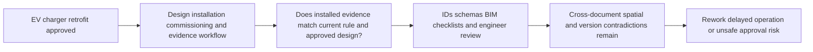
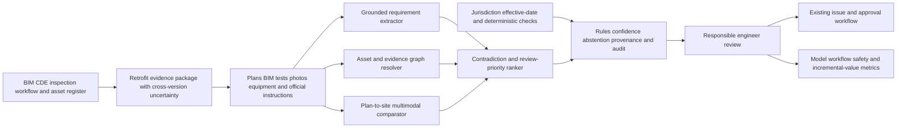

# CONST-002 AI-assisted EV-charging fire-safety evidence assurance

## Classification

- **Segment:** construction-real-estate
- **Primary market / jurisdiction:** Brazil
- **Evidence reference date:** 2026-07-25
- **Index summary:** Brazilian property teams can reconcile EV-charger retrofit plans, as-built evidence, electrical tests, fire-safety requirements, and site images to flag contradictions before engineer and authority review.
- **Organization archetype / size:** Property manager or developer operating 5–50 residential or commercial buildings
- **Primary actor:** Facilities engineering or retrofit compliance coordinator
- **Simulated process:** Approve an EV-charging retrofit evidence package for a shared garage
- **Opportunity type:** integration
- **Status:** hypothesis
- **Confidence:** medium
- **Complexity:** large
- **Horizon:** medium
- **Risk:** regulated
- **Solution evidence level:** conceptual
- **Operational maturity:** unvalidated
- **Existing-solution disposition:** integrate
- **Azure fit:** high
- **AI dependency:** core
- **Primary AI role:** multimodal
- **Intelligent capability:** Version-aware regulatory extraction, plan-to-site multimodal reconciliation, contradiction detection, and risk-ranked evidence review
- **Repository alignment:** extend-kit

## Operational simulation

### Operating archetype

- **Organization type and approximate size:** A property group retrofitting EV chargers in shared garages across 5–50 buildings.
- **Primary actor and authority:** A facilities engineer assembles the package; the responsible engineer, building owner, insurer, and competent fire-safety authority retain approval authority.
- **Process trigger:** A condominium or commercial building approves installation or expansion of charging points.
- **Actor objective and completion condition:** Produce a traceable package showing that the approved design, installed equipment, electrical protections, signage, clearances, ventilation, emergency provisions, and current jurisdictional requirements agree.
- **Inputs, systems, documents, devices, or physical context:** Floor plans, BIM/IFC when available, electrical single-line diagrams, charger and protection-device datasheets, inspection forms, test reports, photos, videos, asset registers, work orders, authority instructions, and versioned approvals.
- **Rules, deadlines, safety, cost, and compliance constraints:** State fire-safety instructions, electrical rules, licensed-professional responsibility, building access, privacy in shared garages, project deadlines, and the cost of rework or delayed operation.
- **Upstream and downstream handoffs:** Designer → installer → commissioning technician → facilities engineer → responsible engineer → building owner/insurer/authority.

### Assumptions

- **Known operating facts already available:** Brazilian fire-safety requirements are jurisdiction-specific and continue to change; recent state instructions address EV-charging installations in garages.
- **Simulation assumptions requiring validation:** Evidence is split across design, contractor, facility, and authority systems; retrofit changes are not always reflected consistently in as-built documents.
- **Synthetic events or cases introduced:** A charger is moved after design approval; a protection device is substituted; a photo belongs to another floor; an authority instruction changes during a multi-building rollout.

### Workflow simulation

| Stage | Trigger / available information | Actor and system action | Decision or uncertainty | Current handling | Friction, risk, or missed outcome | Feedback signal |
| --- | --- | --- | --- | --- | --- | --- |
| Design intake | Approved retrofit request and current plans | Collect jurisdiction, occupancy, garage layout, electrical capacity, and proposed equipment | Which rules and document versions apply? | Manual checklist and engineer interpretation | Wrong jurisdiction or obsolete instruction may be used | Engineer corrections and authority comments |
| Installation | Work order, equipment, and approved design | Installer records serials, location, protections, photos, and deviations | Does installed work match the approved package? | Photos, redlines, and supervision | Evidence may be valid individually but refer to different locations or revisions | Accepted/rejected deviation records |
| Commissioning | Test results and site evidence | Technician tests protection, grounding, shutdown, signage, and operation | Are tests tied to the correct asset and configuration? | Forms and certificates | Copy-forward, missing provenance, or mismatched asset IDs | Retests and signed commissioning findings |
| Compliance review | Complete package | Facilities engineer reconciles design, as-built, tests, photos, and current requirements | Which contradictions are material and what evidence is missing? | Manual review across files and systems | High review effort; subtle cross-document conflicts can be missed | Reviewer dispositions and authority findings |
| Approval and operation | Human-approved evidence | Responsible parties approve, reject, or request remediation | Is the package sufficient for operation and future audit? | Workflow and signatures | Approval may rely on incomplete or stale evidence | Approval, rejection, remediation, inspection outcome |

### Scenario variants

#### Normal flow

The design, equipment, installation photos, test reports, and current state instruction share consistent identifiers and revisions. Deterministic schema, date, signature, and asset checks close most issues; the intelligent layer abstains or returns low risk.

#### Exception flow

An installer substitutes a protection device, moves a charger, and uploads photos with incomplete location metadata. The documents remain individually plausible. The reviewer must determine whether the substitution affects approved protections, clearance, signage, or emergency response and which evidence must be regenerated.

#### Peak or degraded flow

A property group updates dozens of buildings before a deadline while one authority instruction changes and contractor uploads arrive late. Reviewers face repeated document versions, similar garage layouts, duplicate photos, and inconsistent asset identifiers. The main risk is accepting a package assembled from incompatible revisions.

### Opportunity points derived from the simulation

| Decision, exception, or uncertainty | Strongest deterministic response | Remaining gap | Candidate intelligent role | Expected incremental outcome | Main risk |
| --- | --- | --- | --- | --- | --- |
| Select applicable rule version | Jurisdiction and effective-date rules | Requirements may be expressed across changing narrative documents | Grounded extraction and version comparison | Faster, traceable applicability review | Misinterpreting legal text |
| Match installed work to approved design | Asset IDs, QR codes, mandatory photos, BIM coordinates | Visual and semantic mismatch can survive valid metadata | Multimodal plan-to-site reconciliation | More contradictions surfaced before approval | False visual matches |
| Link tests to physical assets | Signed forms, serial validation, timestamps | Reports may omit or inconsistently name location/configuration | Entity resolution and evidence linking | Fewer orphan or misapplied tests | Incorrect linkage |
| Prioritize package review | Completeness checklist and rules | Materiality depends on combined evidence and safety context | Calibrated contradiction ranking | Reviewer attention on high-risk evidence gaps | Automation bias |

## Selected problem and opportunity hypothesis

The selected gap is not charger operation or automatic code approval. It is the reconciliation of a versioned fire-safety and commissioning evidence chain during retrofit. A bounded assistant may identify incompatible revisions, locations, equipment, tests, and site evidence that deterministic completeness checks miss, while licensed professionals and authorities retain all conclusions.

## Brazil applicability and current context

On 1 July 2026, the Sergipe Fire Department published IT 48 for fire safety in garages and other locations with EV supply equipment, including requirements concerning separation, signage, grounding, and electrical protection, effective 3 July 2026. Other state fire authorities also maintain and revise their own technical instructions, demonstrating that applicability is jurisdiction- and version-dependent. Brazil's federal public-property administration published practical BIM guidance in May 2026, supporting structured project and asset information but not eliminating retrofit evidence reconciliation.

The simulation's assumption that changing instructions and heterogeneous evidence create review complexity is plausible, but the frequency of material mismatches, inspection rejection rates, and incremental value over disciplined BIM/checklist practice remain unknown.

## Existing solutions and differentiation

### Existing solutions reviewed

| Solution / platform | Owner or vendor | Current capabilities | Evidence date | Coverage overlap |
| --- | --- | --- | --- | --- |
| Autodesk Construction Cloud / BIM workflows | Autodesk and ecosystem | Design coordination, issues, models, documents, approvals, and field evidence | Current product category reviewed 2026-07-25 | Strong overlap in document and issue workflow; not Brazilian fire-code interpretation |
| Inspectly360 | Inspectly360 | Mobile statutory inspections, timestamped photo evidence, obligations, audit packs, and EV-charger safety checklists | Current site reviewed 2026-07-25 | Covers evidence capture and compliance workflow |
| PyroComply | PyroComply | Fire-risk inspections, visual evidence analysis, document extraction, regulation-aligned checks, and reports for UK law | Current site reviewed 2026-07-25 | Strong capability overlap, but jurisdiction and retrofit evidence model differ |
| Flambo | Flambo | AI-assisted fire-safety design and plan compliance against listed foreign codes | Current site reviewed 2026-07-25 | Overlaps plan analysis, not as-built commissioning assurance under Brazilian state instructions |
| Brazilian fire-authority portals and checklists | State fire departments | Rule publication, licensing, project analysis, inspection, and checklists | 2026 | Official authority remains source of truth and approval channel |

### Gap and disposition

- **What is already solved:** BIM/document control, mobile inspection, asset tracking, checklists, issue workflow, report generation, and foreign-jurisdiction fire-compliance analysis.
- **Overlap with the simulated candidate:** Evidence capture, project coordination, visual inspection, obligation tracking, and report assembly.
- **Material uncovered gap:** Version-aware reconciliation of Brazilian state requirements with the approved design, installed configuration, commissioning tests, and site evidence for EV-charging retrofits.
- **Underserved actor, scenario, exception, integration, decision, or outcome:** Multi-building Brazilian property teams managing substitutions, moved equipment, inconsistent asset IDs, authority changes, and incompatible evidence revisions.
- **Disposition:** integrate.
- **Why changing vendor, cloud, model, UI, or architecture is insufficient:** The value depends on a governed Brazilian requirement/evidence model and integrations with existing BIM, inspection, document, and authority workflows.
- **Differentiation statement:** This is a read-only assurance layer for cross-evidence contradictions in Brazilian EV-charging retrofits, not another BIM, charger-management, inspection, or automatic code-approval product.

## Evidence map

### Simulated observations

- A package can be complete at the file level while combining incompatible design, equipment, test, and photo revisions.
- Peak rollout increases duplicate evidence and jurisdiction/version mistakes.

### Confirmed problem evidence

- CBMSE IT 48, published 1 July 2026, introduced specific fire-safety requirements for EV-charging installations in garages and entered into force on 3 July 2026.
- Current state fire-authority pages show ongoing revision of technical instructions and licensing procedures.

### Existing-solution evidence

- Current compliance platforms capture inspections, evidence, actions, and audit reports; some include AI-assisted visual analysis and regulation checks.
- Current fire-safety design tools analyze plans against foreign code sets.

### Favorable evidence for the uncovered gap

- A 2026 Brazilian BIM study describes BIM as useful for organizing and reducing inconsistencies in fire-safety project review.
- Recent graph-based BIM compliance research achieved promising but imperfect accuracy on expert-verified fire-safety queries, supporting human-reviewed prototypes rather than autonomous approval.

### Counter-evidence and limitations

- Strong BIM governance, immutable IDs, mandatory structured evidence, and deterministic checks may solve much of the problem without AI.
- Geometry- and regulation-reasoning models remain imperfect; visual similarity and document consistency do not prove safe installation.
- State-by-state rule modeling and updates may dominate prototype cost.

### Inference

- Incremental value is most plausible in multi-building retrofit programs with frequent deviations and heterogeneous evidence, not a single well-governed installation.

### Unknowns

- Actual contradiction frequency, authority rejection patterns, accessible APIs, evidence quality, reviewer workload, and willingness to adopt a separate assurance layer.

### Sources

- [CBMSE lança IT 48 para locais com sistemas de alimentação de veículos elétricos](https://cbm.se.gov.br/cbmse-lanca-instrucao-tecnica-para-seguranca-contra-incendio-em-locais-com-sistemas-de-alimentacao-de-veiculos-eletricos/) — Brazil; 2026-07-01; current official operating requirement.
- [CBMES legislação vigente](https://cb.es.gov.br/legislacoes-em-vigor) — Brazil; current page including 2026 revisions; jurisdiction/version context.
- [Guia Prático de Diretrizes BIM do MGI](https://www.gov.br/obrasgov/pt-br/noticias/2026/secretaria-de-servicos-compartilhados-ssc-mgi-publica-guia-pratico-de-diretrizes-bim-e-inicia-nova-etapa-de-implementacao-da-metodologia) — Brazil; 2026-05-05; BIM information governance context.
- [Aplicação BIM na análise de projetos de segurança contra incêndio](https://dspace.unila.edu.br/items/db9b9845-75ef-4f40-bf3a-8b11742ca70c) — Brazil; 2026-01-21; favorable technical context.
- [Inspectly360 building and car-park compliance](https://www.inspectly360.com/solutions/car-park-inspection-compliance-software) — international; current existing solution.
- [PyroComply](https://pyrocomply.co.uk/) — UK; current existing solution and human-judgment limitation.
- [Flambo](https://flambo.ltd/) — international; current existing solution.
- [Graph-based semantic reasoning for BIM compliance checking](https://arxiv.org/abs/2606.12065) — international; 2026-06; plausibility and accuracy limitation.

## Current process and remaining gap

## Baselines

- **Current manual or system baseline:** Engineer review across plans, forms, photos, tests, document repositories, and authority requirements.
- **Existing product or platform baseline:** BIM/common-data environment plus inspection/compliance workflow and charger asset management.
- **Strongest realistic non-AI alternative:** Immutable asset and evidence IDs, jurisdiction/effective-date registry, mandatory capture templates, BIM coordinates, rule engine, deterministic document diff, and dual approval.
- **Baseline strengths:** Transparent, auditable, and reliable for explicit requirements and well-governed evidence.
- **Baseline limitations:** Weak when descriptions, images, locations, equipment substitutions, and narrative requirements disagree implicitly.
- **Exact simulated condition where intelligence may add incremental value:** Multi-building retrofit with deviations, inconsistent identifiers, heterogeneous evidence, and changing state instructions.
- **Condition where adoption, process redesign, or deterministic automation should be preferred:** Low-volume projects with clean BIM, stable requirements, strict asset IDs, and complete commissioning packages.

## Proposed solution or extension

Integrate a read-only assurance service with the existing BIM/document environment, inspection workflow, and asset register. It extracts versioned requirement statements with citations, links equipment and tests to locations, compares site images with approved layouts and equipment, and ranks contradictions. It cannot approve a project, certify compliance, control chargers, or submit to authorities.

## Where AI enters

### AI role map

| Process stage | AI component | Primary role and model family | Inputs | What it does | Training / grounding | Runtime | Output | Deterministic or human control |
| --- | --- | --- | --- | --- | --- | --- | --- | --- |
| Requirement intake | Versioned requirement extractor | Extraction/retrieval; grounded LLM and document model | Official instructions and metadata | Extracts candidate obligations with citations and effective scope | Prompt/grounding; no autonomous legal training | Asynchronous batch | Structured requirement candidates | Jurisdiction/date rules and engineer approval |
| Evidence linking | Asset-evidence resolver | Entity resolution; embeddings and graph model | Plans, asset IDs, datasheets, tests, work orders | Links evidence to candidate asset, location, and revision | Pretrained embeddings; local adjudicated links | Batch | Ranked links and unresolved evidence | ID rules, thresholds, abstention, reviewer confirmation |
| Site reconciliation | Plan-to-site comparator | Multimodal recognition; vision-language model | Approved plan/BIM, photos, equipment imagery, location metadata | Flags candidate layout, equipment, signage, or clearance mismatch | Pretrained model plus synthetic deviations and local calibration | Edge-assisted/private batch | Evidence-backed mismatch candidates | Capture rules and engineer inspection |
| Package review | Contradiction ranker | Classification/ranking; NLI and gradient boosting | Requirements, linked evidence, deterministic findings | Prioritizes material contradictions and missing proof | Supervised only after adjudicated findings | Batch before approval | Ranked review queue with factors | No automatic pass/fail; human disposition |

### Required distinctions

- **Primary AI role:** extraction, multimodal recognition, entity resolution, contradiction detection, and ranking.
- **Model family:** grounded LLM/document model, embeddings, graph ML, multimodal vision-language model, NLI, and calibrated tabular ranking.
- **Training requirement and cadence:** pretrained and grounded initially; synthetic exceptions for testing; periodic calibration only with adjudicated review outcomes.
- **Inference location and runtime:** private cloud batch, with optional edge validation during capture.
- **Agent role:** not used.
- **LLM role:** source-grounded requirement extraction and contradiction classification only; no legal interpretation or approval.
- **Non-LLM intelligence:** vision-language comparison, entity resolution, graph linking, NLI, and calibrated ranking.
- **Not AI:** rule effective dates, asset IDs, schemas, calculations, BIM/document storage, workflow, queues, signatures, authority portals, charger control, and approvals.

## Intelligent capability details

- **Why it is necessary for the uncovered gap:** Deterministic completeness checks cannot reliably identify implicit conflicts across narrative rules, plans, equipment, photos, tests, and revisions.
- **Inputs:** Versioned official instructions, approved plans/BIM, equipment data, commissioning reports, photos/video, asset IDs, work orders, and reviewer findings.
- **Outputs:** Candidate obligations, evidence links, contradiction findings, confidence, source regions, abstention reason, and ranked review priority.
- **Training / grounding / optimization assumptions:** Official sources can be versioned; local evidence links and reviewer findings can be retained; synthetic mismatches can test failure modes.
- **Evaluation against existing product and non-AI baselines:** Compare with BIM/checklist workflow on recall of adjudicated material contradictions, false-alert burden, review time, and missed findings.
- **Fallback and controls:** Deterministic-only package, abstention, source display, independent engineer review, rollback to prior model, and no write-back or approval.

## Data and integration assumptions

- **Data owners and access path:** Building owner/developer, responsible engineering firms, installers, inspection providers, and official public instructions.
- **Expected volume, history, frequency, and coverage:** Prototype across 3–10 retrofit packages and 50–300 evidence items per package.
- **Labels, outcomes, feedback, or simulation:** Reviewer-confirmed links, contradictions, remediations, authority comments, and synthetic substitutions/revision conflicts.
- **Quality, imbalance, missingness, and leakage risks:** Sparse confirmed defects, duplicate layouts, weak photo metadata, post-review notes leaking outcomes, and jurisdiction drift.
- **Brazilian or local-context representativeness:** Must be configured per state authority and cannot transfer foreign code assumptions.
- **Privacy, retention, consent, surveillance, or sharing constraints:** Minimize resident/vehicle/person imagery, blur identifiers, restrict access, and apply building retention policy.
- **Existing platform APIs, exports, extension points, and limits:** BIM/CDE exports, document APIs, inspection exports, and asset registers; authority APIs may be unavailable.
- **Integration and synchronization assumptions:** Read-only snapshot initially with explicit baseline timestamp.
- **Drift and change sources:** Rule revisions, authority interpretation, new charger/electrical equipment, building changes, and capture practices.
- **Minimum viable data for a prototype:** Three complete packages, one applicable instruction baseline, 30–50 adjudicated or synthetic contradictions, and engineer review.

## Prototype validation plan

- **Prototype scope / process slice:** One state, one building type, and one EV-charging retrofit pattern; read-only review before final engineering approval.
- **Users, sites, assets, documents, events, or simulated cases:** 2–4 engineers, 3–10 garages, and synthetic plus historical package variants.
- **Existing solution baseline:** BIM/document platform plus inspection and issue workflow.
- **Non-AI baseline:** Version registry, required fields, asset IDs, deterministic diff, and checklist.
- **Required data and integrations:** Exported plans, documents, photos, tests, asset records, and official instruction documents.
- **Model-quality metrics:** Material-finding recall, precision, calibration, evidence-link precision@k, abstention rate, and source-grounding accuracy.
- **Incremental-value metrics beyond the existing solution:** Additional confirmed contradictions found beyond rules/checklists and avoided duplicate review.
- **Business or workflow metrics:** Review time, evidence re-request rate, late remediation, and package re-entry.
- **Human acceptance, correction, or override metrics:** Finding confirmation, correction, dismissal, evidence inspection, and reviewer disagreement.
- **Safety and compliance boundaries:** No certification, legal conclusion, automatic approval, charger control, or authority submission.
- **Failure or redesign criteria:** No incremental findings over deterministic baseline; unacceptable false alerts; low source accuracy; failure across site conditions; or reviewer automation bias.
- **Evidence required before pilot or broader implementation:** Stable temporal/package holdout performance, security review, state-rule governance, rollback, and measured workflow improvement.

## Macro architecture

## Capabilities and possible technologies

- **Existing platform capabilities reused:** BIM/CDE, inspection forms, issue tracking, asset registry, document versioning, and approval workflow.
- **Application and workflow capabilities:** Evidence viewer, source highlighting, review queue, correction capture, and audit.
- **Data capabilities:** Versioned requirement/evidence graph, metadata lineage, and privacy processing.
- **Integration and extension capabilities:** IFC/document exports, inspection APIs, asset systems, identity, and issue write-back only after later approval.
- **Required AI / ML capabilities:** Document extraction, grounded retrieval, multimodal comparison, entity resolution, graph linking, NLI, and ranking.
- **Training, grounding, recognition, or optimization capabilities:** Official-source grounding, synthetic mismatch generation, local calibration, and holdout evaluation.
- **Agent and tool-use capabilities, or `not used`:** not used.
- **LLM / foundation-model capabilities, or `not used`:** restricted grounded extraction/classification.
- **Evaluation and model-operations capabilities:** Dataset/version registry, experiment tracking, calibration, monitoring, and rollback.
- **Security and governance capabilities:** Managed identity, private networking, RBAC, encryption, audit, image redaction, and retention.
- **Azure services that may fit:** Azure AI Document Intelligence, Azure AI Search, Azure OpenAI, Azure Machine Learning, Azure AI Vision, Functions or Container Apps, Blob Storage, PostgreSQL, Entra ID, Key Vault, and Monitor.
- **Non-Azure or open-source alternatives:** IFCOpenShell, PostgreSQL/pgvector, sentence-transformers, OpenCV, MLflow, and private multimodal models.

## Possible gains

- Surface package contradictions before final engineering or authority review.
- Reduce repeated manual reconciliation across similar buildings and revisions.
- Preserve a traceable evidence chain for remediation and audit.

## Metrics for validation

### Business and operational metrics

- Review time and evidence re-request rate against current BIM/checklist process.
- Confirmed late contradictions, re-entry, remediation lead time, and duplicate review effort.

### Intelligent-capability metrics

- Recall/precision for material contradictions, calibration, evidence-link precision@k, grounded-source accuracy, and abstention.
- Human confirmation, correction, override, disagreement, and source-inspection rates.

## Risks, limits, and controls

- **Existing-solution overlap and roadmap risk:** BIM/compliance vendors may add equivalent Brazilian rule packs and reconciliation features.
- **Privacy and sensitive data:** Shared-garage images may expose people, vehicles, plates, routines, and building security details.
- **Brazilian regulatory or policy constraints:** State authority instructions and licensed-professional responsibilities remain authoritative.
- **Human decision boundaries:** Engineers, owners, insurers, and authorities retain all compliance and operating decisions.
- **Model or policy failure modes:** Wrong rule scope, false asset links, image mismatch, hidden installation conditions, and over-ranking.
- **Agent or tool-execution failure modes, when applicable:** Agent not used.
- **LLM hallucination, grounding, or prompt-injection risks, when applicable:** Treat all documents as data; require citations, schema validation, and abstention.
- **Comparable failures and lessons:** Current geometry reasoning remains imperfect; models must augment, not replace, inspection and professional judgment.
- **Bias, drift, weak labels, or insufficient feedback:** Sparse defects and changing instructions can destabilize ranking.
- **Integration and vendor/platform dependency risks:** Proprietary BIM formats, missing APIs, and inconsistent contractor evidence.
- **Adoption and change-management risks:** Reviewers may over-trust well-presented findings or reject a tool with excessive false alerts.
- **Prototype cost or operational assumptions:** Main costs are evidence normalization, state-rule modeling, image handling, and engineer adjudication.

## Fit score

| Dimension | Score | Rationale |
| --- | ---: | --- |
| Process opportunity fit | 18/20 | Simulation exposes a concrete cross-version evidence decision under exception and peak conditions. |
| Business or operational value | 17/20 | Avoided rework, delayed approvals, and missed safety evidence are plausible and measurable. |
| Technical feasibility | 16/20 | A bounded read-only prototype is testable, but geometry, rule scope, and sparse labels are hard. |
| Reuse potential | 17/20 | Evidence reconciliation generalizes to other regulated building retrofits and safety systems. |
| Strategic differentiation | 16/20 | Differentiation is Brazilian version-aware cross-evidence assurance, not generic inspection or BIM. |
| **Total** | **84/100** | Publishable integration hypothesis with material jurisdiction, data, and false-alert unknowns. |

## Repository relationship

- **Existing references that may be reused:** Document extraction, grounded retrieval, multimodal evidence, graph reconciliation, human review, and model evaluation patterns.
- **Missing capabilities exposed by the differentiated gap:** Versioned regulatory applicability, spatial evidence linking, and cross-modal contradiction evaluation.
- **Potential building blocks:** `versioned-requirement-extractor`, `evidence-asset-graph`, `plan-site-comparator`, and `assurance-review-queue`.
- **Potential composed solution or extension:** `regulated-building-retrofit-assurance`.
- **Reasons to keep it outside the current kit:** State-specific legal interpretation and production authority integration must remain adapters and customer responsibilities.

## Duplicate control

- **Problem keys:** EV charging retrofit, shared garage, fire safety, commissioning evidence, as-built mismatch, state instruction version
- **Capability keys:** grounded regulatory extraction, multimodal plan-site comparison, evidence entity resolution, contradiction ranking
- **Existing solutions reviewed:** Autodesk/BIM workflows, Inspectly360, PyroComply, Flambo, state fire-authority portals
- **Research queries used:** Brazil 2026 EV charging garage fire instruction; Brazilian fire inspection BIM software; fire compliance evidence platform; EV charging retrofit inspection AI
- **Related repository opportunities:** CONST-001 visual progress assurance; PUBLIC-001 procurement document assurance; MANUF-002 release evidence assurance
- **External overlap statement:** Existing products cover BIM, inspections, evidence, reports, and foreign-code analysis, but no reviewed source demonstrated the same Brazilian state-versioned retrofit evidence reconciliation.
- **Uniqueness statement:** The opportunity focuses on reconciling approved design, installed EV equipment, commissioning tests, site imagery, and current Brazilian state fire instructions before human approval.

## Next decision

- prototype candidate

Implementation approval remains an explicit human decision.
