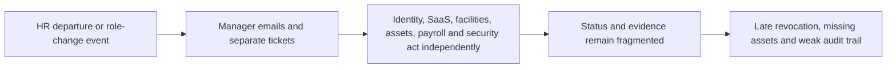
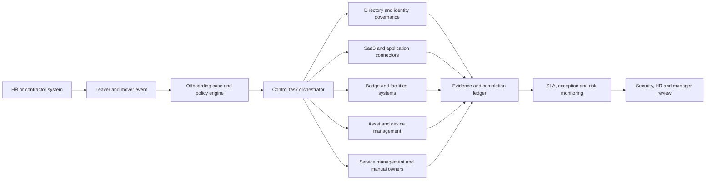

# CROSS-001 Cross-system offboarding control plane

## Classification

- **Segment:** cross-industry
- **Index summary:** Organizations with fragmented offboarding can coordinate HR events, account revocation, asset return, physical access, evidence, and overdue exceptions through one auditable control plane.
- **Company profile / size:** medium and large organizations with multiple SaaS, cloud, on-premises, physical-access, and asset-management systems
- **Opportunity type:** integration
- **Status:** researched
- **Confidence:** high
- **Complexity:** medium
- **Horizon:** medium
- **Risk:** high
- **Azure fit:** high
- **AI dependency:** none
- **Repository alignment:** new-solution

## Problem

HR operations, line managers, identity teams, facilities, security, service desks, and asset owners often execute employee departures and internal transfers through separate tickets, spreadsheets, emails, and application-specific actions. The process lacks a shared case, explicit ownership, completion evidence, and escalation for overdue revocation or asset-return tasks.

The affected actor is the offboarding coordinator or manager responsible for confirming that a departing or transferred worker no longer retains inappropriate digital or physical access and that organizational assets are recovered. The recurring consequence is a period in which accounts, privileges, badges, devices, or software access remain active after the underlying employment or role change.

## Evidence

### Confirmed

- A 2025 Employment and Social Development Canada audit reviewed 6,900 departures and 1,099 internal moves. It found that access revocation and IT asset return were not consistently completed, with some tickets unresolved after 60 days.
- The same audit found fragmented responsibilities, inconsistent use of the departure workflow, delayed physical-access revocation, weak reporting, and a need to improve software and information access for both leavers and movers.
- NIST SP 800-171 Rev. 3 requires organizations to disable accounts that are expired, inactive, no longer associated with a user, or contrary to policy, and to notify responsible personnel when users are terminated, transferred, or no longer require access.
- A 2025 City of Atlanta audit reported that manual and decentralized offboarding did not ensure system access termination or equipment collection and recommended standardized tracking and prompt revocation.

### Inference

- A shared control plane can reduce coordination gaps even when authoritative execution remains distributed across HR, identity, SaaS, facilities, service-management, and asset systems.
- The highest-value initial scope is not universal automatic deletion. It is deterministic orchestration, ownership, evidence collection, overdue detection, and human-controlled handling of exceptions.
- The same process model can support internal transfers, contractors, temporary access expiry, and high-risk termination procedures without requiring generative AI.

### Sources

- [Audit of employee offboarding](https://www.canada.ca/en/employment-social-development/corporate/reports/audits/2025-employee-offboarding.html) — Government of Canada audit published in 2025; evidence of delayed revocation, unresolved tickets, decentralized controls, and weak reporting.
- [NIST SP 800-171 Rev. 3](https://nvlpubs.nist.gov/nistpubs/SpecialPublications/800-171r3/NIST.SP.800-171r3.html) — account-management requirements for inactive, unassociated, terminated, and transferred users.
- [Offboarding audit](https://www.atlaudit.org/offboarding---october-2025.html) — City of Atlanta audit released in October 2025; evidence of manual decentralized processes and incomplete access and asset controls.
- [Execute employee termination tasks by using lifecycle workflows](https://learn.microsoft.com/en-us/entra/id-governance/tutorial-offboard-custom-workflow-portal) — Microsoft Learn documentation, updated in 2026, showing supported Entra termination workflow actions.
- [Azure Logic Apps documentation](https://learn.microsoft.com/en-us/azure/logic-apps/) — Microsoft Learn documentation for cross-system workflow integration and connectors.

## Current process

## Proposed solution

Create an offboarding control plane that receives an authoritative leaver or mover event, creates one governed case, resolves the required task set from policy and role data, assigns each task to an automated connector or accountable human, and tracks evidence until every mandatory control is complete or formally waived.

The solution remains deterministic. Policy decides which controls apply, deadlines, approval boundaries, escalation paths, and whether an action can run automatically. Connectors may disable directory accounts, remove memberships, revoke application entitlements, invalidate badges, initiate device lock or return workflows, and update service-management records. Unsupported or sensitive systems generate owned tasks with evidence requirements rather than unsafe automation.

Humans approve destructive actions, exceptions, legal holds, content-preservation steps, and cases where source data conflict. A risk view highlights overdue access, failed connectors, missing assets, and controls completed without acceptable evidence.

## Macro architecture

## Capabilities and possible technologies

- Application and workflow capabilities: governed cases, policy-derived task plans, deadlines, ownership, approvals, waivers, escalations, evidence capture, and dashboards.
- Data capabilities: normalized worker identity, employment status, role, application entitlement, asset, badge, task, evidence, and exception records.
- Integration capabilities: event or API ingestion from HR systems; connectors for identity, ITSM, SaaS, endpoint management, facilities, asset inventory, email, and messaging.
- Analytics / ML / AI capabilities: deterministic analytics for SLA breaches, recurring connector failures, orphaned accounts, incomplete evidence, and control coverage; ML or generative AI is not required.
- Security and governance capabilities: least privilege, managed identities, segregation of duties, immutable audit events, retention policies, legal-hold handling, encryption, and tenant boundaries.
- Azure services that may fit: Microsoft Entra ID Governance and Lifecycle Workflows, Microsoft Graph, Azure Logic Apps, Azure Functions for custom adapters, Azure Service Bus, Azure SQL or Cosmos DB, Azure Monitor, Application Insights, and Key Vault.
- Non-Azure or open-source alternatives worth considering: Keycloak, Temporal, Camunda, n8n, PostgreSQL, OpenTelemetry, and vendor-neutral REST or SCIM connectors.

## Possible gains

- Shorter exposure windows between an employment or role event and confirmed access removal.
- One accountable case instead of disconnected tickets and spreadsheets.
- Better recovery and traceability of laptops, phones, badges, keys, and other issued assets.
- Auditable proof of completed controls, approved exceptions, and failed integration attempts.
- Reusable lifecycle controls for leavers, movers, contractors, temporary access, and periodic access cleanup.

## Metrics for validation

- Median and 95th-percentile time from authoritative event to completion of mandatory digital-access controls.
- Percentage of cases with every required task completed by its policy deadline.
- Count and age of active accounts, privileges, badges, or entitlements linked to departed or transferred workers.
- Percentage of issued assets returned, reassigned, remotely secured, or covered by an approved exception.
- Connector success rate, manual task aging, reopened cases, and evidence completeness rate.
- Number of unauthorized waivers, segregation-of-duty conflicts, and destructive actions awaiting approval.

## Risks, limits, and controls

- Privacy and sensitive data: employment status, termination reason, access records, device data, and investigation details require strict minimization, role-based views, retention rules, and audit controls.
- Regulatory or policy constraints: labor law, records retention, legal holds, union agreements, privacy law, and sector-specific controls may prohibit immediate deletion or broad disclosure.
- Human decision boundaries: legal holds, high-risk terminations, content transfer, account deletion, disputed assets, and policy waivers require authorized review.
- Model or automation failure modes: no model is required; automation can still revoke the wrong access, miss unmanaged applications, retry destructive actions, or trust stale HR data. Idempotency, preconditions, dry-run views, and compensating procedures are mandatory.
- Integration and data availability risks: incomplete application inventories, shared accounts, non-SCIM systems, contractors outside HR, and inconsistent identity keys can leave blind spots.
- Adoption and change-management risks: managers and system owners may bypass the process unless the authoritative trigger, ownership model, SLA, and exception path are operationally enforced.

## Fit score

| Dimension | Score | Rationale |
| --- | ---: | --- |
| Problem evidence and relevance | 19/20 | Recent government audits document delayed access revocation, unresolved tasks, missing assets, fragmented ownership, and weak monitoring; NIST defines explicit control expectations. |
| Business or operational value | 18/20 | The solution can reduce security exposure, audit effort, asset loss, coordination time, and unresolved exceptions across every departure and transfer. |
| Technical feasibility | 17/20 | Identity and workflow capabilities are mature, but heterogeneous SaaS, physical-access, legacy, shared-account, and asset systems require incremental connectors and manual fallbacks. |
| Reuse potential | 19/20 | The core case, task, evidence, connector, SLA, and exception model applies across industries and can extend to movers, contractors, temporary access, and access reviews. |
| Strategic differentiation | 14/20 | Individual identity and workflow products already exist; differentiation comes from cross-domain control evidence, heterogeneous connectors, and safe handling of unsupported systems rather than basic account disabling. |
| **Total** | **87/100** | Strong horizontal problem and reusable architecture, with integration breadth and organizational adoption as the principal constraints. |

## Repository relationship

- Existing references that may be reused: workflow, integration, identity, audit, observability, portal, and secure API patterns where present in the kit.
- Missing capabilities exposed by this opportunity: policy-driven lifecycle cases, idempotent deprovisioning connectors, evidence ledger, deadline and waiver model, asset and physical-access adapters, and reconciliation jobs for orphaned access.
- Potential building blocks: lifecycle event contract, control policy schema, offboarding case engine, connector adapter contract, evidence ledger, exception approval, and orphaned-access reconciler.
- Potential composed solution: cross-system joiner-mover-leaver control plane with a focused offboarding reference flow.
- Reasons to keep it outside the current kit, when applicable: none identified, but product-grade connector breadth should remain outside an initial reference implementation.

## Duplicate control

- **Problem keys:** employee-offboarding, mover-access-adjustment, delayed-deprovisioning, orphaned-accounts, asset-return, physical-access-revocation, fragmented-control-evidence
- **Capability keys:** lifecycle-case-management, policy-engine, identity-governance, workflow-orchestration, enterprise-connectors, evidence-ledger, sla-monitoring, exception-approval, access-reconciliation
- **Research queries used:** `inactive accounts offboarding access review guidance 2025`; `account management termination access review organization guidance`; `2025 audit report user access offboarding inactive accounts public sector`; `Microsoft Entra lifecycle workflows employee offboarding`; `Azure Logic Apps workflow integration connectors`
- **Related opportunities:** none; this is the first published radar opportunity.
- **Uniqueness statement:** This opportunity is not a generic HR workflow or directory-offboarding script. Its distinctive process is a cross-system control case that proves completion across identity, SaaS, physical access, assets, ITSM, exceptions, and human approvals.

## Next decision

- shortlist for review.
