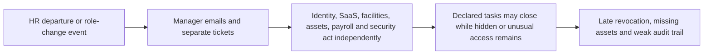
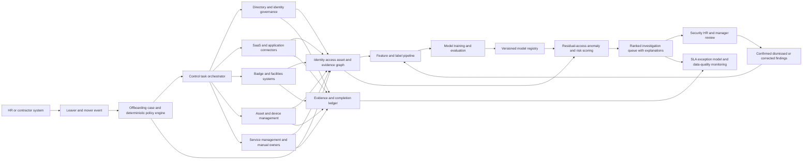

# CROSS-001 AI-assisted cross-system offboarding risk control plane

## Classification

- **Segment:** cross-industry
- **Index summary:** Organizations with fragmented offboarding can orchestrate known revocations and use access-graph anomaly detection to identify likely residual accounts, privileges, assets, and missing controls for human review.
- **Company profile / size:** medium and large organizations with multiple SaaS, cloud, on-premises, physical-access, and asset-management systems
- **Opportunity type:** integration
- **Status:** researched
- **Confidence:** high
- **Complexity:** large
- **Horizon:** medium
- **Risk:** high
- **Azure fit:** high
- **AI dependency:** core
- **Intelligent capability:** identity and access graph anomaly detection with risk-ranked reconciliation
- **Repository alignment:** new-solution

## Problem

HR operations, line managers, identity teams, facilities, security, service desks, and asset owners often execute employee departures and internal transfers through separate tickets, spreadsheets, emails, and application-specific actions. The process lacks a shared case, explicit ownership, completion evidence, and escalation for overdue revocation or asset-return tasks.

The affected actor is the offboarding coordinator or security analyst responsible for confirming that a departing or transferred worker no longer retains inappropriate digital or physical access and that organizational assets are recovered. Known systems may be handled by deterministic workflows, but organizations frequently lack a complete inventory of direct grants, shared accounts, shadow applications, inherited privileges, stale badges, unmanaged devices, and access combinations that differ from expected role patterns.

## Evidence

### Confirmed

- A 2025 Employment and Social Development Canada audit reviewed 6,900 departures and 1,099 internal moves. It found that access revocation and IT asset return were not consistently completed, with some tickets unresolved after 60 days.
- The same audit found fragmented responsibilities, inconsistent use of the departure workflow, delayed physical-access revocation, weak reporting, and a need to improve software and information access for both leavers and movers.
- NIST SP 800-171 Rev. 3 requires organizations to disable accounts that are expired, inactive, no longer associated with a user, or contrary to policy, and to notify responsible personnel when users are terminated, transferred, or no longer require access.
- A 2025 City of Atlanta audit reported that manual and decentralized offboarding did not ensure system access termination or equipment collection and recommended standardized tracking and prompt revocation.

### Inference

- A deterministic workflow can coordinate known controls, but it cannot reliably identify access that is missing from the declared application inventory or inconsistent with a worker's role, peers, employment state, and prior offboarding patterns.
- A model over the identity, entitlement, device, badge, asset, ticket, connector, and evidence graph can rank likely residual access and incomplete controls for investigation without autonomously revoking access.
- Historical confirmed misses, analyst decisions, peer-role patterns, graph relationships, and connector outcomes can provide labels and feedback for supervised, semi-supervised, or anomaly-detection approaches.
- The same intelligence can support internal transfers, contractors, temporary access expiry, access certification, and high-risk termination procedures.

### Sources

- [Audit of employee offboarding](https://www.canada.ca/en/employment-social-development/corporate/reports/audits/2025-employee-offboarding.html) — Government of Canada audit published in 2025; evidence of delayed revocation, unresolved tickets, decentralized controls, and weak reporting.
- [NIST SP 800-171 Rev. 3](https://nvlpubs.nist.gov/nistpubs/SpecialPublications/800-171r3/NIST.SP.800-171r3.html) — account-management requirements for inactive, unassociated, terminated, and transferred users.
- [Offboarding audit](https://www.atlaudit.org/offboarding---october-2025.html) — City of Atlanta audit released in October 2025; evidence of manual decentralized processes and incomplete access and asset controls.
- [Execute employee termination tasks by using lifecycle workflows](https://learn.microsoft.com/en-us/entra/id-governance/tutorial-offboard-custom-workflow-portal) — Microsoft Learn documentation showing supported Entra termination workflow actions.
- [Azure Logic Apps documentation](https://learn.microsoft.com/en-us/azure/logic-apps/) — Microsoft Learn documentation for cross-system workflow integration and connectors.

## Current process

## Proposed solution

Create an offboarding risk control plane that receives an authoritative leaver or mover event, creates one governed case, resolves the required task set from deterministic policy and role data, assigns each task to an automated connector or accountable human, and tracks evidence until every mandatory control is complete or formally waived.

Alongside the deterministic workflow, build an identity and operational graph containing workers, accounts, entitlements, groups, applications, devices, assets, badges, roles, peers, tickets, connector outcomes, evidence, and previous offboarding decisions. An anomaly model produces a ranked list of suspected residual access, unusual privilege relationships, missing systems, inconsistent asset states, and controls whose completion evidence differs from known-good cases.

The model does not revoke access. Analysts review each recommendation, confirm or dismiss it, and the decision becomes feedback for later evaluation and retraining. Deterministic policy remains authoritative for deadlines, required controls, approvals, legal holds, and whether any action can run automatically.

Removing the intelligent capability would reduce the proposal to a conventional lifecycle workflow limited to known systems. The model-based reconciliation is the core differentiator because it searches for probable omissions and cross-system inconsistencies that explicit task lists cannot enumerate reliably.

## Intelligent capability

- **Technique / model family:** graph feature engineering combined with supervised risk ranking, semi-supervised learning, or unsupervised anomaly detection; simpler baselines may begin with isolation forests, gradient-boosted ranking, or graph-derived heuristics before graph neural approaches are justified.
- **Why it is necessary:** fragmented application inventories and indirect entitlement relationships make a complete deterministic rule set impractical. The model prioritizes likely omissions and unusual residual access across systems.
- **Inputs:** employment and transfer events; worker identity; role and peer groups; directory accounts; direct and inherited entitlements; application activity; badges; devices and assets; ITSM tasks; connector failures; completion evidence; analyst dispositions; confirmed post-offboarding findings.
- **Outputs:** ranked suspected residual accounts, entitlements, assets, badges, missing control tasks, and evidence anomalies with contributing signals and confidence.
- **Training / grounding / optimization:** start with historical offboarding cases and confirmed findings; use analyst confirmations and dismissals as feedback; maintain time-based train/evaluation splits; use unsupervised scores when labels are sparse; preserve explainable features and rule-based baselines.
- **Evaluation:** precision and recall on confirmed residual access; precision at analyst review capacity; false-positive rate; calibration; time-to-detection; coverage by system type; model drift; analyst acceptance and correction rate; comparison against deterministic rules alone.
- **Fallback and controls:** no autonomous revocation from model output; confidence thresholds; explicit abstention; human approval; deterministic required-task baseline; explainable contributing signals; audit trail; rollback and model disable switch; manual reconciliation when data quality is insufficient.

## Macro architecture

## Capabilities and possible technologies

- Application and workflow capabilities: governed cases, policy-derived task plans, deadlines, ownership, approvals, waivers, escalations, evidence capture, analyst queues, and dashboards.
- Data capabilities: normalized worker identity, employment status, role, peer, application entitlement, account activity, asset, badge, task, evidence, exception, feature, label, and model-decision records.
- Integration capabilities: event or API ingestion from HR systems; connectors for identity, ITSM, SaaS, endpoint management, facilities, asset inventory, email, and messaging.
- Required AI / ML capabilities: access-graph feature generation, anomaly detection, risk ranking, confidence calibration, explanation, feedback capture, drift monitoring, and model comparison against rule-only baselines.
- Training, fine-tuning, grounding, recognition, or optimization capabilities: historical labeled-case preparation, weak-label strategies, time-based validation, model registry, scheduled retraining, champion/challenger evaluation, and safe inference endpoints.
- Evaluation and model-operations capabilities: offline precision/recall and ranking evaluation, online review outcomes, model/data drift, feature quality, auditability, and disable/rollback controls.
- Security and governance capabilities: least privilege, managed identities, segregation of duties, immutable audit events, retention policies, legal-hold handling, encryption, model-access boundaries, and tenant isolation.
- Azure services that may fit: Microsoft Entra ID Governance and Lifecycle Workflows, Microsoft Graph, Azure Logic Apps, Azure Functions, Azure Service Bus, Azure SQL or Cosmos DB, Azure Machine Learning, Microsoft Fabric or Azure Data Explorer for feature preparation where justified, Azure Monitor, Application Insights, and Key Vault.
- Non-Azure or open-source alternatives worth considering: Keycloak, Temporal, Camunda, n8n, PostgreSQL, Neo4j, NetworkX, scikit-learn, XGBoost, PyTorch Geometric, MLflow, Feast, OpenTelemetry, and vendor-neutral REST or SCIM connectors.

## Possible gains

- Shorter exposure windows between an employment or role event and confirmed access removal.
- Detection of likely residual access and missing controls that are absent from the declared workflow.
- Better prioritization of analyst effort toward cases with the highest modeled risk.
- One accountable case instead of disconnected tickets and spreadsheets.
- Better recovery and traceability of laptops, phones, badges, keys, and other issued assets.
- Auditable proof of completed controls, model recommendations, human decisions, approved exceptions, and failed integration attempts.
- Reusable lifecycle intelligence for leavers, movers, contractors, temporary access, and periodic access cleanup.

## Metrics for validation

### Business and operational metrics

- Median and 95th-percentile time from authoritative event to completion of mandatory digital-access controls.
- Percentage of cases with every required task completed by its policy deadline.
- Count and age of active accounts, privileges, badges, or entitlements linked to departed or transferred workers.
- Percentage of issued assets returned, reassigned, remotely secured, or covered by an approved exception.
- Analyst time per case, review queue age, reopened cases, evidence completeness, and confirmed residual-access findings.

### Intelligent-capability metrics

- Precision, recall, and precision at the available analyst-review capacity for confirmed residual access or missing controls.
- False-positive rate and abstention rate by application, worker type, role, and risk tier.
- Calibration between predicted risk and confirmed findings.
- Incremental confirmed findings compared with deterministic rules alone.
- Analyst acceptance, dismissal, correction, and override rates.
- Data and model drift, stale-feature rate, and performance by system coverage.

## Risks, limits, and controls

- Privacy and sensitive data: employment status, termination reason, access records, device data, behavioral signals, and investigation details require strict minimization, role-based views, retention rules, and audit controls.
- Regulatory or policy constraints: labor law, records retention, legal holds, union agreements, privacy law, automated-decision restrictions, and sector-specific controls may prohibit immediate deletion or broad disclosure.
- Human decision boundaries: model output may prioritize investigation but cannot independently revoke accounts, delete data, impose employment consequences, approve waivers, or resolve legal holds.
- Model, retrieval, recognition, or policy failure modes: false positives may waste analyst time or create suspicion; false negatives may leave residual access undetected; explanations may overstate causality; sparse labels may bias the model toward well-instrumented systems.
- Bias, drift, weak labels, or insufficient feedback: contractors, acquired companies, uncommon roles, and legacy systems may have lower data quality and higher error rates. Evaluation must be segmented, and the deterministic baseline must remain available.
- Integration and data availability risks: incomplete application inventories, shared accounts, non-SCIM systems, contractors outside HR, inconsistent identity keys, and inaccessible activity logs can leave blind spots.
- Adoption and change-management risks: analysts may over-trust scores or ignore them. Training, confidence display, explanations, sampling of low-risk cases, and periodic control testing are required.

## Fit score

| Dimension | Score | Rationale |
| --- | ---: | --- |
| Problem evidence and relevance | 19/20 | Recent government audits document delayed revocation, unresolved tasks, missing assets, fragmented ownership, and weak monitoring; NIST defines explicit control expectations. |
| Business or operational value | 19/20 | Deterministic orchestration plus model-based residual-access discovery can reduce security exposure, audit effort, asset loss, unresolved exceptions, and analyst search time. |
| Technical feasibility | 15/20 | Workflow and identity capabilities are mature, but graph normalization, sparse labels, heterogeneous systems, calibration, and safe evaluation make the intelligence layer materially harder. |
| Reuse potential | 18/20 | The case, graph, feature, model, evidence, connector, SLA, and exception patterns apply across industries and extend to movers, contractors, access reviews, and temporary access. |
| Strategic differentiation | 18/20 | The model-based search for hidden or inconsistent residual access differentiates the solution from standard lifecycle workflows limited to declared tasks and known connectors. |
| **Total** | **89/100** | Strong horizontal problem and reusable AI-enabled architecture, with data coverage, labels, integration breadth, and organizational adoption as the principal constraints. |

## Repository relationship

- Existing references that may be reused: workflow, integration, identity, audit, observability, portal, secure API, data, and ML deployment patterns where present in the kit.
- Missing capabilities exposed by this opportunity: identity/access graph contract, feature and label pipeline, anomaly/risk-ranking training reference, model evaluation, feedback loop, model registry/inference, policy-driven lifecycle cases, evidence ledger, and reconciliation connectors.
- Potential building blocks: lifecycle event contract, control policy schema, identity-access graph, model training and evaluation pipeline, residual-access scorer, model decision ledger, connector adapter contract, exception approval, and human-review queue.
- Potential composed solution: AI-assisted joiner-mover-leaver control plane with deterministic workflow and model-based residual-access reconciliation.
- Reasons to keep it outside the current kit, when applicable: product-grade connector breadth and enterprise-wide identity graph operation should remain outside an initial reference implementation.

## Duplicate control

- **Problem keys:** employee-offboarding, mover-access-adjustment, delayed-deprovisioning, orphaned-accounts, residual-access-detection, asset-return, physical-access-revocation, fragmented-control-evidence
- **Capability keys:** lifecycle-case-management, policy-engine, identity-governance, workflow-orchestration, enterprise-connectors, identity-access-graph, anomaly-detection, risk-ranking, explainable-model-output, feedback-learning, model-monitoring, evidence-ledger, exception-approval
- **Research queries used:** `inactive accounts offboarding access review guidance 2025`; `account management termination access review organization guidance`; `2025 audit report user access offboarding inactive accounts public sector`; `Microsoft Entra lifecycle workflows employee offboarding`; `Azure Logic Apps workflow integration connectors`
- **Related opportunities:** none; this is the first published radar opportunity.
- **Uniqueness statement:** This opportunity is not a generic HR workflow or directory-offboarding script. Its distinctive process combines deterministic cross-system control evidence with a trained risk model that identifies and prioritizes probable residual access and missing controls for governed human review.

## Next decision

- shortlist for review.
