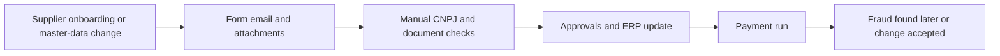
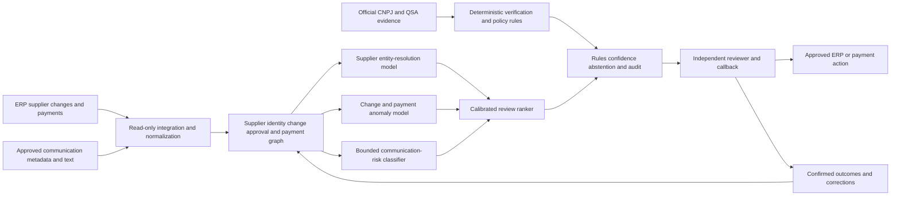

# CROSS-002 AI-assisted supplier identity and payment-change assurance

## Classification

- **Segment:** cross-industry
- **Primary market / jurisdiction:** Brazil
- **Evidence reference date:** 2026-07-19; Brazilian corporate-fraud evidence published 2025-12-04; CNPJ service updated 2026-04-10
- **Index summary:** Brazilian organizations can combine supplier-master history, CNPJ evidence, approval context, communications, and payment behavior to rank suspicious onboarding and bank-detail changes before human-approved payment release.
- **Company profile / size:** medium and large organizations with ERP-based procurement and accounts payable
- **Opportunity type:** security | operations | automation
- **Status:** hypothesis
- **Confidence:** medium
- **Complexity:** medium
- **Horizon:** short
- **Risk:** high
- **Solution evidence level:** conceptual
- **Operational maturity:** unvalidated
- **Azure fit:** high
- **AI dependency:** core
- **Primary AI role:** anomaly-detection
- **Intelligent capability:** supplier-entity resolution, change-pattern anomaly detection, communication-risk classification, and payment-review ranking
- **Repository alignment:** extend-kit

## Problem

Procurement, supplier-management, treasury, and accounts-payable teams frequently receive new-supplier registrations and requests to change bank, contact, address, ownership, or tax data. The process is fragmented across ERP forms, email, attachments, CNPJ checks, approvals, and payment runs. Fraudsters or insiders can exploit a legitimate supplier relationship, compromised mailbox, forged document, duplicate entity, or unusual master-data change to redirect payments. Manual review is inconsistent and often treats each request independently, without comparing entity, communication, approval, and payment history.

## Brazil applicability and current context

Serasa Experian reported in December 2025 that payment-transaction fraud affected 28.4% of surveyed Brazilian companies, while fraud involving requests to pay fraudulent accounts affected 26.5%; 58.5% reported greater concern about fraud. The official Brazilian CNPJ service, updated in April 2026, allows consultation of registration status and the quadro de sócios e administradores, providing a deterministic source for supplier verification. These sources establish a current Brazilian problem and an available official verification layer, but do not prove that a model will reduce losses in a particular organization.

## Evidence

### Confirmed problem evidence

- Brazilian companies report material exposure to transactional fraud and requests for payment to fraudulent accounts.
- Supplier verification can use official CNPJ status and QSA data, but those checks do not detect compromised communications, suspicious change sequences, duplicates, or unusual payment context.

### Favorable solution evidence

- Entity matching, graph features, tabular classification, and anomaly detection are technically testable on historical supplier-master and payment events.
- The public Bank Account Fraud dataset demonstrates realistic evaluation challenges including temporal dynamics, class imbalance, and bias, supporting a disciplined prototype design rather than assumed accuracy.

### Counter-evidence and limitations

- Fraud labels are sparse and delayed; anomaly models can overload reviewers by flagging legitimate corporate reorganizations, factoring arrangements, or bank changes.
- Static rules and independent callbacks are strong controls and may outperform ML where change volume is low or data history is poor.
- The model must not infer legal ownership, beneficial ownership, or fraud from similarity alone.

### Inference

- The best initial value is not autonomous fraud blocking, but concentrating independent verification on a small, explainable set of higher-risk changes.

### Unknowns

- Local fraud prevalence, label quality, review capacity, data consistency across ERP instances, and incremental lift over existing maker-checker controls.

### Sources

- [Fraudes transacionais e vazamentos de dados são as principais ocorrências em empresas brasileiras](https://www.serasaexperian.com.br/sala-de-imprensa/prevencao-a-fraude/fraudes-transacionais-e-vazamentos-de-dados-sao-as-principais-ocorrencias-em-empresas-brasileiras-aponta-pesquisa-da-serasa-experian/) — Brazil; 2025-12-04; problem evidence.
- [Consultar CNPJ](https://www.gov.br/pt-br/servicos/consultar-cadastro-nacional-de-pessoas-juridicas) — Brazil; updated 2026-04-10; official verification baseline.
- [Bank Account Fraud dataset](https://arxiv.org/abs/2211.13358) — international technical research; realistic imbalance, temporal drift, and bias limitations.
- [Targeted Attacks: Redefining Spear Phishing and Business Email Compromise](https://arxiv.org/abs/2309.14166) — international technical background; targeted communication attacks and detection limitations.

## Current process

## Baseline without AI

- **Current baseline:** maker-checker approval, CNPJ lookup, document checklist, callback, account confirmation, and payment hold.
- **Strongest realistic non-AI alternative:** mandatory independent callback using previously verified contact data, exact-field comparisons, duplicate CNPJ/account rules, approval segregation, and threshold-based payment holds.
- **Baseline strengths:** explainable, auditable, low model risk, and effective for known scenarios.
- **Baseline limitations:** weak at combining many subtle signals, entity variants, historical sequences, and communication context.
- **Context where intelligence may add incremental value:** organizations with many suppliers, frequent changes, multiple ERPs, shared-service centers, and enough historical outcomes.
- **Condition where the non-AI baseline should be preferred:** low change volume, insufficient history, or inability to perform independent verification.

## Proposed solution

Create a pre-release assurance workflow that ingests supplier-master changes, official CNPJ evidence, prior verified contacts, approval path, email metadata and text, bank-account relationships, invoice/payment context, and historical outcomes. Deterministic controls validate required fields, CNPJ status, segregation, callback completion, and policy thresholds. Models resolve duplicate or related entities, detect unusual changes and sequences, classify communication-risk cues, and rank cases for independent verification. Humans decide whether to accept, reject, revert, or escalate every change and payment hold.

## Where AI enters

### AI role map

| Process stage | AI component | AI type / model family | What it does | Runtime mode | Output | Human or deterministic control |
| --- | --- | --- | --- | --- | --- | --- |
| Intake | Supplier entity resolver | embeddings plus probabilistic entity matching | links name, CNPJ, address, account, contact, and historical variants | asynchronous batch/online | match candidates and confidence | exact CNPJ rules; reviewer confirmation |
| Change review | Change anomaly model | gradient boosting plus graph/anomaly features | scores unusual field combinations, sequences, approvers, accounts, and payment context | online | calibrated risk score and factors | policy thresholds; abstention; callback |
| Communication review | Message-risk classifier | supervised text classifier or grounded LLM classifier | identifies payment-redirection and impersonation cues without deciding fraud | asynchronous | labels, evidence spans, confidence | source display; reviewer confirmation |
| Queueing | Review ranker | learning-to-rank or calibrated classifier | prioritizes limited verification capacity | batch/online | ranked case queue | fixed critical rules override ranking |

### Required distinctions

- **Primary AI role:** anomaly detection and ranking/recommendation.
- **Model family:** classical tabular ML, graph features, embeddings/entity resolution, and a bounded text classifier.
- **Training requirement:** supervised training where labels exist; weak supervision and synthetic scenarios for initial stress testing.
- **Training location and cadence:** offline per organization; quarterly or drift-triggered retraining.
- **Inference location:** private cloud batch and online service before ERP activation or payment release.
- **Agent role:** not used.
- **LLM role:** optional bounded classification with evidence spans; not used for approval, CNPJ verification, or autonomous action.
- **Non-LLM intelligence:** entity matching, gradient boosting, graph anomaly features, and ranking.
- **Not AI:** CNPJ consultation, exact comparisons, approval workflow, segregation rules, callbacks, payment holds, audit logs, and human decisions.

## Intelligent capability details

- **Technique / model family:** probabilistic entity resolution, gradient-boosted classification, graph-derived features, text classification, and calibrated ranking.
- **Why it is necessary:** to combine weak signals across identity, change history, communications, approvals, accounts, and payment context at a scale manual rules cannot prioritize consistently.
- **Inputs:** supplier records, change events, CNPJ/QSA evidence, contacts, bank accounts, approvals, email metadata/text, invoices, payments, callback outcomes.
- **Outputs:** entity links, risk score, reason factors, evidence spans, and ranked review case.
- **Training / grounding / optimization assumptions:** historical confirmed fraud and legitimate-change outcomes; otherwise weak labels plus synthetic attacks and reviewer feedback.
- **Evaluation:** temporal holdout, precision-recall, recall at fixed review capacity, calibration, false-positive burden, and lift over rules.
- **Fallback and controls:** deterministic high-risk rules, independent callback, manual queue, abstention, rollback of master changes, and payment hold.

## Data and integration assumptions

- **Data owners and access path:** procurement, vendor master, accounts payable, treasury, security, legal/privacy, and ERP owners.
- **Expected volume, history, frequency, and coverage:** ideally 12–24 months of change and payment events; prototype may start with one business unit.
- **Labels, outcomes, feedback, or simulation available:** confirmed incidents, rejected changes, callback results, audit findings, and synthetic scenarios.
- **Known quality, imbalance, missingness, and leakage risks:** rare positives, inconsistent supplier IDs, post-investigation fields leaking outcomes, and undocumented exceptions.
- **Brazilian or local-context representativeness:** Portuguese communications, Brazilian CNPJ formats, local banking and supplier practices.
- **Privacy, retention, consent, surveillance, or sharing constraints:** LGPD purpose limitation, minimum message content, role-based access, and retention controls.
- **Integration and synchronization assumptions:** ERP/vendor-master API or controlled export, mail-security metadata, payment workflow, and case-management integration.
- **Drift and change sources:** acquisitions, new ERPs, bank formats, policy changes, seasonal suppliers, and attacker adaptation.
- **Minimum viable data for a prototype:** supplier master snapshots, change events, payments, approvals, and at least reviewer-confirmed legitimate/exception cases.

## Prototype validation plan

- **Prototype scope / process slice:** one ERP, one supplier-change type, and pre-payment review in shadow mode.
- **Users, sites, assets, documents, events, or simulated cases:** 5–10 reviewers; historical changes plus synthetic redirection scenarios.
- **Baseline or comparison:** strongest deterministic callback/checklist/rule workflow.
- **Required data and integrations:** read-only extracts first; no automatic ERP write.
- **Model-quality metrics:** precision-recall, recall at top-k, calibration, entity-match precision, evidence-span accuracy, and abstention rate.
- **Business or workflow metrics:** review time, cases reviewed per analyst, prevented or corrected risky changes, and payment delays.
- **Human acceptance, correction, or override metrics:** acceptance, override, correction reason, and reviewer agreement.
- **Safety and compliance boundaries:** no autonomous supplier rejection, master update, account change, or payment release/block.
- **Failure or redesign criteria:** no lift over rules, excessive false positives, poor calibration, unverifiable reasons, or review delays exceeding policy.
- **Evidence required before a pilot or broader implementation:** stable temporal replay, acceptable review burden, privacy approval, and successful shadow-mode callbacks.

## Macro architecture

## Capabilities and possible technologies

- Application and workflow capabilities: change case, evidence view, callback workflow, approvals, audit.
- Data capabilities: normalized supplier history, graph relationships, feature store, temporal datasets.
- Integration capabilities: ERP, vendor portal, mail security, CNPJ evidence, treasury/payment workflow.
- Required AI / ML capabilities: entity resolution, anomaly detection, classification, calibrated ranking.
- Training, grounding, recognition, or optimization capabilities: temporal evaluation, synthetic scenarios, drift monitoring.
- Agent and tool-use capabilities, or `not used`: not used.
- LLM / foundation-model capabilities, or `not used`: optional bounded evidence-grounded classification; removable from baseline prototype.
- Evaluation and model-operations capabilities: model registry, monitoring, reviewer feedback, rollback.
- Security and governance capabilities: private networking, RBAC, encryption, immutable audit, data minimization.
- Azure services that may fit: Azure Functions, Logic Apps, Service Bus, Azure Machine Learning, Azure AI Search, Azure AI Content Understanding or Document Intelligence, PostgreSQL/Cosmos DB, Key Vault, Monitor.
- Non-Azure or open-source alternatives worth considering: Python/scikit-learn, LightGBM, Splink, Neo4j, PostgreSQL, MLflow, OpenSearch.

## Possible gains

- Focus independent verification on the supplier changes most likely to need scrutiny.
- Detect cross-record relationships and suspicious sequences that isolated checklists miss.
- Preserve an auditable, human-controlled payment-release process.

## Metrics for validation

### Business and operational metrics

- Review effort and payment delay against the deterministic baseline.
- Confirmed risky changes detected before activation or payment.

### Intelligent-capability metrics

- Precision-recall, recall at fixed review capacity, calibration error, entity-link precision, and false-positive rate.
- Human acceptance, override, correction, and abstention outcomes.

## Risks, limits, and controls

- Privacy and sensitive data: minimize email and bank data; restrict access and retention.
- Brazilian regulatory or policy constraints: LGPD, contractual duties, banking-data security, and internal approval policies require review.
- Human decision boundaries: only authorized staff approve supplier and payment actions.
- Model or policy failure modes: false positives, missed compromised suppliers, drift, duplicate mislinking, and biased treatment of small/new suppliers.
- Agent or tool-execution failure modes, when applicable: not applicable.
- LLM hallucination, grounding, or prompt-injection risks, when applicable: use evidence spans, constrained schema, sanitized content, and allow removal of the LLM component.
- Comparable failures and applicable lessons: rare-event imbalance and temporal change require capacity-based metrics and temporal holdouts.
- Bias, drift, weak labels, or insufficient feedback: monitor by supplier type, region, tenure, and change type without inferring protected traits.
- Integration and data risks: inconsistent supplier IDs and incomplete approval history.
- Adoption and change-management risks: alert fatigue and bypass outside approved channels.
- Prototype cost or operational assumptions: begin read-only with one ERP and bounded message processing.

## Fit score

| Dimension | Score | Rationale |
| --- | ---: | --- |
| Problem evidence and relevance | 18/20 | Current Brazilian corporate-fraud evidence and a concrete supplier/payment-change process. |
| Business or operational value | 18/20 | Avoided redirection and more focused verification could be material. |
| Technical feasibility | 17/20 | Bounded shadow-mode prototype is feasible, but labels and integrations are uncertain. |
| Reuse potential | 18/20 | Reusable entity resolution, anomaly, workflow, evidence, and audit blocks. |
| Strategic differentiation | 17/20 | Cross-context risk ranking adds value beyond isolated rules while preserving them. |
| **Total** | **88/100** | Medium-confidence prototype candidate. |

## Repository relationship

- Existing references that may be reused: workflow orchestration, document intake, RAG/evidence, model evaluation, and secure integration patterns.
- Missing capabilities exposed by this opportunity: reusable entity-resolution and calibrated case-ranking blocks.
- Potential building blocks: supplier evidence connector, temporal change store, entity graph, anomaly model, review queue, callback control.
- Potential composed solution: supplier-master and payment-change assurance service.
- Reasons to keep it outside the current kit, when applicable: none at hypothesis stage.

## Duplicate control

- **Problem keys:** supplier onboarding, vendor master, bank-account change, payment redirection, accounts payable fraud.
- **Capability keys:** entity resolution, graph anomaly detection, text classification, risk ranking, human verification.
- **Research queries used:** Brazil corporate payment fraud 2025; CNPJ QSA consultation 2026; supplier master data fraud; bank-detail change anomaly detection; entity resolution false positives.
- **Related opportunities:** FIN-001 addresses Pix participant fraud; CROSS-001 addresses employee offboarding and residual access.
- **Uniqueness statement:** This opportunity controls enterprise supplier-master and payment-change workflows, not consumer-payment fraud or workforce access revocation.

## Next decision

- prototype candidate.

Implementation approval remains an explicit human decision.
