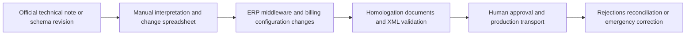
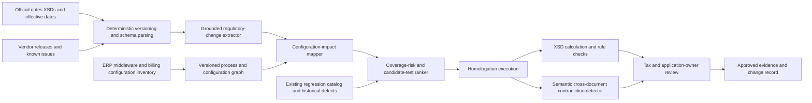

# CROSS-003 AI-assisted Brazilian tax-reform configuration assurance

## Classification

- **Segment:** cross-industry
- **Primary market / jurisdiction:** Brazil
- **Evidence reference date:** 2026-07-20
- **Index summary:** Brazilian companies can trace official IBS/CBS changes into ERP configuration and generated fiscal documents, using grounded extraction and contradiction detection to prioritize human review before rejected or inconsistent invoices reach production.
- **Company profile / size:** Mid-sized and large organizations operating one or more ERPs, fiscal engines, billing systems, or shared-service centers in Brazil
- **Opportunity type:** integration
- **Status:** hypothesis
- **Confidence:** medium
- **Complexity:** large
- **Horizon:** short
- **Risk:** regulated
- **Solution evidence level:** conceptual
- **Operational maturity:** unvalidated
- **Existing-solution disposition:** integrate
- **Azure fit:** high
- **AI dependency:** core
- **Primary AI role:** extraction
- **Intelligent capability:** Grounded regulatory-change extraction, configuration-impact mapping, cross-system contradiction detection, and risk-ranked regression-test generation
- **Repository alignment:** new-solution

## Problem

Brazilian tax, billing, ERP, and integration teams must translate frequently revised IBS/CBS technical notes into coordinated changes across tax configuration, product and customer masters, order-to-cash, procure-to-pay, fiscal middleware, XML generation, and regression tests. The main risk is not merely missing a field: it is applying a valid rule to the wrong operation, date, document chain, establishment, or system version, producing rejected documents or internally inconsistent tax treatment.

## Operational simulation

### Organization and actor

**Synthetic archetype:** a Brazilian multi-entity distributor with 2,000 employees, SAP plus a legacy billing platform, third-party fiscal middleware, and centralized tax operations.

**Primary actor:** tax-configuration lead. The actor may propose mappings and release evidence, but tax managers and application owners approve production changes.

### Process simulated

**Trigger:** a new or revised official technical note changes IBS/CBS fields, validation rules, dates, or document relationships.

**Objective:** identify affected processes and configurations, implement changes, prove expected document behavior in homologation, and retain an audit trail from official source to approved deployment.

**Completion condition:** impacted systems pass approved test cases, generated documents conform to current schemas and business rules, and unresolved cases are explicitly blocked or accepted by authorized humans.

**Inputs and context:** official technical notes and XSDs, ERP release notes, SAP Notes, tax tables, product/customer/supplier masters, sample orders and invoices, integration mappings, historical rejection logs, configuration transports, test results, and approval records.

**Constraints:** legal effective dates, multiple document types, parallel old/new tax treatment during transition, vendor release timing, segregation of duties, fiscal-data confidentiality, production-change windows, and inability to test every operational combination manually.

### Scenario variants

#### Normal flow

1. Tax operations receives an official technical-note revision.
2. Analysts compare it with the prior version and create a spreadsheet of changed fields and rules.
3. ERP, middleware, and billing owners interpret which configurations and interfaces are affected.
4. Teams create representative orders and invoices in homologation.
5. XMLs and tax calculations are checked, defects corrected, and evidence attached to the change record.

**Judgment points:** whether a textual change affects a real process; which date and document predecessor control treatment; whether a vendor patch fully covers local customizations.

#### Exception flow

A revised rule conflicts with an existing internal mapping for returns and credit notes. SAP supports the new tax situation, but the legacy billing system still derives treatment from product classification alone. Test XMLs validate structurally while applying inconsistent classifications across the document chain.

**Failure path:** teams see technically valid XMLs, miss the semantic inconsistency, and release a configuration that later generates rejected adjustments or incorrect downstream reconciliation.

#### Peak or degraded flow

Several technical notes, XSD revisions, vendor patches, and business requests arrive before a mandatory production date. Key tax analysts are unavailable and homologation capacity is constrained.

**Failure path:** duplicate spreadsheets diverge, low-risk tests consume scarce capacity, high-impact combinations remain untested, and emergency fixes bypass complete evidence.

### Opportunity points derived from simulation

| Operational point | Deterministic response tested first | Remaining intelligent gap |
| --- | --- | --- |
| Detect changed fields and schema rules | XML diff, version control, schema validation | Relate textual regulatory changes to business meaning and affected process variants |
| Map impact to systems and configuration | CMDB, configuration inventory, dependency graph | Resolve semantic links between regulatory concepts, ERP objects, custom mappings, and document chains |
| Build regression coverage | Rule-based test templates and pairwise combinations | Rank high-risk scenarios and generate grounded candidate cases from changed obligations and historical failures |
| Review outputs | XSD validation, calculation checks, approval workflow | Detect cross-document semantic contradictions that remain structurally valid |

## Brazil applicability and current context

The Receita Federal states that, from 1 January 2026, electronic fiscal documents must highlight CBS and IBS according to document-specific technical notes. The year is a testing period, but compliance with accessory obligations remains operationally relevant. The official NFS-e portal continued revising RTC layouts in June and July 2026, including new adjustment-note structures and CNPJ-alphanumeric changes. The CGIBS announced that emission parameters become mandatory on 3 August 2026 and documents lacking the new information may be rejected.

The opportunity is therefore time-bounded and Brazil-specific: organizations must continuously reconcile official changes, vendor localizations, custom code, master data, and test evidence during a multi-year transition.

## Existing solutions and differentiation

### Existing solutions reviewed

| Solution / platform | Owner or vendor | Current capabilities | Evidence date | Coverage overlap |
| --- | --- | --- | --- | --- |
| SAP Brazil localization for IBS/CBS | SAP | Tax-situation configuration, purchasing and sales mappings, transition-date logic, calculation, document relation handling, and known-issue guidance | 2026-07 | Strong overlap for SAP-native calculation and configuration |
| Questor Reforma Tributária workspace | Questor | Fiscal workspace and product-specific support for IBS/CBS transition | 2026-05 | Covers tax configuration inside its product suite |
| ERP and fiscal engines marketed as reform-ready | Multiple Brazilian vendors | Automatic calculation, tax catalogs, parallel old/new tax treatment, and document generation | 2026 | Covers execution within each vendor boundary |
| Official validation environments and schemas | Receita Federal / fiscal authorities | XSDs, technical notes, homologation, and document authorization | 2026-07 | Covers structural and official-rule validation, not enterprise-wide impact evidence |

### Gap and disposition

- **What is already solved:** Vendor platforms calculate IBS/CBS, expose configuration objects, apply patches, generate fiscal documents, and validate schemas.
- **Material uncovered gap:** Cross-vendor assurance from a specific official change to impacted configuration, custom integration, master data, regression scenarios, generated documents, and human approval evidence.
- **Underserved context:** Enterprises with multiple ERPs, legacy billing, fiscal middleware, custom tax logic, and shared-service handoffs.
- **Disposition:** integrate
- **Why changing vendor, cloud, model, UI, or architecture is insufficient:** The value depends on connecting authoritative rules, heterogeneous configuration, document lineage, and test evidence; another tax calculator would duplicate existing products.
- **Differentiation statement:** This is not a tax engine or autonomous tax adviser. It is a governed assurance layer that identifies likely impact and contradiction paths across existing platforms and proposes evidence-backed tests for expert approval.

## Evidence

### Confirmed problem evidence

- Receita Federal guidance updated on 6 May 2026 requires CBS/IBS information in electronic fiscal documents during the 2026 test year.
- The NFS-e RTC documentation was updated on 14 July 2026 and shows continuing layout and availability changes.
- CGIBS stated on 22 May 2026 that required parameters become mandatory from 3 August 2026 and missing information may cause rejection.
- The NF-e portal listed RTC layout version 1.50 on 3 June 2026 and further 2026 schema changes, demonstrating active technical change.

### Existing-solution evidence

- SAP currently provides native IBS/CBS calculation, tax-situation configuration, purchasing and sales mappings, transition-date logic, and troubleshooting guidance.
- These capabilities confirm that calculation and ERP-local configuration are existing landscape, invalidating a new tax-engine framing.

### Favorable evidence for the uncovered gap

- Official notes, XSDs, vendor documentation, configuration exports, document XMLs, and test evidence provide machine-readable or extractable inputs.
- Historical rejection logs and accepted test outcomes can support ranking and calibration without allowing the model to decide tax liability.

### Counter-evidence and limitations

- Deterministic schema validation and vendor test tools may solve most standard cases; the intelligent layer must prove incremental detection of semantic or cross-system defects.
- Tax language is high-stakes and changes rapidly; grounded extraction can still omit conditions or mis-map legal meaning.
- Configuration inventories may be incomplete, making impact graphs misleading.
- Synthetic tests may not represent rare real operations.

### Inference

- The strongest value likely occurs in heterogeneous enterprises, not organizations running one current, minimally customized ERP with complete vendor support.

### Unknowns

- Frequency and cost of cross-system semantic defects during the transition.
- Availability and quality of configuration exports from each platform.
- Incremental recall over expert-built regression suites.
- Whether vendor roadmaps add equivalent cross-system impact assurance.

### Sources

- [Orientações da Reforma Tributária para 2026](https://www.gov.br/receitafederal/pt-br/acesso-a-informacao/acoes-e-programas/programas-e-atividades/reforma-tributaria-do-consumo/orientacoes-2026) — Brazil; updated 2026-05-06; official obligations and transition context.
- [RTC technical documentation](https://www.gov.br/nfse/pt-br/biblioteca/documentacao-tecnica/rtc/rtc) — Brazil; updated 2026-07-14; current NFS-e layouts and rollout limitations.
- [Nota Técnica 009](https://www.gov.br/nfse/pt-br/noticias/publicada-a-nota-tecnica-009-da-nfs-e) — Brazil; 2026-06-09; current layout changes.
- [CGIBS adequacy deadline](https://cgibs.gov.br/prazo-para-adequacao-dos-sistemas-de-emissao-de-notas-fiscais-ao-regulamento-do-ibs-encerra-em) — Brazil; 2026-05-22; mandatory parameters and rejection risk.
- [NF-e technical notes](https://www.nfe.fazenda.gov.br/portal/listaConteudo.aspx?tipoConteudo=6WfrpZYE4Ik%3D) — Brazil; accessed 2026-07-20; current schemas and RTC versions.
- [SAP tax situation configuration](https://help.sap.com/docs/SAP_ERP/063e7e5f4d7f4fc0be08565793a9b941/515d712ff51c40e5b3092e2345c5e8bc.html?locale=pt-BR) — current product capability.
- [SAP transition determination](https://help.sap.com/docs/SAP_ERP/063e7e5f4d7f4fc0be08565793a9b941/0688d47029324cf2ab38fd744ad13595.html?locale=pt-BR) — current date and document-chain capability.
- [SAP troubleshooting guide](https://userapps.support.sap.com/sap/support/knowledge/en/3642384) — updated 2026-05-27; known issues and limitations.

## Current process and current solution

## Baseline

- **Current manual or system baseline:** Tax experts maintain impact spreadsheets and coordinate system owners through change tickets.
- **Existing product or platform baseline:** Vendor localizations, tax engines, schema validators, homologation environments, and regression suites.
- **Strongest realistic non-AI alternative:** Version-controlled regulatory rules, configuration inventory, deterministic dependency graph, pairwise tests, and mandatory approval evidence.
- **Baseline strengths:** Auditable, predictable, and appropriate for known rules.
- **Baseline limitations:** Semantic relationships and cross-system exceptions require substantial expert interpretation.
- **Exact context where the proposed intelligence adds incremental value:** Prioritizing and explaining likely impacts or contradictions across heterogeneous platforms and custom document chains.
- **Condition where adoption or the baseline should be preferred:** A single current ERP with complete vendor localization and adequate deterministic regression coverage.

## Proposed solution or extension

Integrate official regulatory sources, vendor release documentation, configuration exports, process lineage, test catalogs, XML outputs, and rejection history. Deterministic parsers establish versions, schemas, dates, identifiers, and calculation checks. Grounded models extract candidate obligations and conditions, map them to configuration and process nodes, detect inconsistent treatment across related documents, and rank missing regression coverage. Tax experts approve every interpretation, mapping, test, and release decision.

## Where AI enters

### AI role map

| Process stage | AI component | AI type / model family | Inputs | What it does | Runtime mode | Output | Human or deterministic control |
| --- | --- | --- | --- | --- | --- | --- | --- |
| Regulatory change intake | Grounded change extractor | document model plus LLM structured extraction | official notes, annexes, prior version | extracts changed obligations, conditions, dates, document types, and citations | asynchronous | cited candidate rule changes | schema validation and tax-expert approval |
| Impact analysis | Configuration impact mapper | embeddings, cross-encoder, graph link prediction | candidate changes, ERP objects, mappings, process graph | ranks potentially affected configuration and integration nodes | batch | explained impact candidates | allowlisted inventory and owner confirmation |
| Test design | Coverage-risk ranker | learning-to-rank plus constrained generation | approved impacts, historical defects, existing test catalog | identifies weak coverage and drafts grounded test cases | batch | prioritized candidate tests | deterministic templates and reviewer approval |
| Result review | Semantic contradiction detector | natural-language inference and structured comparison | orders, invoices, XMLs, predecessor documents, approved rules | flags structurally valid but semantically inconsistent treatment | batch | cited review findings | calculations, XSD checks, abstention, tax review |

### Required distinctions

- **Primary AI role:** grounded extraction and cross-system classification
- **Model family:** document extraction, embeddings, cross-encoder, graph link prediction, natural-language inference, constrained LLM generation
- **Training requirement:** prompt and grounding initially; supervised calibration from accepted and rejected findings later
- **Training location and cadence:** private batch pipeline after sufficient reviewed cases; versioned by regulatory baseline
- **Inference location:** private batch pipeline
- **Agent role:** not used
- **LLM role:** cited structured extraction and bounded test drafting; it does not issue tax decisions
- **Non-LLM intelligence:** semantic matching, graph link prediction, contradiction classification, and risk ranking
- **Not AI:** source acquisition, version control, schema parsing, calculations, XSD validation, workflow, queues, RBAC, approvals, and deployment

## Intelligent capability details

- **Why it is necessary for the uncovered gap:** Exact identifiers and schema changes are deterministic, but mapping changing regulatory meaning to heterogeneous custom processes and detecting semantically inconsistent yet valid documents requires contextual comparison.
- **Inputs:** official sources, vendor notes, configuration exports, process graph, document samples, XMLs, rejection logs, and review outcomes.
- **Outputs:** cited change records, impacted-node rankings, candidate tests, contradiction findings, and abstentions.
- **Training / grounding / optimization assumptions:** authoritative-source-only grounding; no model memory treated as law; all outputs tied to source and configuration versions.
- **Evaluation against existing product and non-AI baselines:** compare with vendor regression suites and expert-maintained impact matrices.
- **Fallback and controls:** deterministic-only operation, mandatory abstention on missing sources or inventory, and expert approval.

## Data and integration assumptions

- **Data owners and access path:** tax, ERP, billing, integration, QA, and compliance teams.
- **Expected volume, history, frequency, and coverage:** low document volume but frequent versions; thousands of configuration and test artifacts.
- **Labels, outcomes, feedback, or simulation:** accepted impacts, rejected findings, defects, authorization rejections, and test outcomes.
- **Quality, imbalance, missingness, and leakage risks:** rare severe failures, incomplete inventories, stale vendor documents, and duplicate tests.
- **Brazilian or local-context representativeness:** mandatory; foreign tax material is excluded from rule grounding.
- **Privacy, retention, consent, surveillance, or sharing constraints:** fiscal and customer data minimized and masked; role-based retention.
- **Existing platform APIs, exports, extension points, and limits:** configuration transports, metadata exports, test APIs, XML repositories, and change-management APIs; proprietary objects may require adapters.
- **Integration and synchronization assumptions:** every artifact is tied to source, system, company, environment, and effective-date versions.
- **Drift and change sources:** official notes, vendor patches, custom logic, master-data changes, and process redesign.
- **Minimum viable data for a prototype:** two regulatory versions, one ERP plus one adjacent system, configuration inventory, 30 approved test cases, and historical or seeded defects.

## Prototype validation plan

- **Prototype scope / process slice:** outgoing NF-e sales and adjustment documents across one SAP environment and one fiscal middleware.
- **Users, sites, assets, documents, events, or simulated cases:** one tax team, two application owners, 30–50 baseline tests, and seeded cross-system defects.
- **Existing solution baseline:** SAP localization, vendor notes, homologation, and current regression suite.
- **Non-AI baseline:** document diff, deterministic dependency tags, schema checks, and pairwise test selection.
- **Required data and integrations:** official notes, SAP configuration export, middleware mappings, test documents, XMLs, and review workflow.
- **Model-quality metrics:** extraction precision/recall, impact-ranking recall@k, contradiction precision, citation correctness, and abstention quality.
- **Incremental-value metrics beyond the existing solution:** additional confirmed defects found, high-risk coverage gained, and expert effort per accepted finding.
- **Business or workflow metrics:** time from official update to approved impact matrix; escaped configuration defects; emergency changes.
- **Human acceptance, correction, or override metrics:** acceptance rate, edit distance, false-alert dismissal reasons, and unresolved abstentions.
- **Safety and compliance boundaries:** no autonomous tax interpretation, configuration change, transport, filing, or invoice release.
- **Failure or redesign criteria:** stop if confirmed-defect recall does not exceed the deterministic baseline, citation errors exceed agreed tolerance, or reviewer burden increases without additional accepted findings.
- **Evidence required before pilot or broader implementation:** repeatable performance across at least two regulatory revisions and two document-chain variants.

## Macro architecture

## Capabilities and possible technologies

- Existing platform capabilities reused: ERP localizations, tax engines, homologation, configuration transport, and XML validation.
- Application and workflow capabilities: source versioning, review queues, approvals, evidence packages, and release gates.
- Data capabilities: document lake, metadata catalog, lineage graph, and versioned feature store.
- Integration and extension capabilities: ERP metadata adapters, fiscal-middleware APIs, test runners, and change-management connectors.
- Required AI / ML capabilities: grounded extraction, semantic matching, graph inference, contradiction classification, and ranking.
- Training, grounding, recognition, or optimization capabilities: authoritative-source retrieval, reviewed-label pipeline, calibration, and drift monitoring.
- Agent and tool-use capabilities, or `not used`: not used.
- LLM / foundation-model capabilities, or `not used`: bounded cited extraction and test drafting.
- Evaluation and model-operations capabilities: golden regulatory-change set, regression evaluation, error slices, and version pinning.
- Security and governance capabilities: private networking, managed identity, RBAC, encryption, audit, content filtering, and data minimization.
- Azure services that may fit: Azure AI Document Intelligence, Azure AI Search, Azure OpenAI, Azure Machine Learning, Azure Functions, Logic Apps, Service Bus, Cosmos DB or PostgreSQL, and Azure Monitor.
- Non-Azure or open-source alternatives: OCR libraries, PostgreSQL/pgvector, Neo4j, OpenSearch, MLflow, Airflow, and self-hosted language models.

## Possible gains

- Earlier detection of cross-system tax configuration defects that vendor-local testing misses.
- Faster, more consistent impact assessment with traceable expert decisions.
- Better prioritization of scarce homologation capacity during rapid regulatory change.

## Metrics for validation

### Business and operational metrics

- Confirmed escaped defects versus current process.
- Time and expert hours required to approve an impact matrix and regression package.

### Intelligent-capability metrics

- Impact recall@k, contradiction precision, citation accuracy, and abstention rate.
- Human acceptance, correction, override, and false-alert burden.

## Risks, limits, and controls

- Existing-solution overlap and roadmap risk: ERP and tax vendors may add cross-system impact tools; reassess before pilot.
- Privacy and sensitive data: mask customer, supplier, pricing, and fiscal identifiers in model inputs.
- Brazilian regulatory or policy constraints: only authoritative current Brazilian sources may ground rule claims.
- Human decision boundaries: tax interpretation, configuration, filing, release, and remediation remain human-authorized.
- Model or policy failure modes: omitted condition, wrong effective date, false semantic match, stale source, and overconfident test proposal.
- Agent or tool-execution failure modes, when applicable: not applicable.
- LLM hallucination, grounding, or prompt-injection risks, when applicable: retrieved documents are data, not instructions; require citations, schemas, allowlists, and abstention.
- Comparable failures and lessons: structurally valid documents can still embody wrong business treatment; schema validation is necessary but insufficient.
- Bias, drift, weak labels, or insufficient feedback: severe defects are rare and reviewer behavior may be inconsistent.
- Integration and vendor/platform dependency risks: proprietary configuration access and release timing.
- Adoption and change-management risks: experts may distrust opaque impact rankings or treat suggestions as legal conclusions.
- Prototype cost or operational assumptions: adapter development and curated test cases are the main costs.

## Fit score

| Dimension | Score | Rationale |
| --- | ---: | --- |
| Problem evidence and relevance | 19/20 | Current official Brazilian obligations, active technical revisions, and imminent rejection risk. |
| Business or operational value | 17/20 | Potentially prevents disruption and expert rework, but frequency and cost of semantic defects require measurement. |
| Technical feasibility | 16/20 | Bounded prototype is testable with available documents and exports; configuration access is uncertain. |
| Reuse potential | 18/20 | Pattern applies across ERP, fiscal middleware, billing, and document types. |
| Strategic differentiation | 16/20 | Distinct cross-system assurance layer, but adjacent vendor roadmaps create overlap risk. |
| **Total** | **86/100** | Publishable integration hypothesis with strong timing and a measurable prototype. |

## Repository relationship

- Existing references that may be reused: document extraction, grounded retrieval, workflow, graph, evaluation, and human-approval building blocks.
- Missing capabilities exposed by the differentiated gap: versioned regulatory-to-configuration impact graph and cross-document semantic regression assurance.
- Potential building blocks: document ingestion, schema parser, graph mapper, ranking service, evaluation harness, and approval workflow.
- Potential composed solution or extension: fiscal-change assurance integration reference.
- Reasons to keep it outside the current kit: requires customer-specific ERP and fiscal adapters before implementation approval.

## Duplicate control

- **Problem keys:** brazil-tax-reform, ibs-cbs, fiscal-configuration, regulatory-change-impact, regression-assurance
- **Capability keys:** grounded-change-extraction, configuration-impact-mapping, semantic-contradiction-detection, test-risk-ranking
- **Existing solutions reviewed:** SAP Brazil localization, Questor fiscal workspace, reform-ready ERP/tax engines, official schemas and homologation
- **Research queries used:** Brazil 2026 IBS CBS official obligations; NF-e NFS-e RTC technical notes; SAP IBS CBS localization; tax software reform readiness; tax AI limitations and human review
- **Related repository opportunities:** PUBLIC-001 uses grounded document contradiction detection but targets procurement drafting, not fiscal configuration and execution evidence.
- **External overlap statement:** Existing products calculate taxes and validate documents within vendor boundaries; no reviewed evidence showed an equivalent vendor-neutral regulatory-to-configuration assurance chain.
- **Uniqueness statement:** The candidate links current official change, heterogeneous configuration lineage, high-risk test selection, and semantic document-chain verification under tax-expert control.

## Next decision

Prototype candidate.

Implementation approval remains an explicit human decision.
