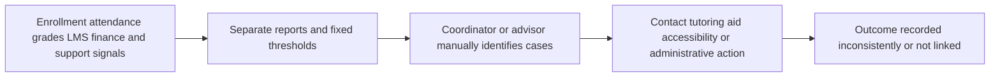
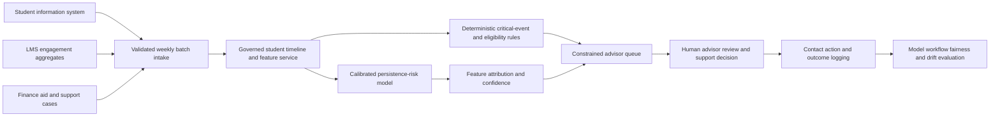

# EDU-001 AI-assisted student-persistence early warning and support triage

## Classification

- **Segment:** Education, training, and workforce development
- **Primary market / jurisdiction:** Brazil
- **Evidence reference date:** 2026-07-19; Brazilian sources published or updated through 2026-06-23.
- **Index summary:** Brazilian higher-education institutions can combine academic progression, attendance, LMS activity, financial and service signals to rank dropout risk, explain contributing factors, and route bounded support actions under advisor control.
- **Company profile / size:** Public and private higher-education institutions with student-information systems, LMS platforms, academic advising, financial-aid or student-support operations.
- **Opportunity type:** operations
- **Status:** hypothesis
- **Confidence:** medium
- **Complexity:** medium
- **Horizon:** medium
- **Risk:** regulated
- **Solution evidence level:** prototype
- **Operational maturity:** unvalidated
- **Azure fit:** high
- **AI dependency:** core
- **Intelligent capability:** Calibrated student-persistence risk prediction, risk-factor ranking, and support-case prioritization
- **Repository alignment:** new-solution

New opportunities normally start as `hypothesis`. This brief proposes a bounded test and does not claim proven Brazilian production impact.

## Problem

Academic coordinators and student-support teams usually discover persistence problems through missed assessments, low grades, prolonged absence, tuition or aid issues, or direct requests for help. Signals are fragmented across enrollment, attendance, LMS, finance, library, tutoring, accessibility, and advising systems.

Manual lists and fixed thresholds identify obvious cases but struggle to combine weak signals, distinguish temporary difficulty from sustained disengagement, and prioritize limited advisor capacity. Late or poorly targeted contact reduces the chance of resolving academic, financial, accessibility, or administrative barriers before withdrawal.

## Brazil applicability and current context

The 2024 Brazilian Higher Education Census, published by Inep in 2025, recorded more than 10.2 million undergraduate enrollments across 2,561 institutions. This scale creates a material student-persistence and support-routing problem even when individual institutions use different definitions of withdrawal, transfer, temporary interruption, or non-renewal.

Current Brazilian research has tested machine-learning approaches for dropout prediction using institutional and learning-platform data, including Brazilian statistics programs, UTFPR and Moodle-based datasets. These studies support prototype plausibility but do not establish that predictions alone improve retention.

For public basic-education networks, the MEC's 2026 VAAR guidance explicitly identifies abandonment and evasion as major remaining challenges and links funding indicators to attendance and permanence. Although the proposed first prototype targets higher education, this confirms that student permanence remains a current Brazilian operating priority.

Local validation must reflect Brazilian academic calendars, public and private financing models, affirmative-action and assistance programs, LGPD constraints, regional access differences, and institution-specific definitions of dropout and successful intervention.

## Evidence

### Confirmed problem evidence

- Inep reported 10,226,873 undergraduate enrollments, 2,561 institutions and 45,772 undergraduate courses in the 2024 Higher Education Census, demonstrating the scale of Brazilian student-progression operations.
- MEC's current VAAR material states that abandonment and evasion remain major challenges to universal educational attendance and permanence.
- Recent Brazilian studies continue to investigate dropout prediction in statistics, computing and broader undergraduate populations, indicating that institutions possess relevant data but still face detection and intervention challenges.

### Favorable solution evidence

- A 2025 Brazilian study proposed machine-learning classification for dropout in undergraduate statistics programs.
- A 2025 Scientific Reports study used Moodle logs to optimize dropout prediction, supporting the use of temporal engagement features.
- A 2024 higher-education study using 11,698 first-year records showed that academic performance and enrollment variables can support early-warning models, while also showing that later-semester signals improve accuracy.
- Brazilian UTFPR research compared multiple machine-learning approaches for institutional dropout prediction, supporting local prototype feasibility.

### Counter-evidence and limitations

- Predictive accuracy does not prove that outreach causes persistence; the intervention workflow must be evaluated separately from the model.
- Strong predictors such as accumulated grades may arrive too late to support genuinely early intervention.
- Demographic, financial or assistance-program variables may encode structural inequality and create discriminatory prioritization if used without fairness tests and policy controls.
- Historical outcomes may reflect inconsistent dropout definitions, incomplete contact attempts, advisor capacity, or policies that changed over time.
- Excessive false alerts can overload advisors and stigmatize students; a simpler threshold-based caseload may perform better when data integration is weak.

### Inference

- The most defensible first value is prioritizing a limited advisor queue and identifying missing support actions, not automatically labeling a student as likely to abandon a course.
- A model is useful only when it improves recall of genuinely actionable cases at an acceptable advisor workload compared with transparent rules.

### Unknowns

- Institution-specific definition and reliable timestamp of dropout, transfer, temporary leave and successful persistence.
- Whether recorded interventions are complete enough to measure causal or incremental benefit.
- Availability, latency and consistency of attendance, LMS, grade, finance, aid and advising data.
- Student acceptance, advisor trust, false-alert cost and effect across protected or vulnerable groups.

### Sources

- [Censo da Educação Superior 2024: Notas Estatísticas](https://www.gov.br/inep/pt-br/centrais-de-conteudo/acervo-linha-editorial/publicacoes-institucionais/estatisticas-e-indicadores-educacionais/censo-escolar-da-educacao-superior-2024-notas-estatisticas) — Brazil; published 2025-10-17; current scale and operating context.
- [Censo da Educação Superior — relatório de gestão 2025](https://www.gov.br/inep/pt-br/relatorio-anual-de-atividades-e-gestao-do-inep-2025/pesquisas-estatisticas-e-indicadores-educacionais/censo-da-educaca-superior) — Brazil; published 2026-03-31; current census totals and execution context.
- [Indicadores do VAAR](https://www.gov.br/mec/pt-br/financiamento-da-educacao-basica/como-funciona-fundeb/condicionalidades-e-indicadores/indicadores-do-vaar) — Brazil; updated 2026-06-23; current permanence and abandonment policy context.
- [Using machine learning techniques for predicting dropout in Brazilian statistics courses](https://pubmed.ncbi.nlm.nih.gov/41417519/) — Brazil; published 2025-12-19; local model plausibility.
- [Investigating Student Dropout Risk in Higher Education through Machine Learning](https://sol.sbc.org.br/index.php/sbie/article/view/31464) — Brazil; published 2024; local institutional comparison and limitations.
- [Student dropout prediction through machine learning optimization](https://doi.org/10.1038/s41598-025-93918-1) — international/Brazilian research participation; published 2025-03-21; Moodle-log model evidence.
- [Development of an early warning system for higher education](https://doi.org/10.1111/hequ.12539) — international; published 2024-05-07; early-warning timing and feature evidence.

## Current process

## Baseline without AI

- **Current baseline:** Fixed rules for absence, failed assessments, unpaid balances, missing enrollment renewal and advisor referrals.
- **Strongest realistic non-AI alternative:** Unified student timeline, explicit risk rules, prioritized case queue, standard reason codes and mandatory intervention/outcome logging.
- **Baseline strengths:** Transparent, inexpensive, easy to audit and effective for known high-severity conditions.
- **Baseline limitations:** Weak at combining multiple moderate signals, adapting to course-specific patterns and ranking large queues under limited advisor capacity.
- **Context where intelligence may add incremental value:** Institutions with linked longitudinal data, sufficient outcome volume and more flagged cases than support teams can review promptly.
- **Condition where the non-AI baseline should be preferred:** Sparse or inconsistent histories, unclear outcomes, low caseload, or rules already meeting intervention coverage and workload targets.

## Proposed solution

Build a read-only student-persistence support layer for one institution, program family or first-year cohort. It assembles a governed weekly student timeline, applies deterministic critical-event rules, predicts near-term persistence risk, ranks contributing factors, and prioritizes a bounded advisor queue.

The system recommends an approved support category such as academic tutoring, financial-aid review, accessibility contact, administrative correction or advisor outreach. It does not autonomously contact students, restrict enrollment, change grades, alter financial aid or make disciplinary decisions. Advisors inspect evidence, choose or reject actions and record outcomes.

## Where AI enters

| Process stage | Component | Primary AI role | Model family | Inputs | Outputs | Training and cadence | Inference/runtime | Controls |
| --- | --- | --- | --- | --- | --- | --- | --- | --- |
| Weekly risk review | Persistence-risk model | Prediction and classification | Calibrated gradient-boosted trees or regularized logistic regression | Prior grades, attendance, LMS engagement, enrollment changes, finance or aid status, prior support events | Risk score, confidence and abstention flag | Train on prior cohorts; validate out-of-time; retrain by academic term only after drift review | Weekly batch scoring inside institutional environment | Feature allowlist, leakage tests, calibration, fairness slices, confidence threshold and no automatic action |
| Advisor queue formation | Actionability ranker | Ranking/recommendation | Learning-to-rank model or constrained scoring model | Risk output, recent changes, prior contact, available services, advisor capacity | Prioritized cases and suggested approved support category | Begin with rules; train only after reliable intervention outcomes exist | Weekly batch with deterministic capacity constraints | Rules override critical cases; service eligibility and queue caps remain deterministic |
| Case explanation | Risk-factor explanation | Explanation, not generation | Tree attribution or coefficient-based explanation | Current features and model output | Ranked contributing signals with source timestamps | No separate training | Generated with each score | Display only observed features; prohibit causal language and sensitive-feature exposure |

- **Primary AI role:** Predict near-term persistence risk and rank actionable support cases.
- **Model family:** Calibrated classical ML, initially logistic regression or gradient-boosted trees; optional learning-to-rank only after reliable intervention labels exist.
- **Training:** Historical cohorts with temporal splits, leakage controls, class-imbalance handling, calibration and evaluation by course, campus and relevant fairness groups; retraining no more frequently than each academic term.
- **Inference/runtime:** Weekly batch inference in the institution's governed data environment; no public or student-facing real-time scoring.
- **Agent:** not used.
- **LLM:** not used.
- **Deterministic layer:** Data validation, critical-event rules, service eligibility, advisor capacity, queue caps, feature allowlist, abstention, audit and action permissions.
- **Human control:** Advisors decide whether to contact the student, select the support action, correct the case and record the outcome.

Rules, APIs, databases, orchestration, dashboards, calculations, queues and approvals are non-AI components. Removing the persistence model reduces the solution to a unified threshold dashboard and materially reduces its ability to combine weak signals and prioritize overloaded queues.

## Intelligent capability

- **Technique / model family:** Calibrated gradient boosting or logistic regression for risk; optional constrained learning-to-rank for advisor prioritization.
- **Why it is necessary:** Fixed rules do not economically encode combinations and temporal changes across academic, engagement and support signals.
- **Inputs:** Enrollment events, course load, attendance, assessment completion, grades available before cutoff, LMS activity aggregates, finance or aid status, advising history and approved service availability.
- **Outputs:** Calibrated persistence-risk score, confidence, contributing factors, abstention, ranked case priority and approved support category.
- **Training / grounding / optimization assumptions:** Historical labels must use a stable outcome window; future or post-withdrawal fields are excluded; models are institution-specific before any cross-institution reuse.
- **Evaluation:** Precision-recall, calibration, lead time, advisor workload, fairness slices and incremental intervention yield versus rules.
- **Fallback and controls:** Rule-only queue, abstention, advisor review, no automatic student action, rollback to current reports and periodic feature/policy audit.

## Data and integration assumptions

- **Data owners and access path:** Registrar, academic departments, LMS administration, finance or student aid, student support and institutional analytics.
- **Expected volume, history, frequency, and coverage:** At least three academic cohorts for one bounded program family; weekly data refresh.
- **Labels, outcomes, feedback, or simulation available:** Enrollment renewal, active status, completion, formal withdrawal, transfer, temporary leave, contact attempt and support outcome.
- **Known quality, imbalance, missingness, and leakage risks:** Different outcome definitions, missing attendance, delayed grades, duplicated LMS events, rare dropout per course, and post-outcome fields.
- **Brazilian or local-context representativeness:** Train and evaluate on the institution's calendars, admission routes, financing, assistance and regional student population.
- **Privacy, retention, consent, surveillance, or sharing constraints:** LGPD purpose limitation, minimization, role-based access, short retention for detailed activity and prohibition on disciplinary reuse.
- **Integration and synchronization assumptions:** Stable student identifiers and timestamp alignment across SIS, LMS and support systems.
- **Drift and change sources:** Curriculum changes, admission policy, aid programs, hybrid-learning patterns, strikes, calendar disruptions and platform changes.
- **Minimum viable data for a prototype:** One first-year cohort family, two to three prior cohorts, stable academic outcomes, weekly attendance or LMS summaries and 300 or more outcome cases where available.

## Prototype validation plan

- **Prototype scope / process slice:** One first-year program family or campus; weekly read-only advisor queue.
- **Users, sites, assets, documents, events, or simulated cases:** Academic advisors and student-support staff; historical replay plus one-term shadow mode.
- **Baseline or comparison:** Unified deterministic rules and current manual prioritization.
- **Required data and integrations:** Batch extracts from SIS, LMS and support-case system; no write-back during prototype.
- **Model-quality metrics:** Precision-recall AUC, recall at fixed advisor capacity, calibration error, lead time, abstention and performance by course/campus/group.
- **Business or workflow metrics:** Actionable cases found, time to first review, advisor minutes per case, contact completion and support-service uptake.
- **Human acceptance, correction, or override metrics:** Queue acceptance, dismissed alerts, reason corrections and advisor-reported usefulness.
- **Safety and compliance boundaries:** No autonomous contact or adverse decision; no protected characteristic used unless legally reviewed for fairness measurement.
- **Failure or redesign criteria:** No material lift over rules at fixed workload, unstable calibration across terms, unacceptable group disparity, excessive false alerts, insufficient lead time or unavailable outcome labels.
- **Evidence required before a pilot or broader implementation:** Repeatable out-of-time performance, shadow-mode advisor acceptance, documented LGPD assessment and evidence that at least one support workflow can respond within the prediction window.

## Macro architecture

## Capabilities and possible technologies

- Application and workflow capabilities: Advisor queue, case evidence timeline, reason correction and support-outcome capture.
- Data capabilities: Governed batch ingestion, feature history, temporal snapshots and outcome taxonomy.
- Integration capabilities: SIS, LMS, finance/aid and case-management connectors.
- Required AI / ML capabilities: Calibrated classification, explainability and optional constrained ranking.
- Training, grounding, recognition, or optimization capabilities: Temporal validation, class-imbalance handling, calibration and fairness evaluation.
- Evaluation and model-operations capabilities: Cohort replay, shadow comparison, drift monitoring and model registry.
- Security and governance capabilities: RBAC, purpose limitation, audit logs, data minimization and retention controls.
- Azure services that may fit: Azure Data Factory or Fabric Data Factory, Azure Data Lake Storage, Azure Machine Learning, Azure SQL or PostgreSQL, Azure Functions or Container Apps, Power BI, Microsoft Purview and Azure Monitor.
- Non-Azure or open-source alternatives worth considering: Airflow, dbt, PostgreSQL, DuckDB, MLflow, XGBoost, LightGBM, scikit-learn, Evidently and Superset.

## Possible gains

- Earlier identification of students with multiple moderate risk signals.
- Better prioritization of scarce advisor and support capacity.
- More consistent documentation of support actions and outcomes.
- Measurable comparison between predictive assistance and transparent rules.
- Reduced dependence on late end-of-term failure signals.

## Metrics for validation

### Business and operational metrics

- Recall of actionable cases at the weekly advisor-capacity limit.
- Median lead time from first alert to withdrawal or academic failure outcome.
- Advisor time per accepted case and queue completion rate.
- Contact completion, support uptake and persistence outcome, reported separately from model accuracy.

### Intelligent-capability metrics

- Precision, recall, PR-AUC and calibration by cohort.
- Recall and precision at fixed queue capacity.
- False-alert and abstention rates.
- Performance and calibration by course, campus, admission route and legally reviewed fairness groups.
- Advisor acceptance, override and correction rates versus deterministic rules.

## Risks, limits, and controls

- Privacy and sensitive data: Minimize behavioral detail; prohibit disciplinary or marketing reuse.
- Brazilian regulatory or policy constraints: LGPD legal basis, transparency, purpose limitation, access control and institutional policy review.
- Human decision boundaries: Advisors retain all contact and support decisions; no adverse academic or financial action is automated.
- Model or policy failure modes: Late prediction, false risk, stale data, leakage, cohort drift and confusing correlation with causation.
- Comparable failures and applicable lessons: High offline accuracy can coexist with poor intervention value; measure workflow outcomes separately.
- Bias, drift, weak labels, or insufficient feedback: Temporal and subgroup evaluation, stable outcome taxonomy and term-level review.
- Integration and data risks: SIS/LMS identity linkage and timestamp consistency may dominate prototype effort.
- Adoption and change-management risks: Limit queue volume, show evidence and allow rapid dismissal/correction.
- Prototype cost or operational assumptions: Begin with batch extracts and classical ML; do not require streaming, LLMs or autonomous agents.

## Fit score

| Dimension | Score | Rationale |
| --- | ---: | --- |
| Problem evidence and relevance | 17/20 | Current Inep and MEC sources establish scale and permanence as a Brazilian priority; local research confirms institutional dropout-prediction demand. |
| Business or operational value | 17/20 | Advisor workload, lead time, actionable-case yield and support uptake are directly measurable. |
| Technical feasibility | 17/20 | Classical models and existing institutional data support a bounded replay and shadow prototype; outcome and intervention labels remain uncertain. |
| Reuse potential | 17/20 | The pattern applies across universities, technical education, online learning and workforce-training programs with local retraining. |
| Strategic differentiation | 15/20 | Calibrated combination of weak temporal signals and capacity-aware ranking can outperform static thresholds, but only where data and intervention capacity are adequate. |
| **Total** | **83/100** | Strong prototype hypothesis with material privacy, fairness and intervention-effectiveness questions. |

## Repository relationship

- Existing references that may be reused: Batch data ingestion, Azure Machine Learning, model evaluation, dashboards, identity and governance patterns.
- Missing capabilities exposed by this opportunity: Temporal student feature contract, capacity-constrained alert evaluation, intervention-outcome logging and education fairness slices.
- Potential building blocks: Cohort replay evaluator, calibrated risk-service template, advisor evidence card and governed outcome taxonomy.
- Potential composed solution: Student-persistence early-warning reference solution integrating SIS/LMS data, classical ML, deterministic rules, advisor workflow and outcome evaluation.
- Reasons to keep it outside the current kit, when applicable: Institution-specific academic policies, SIS adapters and sensitive-feature decisions should remain solution-level configuration.

## Duplicate control

- **Problem keys:** student-persistence, higher-education-dropout, delayed-support, advisor-capacity, fragmented-student-signals
- **Capability keys:** calibrated-risk-prediction, temporal-learning-analytics, actionability-ranking, advisor-queue, fairness-evaluation
- **Research queries used:** Brazil higher-education census 2024 2025 dropout; MEC VAAR permanence abandonment 2026; Brazilian student dropout prediction machine learning 2025; Moodle dropout prediction 2025; early-warning limitations bias false positives.
- **Related opportunities:** HR-001 ranks employee mobility and reskilling paths from skills evidence; EDU-001 predicts student persistence risk and prioritizes educational support cases from academic and engagement signals.
- **Uniqueness statement:** This opportunity targets institution-operated student persistence and support triage; it does not duplicate workforce skills matching, generic copilots or assessment generation.

## Next decision

- prototype candidate.

Implementation approval remains an explicit human decision.