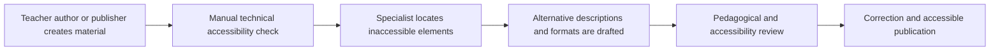
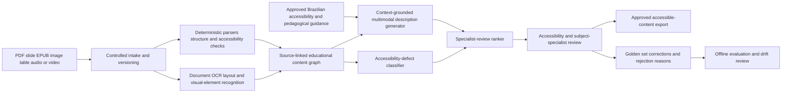

# EDU-002 AI-assisted accessible learning-material assurance

## Classification

- **Segment:** education
- **Primary market / jurisdiction:** Brazil
- **Evidence reference date:** 2026-07-20; Brazilian policy and operating sources updated from 2025-10-21 through 2026-07-02
- **Index summary:** Brazilian education networks can use multimodal extraction and accessibility-quality models to draft and verify descriptions, structure, reading order, and alternative representations of learning materials before specialist approval.
- **Company profile / size:** state and municipal education networks, federal institutes, universities, publishers, accessibility centers, and educational-content teams
- **Opportunity type:** industry-solution
- **Status:** hypothesis
- **Confidence:** medium
- **Complexity:** medium
- **Horizon:** medium
- **Risk:** regulated
- **Solution evidence level:** prototype
- **Operational maturity:** unvalidated
- **Azure fit:** high
- **AI dependency:** core
- **Primary AI role:** multimodal
- **Intelligent capability:** multimodal educational-content extraction, context-aware alternative-description generation, accessibility-defect classification, and specialist-review ranking
- **Repository alignment:** new-solution

## Problem

Education networks and publishers must convert PDFs, slides, worksheets, charts, diagrams, images, tables, and audiovisual material into accessible formats. The work is usually fragmented across authors, teachers, accessibility centers, AEE professionals, designers, transcribers, and external vendors.

Simple format conversion does not make a learning object pedagogically accessible. Reading order may be wrong, tables may lose relationships, mathematical diagrams may be described inaccurately, image descriptions may omit the instructional purpose, and generated audio or simplified text may alter meaning. Specialist teams therefore spend substantial time locating inaccessible elements, drafting alternatives, checking technical structure, and returning material for correction.

The target process is pre-publication assurance: identify accessibility gaps, prepare bounded candidate remediations, attach source evidence, and route uncertain or high-impact elements to qualified reviewers. The system does not decide a student's accommodation plan and does not replace AEE, accessibility, pedagogical, Libras, Braille, or audiodescription specialists.

## Brazil applicability and current context

Brazil instituted the National Policy for Inclusive Special Education through Decree 12,686 of 20 October 2025. Current implementation includes technical-support and material-accessibility centers responsible for accessible materials, assistive technologies, and guidance to education professionals. In June and July 2026, the Ministry of Education launched pedagogical guidance and described the national support network, including one continuing-education center per federation unit and material-accessibility nuclei.

Official services also support distribution of PNLD books in accessible EPUB for blind, low-vision, and dyslexic students. These measures confirm both the legal-operational obligation and the existence of recurring material-production workflows.

The prototype must be locally validated in Portuguese and against Brazilian educational conventions, including Libras-related workflows, Braille and mathematical notation practices, curriculum context, and the roles defined by local education networks. Foreign benchmarks support model feasibility and limitations, not Brazilian legal interpretation.

## Evidence

### Confirmed problem evidence

- The 2025 National Policy for Inclusive Special Education establishes a national inclusive-education framework and provides for production and distribution of educational accessibility resources.
- In May and July 2026, the Ministry of Education described technical-support and material-accessibility nuclei as responsible for producing accessible materials, assistive technologies, and professional guidance.
- The Ministry of Education launched 14 pedagogical volumes in July 2026 to support teachers, managers, AEE professionals, and other education workers implementing inclusive education.
- The federal PNLD service provides accessible EPUB books for students and teachers with blindness, low vision, and dyslexia, confirming an operating path for accessible educational content.

### Favorable solution evidence

- Recent multimodal research shows that models can extract and reason over educational images, handwritten mathematics, icons, and diagrams when supplied with structure and context.
- Research on educational visual generation shows that constrained visual languages and teacher-informed design spaces outperform unconstrained generic image generation for pedagogical fidelity.
- Accessibility research shows that AI-assisted drafting can improve alt-text creation when models receive surrounding metadata, OCR, and interface context.
- Accessible audio-learning systems have been iteratively evaluated with specialist educators and blind or visually impaired learners, supporting the feasibility of bounded, human-reviewed assistive workflows.

### Counter-evidence and limitations

- Generic image descriptions can be fluent but pedagogically wrong, especially for charts, mathematical relationships, diagrams, and images whose instructional purpose depends on surrounding text.
- Text-to-image and vision-language models may omit essential elements, misrepresent quantities or spatial relationships, and perform poorly on noisy handwritten or domain-specific content.
- Automatically generated alt text may be inaccurate or misleading. Technical accessibility checks also cannot determine whether an explanation is pedagogically appropriate for a specific learner.
- These limitations require source-grounded outputs, structured checks, confidence-based abstention, specialist review, and a narrow prototype. The system must never publish generated alternatives automatically.

### Inference

- A large portion of specialist time is likely spent finding recurrent structural defects and drafting first-pass alternatives that can be accelerated without transferring final pedagogical authority to a model.
- Combining deterministic document-accessibility checks with multimodal candidate generation should be more useful and safer than a generic content-generation assistant.

### Unknowns

- Volume and defect mix of materials handled by a target network or publisher.
- Availability of approved Portuguese descriptions, accessible source files, and reviewer corrections for training and evaluation.
- Required support for Braille mathematics, Libras videos, tactile graphics, EPUB, DAISY, tagged PDF, and institution-specific templates.
- Reviewer acceptance, correction effort, and whether the system reduces end-to-end turnaround after integration overhead.
- Performance differences across subject, grade, disability-related access need, and source-document quality.

### Sources

- [O que faz o Decreto 12.686 de 20 de outubro de 2025?](https://www.gov.br/mec/pt-br/acesso-a-informacao/perguntas-frequentes/pneei/o-que-faz-o-decreto) — Brazil; updated 2025-10-21; current policy context.
- [Portaria estrutura Rede Nacional de Educação Especial Inclusiva](https://www.gov.br/mec/pt-br/assuntos/noticias/2026/maio/portaria-estrutura-rede-nacional-de-educacao-especial-inclusiva) — Brazil; 2026-05; operating structure and material-accessibility nuclei.
- [MEC lança cadernos pedagógicos para a educação especial](https://www.gov.br/mec/pt-br/assuntos/noticias/2026/julho/mec-lanca-cadernos-pedagogicos-para-a-educacao-especial) — Brazil; updated 2026-07-02; current implementation support.
- [Solicitar livros do PNLD em formatos acessíveis EPUB](https://www.gov.br/pt-br/servicos/solicitar-livros-do-pnld-em-formatos-acessiveis-%28EPUB%29) — Brazil; modified 2025-12-15; current accessible-content process.
- [Diretrizes para audiodescrição em materiais didáticos de matemática](https://educapes.capes.gov.br/handle/11449/312292?mode=full) — Brazil; 2025; domain-specific accessibility requirements.
- [DrawEduMath](https://aclanthology.org/2025.naacl-long.352/) — international research; 2025; multimodal educational-image benchmark and limitations.
- [Generating Pedagogically Meaningful Visuals for Math Word Problems](https://aclanthology.org/2025.findings-acl.586/) — international research; 2025; constrained generation and failure modes.
- [Early Accessibility: Automating Alt-Text Generation for UI Icons](https://arxiv.org/abs/2504.13069) — international research; 2025; context-aware alt-text generation.
- [Alt4Blind](https://arxiv.org/abs/2405.19111) — international research; 2024; inaccurate or misleading chart descriptions and human authoring support.

## Current process

## Baseline without AI

- **Current baseline:** manual review with checklists, accessibility tools, author corrections, specialist transcription, and format conversion.
- **Strongest realistic non-AI alternative:** deterministic PDF, EPUB, HTML, slide, and media validators combined with templates, mandatory authoring fields, approved description patterns, and specialist workflow.
- **Baseline strengths:** predictable, auditable, standards-aligned, inexpensive for structural checks, and safe for high-impact decisions.
- **Baseline limitations:** cannot reliably interpret pedagogical purpose, summarize complex visuals, relate a diagram to surrounding content, or prioritize the specialist queue by semantic difficulty and likely defect impact.
- **Context where intelligence may add incremental value:** heterogeneous legacy or author-generated materials containing charts, diagrams, images, tables, formulas, and weak document structure.
- **Condition where the non-AI baseline should be preferred:** simple born-accessible documents, stable templates, low volume, or content where deterministic validation and direct specialist authoring are faster and safer.

## Proposed solution

Create a pre-publication accessibility-assurance workspace. It ingests source files, performs deterministic structural validation, extracts text and layout, identifies visual or semantic elements requiring alternatives, and generates bounded candidate descriptions or representations with citations to the source region and surrounding instructional context.

The system classifies each finding by defect type, subject, uncertainty, and expected reviewer effort. It routes complex mathematics, charts, maps, culturally specific imagery, assessment items, Libras-related content, and low-confidence outputs to specialist queues. Reviewers edit, reject, approve, or request author clarification. Only approved outputs are exported into tagged PDF, EPUB, HTML, slide, audio, or production workflows.

## Where AI enters

### AI role map

| Process stage | AI component | AI type / model family | What it does | Runtime mode | Output | Human or deterministic control |
| --- | --- | --- | --- | --- | --- | --- |
| Content understanding | Educational layout and element recognizer | document intelligence, OCR, computer vision, multimodal model | identifies headings, reading regions, tables, charts, equations, diagrams, images, and surrounding instructional context | asynchronous batch | structured content graph with source coordinates and confidence | schema validation, file parser checks, confidence threshold, reviewer inspection |
| Alternative drafting | Context-grounded accessibility-description generator | multimodal foundation model with retrieval and constrained generation | drafts concise and extended descriptions or simplified alternatives using the visual, nearby text, learning objective, and approved guidance | asynchronous human-in-the-loop | source-linked candidate text with uncertainty and unsupported-detail flags | no automatic publication; specialist approval; prohibited-claim and terminology rules |
| Quality assurance | Accessibility-defect and inconsistency classifier | supervised classical ML or fine-tuned multimodal classifier | predicts likely missing, insufficient, contradictory, or structurally misplaced accessibility content | batch | defect class, confidence, and evidence references | deterministic validators remain authoritative for machine-checkable defects; abstention on weak evidence |
| Work routing | Specialist-review ranker | gradient boosting or learning-to-rank | ranks findings by probable impact, complexity, uncertainty, subject, and deadline | batch | prioritized review queue | service-level and safeguarding rules override ranking; coordinators can reorder |

### Required distinctions

- **Primary AI role:** multimodal recognition, extraction, classification, generation, and ranking/recommendation.
- **Model family:** document intelligence and OCR, computer vision or multimodal foundation model, supervised classifier, and learning-to-rank model.
- **Training requirement:** pretrained inference and prompt grounding initially; supervised calibration or fine-tuning only after an approved local golden set exists.
- **Training location and cadence:** offline initial evaluation; periodic retraining by material type or after measured drift, never automatic continuous learning from unreviewed output.
- **Inference location:** private cloud batch pipeline, with optional local preprocessing for sensitive unpublished assessments.
- **Agent:** not used. The workflow is deterministic orchestration around bounded model calls; no component independently pursues goals or executes publication actions.
- **LLM:** used only inside the multimodal, source-grounded candidate-description component. It drafts alternatives and explanations; it does not determine accommodations, compliance, or publication.
- **Non-LLM intelligence:** document recognition, OCR, computer vision, defect classification, and review ranking.
- **Not AI:** file ingestion, parsers, accessibility-standard checks, schemas, rules, APIs, queues, identity, permissions, versioning, export, dashboards, audit logs, approvals, and final pedagogical decisions.

## Intelligent capability details

- **Technique / model family:** multimodal document understanding, constrained source-grounded generation, supervised defect classification, and review ranking.
- **Why it is necessary:** deterministic validators can detect missing tags or fields but cannot reliably interpret instructional meaning, connect visual content with learning objectives, or draft context-specific alternatives at scale.
- **Inputs:** source document, extracted layout, image regions, OCR, formulas, nearby text, learning objective, subject and grade metadata, accessibility guidance, approved examples, and reviewer history.
- **Outputs:** structured elements, candidate descriptions, defect findings, confidence, evidence coordinates, abstention reason, and prioritized review item.
- **Training / grounding / optimization assumptions:** begin with pretrained models and retrieval over approved guidance; create a Portuguese golden set adjudicated by accessibility and subject specialists; consider fine-tuning only after baseline evaluation.
- **Evaluation:** element detection F1, description factuality and coverage, unsupported-detail rate, specialist correction distance, ranking precision at review capacity, abstention quality, and comparison with deterministic-only plus manual workflow.
- **Fallback and controls:** deterministic checks, mandatory source references, uncertainty thresholds, specialist approval, version rollback, original-file preservation, and manual authoring.

## Data and integration assumptions

- **Data owners and access path:** education network, institution, publisher, accessibility center, AEE team, content author, or learning-platform operator through controlled repositories and authoring systems.
- **Expected volume, history, frequency, and coverage:** hundreds to thousands of documents per term; variable source quality; batch processing before publication.
- **Labels, outcomes, feedback, or simulation available:** approved accessible versions, reviewer edits, defect classifications, rejected candidates, synthetic structural defects, and specialist-created benchmark cases.
- **Known quality, imbalance, missingness, and leakage risks:** few examples for complex subjects; inconsistent reviewer style; inaccessible source images; scanned PDFs; missing learning objectives; leakage between near-duplicate textbook editions.
- **Brazilian or local-context representativeness:** Portuguese terminology, Brazilian curricula, Libras workflows, local standards, and subject conventions require local evaluation.
- **Privacy, retention, consent, surveillance, or sharing constraints:** unpublished assessments, student work, names, disability-related information, and licensed content require least privilege, purpose limitation, controlled retention, and no unnecessary learner profiling.
- **Integration and synchronization assumptions:** document repository, LMS or content-management API, accessibility validator, identity provider, review queue, and export pipeline.
- **Drift and change sources:** new templates, curricula, model versions, subject mix, accessibility guidance, source-file formats, and reviewer policy.
- **Minimum viable data for a prototype:** 200 to 500 representative material elements with source files, approved alternatives, defect labels, and specialist adjudication across at least three content families.

## Prototype validation plan

- **Prototype scope / process slice:** pre-publication review of images, charts, tables, and reading order in one bounded collection of Portuguese educational materials.
- **Users, sites, assets, documents, events, or simulated cases:** one accessibility center or publisher team; 50 to 100 documents; at least three subjects; 200 to 500 reviewable elements.
- **Baseline or comparison:** deterministic validators plus existing manual workflow; optionally compare generic model output with context-grounded constrained output.
- **Required data and integrations:** controlled file intake, parser, OCR or document intelligence, reviewer interface, approved guidance repository, and export of reviewed findings.
- **Model-quality metrics:** element detection precision and recall; factual-error and unsupported-detail rate; pedagogical coverage score; specialist acceptance with minor edits; abstention precision; ranking precision at fixed review capacity.
- **Business or workflow metrics:** time from intake to approved accessible version; specialist minutes per element; rework cycles; backlog age; percentage of defects found before publication.
- **Human acceptance, correction, or override metrics:** approval, edit, rejection, override, author-clarification, and reviewer-disagreement rates.
- **Safety and compliance boundaries:** no automatic publication; no accommodation decision; no learner diagnosis or profiling; unpublished assessments remain in controlled environments; original source always visible.
- **Failure or redesign criteria:** frequent factual or mathematical errors; lower defect recall than deterministic baseline; specialist correction time equal to manual drafting; poor performance on Portuguese content; unsafe handling of confidential material; systematic disparities across subjects or accessibility needs.
- **Evidence required before a pilot or broader implementation:** stable golden-set results, acceptable reviewer workload, documented data protection, export fidelity, reliable abstention, and approval from accessibility and pedagogical owners.

## Macro architecture

## Capabilities and possible technologies

- Application and workflow capabilities: controlled intake, review workspace, versioning, evidence display, approval, export, and audit.
- Data capabilities: document-element graph, reviewer labels, golden sets, metrics store, and lineage.
- Integration capabilities: LMS, CMS, document repositories, EPUB or PDF production, identity, and notifications.
- Required AI / ML capabilities: OCR and layout extraction, multimodal recognition, source-grounded generation, classification, and ranking.
- Training, grounding, recognition, or optimization capabilities: retrieval over approved guidance, offline evaluation, optional fine-tuning, calibration, and drift analysis.
- Agent and tool-use capabilities, or `not used`: not used.
- LLM / foundation-model capabilities, or `not used`: multimodal source-grounded candidate description only.
- Evaluation and model-operations capabilities: golden-set runs, prompt and model versioning, quality slices, abstention monitoring, and rollback.
- Security and governance capabilities: private endpoints, encryption, managed identity, RBAC, content isolation, retention rules, audit, and human approval.
- Azure services that may fit: Azure AI Document Intelligence, Azure AI Foundry model endpoints, Azure AI Search, Azure Machine Learning, Azure Functions or Container Apps, Blob Storage, PostgreSQL, Service Bus, Application Insights, Key Vault, and Microsoft Entra ID.
- Non-Azure or open-source alternatives worth considering: Tesseract, PaddleOCR, Docling, Marker, LayoutParser, PyMuPDF, accessibility linters, open multimodal models, PostgreSQL with pgvector, and workflow engines.

## Possible gains

- Find recurrent accessibility defects earlier and more consistently.
- Reduce specialist time spent on locating defects and drafting routine first-pass alternatives.
- Reserve scarce specialists for complex pedagogical, linguistic, mathematical, and learner-specific review.
- Improve traceability between each accessible alternative and its source content.
- Build reusable approved examples and measurable quality controls across content teams.

## Metrics for validation

### Business and operational metrics

- Turnaround and specialist effort versus deterministic-plus-manual baseline.
- Defects found before publication, rework cycles, backlog age, and approved material throughput.
- Reviewer adoption, correction burden, and subject-specific performance.

### Intelligent-capability metrics

- Detection precision and recall by element and subject.
- Factuality, coverage, unsupported-detail rate, and mathematical-relation accuracy.
- Acceptance, edit, rejection, abstention, override, and inter-reviewer agreement.
- Ranking precision and recall at available review capacity.

## Risks, limits, and controls

- Privacy and sensitive data: remove unnecessary learner identifiers; isolate assessments and copyrighted material; enforce retention and access boundaries.
- Brazilian regulatory or policy constraints: local owners must interpret PNEEI, LBI, copyright, educational policy, and institution rules; the model does not certify compliance.
- Human decision boundaries: specialists approve all alternatives and publications; educators define learning objectives and accommodations.
- Model or policy failure modes: hallucinated visual details, lost mathematical relationships, oversimplification, bias toward common subjects, and overconfident output.
- Agent or tool-execution failure modes, when applicable: not applicable; no agent is used.
- LLM hallucination, grounding, or prompt-injection risks, when applicable: source documents may contain adversarial or irrelevant text; isolate instructions, restrict retrieval, cite source regions, and reject unsupported content.
- Comparable failures and applicable lessons: generic alt text and text-to-image systems can be misleading; use constrained outputs, specialist review, and domain slices.
- Bias, drift, weak labels, or insufficient feedback: reviewer preferences and scarce complex examples can distort training; maintain adjudicated sets and disagreement analysis.
- Integration and data risks: scanned files, broken exports, duplicate versions, and inaccessible authoring tools may dominate model performance.
- Adoption and change-management risks: reviewers may distrust fluent but wrong text; expose evidence and uncertainty and measure correction effort.
- Prototype cost or operational assumptions: multimodal inference and specialist adjudication are material costs; batch processing, element triage, and smaller models should be compared.

## Fit score

| Dimension | Score | Rationale |
| --- | ---: | --- |
| Problem evidence and relevance | 19/20 | Current Brazilian policy, operating structures, accessible-content services, and 2026 implementation guidance directly support the process. |
| Business or operational value | 17/20 | Faster and more consistent pre-publication assurance could expand specialist capacity, but local volume and bottlenecks require validation. |
| Technical feasibility | 17/20 | A bounded human-reviewed prototype is feasible with current document and multimodal models, although complex mathematics and pedagogical fidelity remain difficult. |
| Reuse potential | 18/20 | The workflow applies across networks, institutions, publishers, subjects, and several accessible formats. |
| Strategic differentiation | 17/20 | Context-grounded multimodal drafting and semantic defect triage materially exceed deterministic accessibility checking while preserving specialist authority. |
| **Total** | **88/100** | Publishable medium-confidence hypothesis with strong Brazilian relevance and explicit failure controls. |

## Repository relationship

- Existing references that may be reused: document processing, RAG, model evaluation, content safety, workflow integration, and human approval patterns.
- Missing capabilities exposed by this opportunity: source-region-grounded multimodal generation, accessibility-specific golden sets, document accessibility validation, specialist review UX, and accessible-format export.
- Potential building blocks: educational document-element extractor, grounded alternative-description generator, accessibility-defect evaluator, review-ranking model, and specialist approval workflow.
- Potential composed solution: accessible learning-material assurance workspace.
- Reasons to keep it outside the current kit, when applicable: not applicable; it is a strong candidate for a future education reference solution after human approval.

## Duplicate control

- **Problem keys:** accessible-learning-materials, educational-content-remediation, alternative-descriptions, inclusive-education, pre-publication-accessibility
- **Capability keys:** multimodal-document-understanding, grounded-description-generation, accessibility-defect-classification, review-ranking, document-intelligence
- **Research queries used:** `site:gov.br educação acessibilidade digital materiais didáticos 2025 Brasil estudantes deficiência`; `site:gov.br/mec 2025 educação especial inclusiva materiais acessíveis decreto 12.686`; `site:gov.br educação especial censo escolar 2025 matrículas deficiência`; `accessible educational materials AI image description math charts limitations study 2025`; `automatic alt text educational diagrams hallucination accessibility limitations 2024 2025 research`
- **Related opportunities:** EDU-001, PUBLIC-001
- **Uniqueness statement:** EDU-001 predicts persistence risk and routes student support; EDU-002 assures the accessibility quality of educational content before publication using multimodal understanding and specialist-reviewed remediation.

## Next decision

Continue research and consider a bounded prototype only after an accessibility or education-content owner confirms material volume, target formats, specialist review capacity, and an obtainable Portuguese golden set.
