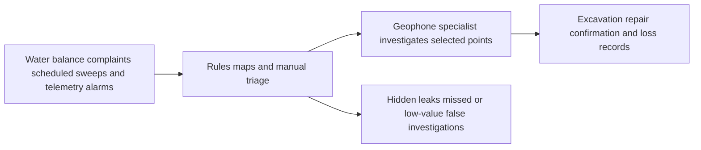
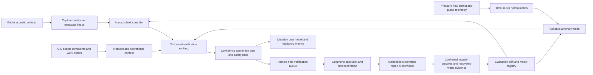

# ENERGY-001 AI-assisted water-leak detection and field verification

## Classification

- **Segment:** energy-utilities
- **Primary market / jurisdiction:** Brazil
- **Evidence reference date:** watcher execution on 2026-07-19; principal Brazilian production evidence published on 2025-11-26 and 2025-10-08; ANA regulatory rule published on 2025-12-19 and effective on publication.
- **Index summary:** Brazilian water utilities can use acoustic and hydraulic anomaly models to rank suspected hidden leaks, direct field verification, and measure recovered water while retaining geophone confirmation and cost-benefit controls.
- **Company profile / size:** municipal, state, private, or regional water-service providers operating distribution networks with recurring loss-control teams, maintenance records, district metering, acoustic inspection, pressure or flow telemetry, or a staged path to those capabilities
- **Opportunity type:** operations
- **Status:** researched
- **Confidence:** high
- **Complexity:** medium
- **Horizon:** short
- **Risk:** medium
- **Solution evidence level:** production
- **Operational maturity:** proven
- **Azure fit:** medium
- **AI dependency:** core
- **Intelligent capability:** acoustic leak classification and hydraulic anomaly ranking with human-confirmed localization
- **Repository alignment:** new-solution

## Problem

Water-distribution operators must find real and apparent losses across large buried networks while field teams, geophone specialists, repair crews, and capital budgets remain limited. Hidden leaks may persist without surface evidence, while normal consumption, traffic, pumps, valves, pressure changes, pipe material, and urban noise create signals that are difficult to interpret consistently.

The current process combines water balance, district metering, customer complaints, minimum-night-flow analysis, scheduled network sweeps, listening rods, correlators, geophones, pressure and flow alarms, and technician judgment. Broad sweeps consume scarce specialist time. Static thresholds and unfiltered logger alarms may create many false investigations. Reactive discovery can delay repair until a leak becomes visible, interrupts service, damages infrastructure, or wastes treated water and pumping energy.

The affected actors are loss-control managers, control-room analysts, field inspectors, geophone specialists, maintenance planners, and repair crews. The operational decision is which district, pipe section, meter, valve, acoustic point, or hydraulic anomaly should be verified first and whether the evidence justifies excavation or repair.

## Brazil applicability and current context

Brazilian regulation now directly requires structured management of distribution losses. ANA Resolution 275, published on 2025-12-19, approved Reference Standard 15/2025. The standard requires standardized water-balance diagnosis, annual indicators, and municipal loss-reduction plans. It explicitly covers real losses from leaks, breaks, and overflows; apparent losses; macrometering; continuity; pressure; monitoring; and cost-benefit analysis by the service provider.

Brazil also has current production evidence. Sanepar reported on 2025-11-26 that an AI-assisted acoustic workflow in Cascavel inspected nearly 70,000 points over 900 kilometers in one year and identified 1,100 leaks, including 600 hidden leaks. The company reported that the workflow reduced detection time by half. The intelligent component did not replace specialist verification; it prequalified suspicious points for field confirmation.

A separate 2025 deployment reported by Sanasa used pressure and flow sensors with anomaly analytics. The published first-year result attributed 370,442 cubic meters of avoided treated-water loss and approximately R$1.5 million in savings to the monitored workflow. This supports production feasibility for telemetry-based anomaly detection, although the public report does not isolate the model contribution from sensors, process changes, and maintenance action.

Applicability still varies by pipe material, network age, district-metering coverage, acoustic propagation, telemetry quality, urban noise, pressure regime, repair capacity, and water-production cost. Smaller providers may obtain better economics from mobile acoustic collection than from dense permanent sensing.

## Evidence

### Confirmed problem evidence

- ANA Resolution 275 and Reference Standard 15/2025 require Brazilian service providers and regulators to diagnose, plan, monitor, and progressively reduce real and apparent distribution losses, with standardized indicators and cost-benefit assessment.
- The rule defines real losses as treated water lost through leaks, overflows, or breaks and requires annual water-balance diagnosis, loss indicators, macrometering indicators, continuity, and pressure considerations.
- Sanepar's production operation demonstrates that hidden leaks occur at material scale and require systematic field discovery rather than customer complaints alone.

### Favorable solution evidence

- Sanepar reported on 2025-11-26 that its AI-assisted acoustic workflow in Cascavel inspected almost 70,000 points across 900 kilometers in one year, found 1,100 leaks including 600 hidden leaks, and reduced detection time by half.
- Sanasa's first-year sensor-and-analytics deployment was reported on 2025-10-08 as avoiding 370,442 cubic meters of treated-water loss and approximately R$1.5 million in cost.
- Sanepar announced on 2025-04-24 a R$5.7 million, two-year scale-up of intelligent hydrophone monitoring, showing progression beyond a demonstration into an operational expansion program.
- A 2026 IEEE case study using real maintenance logs showed that adaptive anomaly detection identified 16 confirmed leaks with 100% precision and 80% recall, while standard DBSCAN produced severe overestimation. This is foreign technical evidence, not Brazilian economic proof.

### Counter-evidence and failed comparables

- A 2025 comparative economic study found conventional acoustic inspection more cost-effective than AI-assisted satellite detection in the studied Atlanta context, generating 50% higher net benefits over three years. Intelligent detection is therefore not automatically the best option; economics depend on network scale, sensing method, production cost, and field process.
- A utility case reported that 72% of alarms from an existing acoustic-logger estate were false positives before a second-stage AI classifier. This demonstrates that sensor deployment alone can create a substantial analyst burden and that false-positive handling must be evaluated explicitly.
- The Rio+ case showed one large leak generating suspicious signals at three nearby points. Acoustic propagation can create correlated alerts rather than exact excavation coordinates, requiring geophone localization and human interpretation.
- The supplier states that the intelligent workflow does not replace the geophone specialist and that very early leaks without an acoustically detectable signature remain outside the detection boundary.
- No public Brazilian source reviewed in this round disclosed complete precision, recall, false-positive rate, total deployment cost, cost per confirmed leak, or a controlled comparison against a strengthened conventional acoustic baseline.

The mitigation is a narrow decision-support design: AI ranks and filters points, technicians confirm location, and excavation requires deterministic evidence and human approval. The pilot compares against current acoustic and hydraulic methods rather than assuming replacement.

### Inference

- Combining acoustic classification with pressure, flow, district, asset, complaint, and maintenance context should improve prioritization beyond either acoustic or hydraulic evidence alone.
- Mobile collection may be the economically preferable starting architecture for providers without dense telemetry or permanent acoustic sensors.
- Repair outcomes, geophone confirmations, excavations, and false investigations can provide operational labels for calibration and drift monitoring.

### Unknowns

- Local precision, recall, abstention, and false-alert burden by pipe material, diameter, pressure, soil, traffic, and collection device.
- Incremental benefit versus a strengthened conventional geophone route, minimum-night-flow rules, and district-metering program.
- Complete cost per kilometer scanned, confirmed leak, recovered cubic meter, sensor-year, and maintained integration.
- Whether repair capacity can absorb a larger confirmed-leak queue without increasing backlog age.
- Generalization across providers with different network maps, maintenance records, telemetry, and acoustic conditions.

### Sources

- [RESOLUÇÃO ANA Nº 275, DE 18 DE DEZEMBRO DE 2025](https://www.gov.br/ana/pt-br/legislacao/resolucoes/resolucoes-regulatorias/2025/275/) — Brazil; published in the DOU on 2025-12-19; effective on publication; current national reference standard for diagnosis, plans, monitoring, indicators, and cost-benefit control of water-distribution losses.
- [Sanepar usa IA em Cascavel e reduz tempo de detecção de vazamentos pela metade](https://www.sanepar.com.br/noticias/sanepar-usa-ia-em-cascavel-e-reduz-tempo-de-deteccao-de-vazamentos-pela-metade) — Brazil; published 2025-11-26; one-year production period; measured operational scale and identified leaks.
- [Sanasa já economizou R$ 1,5 milhão com sistema de detecção de vazamentos](https://correio.rac.com.br/campinasermc/sanasa-ja-economizou-r-1-5-milh-o-com-sistema-de-detecc-o-de-vazamentos-1.1718759) — Brazil; published and updated 2025-10-08; first-year production result; favorable but does not isolate model causality.
- [Sanepar escala solução inovadora para monitorar ruídos e detectar vazamentos em redes de água](https://www.sanepar.com.br/noticias/sanepar-escala-solucao-inovadora-para-monitorar-ruidos-e-detectar-vazamentos-em-redes-de-ag) — Brazil; published 2025-04-24; operational scale-up and stated investment.
- [Rio+ detecta vazamentos com o 4Fluid](https://stattus4.com/case/rio-detecta-vazamentos-com-o-4fluid/) — Brazil; published 2025-07-10; supplier case showing human geophone confirmation and multi-point acoustic signaling; favorable evidence with marketing-source limitations.
- [DBSCAN-Leak, Novel Real-Time Water Leak Detection](https://doi.org/10.1109/ACCESS.2026.3664702) — France; published 2026-02-13; real maintenance-log evaluation showing adaptive detection performance and severe false alerts from a simpler comparator.
- [Evaluating Acoustic vs. AI-Based Satellite Leak Detection](https://doi.org/10.3390/smartcities8040122) — United States; published 2025-07-22; contrary economic evidence showing conventional acoustic inspection can outperform an intelligent satellite approach.
- [United Utilities: FIDO halves leak run time](https://fido.tech/case-studies/fido-halves-leak-run-time-for-united-utilities/) — United Kingdom; production supplier case; counter-evidence that 72% of raw logger alarms were false positives before AI filtering.

## Current process

## Baseline without AI

- **Current baseline:** complaints, visible-leak response, water balance, district and minimum-night-flow analysis, scheduled sweeps, listening rods, correlators, geophones, static thresholds, maps, and technician judgment.
- **Stronger non-AI alternative:** improve macrometering and district segmentation; calibrate deterministic pressure and flow thresholds; optimize routes by asset age, failure history, and hydraulic zones; digitize inspections; and require geophone confirmation before excavation.
- **Baseline cost or effort drivers:** specialist hours, kilometers swept, repeat visits, excavation, sensors, logger maintenance, network-map correction, and repair backlog.
- **Baseline quality and limitations:** proven and interpretable but limited by broad inspection coverage, static thresholds, environmental noise, sparse telemetry, and specialist capacity.
- **Why intelligence should materially outperform it:** models can learn acoustic and temporal patterns, combine heterogeneous evidence, filter large alarm volumes, rank limited field capacity, and adapt thresholds by location and operating context.
- **Condition under which the non-AI baseline should be preferred:** small networks, low production cost, low hidden-leak prevalence, inadequate labels, poor asset maps, insufficient repair capacity, or a pilot showing no lower cost per confirmed leak or recovered cubic meter.

## Proposed solution

Create a loss-control decision-support platform that receives mobile or fixed acoustic captures, pressure and flow telemetry, district-metering data, network topology, pipe attributes, customer complaints, prior failures, work orders, and confirmed repair outcomes.

An acoustic classifier estimates leak likelihood and rejects captures with insufficient signal quality. A hydraulic anomaly model identifies deviations from local temporal patterns. A ranking model combines confidence, estimated loss band, asset criticality, service risk, location uncertainty, and crew availability to prioritize field verification.

The system creates explainable tasks for repeat capture, geophone localization, valve or meter inspection, pressure verification, or repair assessment. A technician confirms the suspected location and records the outcome. Excavation, service interruption, valve operation, and repair authorization remain deterministic and human-controlled.

The architecture explicitly avoids assuming that AI gives an exact excavation coordinate. It treats correlated nearby alarms, background noise, early inaudible leaks, sparse sensors, and topology errors as abstention or verification conditions.

## Intelligent capability

- **Technique / model family:** acoustic feature extraction and supervised classification; temporal anomaly detection for pressure and flow; calibrated ranking or learning-to-rank for field tasks; optional hydraulic-model residual features.
- **Why it is necessary:** static thresholds and universal acoustic rules cannot reliably distinguish leaks from variable consumption, traffic, pumps, valves, pipe materials, and environmental noise across large networks. Removing the models leaves broad manual sweeps and alarm queues without adaptive signal discrimination or capacity-aware prioritization.
- **Inputs:** acoustic recordings and quality metadata; pressure, flow, tank and pump telemetry; district and network topology; pipe material, diameter and age; complaints; weather and operating events; inspection, geophone, excavation and repair outcomes.
- **Outputs:** leak probability; signal-quality and abstention status; suspected zone or point cluster; estimated severity band; contributing evidence; ranked verification task; recommended next measurement.
- **Training / grounding / optimization:** start with historical and prospectively labeled captures linked to geophone and repair outcomes; split evaluation by geography and time; calibrate by pipe and environment segments; train hydraulic anomalies on normal and confirmed-event periods; use active learning only after governance review.
- **Evaluation:** precision, recall, calibration, false alerts per kilometer, false negatives found by baseline sweeps, localization distance, precision at available crew capacity, time to confirmation, cost per confirmed leak, and recovered-water value versus the non-AI baseline.
- **Fallback and controls:** poor-signal rejection; explicit unknown class; minimum deterministic evidence; geophone confirmation; no autonomous excavation or valve operation; manual route; rollback to rules; model and threshold versioning; immutable outcome log.

## Data readiness

- **Data owners and access path:** loss-control, operations-control, GIS, maintenance, metering, customer-service, and field-work systems.
- **Volume, history, frequency, and coverage:** acoustic pilots can start with mobile samples; hydraulic models require sufficient time-series coverage and synchronized telemetry in selected districts.
- **Labels or outcome feedback available:** geophone confirmation, excavation result, repair type, measured flow recovery, repeat capture, and dismissed alert.
- **Known quality, missingness, imbalance, and leakage risks:** confirmed leaks are rare relative to normal points; negative outcomes may be under-recorded; post-repair data can leak into features; timestamps and coordinates may be inconsistent.
- **Brazilian or local-context representativeness:** training and evaluation must cover local pipe materials, urban noise, soil, pressure regimes, climates, operators, and collection devices.
- **Privacy, retention, consent, surveillance, or data-sharing constraints:** acoustic capture should be constrained to infrastructure contact measurements; field-worker identity, routes, and performance data require purpose limitation and access control.
- **Integration and synchronization risks:** GIS topology, asset IDs, sensor clocks, work orders, repairs, and district boundaries commonly diverge.
- **Drift and change sources:** seasonal demand, pump schedules, pressure changes, new pipes, repairs, device changes, traffic, and operator collection technique.
- **Minimum viable dataset for a pilot:** one or two districts with trustworthy maps, several months of pressure or flow data where used, a planned acoustic sweep, and confirmed field outcomes for all flagged and sampled unflagged points.

## Pilot, economics, and kill criteria

- **Pilot population / process slice:** one provider, one operational region, and two comparable districts or route groups with meaningful hidden-leak history.
- **Duration or event volume:** enough to complete at least one planned sweep cycle and obtain a pre-agreed minimum number of confirmed leak and non-leak outcomes.
- **Baseline or control group:** strengthened conventional acoustic route and hydraulic rules with the same repair capacity; alternate districts or randomized route windows where operationally feasible.
- **Required integrations and human effort:** field-capture app, work-order linkage, GIS identifiers, outcome labels, geophone confirmation, and weekly loss-team review.
- **Principal cost drivers:** mobile or fixed acoustic hardware, pressure and flow sensors, connectivity, device maintenance, route collection, cloud processing, storage, integration, model operations, specialist verification, excavation, and repairs.
- **Business success criteria:** lower median time and field effort per confirmed hidden leak; lower cost per confirmed leak; measurable recovered-water value; no worsening of repair backlog or service disruption.
- **Model-quality success criteria:** pre-agreed precision and recall by district; calibrated probabilities; acceptable false alerts per kilometer; useful precision at available daily field capacity.
- **Adoption and workflow success criteria:** consistent capture quality, outcome completion, technician acceptance, and no persistent parallel spreadsheet process.
- **Safety or compliance stop conditions:** recommendations leading to unsafe valve operations, repeated unjustified excavation, uncontrolled worker surveillance, or loss of authoritative work-order records.
- **Kill criteria:** stop or redesign when the strengthened non-AI baseline has equal or lower cost per confirmed leak, precision remains below the agreed threshold after calibration, false investigations consume more specialist capacity than saved, data linkage cannot produce reliable labels, or recovered-water value does not cover incremental operating cost.
- **Scale decision:** expand only after segmented performance, full cost measurement, repeatable field adoption, and a confirmed repair-capacity plan.

## Macro architecture

## Capabilities and possible technologies

- Application and workflow capabilities: field capture, map-based sweep planning, ranked tasks, repeat measurement, geophone confirmation, work orders, repair outcomes, and regulatory reporting.
- Data capabilities: time-series ingestion, acoustic storage, network topology, asset master, label store, feature pipelines, water-balance linkage, cost and recovered-water records.
- Integration capabilities: SCADA, telemetry, GIS, CMMS, customer complaints, meter systems, mobile devices, and identity.
- Required AI / ML capabilities: acoustic classification, signal-quality rejection, temporal anomaly detection, calibrated ranking, uncertainty, and drift monitoring.
- Training, fine-tuning, grounding, recognition, or optimization capabilities: labeled audio curation, time and district holdouts, imbalance handling, active learning, and champion-challenger comparison.
- Evaluation and model-operations capabilities: offline tests, shadow mode, controlled field pilot, segmented production metrics, rollback, and cost telemetry.
- Security and governance capabilities: least privilege, infrastructure-data classification, device identity, encryption, audit, retention, worker-data limits, and safe operational boundaries.
- Azure services that may fit: Azure IoT Hub or Event Hubs, Azure Functions, Azure Machine Learning, Blob Storage or Data Lake Storage, Azure Data Explorer, Azure SQL or PostgreSQL, Azure Maps, Azure Monitor, Microsoft Entra ID, and Key Vault.
- Non-Azure or open-source alternatives worth considering: MQTT, Kafka, TimescaleDB, InfluxDB, PostgreSQL/PostGIS, MLflow, PyTorch, TensorFlow, scikit-learn, ONNX Runtime, Grafana, and vendor acoustic platforms.

## Possible gains

- Faster discovery of hidden leaks before visible damage or customer complaints.
- More confirmed leaks per specialist hour and kilometer inspected.
- Lower treated-water, pumping-energy, and emergency-response loss.
- Better prioritization of districts, routes, and repair tasks.
- Traceable evidence for ANA-aligned loss plans and cost-benefit decisions.
- Reusable anomaly and field-verification patterns for gas, district energy, and other buried utility networks, subject to domain-specific validation.

## Metrics for validation

### Business and operational metrics

- Median time from first signal to confirmed location and repair.
- Kilometers and points inspected per confirmed hidden leak.
- Specialist hours, total field cost, excavation cost, and cost per confirmed leak.
- Estimated and measured recovered cubic meters, production cost avoided, repair backlog age, and repeat failures.
- Comparison with the strengthened conventional baseline and regulatory loss indicators.

### Intelligent-capability metrics

- Precision, recall, F1, calibration, abstention, and false alerts per kilometer.
- Localization-distance distribution and multi-point cluster rate.
- Precision at daily verification capacity and ranking gain versus rules.
- Performance by district, pipe material, diameter, pressure, environment, season, and device.
- Human acceptance, correction, dismissal, repeat-capture, and override rates.

## Risks, limits, and controls

- Privacy and sensitive data: infrastructure telemetry and field-worker routes require controlled access; avoid ambient audio capture unrelated to pipe-contact sensing.
- Brazilian regulatory or policy constraints: align reporting, diagnosis, planning, continuity, pressure, and cost-benefit decisions with ANA Reference Standard 15/2025 and applicable local regulator rules.
- Human decision boundaries: specialists confirm localization; authorized operators approve valve operations, excavation, service interruption, and repair.
- Model, recognition, or policy failure modes: environmental noise, weak acoustic signatures, multiple correlated points, topology errors, telemetry outages, changing pressure, and device drift.
- Comparable deployment failures and applicability: conventional acoustic methods may be cheaper than some AI modalities; evaluate mobile acoustic, fixed sensing, and hydraulic analytics separately.
- Bias, drift, weak labels, or insufficient feedback: under-recorded dismissed alerts and repairs can create misleading accuracy; sample negative points and audit labels.
- Integration and data availability risks: inconsistent GIS, asset, work-order, and sensor identifiers can invalidate model evaluation.
- Adoption and change-management risks: field teams may bypass capture or outcomes when workflows add friction; co-design with geophone specialists and preserve their authority.
- Cost, latency, infrastructure, and operational-support risks: hardware and sensor maintenance may dominate model cost; repair capacity can become the limiting system constraint.

## Fit score

| Dimension | Score | Rationale |
| --- | ---: | --- |
| Problem evidence and relevance | 19/20 | Current Brazilian national regulation and multiple recent production operations establish a recurring and measurable problem. |
| Business or operational value | 18/20 | Recovered water, field productivity, energy, service, and cost metrics are directly measurable against baseline. |
| Technical feasibility | 17/20 | Brazilian production evidence exists, but public precision, full cost, controlled baseline, and generalization data remain incomplete. |
| Reuse potential | 17/20 | Reusable across water providers and related utility anomaly workflows, with local calibration and hardware variation. |
| Strategic differentiation | 16/20 | Adaptive signal classification and ranking materially improve broad sweeps and raw alarms, but conventional methods remain competitive in some contexts. |
| **Raw total** | **87/100** | Strong production-backed opportunity with explicit economic and false-positive counter-evidence. |
| **Applied cap** | **none** | Comparable Brazilian production evidence exists and the central failure modes are mitigated through human verification and baseline comparison. |
| **Final total** | **87/100** | Publishable as researched, not approved. |

## Repository relationship

- Existing references that may be reused: event ingestion, IoT, model operations, observability, identity, workflow, and human-review patterns.
- Missing capabilities exposed by this opportunity: acoustic-data pipeline, utility-network topology, field capture, leak labels, cost-per-outcome evaluation, and repair-verification workflow.
- Potential building blocks: acoustic classifier service, time-series anomaly pipeline, calibrated task ranking, GIS work queue, and pilot evaluation harness.
- Potential composed solution: water-distribution loss-control reference solution.
- Reasons to keep it outside the current kit, when applicable: specialized acoustic hardware and utility-domain integration may remain partner or provider specific.

## Duplicate control

- **Problem keys:** water-distribution-loss; hidden-leak-detection; field-inspection-prioritization; non-revenue-water; loss-control
- **Capability keys:** acoustic-classification; hydraulic-anomaly-detection; calibrated-ranking; uncertainty-abstention; human-confirmed-localization
- **Research queries used:** Brasil 2025 perdas de água distribuição SINISA; inteligência artificial detecção vazamentos produção resultados; Sanepar IA Cascavel vazamentos; Sanasa IA sensores economia água; detecção acústica vazamentos falsos positivos; water leak detection AI false positives operational cost; conventional acoustic versus AI satellite leak detection.
- **Related opportunities:** none in the current index.
- **Uniqueness statement:** This opportunity focuses on production-backed Brazilian water-loss operations, acoustic and hydraulic evidence, specialist confirmation, and measured pilot economics rather than generic predictive maintenance or broad utility analytics.

## Next decision

Continue research and shortlist for human review after validating public or partner-accessible precision, false-positive, total-cost, and recovered-water evidence across more than one Brazilian provider.