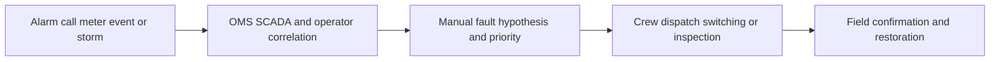
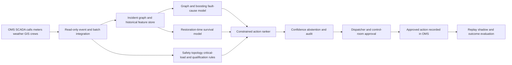

# ENERGY-002 AI-assisted outage restoration and crew prioritization

## Classification
- **Segment:** energy-utilities
- **Primary market / jurisdiction:** Brazil
- **Evidence reference date:** 2026-07-20; ANEEL continuity ranking published 2026-04-15; open continuity dataset updated 2026-07-17; contingency guidance published 2025-12-16.
- **Index summary:** Brazilian electricity distributors can combine outage, topology, weather, vegetation, crew, and customer-impact signals to rank restoration actions while dispatch and switching remain under operator control.
- **Company profile / size:** electricity distribution utilities and contracted field-service operators
- **Opportunity type:** operations
- **Status:** hypothesis
- **Confidence:** medium
- **Complexity:** large
- **Horizon:** medium
- **Risk:** regulated
- **Solution evidence level:** prototype
- **Operational maturity:** unvalidated
- **Azure fit:** high
- **AI dependency:** core
- **Primary AI role:** ranking-recommendation
- **Intelligent capability:** topology-aware outage-cause prediction, restoration-time forecasting, and constrained crew/action ranking
- **Repository alignment:** new-solution

## Problem
During storms and multi-event outages, distribution control centers correlate SCADA/OMS alarms, calls, smart-meter signals, weather, network topology, damage reports, and crew availability. Operators must infer likely fault location and cause, estimate restoration time, and decide which inspection, isolation, switching, or repair action should occur first. The work is time-critical, data-heavy, and often affected by incomplete or delayed field evidence.

## Brazil applicability and current context
ANEEL publishes continuity indicators and compensation data at monthly and distribution-set granularity. Its 2025 continuity ranking, published in April 2026, confirms continuity as an active performance obligation. In December 2025 ANEEL ordered strengthened contingency plans in São Paulo and Rio de Janeiro during severe-weather alerts, explicitly requiring additional trained crews and coordination with public authorities. Brazilian deployment assumptions must account for local feeder topology, vegetation, storm patterns, concession rules, workforce contracts, and heterogeneous OMS/SCADA maturity.

## Evidence
### Confirmed problem evidence
- ANEEL's continuity dataset tracks DEC, FEC, limits, and compensation for breaches, with national monthly coverage and a July 2026 update.
- ANEEL's 2025 continuity ranking evaluates distributors using achieved versus allowed DEC/FEC.
- ANEEL required reinforced contingency staffing and coordination during severe-weather alerts in December 2025.

### Favorable solution evidence
- Recent research shows outage-risk models can combine weather and vegetation signals to identify higher-risk distribution conditions.
- Utility practice outside Brazil indicates topology, outage history, environmental risk, and equipment context can support risk maps and restoration planning.

### Counter-evidence and limitations
- Outage labels may be delayed, inconsistent, or changed after field inspection.
- Rare severe events create distribution shift; models trained on normal operations may fail during the events where help is most needed.
- A ranking can amplify bad topology, stale crew status, or missing critical-customer data.
- Therefore the prototype runs in replay and shadow mode first, abstains under low confidence, and never performs autonomous switching or dispatch.

### Inference
- A bounded decision-support layer may reduce operator search effort and improve consistency when several simultaneous incidents compete for limited crews.

### Unknowns
- Incremental value over current OMS rules and operator expertise; data synchronization quality; false-priority burden; union and contractor workflow fit; performance during unprecedented storms.

### Sources
- [Indicadores Coletivos de Continuidade DEC e FEC](https://dadosabertos.aneel.gov.br/dataset/indicadores-coletivos-de-continuidade-dec-e-fec) — Brazil; updated 2026-07-17; problem evidence and prototype data path.
- [Ranking de continuidade 2025](https://www.gov.br/aneel/pt-br/centrais-de-conteudos/relatorios-e-indicadores/distribuicao/ranking-de-continuidade/2025) — Brazil; 2026-04-15; regulatory performance context.
- [ANEEL determina reforço nos planos de contingência](https://www.gov.br/aneel/pt-br/assuntos/noticias/2025/aneel-determina-reforco-nos-planos-de-contingencia-em-sp-e-rj-diante-de-alerta-de-eventos-climaticos-severos) — Brazil; 2025-12-16; operational context.
- [Risk Assessment of Distribution Networks Considering Climate Change and Vegetation Management Impacts](https://arxiv.org/abs/2503.09239) — international; 2025-03-12; technical plausibility and limitations.

## Current process

## Baseline without AI
- **Current baseline:** OMS/SCADA rules, outage clustering, priority classes, critical-customer lists, operator judgment, and radio/phone coordination.
- **Strongest realistic non-AI alternative:** deterministic topology tracing, rule-based incident grouping, critical-load priority, travel-time calculation, and optimization with fixed constraints.
- **Baseline strengths:** auditable, familiar, predictable, and safe when data are complete.
- **Baseline limitations:** weak under ambiguous multi-signal incidents, uncertain cause, changing weather, and simultaneous competing events.
- **Context where intelligence may add incremental value:** ranking ambiguous fault hypotheses and restoration sequences during multi-event conditions.
- **Condition where the non-AI baseline should be preferred:** missing topology, stale telemetry, novel operating mode, low confidence, or safety-critical switching.

## Proposed solution
Create a decision-support service that ingests incident, topology, weather, vegetation, asset, crew, travel, and customer-impact data. Deterministic rules first enforce safety, critical-load, access, qualification, and switching constraints. Models then predict likely cause and restoration duration and rank bounded candidate actions. Operators see evidence, confidence, alternatives, and reasons; they approve, reject, or reorder every action.

## Where AI enters
### AI role map
| Process stage | AI component | AI type / model family | What it does | Runtime mode | Output | Human or deterministic control |
| --- | --- | --- | --- | --- | --- | --- |
| Incident interpretation | Fault-cause and location model | graph ML plus gradient boosting | estimates likely failed segment and cause from topology, alarms, calls, weather, and history | asynchronous online | calibrated cause/location candidates | topology validation, confidence threshold, operator confirmation |
| Restoration planning | Restoration-time model | survival model or gradient boosting | forecasts time-to-restore for candidate actions | online | duration distribution | deterministic feasibility and crew constraints |
| Action prioritization | Constrained restoration ranker | learning-to-rank plus optimization solver | ranks inspection, isolation, dispatch, and repair candidates | human-in-the-loop | ordered action proposals | safety rules, critical-load priorities, dispatcher approval |

### Required distinctions
- **Primary AI role:** prediction and ranking/recommendation.
- **Model family:** graph ML, classical gradient boosting or survival analysis, learning-to-rank, and a deterministic optimization solver.
- **Training requirement:** supervised training on historical incidents and adjudicated final causes; simulation for rare severe-event scenarios.
- **Training location and cadence:** offline initial training per distributor; quarterly or drift-triggered retraining.
- **Inference location:** private cloud real-time service with cached fallback.
- **Agent role:** Agent: not used.
- **LLM role:** LLM: not used.
- **Non-LLM intelligence:** graph-based cause inference, duration prediction, and constrained ranking.
- **Not AI:** SCADA/OMS, topology checks, safety rules, switching authority, APIs, queues, dashboards, optimization constraints, and approvals.

## Intelligent capability details
- **Technique / model family:** graph features, calibrated gradient boosting or survival analysis, and constrained learning-to-rank.
- **Why it is necessary:** the value depends on combining ambiguous, interacting signals and learning recurring fault/restoration patterns that fixed rules do not encode well.
- **Inputs:** alarms, calls, meter events, topology, weather, vegetation, asset history, crew state, travel time, critical loads, and historical outcomes.
- **Outputs:** likely cause/location, restoration-time distribution, action ranking, evidence features, confidence, and abstention.
- **Training assumptions:** historical incident IDs can be reconciled with final cause, affected assets, actions, crews, and restoration timestamps.
- **Evaluation:** top-k fault localization, calibration, MAE/quantile loss for restoration time, NDCG for action ranking, and comparison with existing OMS priority.
- **Fallback and controls:** rule-only priority, operator review, low-confidence abstention, shadow mode, and rollback.

## Data and integration assumptions
- **Data owners and access path:** distribution operations, asset management, GIS, OMS, SCADA, workforce management, customer service, and meteorological providers.
- **Expected volume, history, frequency, and coverage:** at least 12-24 months of incidents; streaming alarms and periodic GIS/asset updates.
- **Labels, outcomes, feedback, or simulation available:** final cause, restored segment, timestamps, actions, crew outcome, and operator overrides; simulation for rare events.
- **Known quality risks:** duplicated incidents, clock drift, changing feeder topology, missing causes, inconsistent closure codes, and severe class imbalance.
- **Brazilian representativeness:** train and validate by concession area, climate, network type, and urban/rural context.
- **Privacy and sharing constraints:** minimize customer-level data; protect critical infrastructure and crew location data.
- **Integration assumptions:** read-only shadow integration with OMS/SCADA first.
- **Drift sources:** network upgrades, vegetation cycles, climate extremes, new sensors, process changes, and contractor turnover.
- **Minimum viable data:** one operating region, one storm season, reconciled topology, incident timeline, actions, and restoration outcomes.

## Prototype validation plan
- **Scope:** one control center or concession region; replay historical incidents and run shadow mode during selected events.
- **Cases:** normal outages plus curated multi-event and severe-weather scenarios.
- **Baseline:** current OMS rules and dispatcher ranking.
- **Required integrations:** read-only extracts from OMS, GIS, weather, crew, and incident history.
- **Model-quality metrics:** top-3 fault-location recall, calibration error, restoration-time MAE/coverage, NDCG, abstention rate, and false-priority rate.
- **Business/workflow metrics:** time to first viable hypothesis, operator search effort, dispatch reversals, avoidable truck rolls, and restoration-sequence agreement.
- **Human metrics:** acceptance, reorder, rejection, explanation usefulness, and workload.
- **Safety boundaries:** no automatic switching, dispatch, customer communication, or emergency prioritization.
- **Failure/redesign criteria:** no gain over deterministic baseline; unsafe ranking; poor severe-event calibration; excessive overrides; or integration latency that makes recommendations stale.
- **Evidence before pilot:** stable shadow-mode performance across ordinary and severe events, documented failure modes, operator acceptance, and regulator/security review where required.

## Macro architecture

## Capabilities and possible technologies
- Application and workflow capabilities: incident workbench, evidence view, ranked alternatives, override capture.
- Data capabilities: event ingestion, topology graph, feature store, historical replay.
- Integration capabilities: OMS, SCADA, GIS, workforce management, weather, customer-impact systems.
- Required AI / ML capabilities: graph features, calibrated prediction, survival forecasting, ranking.
- Training capabilities: offline supervised training and severe-event simulation.
- Agent and tool-use capabilities: not used.
- LLM / foundation-model capabilities: not used.
- Evaluation and model-operations capabilities: replay, shadow mode, calibration, drift and override monitoring.
- Security and governance capabilities: private networking, managed identity, least privilege, critical-infrastructure logging.
- Azure services that may fit: Event Hubs, Data Explorer, Azure Machine Learning, Azure Functions, Azure Database for PostgreSQL, Managed Grafana, and private networking.
- Open-source alternatives: Kafka, Flink, PostGIS, NetworkX/PyTorch Geometric, LightGBM/XGBoost, MLflow, and OR-Tools.

## Possible gains
- Faster assembly of a plausible, evidence-backed restoration hypothesis during multi-event outages.
- More consistent prioritization across shifts and control centers.
- Fewer avoidable inspections or dispatch reversals when confidence is adequate.
- Better audit evidence for why an action was proposed and overridden.

## Metrics for validation
### Business and operational metrics
- Time to first viable restoration plan versus current workflow.
- Dispatch reversal, repeated visit, stale recommendation, and restoration-sequence metrics.
### Intelligent-capability metrics
- Fault top-k recall, calibration, restoration-time interval coverage, NDCG, false-priority and abstention rates.
- Operator acceptance, reorder, correction, rejection, and escalation rates.

## Risks, limits, and controls
- Privacy and sensitive data: crew location and critical-customer data require strict access.
- Brazilian regulatory constraints: continuity, compensation, safety, concession, and emergency obligations remain authoritative.
- Human decision boundaries: operators retain all switching, dispatch, isolation, and restoration authority.
- Model failure modes: rare storms, stale topology, missing alarms, correlated failures, and confidence collapse.
- Agent failure modes: not applicable.
- LLM risks: not applicable.
- Comparable lessons: utility models should augment rather than replace deterministic protection, topology, and operator controls.
- Bias/drift: regions with fewer labeled incidents may receive worse predictions; monitor by feeder type and geography.
- Integration risks: stale or inconsistent OMS/GIS/crew state can invalidate ranking.
- Adoption risks: opaque priorities and alert overload can cause rejection.
- Cost assumptions: integration, data reconciliation, and 24x7 reliability may dominate model cost.

## Fit score
| Dimension | Score | Rationale |
| --- | ---: | --- |
| Problem evidence and relevance | 19/20 | Current ANEEL continuity, compensation, ranking, and contingency evidence. |
| Business or operational value | 18/20 | Restoration speed and prioritization are material, though benefit must be measured locally. |
| Technical feasibility | 17/20 | Bounded replay and shadow prototype is feasible with utility history, but integrations and rare-event shift are hard. |
| Reuse potential | 18/20 | Event graphs, duration prediction, constrained ranking, and shadow evaluation generalize across utilities. |
| Strategic differentiation | 17/20 | Intelligence adds value in ambiguous multi-event conditions beyond fixed rules. |
| **Total** | **89/100** | Medium-confidence prototype hypothesis. |

## Repository relationship
- Existing references that may be reused: event ingestion, ML evaluation, observability, and secure integration building blocks.
- Missing capabilities: topology graph features, shadow-mode decision evaluation, constrained ranking.
- Potential building blocks: outage-event graph, restoration-time model, governed action ranker.
- Potential composed solution: distribution outage restoration assurance.
- Reasons to keep outside current kit: none at hypothesis stage.

## Duplicate control
- **Problem keys:** electricity-distribution-outage-restoration, storm-contingency, crew-prioritization
- **Capability keys:** graph-fault-localization, restoration-time-prediction, constrained-action-ranking
- **Research queries used:** Brazil ANEEL 2025 outage continuity; severe-weather contingency distribution crews; vegetation outage risk machine learning; utility outage restoration AI limitations.
- **Related opportunities:** ENERGY-001, TELCO-001, LOG-001
- **Uniqueness statement:** Unlike water-leak detection or telecom alarm correlation, this opportunity focuses on regulated electricity restoration sequencing under physical-grid safety and crew constraints.

## Next decision
- prototype candidate

Implementation approval remains an explicit human decision.
