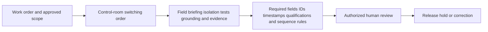
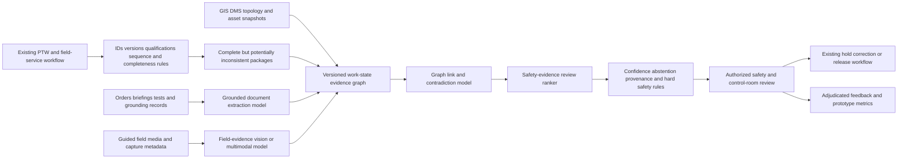

# ENERGY-003 AI-assisted field-work isolation evidence assurance

## Classification

- **Segment:** energy-utilities
- **Primary market / jurisdiction:** Brazil
- **Evidence reference date:** 2026-07-25
- **Index summary:** Brazilian electricity distributors can reconcile switching orders, live topology, crew qualifications, grounding evidence, job briefings, and field images to flag unsafe inconsistencies before a human authorizes work.
- **Company profile / size:** Medium and large electricity distributors operating internal and contractor field crews
- **Opportunity type:** operations
- **Status:** hypothesis
- **Confidence:** medium
- **Complexity:** large
- **Horizon:** medium
- **Risk:** regulated
- **Solution evidence level:** conceptual
- **Operational maturity:** unvalidated
- **Existing-solution disposition:** integrate
- **Azure fit:** high
- **AI dependency:** core
- **Primary AI role:** multimodal
- **Intelligent capability:** Version-aware multimodal reconciliation of switching, isolation, grounding, crew, topology, and field evidence with contradiction detection and risk-ranked review
- **Repository alignment:** extend-kit

## Operational simulation

The following workflows are synthetic operational simulations used to generate hypotheses. They are not claims about a specific distributor.

### Organization and actor

- **Organization archetype:** Brazilian electricity distributor with a control center, regional bases, internal crews, and contractors.
- **Primary actor:** field-work safety coordinator or authorized switching supervisor.
- **Decision authority:** authorizes, suspends, or returns a work package for correction; the control-room operator retains switching authority and the field leader retains stop-work authority.
- **Trigger:** planned or emergency maintenance requires work near or on electrical installations.
- **Objective:** release work only when the approved scope, isolation state, crew, hazards, controls, and field evidence are mutually consistent.
- **Completion condition:** authorized humans confirm the work package, isolation, grounding, job briefing, crew readiness, and safe start or cancellation.
- **Inputs and systems:** work order, GIS/asset registry, OMS/DMS/SCADA topology snapshot, switching order, permit-to-work record, crew roster and qualifications, contractor records, job briefing, timestamps, geolocation, equipment scans, photos or short video, weather, and communications.
- **Constraints:** NR-10 and company procedures, electrical hazards, contractor governance, changing topology, poor connectivity, emergency restoration pressure, privacy, auditability, and prohibition of autonomous switching or work release.
- **Handoffs:** planning → control room → dispatch → field leader → safety supervision → execution → closeout.

### Scenario 1 — normal flow

1. Planning creates a work order linked to an asset and approved switching sequence.
2. The control room confirms the current topology and issues switching instructions.
3. The field leader checks crew identity and qualifications, scans the asset, conducts the job briefing, verifies absence of voltage and grounding, and captures evidence.
4. Deterministic rules validate required fields, timestamps, asset IDs, sequence completion, signatures, and expiry.
5. The authorized supervisor reviews the package and releases the work.
6. Corrections and final outcome become structured feedback.

### Scenario 2 — exception flow

Synthetic exception: the work order references feeder revision A, the switching order was regenerated against revision B, one image shows grounding hardware near a visually similar but different structure, and a contractor qualification expires during the shift.

- Each document is individually complete.
- IDs, natural-language descriptions, field images, and topology snapshots disagree partially.
- A checklist can confirm presence but not whether all evidence refers to the same asset, revision, crew, and isolation boundary.
- The supervisor must reconstruct context across systems, increasing delay and the chance of accepting plausible but mismatched evidence.
- Confirmed mismatches, rejected links, and supervisor explanations can become labels.

### Scenario 3 — peak or degraded flow

Synthetic degraded condition: severe weather produces simultaneous emergency jobs, mobile connectivity is intermittent, the topology changes repeatedly, contractor crews are reassigned, and evidence arrives out of order.

- Offline captures may synchronize after a newer switching state.
- Similar asset names and repeated photos increase reconciliation risk.
- Supervisors face a queue where urgency competes with safety review.
- The safe fallback is hold, manual verification, and direct control-room confirmation rather than model-driven release.

### Opportunity points derived from simulation

| Operational point | Best deterministic response | Remaining intelligent gap |
| --- | --- | --- |
| Required records missing | Mandatory fields, schemas, signatures, and blocking workflow | None; AI is unnecessary |
| Wrong or expired qualification | Rules against authoritative qualification records | None when identity and records are reliable |
| Evidence linked to visually similar equipment | Barcode/NFC, immutable asset IDs, geofence, and capture guidance | Recognition and cross-evidence reconciliation when identifiers are absent, damaged, or contradictory |
| Switching order and topology revision disagree | Version checks and control-room confirmation | Semantic and graph reconciliation across descriptions, topology snapshots, and changed field context |
| Peak queue prioritization | Severity, voltage, work type, and deterministic risk rules | Ranking packages with contradiction patterns and evidence uncertainty while never overriding safety rules |

The candidate remains only where ordinary workflow cannot reliably reconcile heterogeneous evidence. It must not replace mandatory identifiers, verification tests, switching controls, or human authority.

## Brazil applicability and current context

In April 2026, the Ministry of Labor and Employment reported a proposed tripartite pact for the Brazilian electricity sector motivated in part by historically high accident levels, outsourcing, unequal working conditions, and the need to strengthen safety culture. In May 2026, the MTE announced modernization of NR-10, the central Brazilian standard for safety in electrical installations and services. These sources establish a current Brazilian worker-safety and governance context, not proof that the proposed model improves outcomes.

The opportunity is applicable where distributors already digitize work, topology, crew, and field evidence but still require human reconciliation across systems. Company procedures and the currently effective official NR-10 text remain authoritative; the prototype must verify the final published normative text before implementation.

## Existing solutions and differentiation

### Existing solutions reviewed

| Solution / platform | Owner or vendor | Current capabilities | Evidence date | Coverage overlap |
| --- | --- | --- | --- | --- |
| Oracle Utilities Field Service | Oracle | Work orders, scheduling, dispatch, maintenance templates, asset inspection, and operational analytics | accessed 2026-07-25 | Field execution, asset work, scheduling, and workflow |
| Field1st Utilities | Field1st | Digital tailboards, voice/photo capture, switching and grounding evidence, permits, approvals, and real-time visibility | accessed 2026-07-25 | Job briefing, permits, switching, grounding, and evidence capture |
| Versify Control of Work | Versify | Digital permit-to-work, switching orders, approvals, mobile access, dashboards, and audit records | accessed 2026-07-25 | PTW, switching workflow, visibility, and auditability |
| CONTROLIT | CONTROLIT | Multi-stage PTW, field verification, SIMOPS checks, audit trail, and AI-assisted risk assessment | accessed 2026-07-25 | Permit workflow, approvals, field checks, and risk assessment |

### Gap and disposition

- **What is already solved:** digital permits, switching-order workflows, job briefings, approvals, asset work, scheduling, photo/voice capture, and audit trails.
- **Material uncovered gap:** source-grounded reconciliation of whether switching, topology, crew, grounding, asset identity, timestamps, and field media all describe the same authorized work state.
- **Underserved actor, context, integration, or outcome:** Brazilian distribution safety supervisors reviewing cross-system evidence under topology change, contractor complexity, and degraded connectivity.
- **Disposition:** integrate.
- **Why changing vendor, cloud, model, UI, or architecture is insufficient:** the value depends on connecting authoritative systems and proving incremental contradiction detection beyond each platform's native workflow.
- **Differentiation statement:** this is not another PTW, field-service, computer-vision PPE, or switching product; it is a read-only assurance layer that flags cross-system evidence inconsistency before authorized human release.

## Evidence

### Confirmed problem evidence

- The MTE reported in April 2026 that electricity-sector representatives sought a permanent tripartite mechanism addressing outsourcing, high accident levels, unequal working conditions, and safety culture.
- The MTE announced modernization of NR-10 in May 2026, confirming active regulatory attention to electrical-work safety.

### Existing-solution evidence

- Oracle offers utility field-service and asset-inspection workflow capabilities.
- Field1st, Versify, and CONTROLIT digitize permits, safety briefings, switching, grounding, verification, approvals, and audit records.

### Favorable evidence for the uncovered gap

- Multimodal document and image models can extract and compare heterogeneous operational evidence.
- Graph-based reconciliation can represent assets, topology revisions, orders, crews, controls, and evidence links.
- A bounded replay prototype can inject known mismatches without connecting to live switching control.

### Counter-evidence and limitations

- Strong identifier discipline, barcode/NFC capture, topology versioning, and mandatory workflow may remove much of the need for AI.
- Images may not prove absence of voltage, correct grounding, safe distance, or complete work-zone isolation.
- PPE or object recognition can fail under occlusion, low light, weather, unusual equipment, and camera perspective.
- Similarity and co-occurrence do not prove that a work package is safe.
- Product vendors may add cross-evidence assurance to their roadmaps, reducing differentiation.

### Inference

- A model may add value primarily for evidence conflicts and ambiguous identity, not for standard permit completeness.
- The safest prototype is retrospective and read-only, comparing findings with expert-reviewed work packages and synthetic exceptions.

### Unknowns

- Frequency of cross-system contradictions after deterministic controls are strengthened.
- Availability and quality of adjudicated near-miss, rejected-package, and correction labels.
- Access to topology snapshots, contractor qualifications, and field media under privacy and security constraints.
- Incremental review-time reduction and false-alert burden.

### Sources

- [Trabalhadores do setor elétrico propõem pacto tripartite para fortalecer o trabalho decente](https://www.gov.br/trabalho-e-emprego/pt-br/noticias-e-conteudo/2026/abril/trabalhadores-do-setor-eletrico-propoem-pacto-tripartite-para-fortalecer-o-trabalho-decente) — Brazil; 2026-04-16; current problem and operating context.
- [Ministro assina portarias que modernizam NR-10](https://www.gov.br/trabalho-e-emprego/pt-br/noticias-e-conteudo/2026/maio/ministro-luiz-marinho-assina-portarias-que-modernizam-nr-10-e-instala-mesa-estadual-do-trabalho-decente-no-meio-rural-em-sp) — Brazil; 2026-05-28; regulatory context.
- [Field Service for Utilities](https://www.oracle.com/utilities/field-service/) — international product; accessed 2026-07-25; existing solution.
- [Utility Safety Software for T&D and Field Crews](https://field1st.com/industries/utilities/) — international product; accessed 2026-07-25; existing solution.
- [Permit to Work and Control of Work](https://www.versify.com/control-of-work/) — international product; accessed 2026-07-25; existing solution.
- [CONTROLIT Digital Permit to Work](https://getcontrolit.com/) — international product; accessed 2026-07-25; existing solution.

## Current process and current solution

## Baseline

- **Current manual or system baseline:** PTW, switching order, job briefing, field verification, signatures, and supervisor review.
- **Existing product or platform baseline:** Field-service and control-of-work platforms with mobile capture, approvals, and audit trails.
- **Strongest realistic non-AI alternative:** immutable IDs, barcode/NFC, controlled terminology, version-locked topology, offline-safe forms, deterministic qualification checks, required capture positions, and dual approval.
- **Baseline strengths:** transparent, auditable, enforceable, and appropriate for hard safety rules.
- **Baseline limitations:** heterogeneous free text, visually similar assets, changed topology, offline synchronization, and contradictory evidence spanning systems.
- **Exact context where the proposed intelligence adds incremental value:** packages that pass completeness rules but contain unresolved identity, revision, semantic, visual, or temporal contradictions.
- **Condition where adoption or the baseline should be preferred:** low contradiction frequency, reliable asset identifiers, stable integrations, or model alerts that do not outperform expert-defined rules.

## Proposed solution or extension

Integrate a read-only assurance service with the existing PTW, field-service, GIS/DMS, qualification, and evidence repositories. Deterministic controls run first. Only packages that are complete but potentially inconsistent reach the intelligent layer.

The service builds a versioned evidence graph linking work order, asset, topology snapshot, switching step, crew, qualification, grounding, test record, capture location, time, and media. Models propose entity links, identify contradictions, and rank packages for human review. They cannot issue switching commands, approve permits, declare isolation, or release work.

## Where AI enters

### AI role map

| Process stage | AI component | AI type / model family | Inputs | What it does | Runtime mode | Output | Human or deterministic control |
| --- | --- | --- | --- | --- | --- | --- | --- |
| Evidence intake | Grounded evidence extractor | Document model and restricted LLM | Work orders, briefings, switching text, test records | Extracts assets, revisions, controls, people, locations, and source spans | asynchronous batch | Structured facts with provenance and confidence | Schema validation, allowlisted fields, abstention, source display |
| Asset and state reconciliation | Work-state evidence graph | Embeddings, cross-encoder, and graph ML | Extracted facts, GIS/DMS topology, asset registry, crew and qualification records | Proposes links and flags mismatched asset, revision, crew, time, or work state | asynchronous | Candidate links, contradictions, confidence | Exact-ID rules take precedence; supervisor confirms or rejects |
| Field-media comparison | Multimodal field-evidence checker | Vision-language model or task-specific computer vision | Guided images/video, asset reference images, capture metadata | Detects visible equipment and grounding evidence and compares it with the expected package | edge-assisted plus private cloud | Visible-object findings, mismatch candidates, insufficient-evidence flag | Images never prove electrical safety; human inspection and tests remain mandatory |
| Review queue | Safety-evidence ranker | Gradient boosting or learning-to-rank | Rule results, contradiction features, uncertainty, work criticality | Ranks complete packages for expert attention | batch or near-real-time | Priority score and contributing factors | Hard safety rules block independently; supervisor controls disposition |

### Required distinctions

- **Primary AI role:** multimodal recognition, extraction, entity resolution, contradiction detection, and ranking.
- **Model family:** document extraction, restricted LLM, embeddings, cross-encoder, graph ML, vision-language model, and calibrated tabular ranking.
- **Training requirement:** pretrained inference and grounding initially; supervised calibration only with adjudicated links, mismatches, and review outcomes; synthetic exception generation for testing.
- **Training location and cadence:** private offline training; periodic retraining only after drift and safety review.
- **Inference location:** optional edge capture validation plus private cloud batch or near-real-time service.
- **Agent role:** not used.
- **LLM role:** restricted extraction and source-grounded contradiction classification; no switching, permit, or safety decision.
- **Non-LLM intelligence:** multimodal recognition, graph linking, similarity, anomaly features, and ranking.
- **Not AI:** PTW workflow, switching execution, absence-of-voltage testing, grounding procedure, calculations, qualification rules, IDs, signatures, APIs, databases, queues, dashboards, approvals, and stop-work authority.

## Intelligent capability details

- **Why it is necessary for the uncovered gap:** deterministic controls cannot reliably resolve all semantic, visual, temporal, and graph inconsistencies when records are complete but refer to different work states.
- **Inputs:** work packages, switching orders, topology snapshots, asset registry, crew and qualification data, job briefings, test and grounding records, timestamps, geolocation, guided media, and reviewer outcomes.
- **Outputs:** extracted facts with provenance, proposed entity links, contradiction findings, insufficient-evidence flags, priority score, and abstention reason.
- **Training / grounding / optimization assumptions:** authoritative source hierarchy exists; assets and revisions can be versioned; synthetic mismatches can be injected; experts can adjudicate a golden set.
- **Evaluation against existing product and non-AI baselines:** compare with deterministic completeness/version checks and the existing PTW review process, measuring only incremental contradiction detection and review efficiency.
- **Fallback and controls:** hard-rule block, abstention, manual verification, direct control-room confirmation, source display, immutable audit, model rollback, and no write path to switching or permit systems.

## Data and integration assumptions

- **Data owners and access path:** distribution operations, occupational safety, control room, asset management, contractor management, and identity teams.
- **Expected volume, history, frequency, and coverage:** thousands of historical work packages and dozens to hundreds of daily jobs for a bounded regional prototype.
- **Labels, outcomes, feedback, or simulation:** accepted, corrected, held, cancelled, mismatch type, near miss, reviewer explanation, and synthetic exception labels.
- **Quality, imbalance, missingness, and leakage risks:** few serious events, inconsistent descriptions, duplicated media, revised orders, contractor data gaps, and post-review fields leaking outcomes.
- **Brazilian or local-context representativeness:** terminology, procedures, topology, qualifications, contractor practices, and NR-10 implementation are company-specific.
- **Privacy, retention, consent, surveillance, or sharing constraints:** minimize worker data, avoid continuous worker surveillance, define lawful purpose, restrict biometrics, preserve contractor boundaries, and apply short media retention where possible.
- **Existing platform APIs, exports, extension points, and limits:** read-only exports or APIs from PTW/FSM, GIS/DMS, qualification, identity, and evidence stores; no live control integration in the prototype.
- **Integration and synchronization assumptions:** every snapshot carries event time, ingestion time, source, revision, and trust level.
- **Drift and change sources:** network reconfiguration, procedure changes, new equipment, contractor turnover, seasonal emergencies, camera devices, and revised NR-10 guidance.
- **Minimum viable data for a prototype:** 1,000 expert-reviewed packages plus a synthetic suite of identity, revision, timing, qualification, and visual mismatches.

## Prototype validation plan

- **Prototype scope / process slice:** retrospective, read-only analysis of one regional maintenance process and one voltage class.
- **Users, sites, assets, documents, events, or simulated cases:** 5–10 safety/control reviewers, 1,000–5,000 historical packages, and at least 200 synthetic exception packages.
- **Existing solution baseline:** current PTW/FSM workflow and expert review.
- **Non-AI baseline:** exact-ID, version, qualification, time-window, geofence, required-field, and deterministic contradiction rules.
- **Required data and integrations:** offline exports only; no switching, dispatch, or permit write access.
- **Model-quality metrics:** per-contradiction precision/recall, calibration, link precision@k, false-alert rate, abstention, media insufficiency detection, and performance by contractor/site/equipment type.
- **Incremental-value metrics beyond the existing solution:** additional expert-confirmed contradictions found beyond rules, avoidable review minutes, duplicate findings, and cases where the model adds no value.
- **Business or workflow metrics:** package review time, correction cycle time, queue age, held-package resolution, and audit completeness.
- **Human acceptance, correction, or override metrics:** finding acceptance, correction reason, evidence-inspection rate, disagreement, automation-bias samples, and stop-work escalation.
- **Safety and compliance boundaries:** no autonomous switching, isolation declaration, permit approval, work release, disciplinary action, or worker scoring.
- **Failure or redesign criteria:** negligible gain over rules; unacceptable false alerts; weak performance on contractors or sites; reviewers stop inspecting evidence; image claims exceed visible evidence; or integration cannot preserve versioned provenance.
- **Evidence required before pilot or broader implementation:** current legal/SST review, stable temporal validation, red-team synthetic exceptions, privacy assessment, documented rollback, shadow-mode evidence, and explicit human-governance approval.

## Macro architecture

## Capabilities and possible technologies

- **Existing platform capabilities reused:** PTW, switching orders, FSM, GIS/DMS, crew qualifications, evidence capture, approvals, and audit.
- **Application and workflow capabilities:** read-only ingestion, evidence viewer, contradiction queue, correction capture, and audit.
- **Data capabilities:** versioned evidence graph, source lineage, topology snapshots, media metadata, and adjudication store.
- **Integration and extension capabilities:** APIs or governed exports from operational systems; event-time reconciliation.
- **Required AI / ML capabilities:** document extraction, multimodal recognition, entity resolution, graph reconciliation, contradiction detection, and calibrated ranking.
- **Training, grounding, recognition, or optimization capabilities:** source-grounded extraction, synthetic exception generation, private golden set, and drift evaluation.
- **Agent and tool-use capabilities, or `not used`:** not used.
- **LLM / foundation-model capabilities, or `not used`:** restricted source-grounded extraction and contradiction classification.
- **Evaluation and model-operations capabilities:** dataset versioning, model registry, temporal evaluation, subgroup monitoring, rollback, and audit.
- **Security and governance capabilities:** managed identity, least privilege, private networking, encryption, immutable logs, worker-data minimization, and no operational write permission.
- **Azure services that may fit:** Azure AI Document Intelligence, Azure AI Vision or Azure Machine Learning endpoints, Azure AI Search, Cosmos DB or PostgreSQL graph-oriented schema, Functions or Container Apps, Blob Storage, Event Grid, Entra ID, Key Vault, Monitor, and Purview.
- **Non-Azure or open-source alternatives:** OCR/document models, sentence-transformers, Neo4j or PostgreSQL, MLflow, OpenCV, object detection models, and conventional rules engines.

## Possible gains

- Find cross-system evidence contradictions that pass ordinary completeness checks.
- Reduce expert time spent manually locating and comparing source records.
- Improve auditability by preserving source, revision, confidence, and reviewer disposition.
- Reveal where stronger deterministic identifiers or workflow controls should replace AI.

## Metrics for validation

### Business and operational metrics

- Review time and correction-cycle time versus current process.
- Additional confirmed contradictions beyond deterministic rules.
- Queue age, audit completeness, and packages safely handled by rule-only flow.

### Intelligent-capability metrics

- Contradiction precision/recall, calibration, false-alert burden, abstention, link precision, and media insufficiency detection.
- Human acceptance, correction, override, source-inspection, and disagreement rates.

## Risks, limits, and controls

- **Existing-solution overlap and roadmap risk:** PTW and FSM vendors may add native cross-evidence intelligence; extension through APIs is preferred over duplicate workflow.
- **Privacy and sensitive data:** worker identity, location, qualifications, voice, and images require minimization, access control, purpose limitation, and retention governance.
- **Brazilian regulatory or policy constraints:** NR-10, company procedures, labor, contractor, privacy, and evidence-retention requirements remain authoritative.
- **Human decision boundaries:** authorized humans own switching, isolation, grounding verification, permit approval, work release, stop-work, investigation, and discipline.
- **Model or policy failure modes:** wrong entity links, stale topology, false visual recognition, missing evidence treated as negative proof, contractor bias, and urgency-driven over-trust.
- **Agent or tool-execution failure modes, when applicable:** agent not used.
- **LLM hallucination, grounding, or prompt-injection risks, when applicable:** extracted facts must include source spans; field text is data, never trusted instructions; unsupported output is rejected.
- **Comparable failures and lessons:** visual PPE or equipment detection is not equivalent to electrical safety assurance; nominal human review can still suffer automation bias.
- **Bias, drift, weak labels, or insufficient feedback:** rare serious events and inconsistent review practices can produce weak labels; synthetic exceptions cannot replace real adjudication.
- **Integration and vendor/platform dependency risks:** inconsistent revision identifiers, offline synchronization, closed APIs, and topology latency may dominate model performance.
- **Adoption and change-management risks:** crews may perceive the system as surveillance or disciplinary scoring; governance must prohibit those uses and involve workers and contractors.
- **Prototype cost or operational assumptions:** major costs are integration, evidence normalization, expert adjudication, secure media handling, and workflow change rather than model inference alone.

## Fit score

| Dimension | Score | Rationale |
| --- | ---: | --- |
| Problem evidence and relevance | 17/20 | Current Brazilian official sources establish active electrical-work safety concerns and NR-10 modernization, though they do not quantify the precise evidence-reconciliation gap. |
| Business or operational value | 17/20 | Preventing one unsafe mismatch may be material, and review/audit improvements are measurable, but incident reduction is not yet proven. |
| Technical feasibility | 16/20 | A retrospective synthetic-exception prototype is feasible; live topology, sparse labels, media ambiguity, and safety constraints increase difficulty. |
| Reuse potential | 17/20 | The evidence-reconciliation pattern can extend to generation, transmission, industrial energy, and other control-of-work settings. |
| Strategic differentiation | 16/20 | Cross-system work-state assurance is narrower than existing PTW/FSM products, but vendor roadmap overlap remains plausible. |
| **Total** | **83/100** | Differentiated integration hypothesis suitable for bounded read-only validation. |

## Repository relationship

- **Existing references that may be reused:** document extraction, multimodal evidence assurance, graph reconciliation, model evaluation, identity, workflow, and observability patterns.
- **Missing capabilities exposed by the differentiated gap:** versioned operational evidence graph, synthetic contradiction suite, source-grounded multimodal reconciliation, and safety-review human-factors metrics.
- **Potential building blocks:** `versioned-evidence-graph`, `grounded-work-package-extractor`, `field-media-evidence-checker`, and `human-review-assurance`.
- **Potential composed solution or extension:** `utility-field-work-isolation-assurance` integrated with existing PTW/FSM/GIS/DMS platforms.
- **Reasons to keep it outside the current kit:** distributor-specific switching, topology, labor, and contractor rules should remain adapters rather than generic core behavior.

## Duplicate control

- **Problem keys:** electric utility field work, switching-order mismatch, isolation evidence, grounding evidence, contractor qualification, topology revision, permit release
- **Capability keys:** multimodal work-state reconciliation, graph entity linking, evidence contradiction detection, field-media comparison, safety-review ranking
- **Existing solutions reviewed:** Oracle Utilities Field Service, Field1st, Versify Control of Work, CONTROLIT
- **Research queries used:** `site:gov.br OR site:aneel.gov.br 2025 2026 acidentes trabalho setor elétrico distribuição segurança equipes campo Brasil`; `site:gov.br OR site:aneel.gov.br 2025 2026 segurança trabalho rede elétrica manutenção desenergização procedimento Brasil`; `electric utility field work safety permit AI computer vision switching plan product 2025`; `utility field service safety software permit to work switching order computer vision platform`
- **Related repository opportunities:** ENERGY-002 outage restoration prioritization; CONST-002 EV-charging fire-safety evidence assurance; HR-003 return-to-work accommodation assurance
- **External overlap statement:** existing products digitize work, permits, switching, grounding, and evidence capture; this candidate tests only cross-system identity, revision, temporal, and multimodal contradiction assurance.
- **Uniqueness statement:** unlike outage restoration or generic PTW, the bounded outcome is expert detection of evidence packages that are complete but internally inconsistent before work release.

## Next decision

- prototype candidate

Implementation approval remains an explicit human decision.
