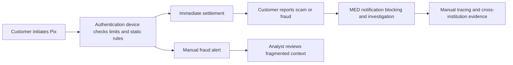
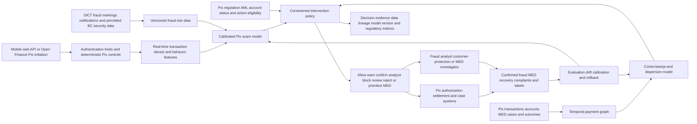

# FIN-001 Real-time Pix scam and mule-account intervention with MED intelligence

## Classification

- **Segment:** financial-services
- **Primary market / jurisdiction:** Brazil
- **Evidence reference date:** 18 July 2026; primary evidence includes Brazilian rules and Banco Central material updated or effective during 2025 and 2026.
- **Index summary:** Brazilian Pix participants can combine Banco Central security signals, transaction behavior, device context, and payment graphs to detect scams and contas laranja, apply proportionate controls, and prioritize MED investigation before funds disperse.
- **Company profile / size:** Brazilian banks, payment institutions, fintechs, acquirers, digital banks, and Pix participants operating high-volume instant payments.
- **Opportunity type:** security
- **Status:** researched
- **Confidence:** high
- **Complexity:** large
- **Horizon:** medium
- **Risk:** regulated
- **Azure fit:** high
- **AI dependency:** core
- **Intelligent capability:** Calibrated Pix scam-risk prediction and graph-based conta-laranja and fund-dispersion detection
- **Repository alignment:** new-solution

## Problem

Fraud operations teams at Brazilian Pix participants must decide within seconds whether a transaction is compatible with the customer's normal behavior, whether the payer may be under social engineering or coercion, whether the receiving account has fraud markings or conta-laranja characteristics, and whether the funds are likely to disperse through additional accounts.

Authentication confirms that a customer initiated the Pix, but it does not prove that the transaction is safe. Static thresholds and isolated account rules struggle with rapidly changing scams, while excessive blocking can harm legitimate customers and overwhelm review teams. Once funds move through several accounts, recovery becomes more difficult and MED analysis requires coordinated evidence across institutions and transaction paths.

## Brazil applicability and current context

This opportunity is directly grounded in the Brazilian Pix operating model in 2026.

Banco Central rules require Pix participants to use fraud-risk management capable of identifying atypical transactions or transactions incompatible with the customer's profile. Current rules and official guidance also support additional authorization time, precautionary blocking, fraud markings in Pix security data, transaction rejection when there is founded suspicion of fraud, and customer-specific limits based on risk and behavior.

Banco Central expanded the fraud information available to participants, including the reason and type of fraud, conta-laranja indicators, the number of accounts linked to a user, accepted fraud notifications, and a longer historical period. In April 2026, Resolution BCB 559 further changed Pix rules related to the Mecanismo Especial de Devolução. These controls make a Brazil-specific intelligent orchestration layer materially different from a generic foreign APP-reimbursement platform.

Foreign fraud patterns may still inform model design, but UK reimbursement rules, European liability structures, and the term `APP scam` are not treated as Brazilian legal or operating assumptions.

## Evidence

### Confirmed

- Banco Central requires Pix participants to use fraud-risk management that considers security information maintained by the BC and can identify transactions that are atypical or incompatible with the customer's profile.
- Banco Central expanded Pix fraud data shared with participants to include fraud reason and type, including conta-laranja and identity-fraud indicators, as well as richer historical and relationship information.
- Current Pix security mechanisms include additional authorization time for suspected transactions, precautionary blocking, fraud markings, and the ability to block, limit, or refuse transactions involving marked users or keys.
- Resolution BCB 501, issued in September 2025, requires payment institutions to reject payment transactions directed to accounts with founded suspicion of fraud and allowed the assessment to use public or private electronic data sources.
- Resolution BCB 498, as amended by Resolution BCB 547 in January 2026, requires continuous 24x7 monitoring for real-time identification of atypical or fraudulent transactions based on historical and behavioral patterns before transactions are sent to Banco Central infrastructure.
- Resolution BCB 559, dated 23 April 2026, changed the Pix Regulation, including rules related to the Mecanismo Especial de Devolução.
- Banco Central's current Pix guidance states that MED requests must be available through institutions' apps and that fraud markings are stored in DICT and shared among Pix participants.

### Inference

- Combining customer-behavior models with beneficiary and transaction-graph analysis should identify risk that neither device authentication nor isolated account rules can capture alone.
- Richer Banco Central security fields can improve feature quality, reason codes, and prioritization, but institutions still need their own governed models and decision policies.
- The highest-value action is not universal blocking. Calibrated warnings, additional confirmation, permitted analysis time, precautionary blocking, specialist review, transaction refusal under explicit rules, and MED prioritization can reduce both fraud loss and false friction.
- Graph-based fund-dispersion analysis can support faster MED investigation and account-network triage, but cross-institution visibility and legal permissions must be validated in the implementation context.

### Sources

- [Banco Central — BC aperfeiçoa os mecanismos de segurança do Pix](https://www.bcb.gov.br/detalhenoticia/20227/nota) — Brazil; current official operating requirement; participants must use fraud-risk management able to identify atypical or profile-incompatible Pix transactions.
- [Banco Central — BC aprimora mecanismos de segurança do Pix](https://www.bcb.gov.br/detalhenoticia/677/noticia) — Brazil; official update effective from 5 November; richer fraud reason, conta-laranja, relationship, and historical security data for participant models.
- [Banco Central — Segurança no Pix](https://www.bcb.gov.br/estabilidadefinanceira/pix-seguranca) — Brazil; current operating guidance; MED, fraud markings, additional analysis time, precautionary blocking, and transaction restrictions.
- [Banco Central — Resolução BCB 142, as amended by Resolução BCB 501](https://www.bcb.gov.br/estabilidadefinanceira/exibenormativo?numero=142&tipo=Resolu%C3%A7%C3%A3o+BCB) — Brazil; Resolution BCB 501 dated 11 September 2025, implementation by 13 October 2025; rejection of transactions to accounts with founded fraud suspicion.
- [Banco Central — Resolução BCB 498, as amended by Resolução BCB 547](https://www.bcb.gov.br/estabilidadefinanceira/exibenormativo?numero=498&tipo=Resolu%C3%A7%C3%A3o+BCB) — Brazil; current version amended 30 January 2026; 24x7 real-time historical and behavioral fraud monitoring before transaction forwarding.
- [Banco Central — Resolução BCB 559](https://www.bcb.gov.br/estabilidadefinanceira/exibenormativo?numero=559&tipo=Resolu%C3%A7%C3%A3o+BCB) — Brazil; published 23 April 2026; current changes to Pix Regulation and MED rules.
- [Banco Central — Limites de valor para transações Pix](https://bcb.gov.br/meubc/faqs/p/limites-de-valor-para-as-transacoes-pix) — Brazil; updated 2 January 2026; institutional limits based on user risk and behavior.

## Current process

## Proposed solution

Create a Brazil-specific Pix fraud intervention and MED intelligence platform spanning payer, beneficiary, device, transaction, DICT security, and payment-network signals.

Deterministic controls remain responsible for authentication, account status, mandatory limits, sanctions and AML controls, existing fraud markings, rule-based rejection, precautionary blocking eligibility, and actions explicitly allowed by Pix regulation. The intelligent layer produces calibrated scam and conta-laranja risk, detects unusual behavior and fund-dispersion patterns, and ranks cases for intervention or MED investigation.

A policy engine combines model confidence and deterministic rules to choose among allow, contextual warning, additional confirmation, permitted additional analysis time, precautionary blocking, specialist review, transaction rejection when a founded suspicion rule is met, or post-event MED prioritization. Every decision records the model version, Banco Central security inputs used, reason codes, customer response, analyst outcome, MED result, and later confirmed labels.

The platform does not autonomously determine criminal liability, deny a customer's MED request, or treat a model score as founded suspicion without the institution's approved decision policy and required human or deterministic validation.

## Intelligent capability

- **Technique / model family:** Supervised Pix fraud classification, behavioral anomaly detection, temporal transaction-graph features or graph neural networks, calibrated risk scoring, and constrained intervention ranking.
- **Why it is necessary:** Authentication and static rules cannot reliably detect combinations of social engineering, sudden behavioral deviation, newly created receiving accounts, conta-laranja networks, and rapid multi-account fund dispersion. Removing the models leaves the institution with known-pattern rules and slower retrospective analysis.
- **Inputs:** Pix amount and time, customer history, beneficiary history, account age, device and session signals, customer limits, DICT and fraud-marking data permitted for use, notification-of-infraction attributes, number of linked accounts, transaction graph, prior warnings, MED cases, analyst outcomes, confirmed fraud labels, and permitted AML or external intelligence.
- **Outputs:** Scam-risk probability, conta-laranja or beneficiary-network risk, likely dispersion paths, uncertainty, reason codes, recommended intervention tier, ranked analyst or MED queue, and abstention when evidence is insufficient.
- **Training / grounding / optimization:** Train on time-split Brazilian Pix data with delayed labels from confirmed fraud, MED results, accepted notifications, precautionary blocks, analyst decisions, and legitimate transactions. Prevent leakage from post-event fields, version Banco Central data semantics, use cost-sensitive learning, evaluate graph snapshots by time, and optimize intervention thresholds within current Pix rules and customer-protection constraints.
- **Evaluation:** Precision-recall, recall at fixed review capacity, value-weighted recall, probability calibration, false-friction rate, lead time before settlement or dispersion, top-k confirmed conta-laranja yield, MED recovery support, analyst acceptance, complaint and appeal outcomes, and stability across customer profiles and channels.
- **Fallback and controls:** Deterministic Pix and AML rules, explicit abstention, conservative safe defaults, human review for material restrictions, rule-based validation before founded-suspicion actions, model rollback, shadow deployment, threshold approval, uninterrupted manual MED processing, and customer complaint and correction paths.

## Macro architecture

## Capabilities and possible technologies

- **Application and workflow capabilities:** Real-time Pix intervention, contextual warning, additional confirmation, specialist review, precautionary-block workflow, MED case prioritization, evidence timeline, and regulator-ready reporting.
- **Data capabilities:** Low-latency feature store, temporal payment graph, versioned DICT and fraud-marking features, delayed-label governance, MED outcome store, and immutable decision evidence.
- **Integration capabilities:** Pix authorization and settlement, core banking, fraud and AML case management, customer channels, device intelligence, DICT-related security services, MED workflow, and reporting systems.
- **Required AI / ML capabilities:** Fraud classification, behavioral anomaly detection, graph-risk inference, fund-dispersion detection, calibration, and constrained action recommendation.
- **Training and optimization capabilities:** Time-split Brazilian training data, delayed-label handling, cost-sensitive learning, graph snapshots, champion-challenger evaluation, shadow mode, and policy simulation.
- **Evaluation and model-operations capabilities:** Drift monitoring, calibration, threshold governance, false-friction analysis, data-semantic versioning, rollback, and audit reporting.
- **Security and governance capabilities:** LGPD purpose limitation and minimization, least privilege, encryption, retention, model-risk management, evidence lineage, explainable reason codes, and accountable human decision ownership.
- **Azure services that may fit:** Azure Event Hubs, Azure Functions or Container Apps, Azure Machine Learning, Microsoft Fabric, Azure Cosmos DB or another graph-capable store, Microsoft Purview, Microsoft Entra ID, Azure Monitor, and managed private networking.
- **Non-Azure or open-source alternatives worth considering:** Apache Kafka, Flink, Feast, Neo4j, PostgreSQL, LightGBM, XGBoost, PyTorch Geometric, MLflow, Evidently, and OpenTelemetry.

## Possible gains

- Earlier identification of suspicious Pix transactions before settlement or rapid fund dispersion.
- Better detection and prioritization of contas laranja and related account networks.
- Faster, evidence-rich MED investigation and recovery support.
- Lower analyst workload through calibrated ranking and graph context.
- More proportionate customer friction than broad static blocking.
- Stronger audit evidence for Banco Central supervision, complaints, and model governance.
- Faster adaptation when fraud patterns, devices, narratives, and network structures change.

## Metrics for validation

### Business and operational metrics

- Confirmed Pix fraud count and value detected before settlement or dispersion.
- Value prevented, precautionarily blocked, recovered through MED, or returned after investigation.
- Time from alert or MED initiation to first actionable account-network view.
- Review queue volume, time to decision, and cases handled per analyst.
- Confirmed conta-laranja yield among top-ranked accounts.
- Customer warning completion, abandonment, complaint, appeal, and false-friction rates.

### Intelligent-capability metrics

- Precision-recall, recall at fixed review capacity, and value-weighted recall.
- Probability calibration and threshold stability across Pix channels and customer profiles.
- False-positive, abstention, override, and analyst-acceptance rates.
- Detection lead time and confirmed account-network precision at top-k.
- Drift in transaction behavior, graph structure, fraud markings, labels, and intervention effectiveness.
- Difference in error and friction rates across legally permitted audit cohorts.

## Risks, limits, and controls

- **Privacy and sensitive data:** Transaction, device, graph, behavioral, and fraud-marking data require strict LGPD purpose limitation, minimization, access control, retention, and security.
- **Brazilian regulatory or policy constraints:** Pix Regulation, Banco Central fraud-management rules, MED procedures, AML obligations, consumer protection, LGPD, banking secrecy, and institution-specific legal interpretation must govern every action.
- **Human decision boundaries:** Models may recommend friction, review, or MED priority but must not independently determine criminal conduct, deny customer rights, or create founded suspicion without approved controls.
- **Model failure modes:** New scams, sparse beneficiary history, compromised trusted devices, coordinated low-value networks, legitimate unusual payments, and delayed labels can cause misses or false positives.
- **Bias, drift, weak labels, or insufficient feedback:** Analyst outcomes, accepted notifications, and MED results may reflect operational inconsistency rather than ground truth. Training sets must distinguish confirmed fraud from precautionary actions.
- **Integration and data availability risks:** Sub-second latency, DICT field availability, graph freshness, cross-institution visibility, payment finality, MED data quality, and inconsistent reason codes can limit effectiveness.
- **Adoption and change-management risks:** Poor warnings and unexplained blocks can reduce trust and increase complaints. Intervention design requires accessibility, customer-support readiness, transparent communication, and monitored false friction.

## Fit score

| Dimension | Score | Rationale |
| --- | ---: | --- |
| Problem evidence and relevance | 20/20 | The opportunity is supported by current Banco Central rules, official Pix security mechanisms, and Brazilian operating requirements effective through 2026. |
| Business or operational value | 19/20 | Prevention and faster MED investigation can reduce customer harm, fraud exposure, recovery effort, and analyst workload. |
| Technical feasibility | 18/20 | Real-time models and graph analytics are mature, while Brazilian Pix data integration, delayed labels, latency, and model governance remain substantial challenges. |
| Reuse potential | 17/20 | Core fraud, graph, and intervention components are reusable across Brazilian Pix participants, but production data and controls are institution-specific. |
| Strategic differentiation | 18/20 | Combining BC security data, payer behavior, conta-laranja graph detection, fund-dispersion analysis, and MED orchestration exceeds isolated rules or retrospective case management. |
| **Total** | **92/100** | Strong Brazil-specific evidence and regulatory fit with core intelligent value, offset by integration, privacy, and regulated model-operation complexity. |

## Repository relationship

- **Existing references that may be reused:** Event-driven integration, observability, identity, storage, security, portal, Functions, and general Azure ML and model-operations patterns.
- **Missing capabilities exposed by this opportunity:** Streaming Pix feature contracts, versioned DICT security features, temporal payment graph, calibrated fraud scoring, fund-dispersion analysis, constrained intervention policy, delayed-label evaluation, and Brazilian regulated model-risk controls.
- **Potential building blocks:** Pix fraud feature pipeline, graph-risk service, MED investigation graph, intervention policy engine, decision-evidence schema, shadow evaluation harness, and delayed-outcome feedback loop.
- **Potential composed solution:** `solutions/pix-fraud-med-intelligence-platform`.
- **Reasons to keep it outside the current kit, when applicable:** Production use requires access to regulated Pix infrastructure, institution-specific fraud data, legal interpretation, low-latency operations, and formal model-risk governance.

## Duplicate control

- **Problem keys:** pix-fraud, social-engineering-scam, conta-laranja, mule-account, med-investigation, fund-dispersion, instant-payment-risk
- **Capability keys:** fraud-classification, behavioral-anomaly-detection, temporal-graph, conta-laranja-detection, dispersion-path-analysis, calibrated-risk, constrained-intervention
- **Research queries used:** `site:bcb.gov.br Pix fraude 2025 2026 MED contas laranja`; `site:bcb.gov.br gerenciamento risco fraude transações Pix atípicas perfil cliente`; `site:bcb.gov.br Resolução BCB 2026 MED Pix fraude`; `site:bcb.gov.br monitoramento tempo real padrões históricos comportamentais fraude`
- **Related opportunities:** CROSS-001 uses graph anomaly detection for residual access after offboarding, but it addresses identity governance rather than Pix fraud, fund dispersion, MED, and regulated payment intervention.
- **Uniqueness statement:** This opportunity is explicitly designed for Brazil's current Pix controls and 2026 operating context, joining payer-risk prediction, conta-laranja graph intelligence, regulatory action validation, and MED investigation support.

## Next decision

Continue research through a bounded shadow-mode architecture using Brazilian Pix data contracts, current Banco Central rules, LGPD controls, and institution-specific model-risk assessment before any implementation approval.