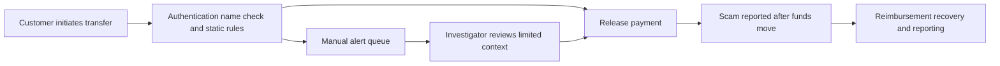
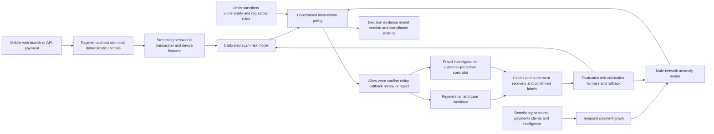

# FIN-001 Real-time APP scam intervention and mule-network risk orchestration

## Classification

- **Segment:** financial-services
- **Index summary:** Payment providers can combine transaction, beneficiary, device, behavioral, and network signals to predict likely APP scams and mule accounts, applying proportionate friction and investigator review before irreversible transfers.
- **Company profile / size:** Banks, payment institutions, e-money firms, and payment processors operating instant or near-instant account-to-account transfers.
- **Opportunity type:** security
- **Status:** researched
- **Confidence:** high
- **Complexity:** large
- **Horizon:** medium
- **Risk:** regulated
- **Azure fit:** high
- **AI dependency:** core
- **Intelligent capability:** Calibrated scam-risk prediction and graph-based mule-network anomaly detection
- **Repository alignment:** new-solution

## Problem

Fraud operations teams must decide within seconds whether an authorized transfer is legitimate, whether the payer is being manipulated, and whether the receiving account is part of a mule network. Strong authentication confirms that the customer authorized the payment but does not establish that the payment is safe. Static rules and name matching miss rapidly changing social-engineering patterns, while excessive blocking creates customer harm and operational overload.

Mandatory reimbursement and shared liability increase the financial and regulatory consequence for both sending and receiving payment providers. The process therefore requires coordinated prevention, evidence capture, proportionate intervention, case handling, and post-event learning rather than only retrospective fraud reporting.

## Evidence

### Confirmed

- The EBA identified payment fraud as the most significant issue affecting EU consumers in its 2024/25 Consumer Trends Report and highlighted the growth of social-engineering techniques.
- The joint EBA-ECB payment-fraud report published in December 2025 found that total payment-fraud value increased from EUR 3.5 billion in 2023 to EUR 4.2 billion in 2024, while payer manipulation required additional mitigation beyond strong customer authentication.
- The UK Payment Systems Regulator's mandatory APP scam reimbursement protections took effect on 7 October 2024 and apply across large and small payment providers.
- UK reimbursement rules share eligible losses between sending and receiving firms, creating a direct incentive to detect suspicious beneficiaries and mule accounts as well as risky outgoing transfers.
- The PSR publishes provider-level prevention and reimbursement performance data and requires compliance reporting, making prevention quality and customer outcomes measurable.

### Inference

- A unified model combining payer behavior and beneficiary-network signals should outperform isolated transaction rules when scams are authorized by the victim and mule accounts appear normal individually.
- The highest-value intervention is not necessarily blocking every high-risk payment; calibrated friction, contextual warnings, delayed release, callback, or specialist review can reduce harm while controlling false positives.
- Smaller payment firms may need a shared or managed architecture because reimbursement, monitoring, evaluation, and graph analytics require capabilities beyond a basic transaction-monitoring stack.

### Sources

- [EBA — Consumer Trends Report 2024/25](https://www.eba.europa.eu/publications-and-media/press-releases/eba-identifies-payment-fraud-indebtedness-and-de-risking-key-issues-affecting-consumers-eu) — official consumer-risk findings, 26 March 2025.
- [EBA and ECB — Joint report on payment fraud](https://www.eba.europa.eu/publications-and-media/press-releases/joint-eba-ecb-report-payment-fraud-strong-authentication-remains-effective-fraudsters-are-adapting) — official 2024 fraud data and payer-manipulation finding, 15 December 2025.
- [Payment Systems Regulator — APP reimbursement maximum](https://www.psr.org.uk/publications/policy-statements/ps247-faster-payments-app-scams-reimbursement-requirement-confirming-the-maximum-level-of-reimbursement/) — reimbursement scope, limit, and effective date.
- [Payment Systems Regulator — APP fraud performance data](https://www.psr.org.uk/app-fraud-data/) — prevention and reimbursement performance reporting.
- [UK Finance — Annual Fraud Report 2025](https://www.ukfinance.org.uk/policy-and-guidance/reports/annual-fraud-report-2025) — industry evidence that fraud tactics continue to adapt.

## Current process

## Proposed solution

Create a real-time scam-intervention control plane spanning sending and receiving signals. Deterministic controls validate authentication, sanctions, account status, limits, beneficiary name, regulatory rules, and intervention permissions. A calibrated model scores payer manipulation risk using transaction context, behavioral deviation, device and session signals, beneficiary history, prior warnings, and known scam indicators. A graph model separately identifies beneficiary accounts whose relationships, funding flows, velocity, counterparties, or account lifecycle resemble mule-network behavior.

A policy engine converts risk and uncertainty into proportionate actions: allow, show a targeted warning, require additional confirmation, introduce a permitted cooling-off period, request a callback, route to specialist review, or reject under an explicit rule. High-impact actions require deterministic eligibility and human control. Every intervention records the evidence, model version, reason codes, customer response, investigator decision, reimbursement outcome, and later fraud confirmation for evaluation and retraining.

## Intelligent capability

- **Technique / model family:** Supervised fraud classification, behavioral anomaly detection, temporal graph features or graph neural networks, calibrated risk scoring, and constrained action ranking.
- **Why it is necessary:** Authorized scams often pass authentication and simple transaction rules. Models are required to detect weak combinations of behavioral manipulation and network-level mule patterns that are not expressible as stable deterministic rules. Removing them leaves only known-pattern blocking and retrospective case handling.
- **Inputs:** Payment amount and timing, payer history, beneficiary history, account age, device and session events, confirmation-of-payee result, warnings shown, customer responses, transaction graph, fraud claims, reimbursement outcomes, investigator labels, and permitted external intelligence.
- **Outputs:** Scam probability, mule-account risk, uncertainty, contributing reason codes, recommended intervention tier, ranked investigator queue, and abstention when evidence is insufficient.
- **Training / grounding / optimization:** Train on time-split confirmed fraud, non-fraud, claims, mule investigations, and intervention outcomes; prevent label leakage from post-payment events; use cost-sensitive learning and temporal validation; govern graph snapshots and delayed labels; optimize intervention policy only within regulatory and customer-protection constraints.
- **Evaluation:** Precision-recall and recall at operational review capacity; fraud value captured; false-positive and false-friction rates; calibration error; detection lead time; graph hit rate for confirmed mule accounts; customer abandonment; investigator acceptance; reimbursement and complaint outcomes; subgroup and vulnerability-impact analysis.
- **Fallback and controls:** Deterministic hard rules, model abstention, conservative safe defaults, human review for material restrictions, explainable reason codes, model rollback, shadow deployment, rate limits on friction, appeal and complaint handling, and uninterrupted manual claim processing.

## Macro architecture

## Capabilities and possible technologies

- **Application and workflow capabilities:** Payment intervention, contextual warning, callback, specialist review, claims linkage, reimbursement workflow, and regulator-ready reporting.
- **Data capabilities:** Low-latency feature store, temporal payment graph, label governance, intervention outcome store, and immutable decision evidence.
- **Integration capabilities:** Payment rails, core banking, fraud case management, customer channels, identity and device intelligence, confirmation-of-payee, and reporting systems.
- **Required AI / ML capabilities:** Fraud classification, behavioral anomaly detection, graph risk inference, calibration, and constrained action recommendation.
- **Training and optimization capabilities:** Time-split training, delayed-label handling, cost-sensitive learning, graph snapshots, champion-challenger evaluation, and policy simulation.
- **Evaluation and model-operations capabilities:** Drift monitoring, calibration, threshold governance, shadow mode, false-friction analysis, rollback, and audit reporting.
- **Security and governance capabilities:** Least privilege, encryption, purpose limitation, retention, protected customer treatment, model-risk management, evidence lineage, and human accountability.
- **Azure services that may fit:** Azure Event Hubs, Azure Functions or Container Apps, Azure Machine Learning, Azure AI Search where governed intelligence retrieval is needed, Azure Cosmos DB or another graph-capable store, Microsoft Fabric, Microsoft Purview, Microsoft Entra ID, and Azure Monitor.
- **Non-Azure or open-source alternatives worth considering:** Apache Kafka, Flink, Feast, Neo4j, PostgreSQL, LightGBM, XGBoost, PyTorch Geometric, MLflow, Evidently, and OpenTelemetry.

## Possible gains

- Earlier interruption of manipulated payments before funds become difficult to recover.
- Better identification and prioritization of beneficiary mule accounts across apparently unrelated transactions.
- Lower investigator workload through calibrated ranking and richer network evidence.
- More proportionate customer friction than broad static blocking.
- Stronger evidence for reimbursement, recovery, complaints, model governance, and regulatory reporting.
- Faster adaptation when criminals change channels, narratives, devices, or payment paths.

## Metrics for validation

### Business and operational metrics

- Confirmed APP scam count and value detected before release.
- Scam value prevented, delayed for validation, recovered, and reimbursed.
- Review queue volume, time to decision, and cases handled per investigator.
- Customer warning completion, callback, abandonment, complaint, and appeal rates.
- Receiving-account investigation time and confirmed mule-account yield.
- False-friction rate for legitimate payments and vulnerable-customer outcomes.

### Intelligent-capability metrics

- Precision-recall, recall at fixed review capacity, and value-weighted recall.
- Probability calibration and stability across payment types and time periods.
- False-positive, abstention, override, and recommendation-acceptance rates.
- Detection lead time and confirmed mule-network precision at top-k.
- Performance and friction differences across permitted customer and vulnerability cohorts.
- Drift in features, graph structure, scam types, labels, and intervention effectiveness.

## Risks, limits, and controls

- **Privacy and sensitive data:** Behavioral, device, graph, and vulnerability data require strict purpose limitation, minimization, retention, and access control.
- **Regulatory or policy constraints:** Payment, consumer-protection, privacy, model-risk, anti-discrimination, and reimbursement obligations vary by jurisdiction and require legal review.
- **Human decision boundaries:** Models may recommend friction or review but must not independently deny customer claims, determine culpability, or override protected-customer processes.
- **Model failure modes:** New scams, sparse beneficiary history, compromised trusted devices, coordinated low-and-slow mule networks, and delayed or disputed labels can cause misses or false positives.
- **Bias, drift, and weak labels:** Historic investigator and reimbursement outcomes may encode inconsistent treatment; evaluation must separate confirmed fraud from operational decisions.
- **Integration and data risks:** Real-time latency, cross-provider intelligence sharing, graph freshness, payment finality, and inconsistent reason codes can limit effectiveness.
- **Adoption risks:** Poorly designed warnings may be ignored, coercive, inaccessible, or overly disruptive; interventions require behavioral testing and customer-support readiness.

## Fit score

| Dimension | Score | Rationale |
| --- | ---: | --- |
| Problem evidence and relevance | 20/20 | Regulators and industry sources identify payment fraud and payer manipulation as current, material problems with explicit reimbursement and reporting consequences. |
| Business or operational value | 19/20 | Prevention can reduce customer harm, reimbursement exposure, recovery effort, and investigator load, though outcomes depend on intervention design and cross-provider cooperation. |
| Technical feasibility | 17/20 | Real-time fraud models and graph analytics are mature, but delayed labels, latency, data sharing, calibration, and regulated deployment are difficult. |
| Reuse potential | 18/20 | The control-plane pattern applies across banks, payment institutions, e-money providers, and multiple instant-payment schemes. |
| Strategic differentiation | 18/20 | Joint payer-manipulation prediction, mule-network inference, calibrated friction, and outcome learning materially exceed static rules or authentication alone. |
| **Total** | **92/100** | Strong evidence and value with core intelligent contribution, offset by regulated risk and substantial data, integration, and model-governance complexity. |

## Repository relationship

- **Existing references that may be reused:** Event-driven integration, observability, identity, storage, portal, Functions, and general Azure AI and model-operations patterns.
- **Missing capabilities exposed by this opportunity:** Streaming feature contracts, temporal payment graph, calibrated fraud scoring, constrained intervention policy, delayed-label evaluation, and regulated model-risk controls.
- **Potential building blocks:** Fraud feature pipeline, graph-risk service, intervention policy engine, decision-evidence schema, shadow evaluation harness, and reimbursement outcome feedback loop.
- **Potential composed solution:** `solutions/app-scam-intervention-platform`.
- **Reasons to keep it outside the current kit, when applicable:** Production use requires payment-rail access, proprietary fraud data, jurisdiction-specific controls, low-latency operations, and formal model-risk governance.

## Duplicate control

- **Problem keys:** authorized-push-payment-scam, payer-manipulation, mule-account, instant-payment-fraud, reimbursement-liability
- **Capability keys:** fraud-classification, behavioral-anomaly-detection, temporal-graph, mule-network-detection, calibrated-risk, constrained-intervention
- **Research queries used:** `APP fraud reimbursement requirement official`; `annual fraud report 2025 APP fraud`; `EBA payment fraud 2025 payer manipulation`; `payment fraud graph detection`
- **Related opportunities:** CROSS-001 uses graph anomaly detection for offboarding residual access, but addresses identity deprovisioning rather than payment fraud, customer intervention, or mule networks.
- **Uniqueness statement:** This opportunity focuses on sub-second authorized-payment intervention and joint sending-receiving risk, combining payer-manipulation prediction with beneficiary-network detection and regulated customer friction.

## Next decision

Continue research through a bounded shadow-mode architecture and jurisdiction-specific model-risk assessment before any implementation approval.