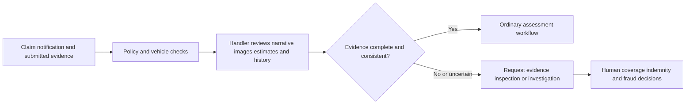
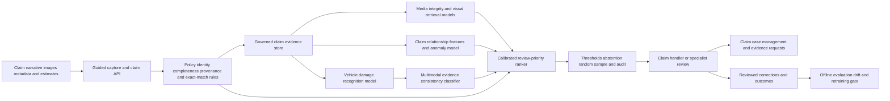

# FIN-002 AI-assisted motor-claim evidence and assessment assurance

## Classification

- **Segment:** financial-services
- **Primary market / jurisdiction:** Brazil
- **Evidence reference date:** 2026-07-19; Brazilian market data through May 2026; current Brazilian insurance-contract framework and operating context
- **Index summary:** Brazilian motor insurers can combine guided image capture, vehicle and policy data, damage recognition, evidence-integrity checks, and claim-network anomalies to prioritize human review without automating coverage, fraud, or indemnity decisions.
- **Company profile / size:** Brazilian motor insurers and insurtech claims administrators with digital first-notice-of-loss and material claim volume
- **Opportunity type:** industry-solution
- **Status:** hypothesis
- **Confidence:** medium
- **Complexity:** large
- **Horizon:** medium
- **Risk:** regulated
- **Solution evidence level:** pilot
- **Operational maturity:** early
- **Azure fit:** high
- **AI dependency:** core
- **Primary AI role:** multimodal
- **Intelligent capability:** multimodal vehicle-damage recognition, evidence-integrity classification, claim-relationship anomaly detection, and review-priority ranking
- **Repository alignment:** extend-kit

## Problem

Motor-claim handlers must reconcile the policy, insured vehicle, first-notice narrative, photographs, repair estimates, prior inspections, prior claims, involved parties, service providers, and sometimes police or assistance records. Digital intake accelerates submission but also creates inconsistent image quality, incomplete evidence, duplicate or unrelated damage, manipulated media, and fragmented relationships that are difficult to assess consistently at scale.

The recurring operational problem is not simply fraud detection. It is deciding which claims are sufficiently complete and internally consistent for ordinary handling, which require more evidence, which need technical inspection, and which deserve specialist investigation. Manual review of every image and relationship is slow; fully automatic settlement or accusation creates unacceptable false-positive and consumer-harm risk.

## Brazil applicability and current context

Brazil has a large and active insurance market. Susep reported R$ 172.89 billion in supervised-sector revenue and R$ 104.96 billion in indemnities, benefits, redemptions, and prizes from January through May 2026. Motor insurance alone reached R$ 25.41 billion in premiums in those five months. This establishes meaningful operational volume and financial relevance, although it does not by itself prove that a specific model will reduce claim cost.

Brazilian motor insurers already use remote image intake and model-assisted claim operations. A current local industry report describes insurers using submitted images to identify vehicle damage and accelerate handling, while sector representatives have publicly discussed attempts involving reused, staged, or digitally manipulated images. These are favorable plausibility signals, not independent proof of model accuracy or ROI.

The solution must operate under Brazilian insurance regulation, the new insurance-contract framework, consumer-protection duties, and LGPD. It must preserve contestability, traceability, proportional review, and professional authority. A model score cannot establish fraud, deny coverage, set final indemnity, or replace required technical and legal analysis.

## Evidence

### Confirmed problem evidence

- Susep reported R$ 25.41 billion in motor-insurance premiums during January–May 2026, within a supervised market that paid R$ 104.96 billion in indemnities, benefits, redemptions, and prizes during the same period.
- CNseg reported that motor-insurance indemnities in Rio de Janeiro alone approached R$ 900 million from January through April 2026, illustrating the material claim flow in one state and one operating context.
- Brazilian reporting in April 2025 documented sector concern over generated or manipulated vehicle-damage images and described existing use of guided capture, metadata, geolocation, and image-analysis controls.

### Favorable solution evidence

- Brazilian insurers publicly report using image analysis and automation in motor claims, including support for damage identification and faster processing. This supports operational plausibility while remaining vendor- or company-reported evidence.
- Visual damage recognition, duplicate-image similarity, metadata consistency, tabular claim models, and relationship-graph analysis are technically separable and can be evaluated against a human-reviewed golden set.
- Susep provides anonymized automobile, rural, and comprehensive-insurance datasets obtained from insurer submissions. These public datasets cannot replace customer claim images or investigation outcomes, but can support market understanding, synthetic-case design, and prototype data contracts.

### Counter-evidence and limitations

- Image-manipulation detectors and fraud models are adversarial targets. Current research shows that attackers may adapt records or media to evade classifiers, so a single detector should not be treated as authoritative.
- Generated-image detection can produce false positives after resizing, compression, screenshots, messaging-app transmission, repair-shop editing, or unusual lighting. Therefore, integrity scores must trigger evidence requests or review rather than automatic adverse decisions.
- Fraud labels are selective and delayed: investigated cases differ from ordinary claims, confirmed fraud is rare, and investigator decisions can encode historical bias. Training directly on investigation labels can reproduce the previous queue rather than discover true incremental risk.
- Strong non-AI controls—guided in-app capture, liveness prompts, metadata checks, duplicate hashes, policy rules, repair-estimate validation, random inspection, and segregation of duties—may solve much of the problem. The prototype must demonstrate incremental value beyond them.

### Inference

- A bounded evidence-assurance layer is more defensible than an autonomous fraud engine: models can rank inconsistencies and missing evidence while deterministic controls and specialists preserve claim decisions.
- Combining independent signals—damage recognition, capture integrity, prior-image similarity, claim relationships, and policy consistency—should be more robust than relying on a generic generated-image detector.

### Unknowns

- The share of claims with usable guided images, prior inspections, repair estimates, and confirmed outcomes at a candidate insurer.
- Whether local investigation outcomes are sufficiently consistent to form training labels, or whether the prototype should begin with weak supervision and reviewer-defined golden cases.
- Incremental precision, review capacity saved, consumer friction, and false-positive distribution after comparison with the insurer's strongest deterministic rules.
- The cost and latency of processing multiple images per claim at production volume.

### Sources

- [Susep divulga Boletim com dados do mercado supervisionado até maio de 2026](https://www.gov.br/susep/pt-br/central-de-conteudos/noticias/2026/julho-1/susep-divulga-boletim-com-dados-do-mercado-supervisionado-ate-maio-de-2026) — Brazil; published 2026-07-14; current market size and indemnity context.
- [Susep publica Relatório de Gestão 2025](https://www.gov.br/susep/pt-br/central-de-conteudos/noticias/2026/abril/susep-publica-relatorio-de-gestao-2025) — Brazil; published 2026-04-01; current regulatory and institutional context.
- [Criminalidade pressiona seguro de automóveis no Rio e eleva indenizações em 13,5%](https://cnseg.org.br/noticias/criminalidade-pressiona-seguro-de-automoveis-no-rio-e-eleva-indenizacoes-em-13-5) — Brazil; published 2026-06-30; current motor-claim operating context.
- [Fraude no seguro: golpistas usam IA para fingir problemas com o carro](https://www.uol.com.br/carros/colunas/paula-gama/2025/04/10/ia-e-usada-para-criar-fraudes-no-seguro-e-tambem-para-combate-las.htm) — Brazil; published 2025-04-10; local problem and current-control evidence with sector interview.
- [Seguradoras avançam no seguro auto com implemento de tecnologia nas operações](https://www.sindicatoseguradoras.com.br/2025/09/01/seguradoras-avancam-no-seguro-auto-com-implemento-de-tecnologia-nas-operacoes/) — Brazil; published 2025-09-01; reported comparable operating patterns and limitations.
- [Susep disponibiliza base de dados sobre seguros de automóvel, rural e compreensivo](https://www.gov.br/susep/pt-br/central-de-conteudos/noticias/2024/junho/susep-disponibiliza-base-de-dados-sobre-seguros-de-automovel-rural-e-compreensivo) — Brazil; published 2024-06-20; stable public-data availability, outside the primary current-evidence window.
- [A new wave of vehicle insurance fraud fueled by generative AI](https://arxiv.org/abs/2510.19957) — international; published 2025-10-22; technical threat and detector-limitation discussion, not Brazilian legal or market evidence.
- [Inductive inference of gradient-boosted decision trees on graphs for insurance fraud detection](https://arxiv.org/abs/2510.05676) — international; published 2025-10-07; technical plausibility and graph-model limitations.

## Current process

## Baseline without AI

- **Current baseline:** manual handler review supported by policy rules, document checklists, repair-estimate controls, prior-claim lookup, and specialist escalation.
- **Strongest realistic non-AI alternative:** guided in-app capture with liveness prompts, immutable timestamps, geolocation with consent, cryptographic hashes, exact duplicate checks, policy and vehicle validations, deterministic inconsistency rules, random inspection, and human review queues.
- **Baseline strengths:** explainable, auditable, easier to contest, robust for known rules, and capable of preventing common reuse or incomplete-submission patterns.
- **Baseline limitations:** cannot reliably recognize semantically similar damage across changed angles, rank complex cross-claim relationships, or prioritize subtle combinations of weak signals at high volume.
- **Context where intelligence may add incremental value:** claims with many images, ambiguous damage, conflicting narrative and visual evidence, repeated actors or repair providers, and limited specialist-review capacity.
- **Condition where the non-AI baseline should be preferred:** low-volume operations, insufficient historical outcomes, poor capture quality, or when deterministic checks already meet review-capacity and loss objectives.

## Proposed solution

Introduce an evidence-assurance service between digital claim intake and specialist decisions. Deterministic controls first validate policy status, vehicle identity, required fields, capture provenance, exact duplicates, dates, and known business rules. Model-based components then identify visible damage, compare the damage with the narrative and prior images, estimate evidence quality, detect non-obvious similarity or relationship anomalies, and rank the next review action.

The output is not `fraud` or `not fraud`. It is an evidence packet containing observations, source links, confidence, missing items, comparable prior evidence, and a recommended route such as ordinary handling, request another guided capture, technical inspection, or specialist review. A claim handler confirms or overrides the route. Coverage, liability, repair authorization, indemnity, accusation, and adverse customer action remain outside model authority.

## Where AI enters

### AI role map

| Process stage | AI component | AI type / model family | What it does | Runtime mode | Output | Human or deterministic control |
| --- | --- | --- | --- | --- | --- | --- |
| Image intake | Vehicle and damage recognizer | Computer vision / multimodal model | Detects vehicle regions, visible damage type, location, severity band, and image-quality limitations | asynchronous near-real-time | structured damage observations with confidence and image regions | minimum quality rules, abstention, handler correction |
| Evidence assurance | Media-integrity and similarity classifier | Deep vision embeddings plus supervised classifier | Ranks possible manipulation, screen recapture, synthetic alteration, or reuse and retrieves similar prior images | asynchronous | integrity indicators and nearest evidence matches | hashes and capture rules remain authoritative; no automatic adverse action |
| Claim consistency | Narrative-to-evidence consistency model | Multimodal model or text and vision embeddings with calibrated classifier | Compares reported event, damage description, vehicle area, timestamps, and submitted images | asynchronous | consistency score with supporting and conflicting fields | source-linked observations, threshold, abstention, human review |
| Relationship review | Claim-network anomaly model | Graph features with gradient boosting or graph ML | Detects unusual repeated relationships among vehicles, claimants, accounts, phones, repair providers, addresses, and prior claims | batch plus event refresh | anomaly features and related-case candidates | deterministic entity resolution, access restrictions, investigator validation |
| Queue routing | Review-priority ranker | Calibrated gradient boosting or learning-to-rank | Combines model outputs and deterministic signals to rank next-best review route within capacity | online or frequent batch | review priority and recommended evidence action | hard policy rules, queue limits, random control sample, handler override |

### Required distinctions

- **Primary AI role:** multimodal recognition, anomaly detection, classification, retrieval, and ranking/recommendation.
- **Model family:** computer vision or multimodal foundation model for damage observations; visual embeddings and supervised classifiers for integrity and similarity; graph-derived features with gradient boosting or graph ML for relationship anomalies; calibrated learning-to-rank for review prioritization.
- **Training requirement:** pretrained vision inference plus supervised calibration on insurer-reviewed images; supervised tabular and ranking training when reliable outcomes exist; synthetic transformations for robustness testing, not as proof of real-world accuracy.
- **Training location and cadence:** offline initial training or calibration in the insurer-controlled environment; periodic retraining after label-quality and drift review, not automatic continuous learning from every handler action.
- **Inference location:** private cloud asynchronous pipeline, with an online routing endpoint after deterministic validation.
- **Agent role:** not used. The system does not plan or execute claim actions through tools.
- **LLM role:** not required in the initial prototype. A later LLM could structure free-text narratives only if every extracted field remains linked to source text; it would not decide claim outcome.
- **Non-LLM intelligence:** computer vision, multimodal consistency classification, visual retrieval, graph anomaly features, calibrated gradient boosting, and learning-to-rank.
- **Not AI:** policy validation, exact calculations, cryptographic hashes, capture workflow, required-document rules, identity and authorization checks, queue orchestration, audit logs, dashboards, approvals, and final claim decisions.

## Intelligent capability details

- **Technique / model family:** multimodal vehicle-damage recognition; image-integrity and similarity classification; graph-feature anomaly detection; calibrated review-priority ranking.
- **Why it is necessary:** semantic image comparison and cross-claim relationship patterns cannot be covered comprehensively by exact hashes, static thresholds, and manual inspection at scale.
- **Inputs:** guided claim images and metadata; policy and vehicle fields; claim narrative; prior inspection images; repair estimates; prior claims; permitted claimant, payment, phone, address, and provider relationships; deterministic rule results.
- **Outputs:** damage observations, evidence-quality score, similarity candidates, consistency conflicts, relationship anomalies, calibrated review priority, abstention, and recommended evidence action.
- **Training / grounding / optimization assumptions:** a reviewed golden set representing ordinary, incomplete, manipulated, duplicated, ambiguous, and confirmed investigated cases; temporal splitting; careful separation of post-decision leakage; cost-sensitive evaluation under severe imbalance.
- **Evaluation:** compare each component and the combined ranker with the strongest deterministic baseline using precision at review capacity, recall of confirmed material cases, calibration, subgroup analysis, handler correction, and customer-friction metrics.
- **Fallback and controls:** deterministic-only routing, random inspection sample, model abstention, source evidence display, specialist confirmation, full audit, version rollback, and manual claim handling.

## Data and integration assumptions

- **Data owners and access path:** claims, underwriting, fraud investigation, repair-network, customer-service, data-protection, and security teams through governed warehouse or operational APIs.
- **Expected volume, history, frequency, and coverage:** ideally 12–24 months of claims with multiple images and temporal outcomes; event intake throughout the day; weekly or daily relationship refresh.
- **Labels, outcomes, feedback, or simulation available:** claim route, evidence requests, inspection result, handler correction, confirmed duplicate, confirmed manipulation, investigation disposition, and payment outcome; synthetic image degradation and manipulation only for robustness testing.
- **Known quality, imbalance, missingness, and leakage risks:** rare confirmed fraud, selective investigation, inconsistent closure codes, duplicated images, messaging-app compression, missing prior inspections, and leakage from post-investigation notes or final payment decisions.
- **Brazilian or local-context representativeness:** local vehicle fleet, plate formats, repair practices, road conditions, capture devices, regional lighting, weather, customer channels, and Portuguese narratives must be represented.
- **Privacy, retention, consent, surveillance, or sharing constraints:** LGPD purpose limitation, minimum necessary relationship data, restricted investigator access, retention schedules, customer notice, and prohibition on unrelated biometric or location profiling.
- **Integration and synchronization assumptions:** claim platform, policy administration, image object store, identity controls, repair-estimate workflow, case management, and audit events expose stable identifiers and timestamps.
- **Drift and change sources:** new vehicle models, camera software, compression, repair patterns, fraud tactics, generated-media tools, claim products, policy wording, and investigator practices.
- **Minimum viable data for a prototype:** a de-identified sample of claims with images, narrative, basic policy and vehicle fields, prior-image references, deterministic-rule outcomes, and a specialist-reviewed golden set; relationship data can begin with synthetic or narrowly scoped links.

## Prototype validation plan

- **Prototype scope / process slice:** one motor product and one claim route, evaluating evidence completeness, damage consistency, duplicate or manipulated-media signals, and specialist-review ranking; no automated settlement or denial.
- **Users, sites, assets, documents, events, or simulated cases:** 5–10 experienced handlers or investigators; historical claims plus controlled synthetic transformations and blinded ordinary cases.
- **Baseline or comparison:** current manual queue plus guided-capture and deterministic-rule baseline.
- **Required data and integrations:** offline snapshot of claim images and structured fields; no production write integration required for the first evaluation.
- **Model-quality metrics:** damage-region precision and recall; integrity precision and recall by transformation; retrieval recall@k; relationship-case precision@k; ranking precision and recall at fixed review capacity; calibration error; abstention rate.
- **Business or workflow metrics:** time to first evidence decision, specialist cases reviewed per day, avoidable repeat evidence requests, investigation yield, claim-cycle-time distribution, and queue age.
- **Human acceptance, correction, or override metrics:** acceptance by recommendation type, correction rate by field, override reason, perceived evidence usefulness, review time, and automation-bias checks.
- **Safety and compliance boundaries:** no automatic fraud label, denial, settlement amount, coverage interpretation, payment block, cancellation, or customer accusation; every adverse path requires accountable human review and recorded evidence.
- **Failure or redesign criteria:** no material gain over deterministic routing at fixed review capacity; unacceptable false-positive concentration; poor calibration; integrity detector fails under ordinary compression; handlers cannot understand or contest evidence; or image processing cost exceeds plausible workflow value.
- **Evidence required before a pilot or broader implementation:** temporal holdout results, subgroup and device-condition analysis, red-team manipulation tests, legal and privacy review, operating-cost estimate, handler acceptance, rollback plan, and monitored shadow-mode performance.

## Macro architecture

## Capabilities and possible technologies

- Application and workflow capabilities: guided evidence intake, evidence packet, handler review, override reasons, case routing, and audit trail.
- Data capabilities: governed image storage, point-in-time claim features, relationship graph, label versioning, temporal datasets, and lineage.
- Integration capabilities: claim administration, policy system, repair estimates, identity, object storage, case management, and notification APIs.
- Required AI / ML capabilities: computer vision, multimodal classification, visual retrieval, graph features, anomaly detection, calibration, and ranking.
- Training, grounding, recognition, or optimization capabilities: image annotation, active sampling, temporal evaluation, transformation robustness, cost-sensitive learning, and drift monitoring.
- Agent and tool-use capabilities, or `not used`: not used.
- LLM / foundation-model capabilities, or `not used`: not used in the initial prototype; optional source-linked narrative extraction later.
- Evaluation and model-operations capabilities: model registry, shadow deployment, slice metrics, calibration monitoring, data drift, version rollback, and human-feedback quality review.
- Security and governance capabilities: private networking, encryption, least privilege, image access logging, retention, purpose limitation, and adverse-action controls.
- Azure services that may fit: Azure Blob Storage, Azure AI Vision or Azure Machine Learning endpoints, Azure Machine Learning training and registry, Azure AI Search vector retrieval, Azure Databricks or Fabric, Azure Functions, Event Grid, API Management, Key Vault, Monitor, and Purview.
- Non-Azure or open-source alternatives worth considering: PyTorch, timm, Ultralytics, OpenCV, pgvector or OpenSearch, LightGBM or XGBoost, NetworkX or Neo4j, MLflow, Evidently, and object storage compatible with S3.

## Possible gains

- Faster identification of incomplete or inconsistent evidence before specialist time is consumed.
- Better allocation of scarce technical-inspection and investigation capacity.
- More consistent evidence requests with source-linked reasons.
- Earlier identification of repeated images, actors, providers, or payment relationships that static rules miss.
- Reduced manual inspection of low-risk ordinary claims only if the model demonstrates reliable abstention and calibration.

## Metrics for validation

### Business and operational metrics

- Review time and claim-cycle-time distribution versus deterministic baseline.
- Specialist-review yield and queue age at fixed review capacity.
- Repeat evidence requests, customer complaints, reopened cases, and avoidable inspection rate.
- Confirmed material inconsistencies captured before payment, without inventing a monetary benefit percentage.

### Intelligent-capability metrics

- Precision, recall, calibration, and abstention by damage type, device condition, region, vehicle group, and recommendation route.
- Recall@k for duplicate or related evidence and precision@k for specialist investigation.
- Human acceptance, correction, override, and evidence-usefulness rates.
- Robustness under compression, cropping, screenshots, low light, weather, altered metadata, and synthetic manipulation.

## Risks, limits, and controls

- Privacy and sensitive data: images may reveal faces, locations, documents, homes, and third parties; minimize capture, redact where appropriate, restrict access, and enforce retention.
- Brazilian regulatory or policy constraints: comply with Susep rules, insurance-contract duties, consumer protection, LGPD, explanation and contestability requirements, and company-specific claims governance.
- Human decision boundaries: only authorized professionals decide coverage, liability, settlement, investigation, accusation, cancellation, or adverse customer treatment.
- Model or policy failure modes: ordinary image degradation mistaken for manipulation, hidden damage not visible, regional or vehicle bias, selective labels, graph guilt by association, and automation bias.
- Agent or tool-execution failure modes, when applicable: not applicable; no agent executes claim actions.
- LLM hallucination, grounding, or prompt-injection risks, when applicable: not applicable in the initial prototype.
- Comparable failures and applicable lessons: adversarial research and generated-media limitations require layered evidence, abstention, random controls, and no single-detector adverse action.
- Bias, drift, weak labels, or insufficient feedback: separate investigation selection from confirmed outcomes, review label policy, monitor slices, and preserve blinded random samples.
- Integration and data risks: missing identifiers, post-decision leakage, inconsistent image retention, poor timestamps, and entity-linking errors can create misleading anomalies.
- Adoption and change-management risks: handlers may over-trust a score or reject a noisy queue; present source observations, collect structured override reasons, and evaluate time burden.
- Prototype cost or operational assumptions: multi-image inference, vector indexing, graph refresh, annotation, specialist review, and secure retention are principal cost drivers.

## Fit score

| Dimension | Score | Rationale |
| --- | ---: | --- |
| Problem evidence and relevance | 18/20 | Current Susep and CNseg data establish a material Brazilian motor-insurance and claims context; local reporting documents digital evidence and manipulation concerns. |
| Business or operational value | 18/20 | Better evidence routing could improve claim speed, specialist capacity, consistency, and loss control without requiring autonomous decisions. |
| Technical feasibility | 17/20 | A bounded offline prototype is testable with claim images, metadata, reviewer labels, synthetic transformations, and deterministic comparisons; imbalance and adversarial drift remain significant. |
| Reuse potential | 18/20 | Guided document and image intake, evidence retrieval, anomaly features, ranking, HITL review, and model governance generalize across claims and regulated workflows. |
| Strategic differentiation | 18/20 | The layered multimodal and relationship evidence packet adds capability beyond workflow automation while retaining a strong deterministic and human control plane. |
| **Total** | **89/100** | Publish as a medium-confidence prototype hypothesis, not a proven production outcome. |

## Repository relationship

- Existing references that may be reused: document-intelligence patterns, governed ingestion, Azure ML foundations, search and retrieval building blocks, event-driven integration, identity, monitoring, and human-review workflows.
- Missing capabilities exposed by this opportunity: reusable multimodal evidence-assurance contract, image provenance and transformation test harness, calibrated review-ranking module, relationship-anomaly feature service, and adverse-action governance pattern.
- Potential building blocks: guided evidence capture, evidence object store, image annotation and evaluation kit, vector similarity service, graph feature pipeline, calibrated ranker, reviewer console, and audit event schema.
- Potential composed solution: regulated claims evidence assurance accelerator combining deterministic validation, multimodal recognition, visual retrieval, graph anomalies, and human-controlled case routing.
- Reasons to keep it outside the current kit, when applicable: insurer-specific coverage logic, repair assessment, fraud investigation procedures, proprietary labels, and claim decisions remain customer solution code and governance.

## Duplicate control

- **Problem keys:** motor claim image review; evidence integrity; vehicle damage consistency; repair assessment triage; claim investigation capacity
- **Capability keys:** vehicle damage recognition; visual similarity retrieval; media manipulation classification; claim relationship anomaly; review priority ranking
- **Research queries used:** `site:gov.br/susep 2025 sinistros seguros fraude relatório Brasil`; `site:cnseg.org.br fraude seguros automóvel 2025 sinistros`; `site:cnseg.org.br sinistros auto 2025 Brasil`; `Brasil 2025 seguradoras fraude sinistro auto fotos IA`; `2025 Brazil insurance claims fraud detection machine learning false positives research`
- **Related opportunities:** FIN-001 addresses real-time Pix scam and mule-account intervention; CROSS-002 addresses supplier payment-change assurance. Neither handles insurance-claim images, vehicle damage, repair evidence, or claim-specific relationships.
- **Uniqueness statement:** This opportunity focuses on multimodal motor-claim evidence quality and human review routing, not payment-transaction fraud, account networks, or supplier-master changes.

## Next decision

- prototype candidate.

Implementation approval remains an explicit human decision.