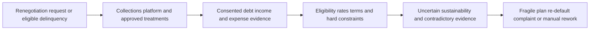
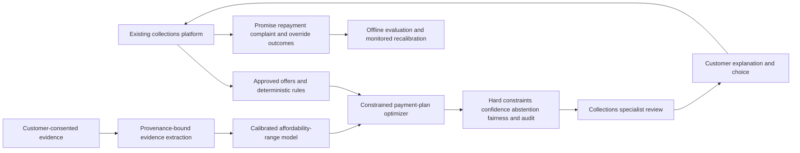

# FIN-003 AI-assisted debt-renegotiation affordability assurance

## Classification

- **Segment:** financial-services
- **Primary market / jurisdiction:** Brazil
- **Evidence reference date:** 2026-07-20
- **Index summary:** Brazilian lenders can test permitted renegotiation offers against consented debt and income evidence, using extraction and constrained optimization to rank sustainable plans while customers and authorized staff retain final choice.
- **Organization archetype / size:** Brazilian retail bank or large credit cooperative with national collections operations
- **Primary actor:** assisted-collections specialist and collections-policy owner
- **Simulated process:** prepare and approve a debt-renegotiation offer for a vulnerable or potentially over-indebted retail customer
- **Opportunity type:** integration
- **Status:** hypothesis
- **Confidence:** medium
- **Complexity:** large
- **Horizon:** medium
- **Risk:** regulated
- **Solution evidence level:** conceptual
- **Operational maturity:** unvalidated
- **Existing-solution disposition:** integrate
- **Azure fit:** high
- **AI dependency:** core
- **Primary AI role:** optimization
- **Intelligent capability:** consented financial-evidence extraction, affordability uncertainty estimation, constrained payment-plan optimization, and human-review ranking
- **Repository alignment:** new-solution

## Operational simulation

### Operating archetype

- **Organization type and approximate size:** retail institution with millions of consumer accounts and centralized collections operations.
- **Primary actor and authority:** collections specialist may present only policy-approved offers; policy, legal, risk, and customer authorities remain separate.
- **Process trigger:** customer requests renegotiation or an account becomes eligible for a recovery program.
- **Actor objective and completion condition:** present understandable, eligible options that the customer can plausibly sustain; finish with customer choice, evidence, consent, and auditable approval.
- **Inputs, systems, documents, devices, or physical context:** contract and arrears, permitted offer catalogue, SCR or customer-provided debt evidence, income and essential-expense declarations, transaction summaries when consented, CRM, collections platform, call/chat records, and program rules.
- **Rules, deadlines, safety, cost, and compliance constraints:** CDC and superindebtedness protections, CMN customer-treatment principles, LGPD minimization, approved discount/rate/term boundaries, no autonomous legal conclusion, and no coercive personalization.
- **Upstream and downstream handoffs:** eligibility engine and debt ledger -> collections specialist -> customer -> supervisor/compliance for exceptions -> contract generation and servicing.

### Assumptions

- **Known operating facts already available:** Brazil has current debt-renegotiation programs; SCR consolidates reported financial-system obligations; financial institutions must consider customer profiles and vulnerabilities and maintain consistent collection procedures.
- **Simulation assumptions requiring validation:** customers will consent to enough evidence for affordability analysis; current platforms do not consistently test offer sustainability across fragmented obligations; accepted-offer outcomes can be linked without unfairly penalizing hardship.
- **Synthetic events or cases introduced:** conflicting income records, an unreported essential expense, delayed SCR data, and a campaign-driven workload spike.

### Workflow simulation

| Stage | Trigger / available information | Actor and system action | Decision or uncertainty | Current handling | Friction, risk, or missed outcome | Feedback signal |
| --- | --- | --- | --- | --- | --- | --- |
| Eligibility | Delinquency, product, balance, dates, campaign rules | Rules engine lists allowed treatments | Is the customer and debt eligible? | Deterministic rules | Incorrect or stale attributes require re-entry | Eligibility correction and audit result |
| Evidence | Customer declaration, SCR/export, optional transaction summary | Specialist reconciles obligations, income, and essential expenses | Which values are current, recurring, duplicated, or uncertain? | Manual review and fixed fields | Fragmented evidence and optimistic self-reporting | Customer correction and document acceptance |
| Offer construction | Approved discounts, terms, rates, grace periods | Platform calculates permitted plans | Which plan is sustainable under uncertainty rather than merely affordable in one month? | Static affordability ratios or predefined plans | Re-default, over-concession, or unsuitable term | Promise kept, missed payment, early re-contact |
| Explanation and choice | Candidate plans and contractual effects | Specialist presents options | Does the customer understand trade-offs and freely choose? | Script and contract summary | Complexity, automation bias, or pressure | Comprehension confirmation, complaint, cancellation |
| Approval and servicing | Selected plan and evidence trail | Human approves exceptions; systems generate contract | Is the evidence and rationale sufficient? | Workflow and supervisor review | Weak traceability between evidence, constraints, and offer | QA finding, override, repayment outcome |

### Scenario variants

#### Normal flow

The debt and program eligibility are clear, consented evidence is consistent, deterministic rules produce several plans, and the specialist presents a ranked shortlist with uncertainty and total-cost trade-offs. The customer chooses; the institution records evidence and rationale.

#### Exception flow

SCR, payroll, transaction summary, and customer declaration disagree. A recent health or housing expense changes disposable income. The system abstains from a precise affordability score, highlights conflicts, excludes unsupported assumptions, and routes the case to assisted review rather than maximizing recovery.

#### Peak or degraded flow

A national renegotiation campaign creates a large queue while one data source is delayed. The deterministic layer continues eligibility and calculations. The intelligent layer uses only timestamped available evidence, increases abstention, and ranks cases needing human clarification; it does not infer missing income.

### Opportunity points derived from the simulation

| Decision, exception, or uncertainty | Strongest deterministic response | Remaining gap | Candidate intelligent role | Expected incremental outcome | Main risk |
| --- | --- | --- | --- | --- | --- |
| Reconcile heterogeneous evidence | Structured forms, source timestamps, duplicate rules | Narrative and document evidence remains inconsistent | Extraction and contradiction classification | Less manual reconciliation | Incorrect extraction of sensitive facts |
| Compare sustainable plans | Hard eligibility and payment constraints | Multiple objectives and uncertain cash flow | Constrained optimization with uncertainty | Fewer obviously fragile plans | Optimizing lender recovery over customer suitability |
| Prioritize assisted review | Thresholds and exception queues | Many cases breach multiple weak signals | Calibrated review ranking | Focus scarce specialists on ambiguous cases | Unequal escalation burden |
| Generate persuasive collection messages | Approved templates | Personalization is not necessary for assurance | Rejected | None | Manipulation and hallucination |

## Selected problem and opportunity hypothesis

The selected gap is not debt negotiation itself. Existing collections platforms already manage cases, treatments, payment plans, channels, and next-best actions. The opportunity is an assurance layer that tests policy-approved offers against consented, timestamped evidence and uncertainty, then ranks sustainable options and review needs. It never declares legal superindebtedness, sets policy, contacts the customer autonomously, or accepts a contract.

## Brazil applicability and current context

The federal Novo Desenrola Brasil - Famílias service was updated on 18 May 2026 and provides current eligibility, rate, term, and debt-category rules. Ministry of Finance guidance published on 2 July 2026 directs eligible families to negotiate with participating institutions. Banco Central's SCR guidance, updated in 2026, describes a consolidated view of debts and commitments useful for assessing indebtedness and renegotiation. The Superindebtedness Law requires responsible credit and preservation of the minimum existential, while CMN Resolution 4,949 requires fair treatment considering customer vulnerabilities and consistent collection procedures.

Research confirmed the scale and current operating trigger, but did not prove that a new model improves Brazilian repayment or consumer outcomes. The prototype must therefore compare against rules and existing platform configuration.

## Existing solutions and differentiation

### Existing solutions reviewed

| Solution / platform | Owner or vendor | Current capabilities | Evidence date | Coverage overlap |
| --- | --- | --- | --- | --- |
| Novo Desenrola Brasil - Famílias and simulator | Ministério da Fazenda | Eligibility, permitted conditions, simulation and customer guidance | May-July 2026 | Rules, calculations and customer journey |
| SCR / Registrato | Banco Central do Brasil | Consolidated reported debts, limits and status | 2026 | Evidence source, not offer assurance |
| Serasa Limpa Nome integration | Serasa Experian | Digital renegotiation and API-scale creditor integration | March 2026 case report | Offer delivery and operational scale |
| Pega Collections / Customer Decision Hub | Pegasystems | Case management, treatments, next-best action, payment plans and exception management | 2025 product documentation | Core collections workflow and decisioning |
| PowerCurve Collections | Experian | Data connectivity, decisioning, workflow and self-service | current product page | Core collections management and automated decisioning |
| FICO optimization | FICO | Decision optimization across lending and collections | April 2026 case | Optimization and strategy design |

### Gap and disposition

- **What is already solved:** eligibility, plan calculation, case management, contact strategy, next-best action, self-service negotiation and portfolio optimization.
- **Overlap with the simulated candidate:** substantial overlap in collections workflow and offer decisioning.
- **Material uncovered gap:** evidence-linked, uncertainty-aware assurance that a permitted offer is sustainable and appropriate under Brazilian vulnerability and responsible-credit controls.
- **Underserved actor, scenario, exception, integration, decision, or outcome:** assisted specialist handling contradictory evidence or hardship exceptions during high-volume campaigns.
- **Disposition:** integrate
- **Why changing vendor, cloud, model, UI, or architecture is insufficient:** the value depends on a new governed control objective, evidence contract, evaluation baseline, and customer-protection boundary across existing systems.
- **Differentiation statement:** add a read-only suitability and evidence-assurance layer to existing collections platforms; do not replace their case, treatment, or optimization engines.

## Evidence map

### Simulated observations

- Contradictory debt and income evidence can make a policy-valid plan operationally fragile.
- Peak campaigns increase pressure to accept incomplete evidence.

### Confirmed problem evidence

- Current federal renegotiation rules target low-income families with delinquent consumer credit.
- SCR provides a consolidated, though reported and time-bounded, debt view.
- Brazilian law and CMN rules establish responsible-credit, vulnerability, transparency, and collection-governance duties.

### Existing-solution evidence

- Pega, Experian, FICO, Serasa and government platforms already cover major workflow, decisioning, optimization and negotiation functions.

### Favorable evidence for the uncovered gap

- Constrained optimization and calibrated ranking can be replayed against historical plans without autonomous action.

### Counter-evidence and limitations

- Existing decision platforms may already support the required constraints through configuration.
- AI-mediated debt interactions can be perceived differently on fairness and empathy; the selected design avoids autonomous negotiation.
- LLM debt-negotiation research reports over-concession risk, reinforcing the decision not to use an autonomous negotiating agent.

### Inference

- A narrow assurance layer may add value only where evidence is heterogeneous and existing rules cannot represent uncertainty.

### Unknowns

- Incremental reduction in re-default, complaints or review time; data consent rates; representativeness; vendor extension limits; and legal interpretation of affordability evidence.

### Sources

- [Novo Desenrola Brasil - Famílias](https://www.gov.br/pt-br/servicos/novo-desenrola-brasil-familias) — Brazil; updated 2026-05-18; current program context.
- [Renegociação de dívidas para famílias](https://www.gov.br/fazenda/pt-br/acesso-a-informacao/acoes-e-programas/renegociacao-de-dividas/perguntas-frequentes/renegociacao-de-dividas-para-familias) — Brazil; 2026-07-02; current rules.
- [Relatório de Empréstimos e Financiamentos - SCR](https://www.bcb.gov.br/meubc/relatorioemprestimofinanciamento) — Brazil; updated 2026; evidence source.
- [Lei 14.181/2021](https://www.planalto.gov.br/ccivil_03/_ato2019-2022/2021/lei/l14181.htm) — Brazil; responsible credit and superindebtedness.
- [Resolução CMN 4.949](https://www.bcb.gov.br/estabilidadefinanceira/exibenormativo?numero=4949&tipo=Resolu%C3%A7%C3%A3o+CMN) — Brazil; customer vulnerabilities and collection governance.
- [Pega Collections 2025](https://academy.pega.com/mission/pega-collections/v3) — product capability and overlap.
- [Experian debt recovery](https://www.experian.com/business-services/debt-recovery.html/) — product capability and overlap.
- [FICO 2026 optimization case](https://investors.fico.com/news-releases/news-release-details/erste-group-offers-tailored-financing-solutions-across-countries) — optimization plausibility and overlap.
- [AI in Debt Collection: Estimating the Psychological Impact on Consumers](https://arxiv.org/abs/2602.00050) — 2026 counter-evidence.
- [Debt Collection Negotiations with Large Language Models](https://arxiv.org/abs/2502.18228) — over-concession counter-evidence.

## Current process and remaining gap

## Baselines

- **Current manual or system baseline:** specialist review plus approved plans and affordability ratios.
- **Existing product or platform baseline:** configured Pega, Experian, FICO, Serasa or equivalent collections decisioning.
- **Strongest realistic non-AI alternative:** structured evidence form, deterministic disposable-income bands, explicit hardship rules, and supervisor queue.
- **Baseline strengths:** interpretable, cheap, stable and auditable.
- **Baseline limitations:** weak handling of contradictory documents, uncertainty and multi-period trade-offs.
- **Exact simulated condition where intelligence may add incremental value:** multiple permitted plans plus inconsistent evidence and uncertain future cash flow.
- **Condition where adoption, process redesign, or deterministic automation should be preferred:** clean structured evidence and a small rules-complete offer catalogue.

## Proposed solution or extension

Integrate a read-only assurance service with the existing collections platform. It extracts only consented fields with provenance, reconciles conflicts, estimates affordability ranges rather than a single truth, and runs constrained optimization over already approved offers. It returns a ranked shortlist, uncertainty, violated soft constraints and review reasons. Rules remain authoritative; the specialist and customer retain final authority.

## Where AI enters

### AI role map

| Process stage | AI component | Primary role and model family | Inputs | What it does | Training / grounding | Runtime | Output | Deterministic or human control |
| --- | --- | --- | --- | --- | --- | --- | --- | --- |
| Evidence reconciliation | Financial evidence extractor | extraction; document model and restricted LLM | consented documents and structured exports | extracts values with source spans and flags contradictions | pretrained, schema-grounded, no free-form factual invention | asynchronous | field candidates, provenance, confidence | schema validation and specialist confirmation |
| Affordability estimation | Cash-flow uncertainty model | prediction; probabilistic tabular/time-series model | verified income, obligations, expense bands and history | estimates payment-capacity ranges and uncertainty | supervised only on reviewed historical outcomes; monitored by cohort | batch/online scoring | calibrated range and abstention | hard exclusions and no adverse autonomous action |
| Offer comparison | Constrained plan optimizer | optimization; mathematical optimization plus calibrated outcome estimates | approved plans, ranges and policy constraints | ranks feasible plans across sustainability, total cost and term | policy constraints versioned; replay before release | synchronous | ranked plans and trade-offs | platform rules, policy owner and customer choice |
| Review routing | Exception ranker | ranking; gradient-boosted or learning-to-rank model | conflicts, missingness and uncertainty | prioritizes assisted review | reviewer outcomes and QA labels | queue batch | priority and reasons | thresholds, fairness monitoring and manual override |

### Required distinctions

- **Primary AI role:** constrained optimization supported by extraction, prediction and ranking.
- **Model family:** document extraction, restricted LLM, probabilistic tabular/time-series models, gradient boosting and mathematical optimization.
- **Training requirement and cadence:** grounding first; periodic supervised calibration only after sufficient reviewed outcomes.
- **Inference location and runtime:** private service; asynchronous extraction and near-real-time offer comparison.
- **Agent role:** not used.
- **LLM role:** restricted schema extraction with citations; not negotiation, persuasion, legal interpretation or autonomous decisioning.
- **Non-LLM intelligence:** calibrated affordability estimation and constrained plan optimization.
- **Not AI:** eligibility, rates, arithmetic, minimum boundaries, consent, RBAC, workflows, contract generation, audit and approvals.

## Intelligent capability details

- **Why it is necessary for the selected simulation gap:** rules cannot reliably reconcile heterogeneous evidence or compare uncertain multi-period plans.
- **Inputs:** verified debt, income, essential-expense bands, approved offers, program constraints and historical repayment outcomes.
- **Outputs:** evidence conflicts, affordability range, feasible-plan ranking, uncertainty and review reason.
- **Training, grounding, simulation, or optimization assumptions:** synthetic hardship and data-delay cases supplement historical replay; no training on unreviewed conversation text.
- **Evaluation against existing-product and non-AI baselines:** configured collections platform and rules-only affordability bands.
- **Fallback, abstention, rollback, and human controls:** abstain on weak evidence, revert to rules-only plans, preserve original platform decision and log every override.

## Data, feedback, and integration assumptions

- **Data owners and access path:** lender collections, credit-risk, servicing and privacy owners; customer-consented external evidence.
- **Expected volume, history, frequency, and coverage:** high-volume campaign batches and lower-volume assisted exceptions.
- **Labels, outcomes, reviewer corrections, rewards, or simulation available:** evidence corrections, chosen plan, kept promises, re-default, complaints, overrides and QA findings.
- **Quality, imbalance, missingness, and leakage risks:** hardship cases are underrepresented; post-offer behavior leaks into training; SCR and income data may lag.
- **Brazilian or local-context representativeness:** required; foreign repayment behavior is not a substitute.
- **Privacy, retention, consent, surveillance, or sharing constraints:** minimization, purpose limitation, source-level consent and short retention for raw documents.
- **Existing platform APIs, exports, extension points, and limits:** case, treatment, offer and outcome APIs must be validated vendor by vendor.
- **Integration and synchronization assumptions:** immutable offer-policy version and evidence timestamps.
- **Drift and change sources:** economic conditions, program rules, product mix, customer behavior and data availability.
- **Minimum viable data, observation, or simulation for a prototype:** de-identified historical cases, approved offer catalogue, verified outcomes and synthetic exception scenarios.

## Prototype validation plan

- **Prototype scope and simulated process slice:** read-only replay of assisted unsecured-credit renegotiation at one institution.
- **Users, sites, assets, documents, events, or synthetic cases:** collections specialists, policy reviewers, 500-2,000 historical cases and explicit synthetic exceptions.
- **Normal, exception, and degraded scenarios included:** clean evidence, contradictory evidence and campaign/data-delay conditions.
- **Existing-solution baseline:** current configured collections platform.
- **Non-AI baseline:** structured form plus deterministic affordability bands and supervisor queue.
- **Required data, observation, simulation, and integrations:** de-identified snapshots and no production write path.
- **Model-quality metrics:** extraction field precision/recall, contradiction recall, calibration error, ranking NDCG, constraint-violation rate and abstention quality.
- **Incremental-value metrics beyond the existing solution:** reduction in unsupported recommendations and review time without worse re-default or complaint rates.
- **Business or workflow metrics:** handling time, repeat contact, promise-kept rate, re-default, complaint and exception backlog.
- **Human acceptance, correction, or override metrics:** acceptance by reason, correction rate, override direction and automation-bias checks.
- **Safety and compliance boundaries:** no autonomous contact, contract, denial, legal classification, pressure tactic or use of sensitive inferences.
- **Failure or redesign criteria:** no improvement over rules/platform; material cohort disparity; frequent constraint errors; evidence extraction not auditable; or specialists cannot understand recommendations.
- **Scale criteria:** stable replay across products and cohorts, legal/privacy approval, monitored shadow mode and reversible integration.
- **Evidence required before pilot or broader implementation:** customer-process observation, vendor-gap confirmation, DPIA, fairness plan and prospective shadow evaluation.

## Macro architecture

## Capabilities and possible technologies

- Existing platform capabilities reused: collections cases, offer catalogue, workflow, contract and servicing.
- Application and workflow capabilities: evidence review, comparison view, override and audit.
- Data, feedback, and simulation capabilities: versioned snapshots, synthetic exceptions and replay.
- Integration and extension capabilities: APIs, events and read-only sidecar.
- Required AI / ML capabilities: extraction, calibrated prediction, ranking and optimization.
- Training, grounding, recognition, optimization, or RL capabilities: supervised calibration and constrained optimization; no RL in the prototype.
- Agent and tool-use capabilities, or `not used`: not used.
- LLM / foundation-model capabilities, or `not used`: restricted evidence extraction only.
- Evaluation and model-operations capabilities: cohort metrics, drift, abstention, lineage and rollback.
- Security and governance capabilities: managed identity, private networking, encryption, RBAC and immutable audit.
- Azure services that may fit: Azure AI Document Intelligence, Azure Machine Learning, Azure AI Foundry model endpoint with structured output, Azure Functions, Service Bus, PostgreSQL, Key Vault and Monitor.
- Non-Azure or open-source alternatives: OCRmyPDF/Tesseract, Docling, constrained local LLM, LightGBM/XGBoost, OR-Tools/Pyomo and MLflow.

## Possible gains

- Reduce manual reconciliation and unsupported offer recommendations in exception cases.
- Improve evidence traceability and consistency beyond existing collections decisioning.

## Metrics for validation

### Business and operational metrics

- Current platform versus rules-only versus assurance-assisted replay.
- Handling time, re-default, repeat contact, complaints, promise-kept rate and queue age.

### Intelligent-capability metrics

- Extraction precision/recall, calibration, constraint compliance, ranking quality and abstention.
- Human acceptance, correction, override, cohort disparity and automation-bias indicators.

## Risks, limits, and controls

- Simulation assumption risk: fragmented evidence may be less important than process configuration.
- Existing-solution overlap and roadmap risk: vendors may already support comparable affordability constraints.
- Privacy and sensitive data: debt, income, expenses and hardship are highly sensitive.
- Brazilian regulatory or policy constraints: legal and compliance review is mandatory; the model does not determine superindebtedness.
- Human decision boundaries: institution policy, specialist presentation and customer consent/choice remain authoritative.
- Model or policy failure modes: false precision, outdated evidence, biased hardship treatment and recovery-first optimization.
- Agent or tool-execution failure modes, when applicable: not applicable.
- LLM hallucination, grounding, or prompt-injection risks, when applicable: structured extraction only; customer text is data, never instruction.
- Comparable failures and lessons: autonomous negotiation can over-concede or create fairness concerns.
- Bias, drift, weak labels, or insufficient feedback: repayment is not a complete welfare or suitability label.
- Integration and vendor/platform dependency risks: proprietary decisioning and limited extension APIs.
- Adoption and change-management risks: specialists may over-trust rankings or reject added review work.
- Prototype cost or operational assumptions: start with offline replay and no production write integration.

## Fit score

| Dimension | Score | Rationale |
| --- | ---: | --- |
| Process-opportunity fit | 18/20 | Specific contradictory-evidence and sustainable-plan gap in a current high-volume process. |
| Business or operational value | 17/20 | Potentially reduces rework and fragile plans, but customer benefit must be measured directly. |
| Technical feasibility | 16/20 | Bounded replay is feasible; consent, labels and vendor APIs remain uncertain. |
| Reuse potential | 17/20 | Reusable across lenders and unsecured products with policy adaptation. |
| Strategic differentiation | 14/20 | Existing platforms overlap heavily; differentiation is the Brazilian evidence-assurance control objective. |
| **Total** | **82/100** | Publishable integration hypothesis requiring vendor-gap and incremental-value validation. |

## Recommendation

Build an offline, read-only prototype only after observing the current assisted-renegotiation workflow and confirming that existing platform configuration cannot provide equivalent evidence-linked affordability assurance. Do not create an autonomous debt-negotiation agent.