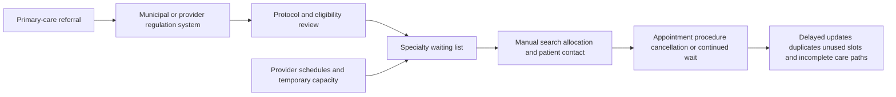
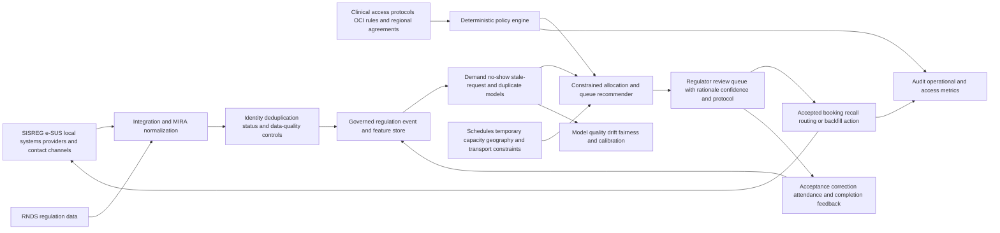

# HEALTH-001 AI-assisted SUS specialist-access and queue orchestration

## Classification

- **Segment:** healthcare
- **Primary market / jurisdiction:** Brazil; Sistema Único de Saúde (SUS)
- **Evidence reference date:** watcher execution on 2026-07-18; principal sources published or updated from 2025-03-07 through 2026-07-15; current Política Nacional de Regulação instituted on 2025-12-30 and published on 2026-01-05.
- **Index summary:** Brazilian SUS regulation centers can combine protocol rules with demand, capacity, geography, wait-time, cancellation, and clinical-context models to recommend equitable specialist-access queues and recover unused appointment capacity under human control.
- **Company profile / size:** municipal, regional, and state health secretariats; public hospitals, university hospitals, policlinics, and contracted providers operating regulated specialist access
- **Opportunity type:** optimization
- **Status:** researched
- **Confidence:** high
- **Complexity:** large
- **Horizon:** medium
- **Risk:** regulated
- **Azure fit:** high
- **AI dependency:** core
- **Intelligent capability:** constrained demand-capacity forecasting, no-show prediction, and protocol-aware queue and slot recommendation
- **Repository alignment:** new-solution

## Problem

Regulation-center teams must match large and changing waiting lists for specialist consultations, exams, and elective procedures with fragmented capacity across municipalities, regions, public hospitals, university hospitals, philanthropic providers, and mobile services. The regulator must respect clinical protocols, risk and priority classifications, territorial agreements, patient vulnerability, travel feasibility, and service eligibility while dealing with cancellations, outdated requests, duplicate records, incomplete referrals, and capacity that appears or disappears on short notice.

The actor is the physician regulator, nurse regulator, access coordinator, or municipal/state queue manager who reviews requests and allocates scarce specialist capacity. Existing systems can record and transmit requests, but the operational decision remains difficult when demand, supply, geography, attendance probability, and complete care-path dependencies change continuously.

## Brazil applicability and current context

Brazil is actively reorganizing specialist access. The federal Agora Tem Especialistas program and its Ofertas de Cuidados Integrados organize consultations, exams, and related procedures as care-path packages. In 2025, federal mutirões delivered 127,100 procedures, while the Ministry continued expanding specialist capacity in 2026. These measures confirm a current, material problem of waiting time and suppressed demand rather than a foreign-market assumption.

Since Portaria GM/MS nº 6.656 of 2025-03-07, periodic submission of regulation-access data to the Rede Nacional de Dados em Saúde is mandatory. Requests from SISREG, e-SUS Regulação, local regulation systems, and relevant electronic records must be shared through the Modelo de Informação da Regulação Assistencial; non-federal systems must transmit updated information daily. This creates a current Brazilian data and interoperability foundation, although real completeness and quality vary by territory.

Portaria GM/MS nº 9.262 of 2025-12-30 instituted the new Política Nacional de Regulação em Saúde do SUS. The Ministry describes access regulation as a protocol-driven public function for equitable, timely, transparent allocation. Therefore, model recommendations must operate inside official clinical and access rules; they cannot autonomously redefine priority, deny care, or replace the responsible regulator.

The proposal is specifically Brazilian. It does not import foreign insurance authorization, reimbursement, liability, or referral rules. Local validation remains necessary for each state's CIB agreements, referral protocols, data coverage, transport constraints, capacity contracts, and governance model.

## Evidence

### Confirmed

- The Ministry of Health states that regulation must organize access according to health need, clinical and access protocols, risk and priority classifications, waiting-list management, available resources, equity, and transparency.
- Portaria GM/MS nº 6.656, dated 2025-03-07, made periodic submission of SUS regulation data to RNDS mandatory; requests from local systems must be transmitted daily with information updated through the previous day.
- The Ministry reports that SISREG cannot accept new adhesions because of structural limitations, while e-SUS Regulação and locally developed systems coexist, making interoperability and normalized regulation data operational requirements.
- The Agora Tem Especialistas ambulatory component uses Ofertas de Cuidados Integrados to organize consultations, exams, and other procedures needed to complete stages of care pathways, with continuous monitoring and adjustments to regional action plans.
- Federal health-service mutirões delivered 127,100 procedures in 2025, including consultations, diagnostic exams, and surgeries, explicitly to reduce SUS waiting time.
- The current Política Nacional de Regulação em Saúde was instituted by Portaria GM/MS nº 9.262 on 2025-12-30 and published on 2026-01-05.

### Inference

- A unified regulation-data feed can support demand forecasting, stale-request detection, cancellation-risk prediction, and simulation of allocation strategies, but data quality and protocol variation require territory-specific validation.
- Deterministic rules can enforce eligibility, mandatory priorities, regional agreements, and care-path dependencies. Models can add value by forecasting pressure, ranking operationally equivalent choices, identifying probable no-shows or stale requests, and suggesting safe capacity reallocation.
- A constrained optimizer can improve use of newly available slots and mobile or mutirão capacity without allowing a model to override clinical priority.
- Feedback from regulator acceptance, patient confirmation, attendance, completed care stages, and later corrections can create labels for evaluation and recalibration.

### Sources

- [Regulação do Acesso](https://www.gov.br/saude/pt-br/composicao/saes/drac/regulacao/regulacao-do-acesso/regulacao-do-acesso) — Brazil; current page consulted 2026-07-18; defines protocol, priority, equity, waiting-list, demand, supply, and transparency responsibilities.
- [Compartilhamento de dados de Regulação do Acesso com a RNDS](https://www.gov.br/saude/pt-br/composicao/saes/drac/regulacao/regulacao-do-acesso/compartilhamento-de-dados-com-a-rnds) — Brazil; current page consulted 2026-07-18; Portaria GM/MS nº 6.656 dated 2025-03-07; establishes mandatory MIRA/RNDS submission and daily transmission by non-federal regulation systems.
- [Sistemas de Informação na Regulação do Acesso](https://www.gov.br/saude/pt-br/composicao/saes/drac/regulacao/regulacao-do-acesso/sistemas-de-informacao) — Brazil; current page consulted 2026-07-18; documents coexistence of SISREG, e-SUS Regulação, e-SUS Captação de Filas, and local systems, plus interoperability requirements.
- [Legislação da Regulação](https://www.gov.br/saude/pt-br/composicao/saes/drac/regulacao/regulacao-do-acesso/legislacao) — Brazil; page published 2025-10-02; Portaria GM/MS nº 9.262 dated 2025-12-30 and published 2026-01-05; current regulatory basis.
- [Componente Ambulatorial do Agora Tem Especialistas](https://www.gov.br/saude/pt-br/composicao/saes/agora-tem-especialistas/componente-ambulatorial) — Brazil; current page consulted 2026-07-18; describes OCI care-path organization and continuous regional monitoring.
- [Mutirões fecham 2025 com mais de 127 mil procedimentos](https://www.gov.br/saude/pt-br/assuntos/noticias/2025/dezembro/mutiroes-do-agora-tem-especialistas-fecham-o-ano-com-mais-de-127-mil-procedimentos-para-pacientes-do-sus-de-todo-o-pais) — Brazil; published and updated 2025-12-18; reports 127,100 procedures and explicit waiting-time reduction objective.
- [Publicações de Regulação](https://www.gov.br/saude/pt-br/composicao/saes/drac/regulacao/regulacao-do-acesso/publicacoes/publicacoes) — Brazil; page published 2025-10-02; operational plan added 2026-05-04 and specialty access protocols published 2025-10-02.
- [Azure Health Data Services FHIR service overview](https://learn.microsoft.com/en-us/azure/healthcare-apis/fhir/overview) — international technical support only; updated 2026-05-04; supports standards-based protected-health-data exchange and audit controls, not Brazilian regulatory applicability.

## Current process

## Proposed solution

Create a regulation-intelligence layer that consumes standardized requests, patient-confirmation events, protocols, capacity schedules, provider constraints, geography, care-path dependencies, attendance outcomes, and historical allocation decisions. It does not replace SISREG, e-SUS Regulação, RNDS, or local systems; it produces governed recommendations and writes accepted actions back through supported integrations.

Deterministic policy remains authoritative for eligibility, clinical priority, legal or policy deadlines, regional agreements, OCI sequence, age or vulnerability rules, provider restrictions, and forbidden allocations. Models forecast demand by service and territory, estimate cancellation or no-show risk, detect stale or duplicate requests, and predict capacity pressure. A constrained optimizer then recommends allocations only among policy-valid alternatives, including waitlist recall, slot backfilling, mutirão routing, and sequencing of linked OCI procedures.

Regulators review recommendations with the relevant protocol, contributing signals, confidence, and expected operational effect. Low-confidence, data-conflicted, clinically unusual, or high-risk cases abstain to the normal manual process. No model may independently downgrade priority, deny access, remove a patient from a queue, or make a clinical decision.

## Intelligent capability

- **Technique / model family:** hierarchical demand forecasting; calibrated no-show and cancellation classification; duplicate/stale-request detection; constrained optimization or learning-to-rank over policy-valid allocations.
- **Why it is necessary:** fixed rules can validate requests but cannot continuously anticipate local demand, attendance probability, geographic friction, temporary capacity, and cross-provider care-path dependencies. Without models and optimization, the solution becomes another queue dashboard rather than an adaptive allocation capability.
- **Inputs:** MIRA/RNDS regulation records; local queue and status events; protocol and priority fields; specialty and procedure codes; provider schedules; OCI dependencies; municipality and travel-time context; contact-confirmation events; cancellations; attendance and completion outcomes; regulator decisions; data-quality indicators.
- **Outputs:** demand forecasts; capacity-pressure alerts; probable no-show or stale-request scores; suspected duplicate groups; ranked policy-valid slot and provider recommendations; recommended recall or backfill queues; confidence and contributing signals.
- **Training / grounding / optimization:** territory-specific historical splits; temporal validation; explicit protocol constraints; cost-sensitive labels for missed attendance and inappropriate recommendation; cold-start rule baselines; periodic recalibration; simulation against historical capacity before live use.
- **Evaluation:** forecast error by specialty and territory; calibration and precision/recall for no-show and stale requests; duplicate-detection pair quality; feasible-allocation rate; time-based comparison against rules and current manual allocation; subgroup analysis by geography and vulnerability; regulator acceptance and correction.
- **Fallback and controls:** deterministic eligibility and priority engine; no autonomous denial or priority reduction; confidence thresholds and abstention; human regulator approval; complete audit trail; model disable switch; manual queue operation; rollback to last validated model and rule-only recommendations.

## Macro architecture

## Capabilities and possible technologies

- Application and workflow capabilities: regulator work queue, explainable recommendations, patient-contact orchestration, slot backfill, exception handling, protocol display, approval, and audit.
- Data capabilities: MIRA-compatible normalization, identity reconciliation, request-status history, capacity events, protocol versions, care-path dependencies, features, labels, and decision ledger.
- Integration capabilities: RNDS-compatible exchange where authorized; SISREG/e-SUS/local-system adapters; provider scheduling; messaging or call-center channels; geographic and travel-time services.
- Required AI / ML capabilities: forecasting, calibrated classification, entity resolution, stale-request detection, constrained ranking and optimization.
- Training, fine-tuning, grounding, recognition, or optimization capabilities: territory-specific pipelines, temporal validation, simulation, recalibration, champion/challenger evaluation, and protocol-constrained optimization.
- Evaluation and model-operations capabilities: segmented performance, drift, calibration, recommendation feasibility, rule-baseline comparison, fairness monitoring, model registry, rollback, and decision traceability.
- Security and governance capabilities: LGPD-aligned minimization, purpose limitation, role-based access, managed identities, encryption, immutable audit, separation of clinical and operational views, retention controls, and incident response.
- Azure services that may fit: Azure Health Data Services FHIR service when a FHIR exchange layer is justified, API Management, Logic Apps or Functions, Service Bus, Azure SQL or PostgreSQL, Azure Machine Learning, Microsoft Fabric or Azure Data Explorer, Azure Maps, Entra ID, Key Vault, Monitor, and Application Insights.
- Non-Azure or open-source alternatives worth considering: HAPI FHIR, PostgreSQL, Kafka, Airflow, MLflow, Feast, scikit-learn, XGBoost, LightGBM, OR-Tools, OptaPlanner, GeoPandas, OpenTelemetry, and standards-compatible local adapters.

## Possible gains

- Faster use of cancellations, temporary schedules, mutirões, mobile units, and newly contracted specialist capacity.
- Better visibility into demand pressure by specialty, municipality, provider, and care-path stage.
- Fewer unused slots caused by unreachable patients, stale requests, duplicates, or avoidable no-shows.
- More consistent application of approved access protocols while preserving regulator authority.
- Better coordination of linked consultations, exams, and procedures in OCI pathways.
- Auditable explanation of why each operational recommendation was made, accepted, corrected, or rejected.

## Metrics for validation

### Business and operational metrics

- Median and 90th-percentile waiting time by specialty, priority, municipality, and vulnerability group.
- Percentage of available slots filled, late cancellations recovered, and temporary capacity used.
- No-show, cancellation, stale-request, duplicate, and unreachable-patient rates.
- Time from capacity release to accepted allocation and from referral to completed OCI stage.
- Percentage of recommendations rejected for protocol, data-quality, geography, or patient-choice reasons.
- Queue transparency, update latency to RNDS, and completeness of request status histories.

### Intelligent-capability metrics

- Forecast MAE or weighted error by specialty, territory, and horizon.
- No-show and stale-request precision, recall, calibration, and decision-curve value.
- Duplicate-detection pair precision/recall and harmful-merge rate.
- Feasible recommendation rate, policy-violation rate, and improvement over rule-only and current manual baselines.
- Regulator acceptance, correction, override, abstention, and rollback rates.
- Performance and calibration differences across territories, travel-distance bands, age groups, and vulnerability categories.

## Risks, limits, and controls

- Privacy and sensitive data: regulation records reveal health conditions, vulnerability, location, and care history; use must be limited to authorized assistance and management purposes with strict access, minimization, retention, and audit.
- Brazilian regulatory or policy constraints: SUS principles, current regulation policy, LGPD, MIRA/RNDS rules, specialty protocols, CIB agreements, judicial priorities, and local governance remain authoritative.
- Human decision boundaries: models cannot diagnose, deny care, remove requests, reduce clinical priority, redefine protocols, or make irreversible access decisions.
- Model, retrieval, recognition, or policy failure modes: inaccurate forecasts may misallocate capacity; no-show scores may create self-fulfilling disadvantage; duplicate resolution may merge different patients; optimization may favor throughput over equity unless constrained.
- Bias, drift, weak labels, or insufficient feedback: historical access reflects unequal supply, missing records, and local practice. Evaluation must be territorial and subgroup-aware, with explicit equity constraints and sampling of rejected or low-score cases.
- Integration and data availability risks: inconsistent identifiers, delayed status updates, incomplete provider schedules, local coding differences, offline workflows, and varying RNDS integration maturity can limit recommendations.
- Adoption and change-management risks: regulators may distrust or over-trust rankings. The interface must show protocols, confidence, source freshness, rationale, and an easy manual path.

## Fit score

| Dimension | Score | Rationale |
| --- | ---: | --- |
| Problem evidence and relevance | 19/20 | Current Brazilian programs, mandatory regulation-data sharing, the new national regulation policy, and 2025-2026 queue-reduction actions directly establish urgency and operating context. |
| Business or operational value | 19/20 | Better queue integrity, capacity recovery, forecasting, and protocol-valid allocation can improve access and use of scarce specialist resources without changing clinical authority. |
| Technical feasibility | 14/20 | Data standards and systems exist, but local completeness, identity resolution, protocol variation, constrained optimization, fairness evaluation, and integration breadth are substantial challenges. |
| Reuse potential | 18/20 | The architecture applies across municipalities, states, specialties, OCI pathways, hospitals, mutirões, and contracted capacity while allowing local rules and models. |
| Strategic differentiation | 18/20 | Forecasting and constrained recommendations transform static queue recording into adaptive capacity orchestration; the intelligent layer is materially more valuable than a dashboard or workflow alone. |
| **Total** | **88/100** | Strong Brazil-specific evidence and policy alignment, with implementation risk concentrated in data quality, local variation, equity controls, and regulator adoption. |

## Repository relationship

- Existing references that may be reused: secure APIs, event-driven workflows, document/data ingestion, identity, observability, model deployment, human review, and integration patterns where already present.
- Missing capabilities exposed by this opportunity: MIRA/RNDS regulation contract, protocol-as-policy engine, queue event model, constrained optimizer, no-show and stale-request baselines, fairness evaluation, recommendation ledger, and regulator interface.
- Potential building blocks: regulation-data adapter contract, protocol policy evaluator, demand-forecast pipeline, attendance-risk scorer, identity/duplicate resolver, constrained allocation service, human-review queue, and model governance pack.
- Potential composed solution: Brazilian specialist-access intelligence and regulated queue orchestration reference solution.
- Reasons to keep it outside the current kit, when applicable: production integration with national and local health systems, real patient data, and clinical governance require agreements and controls beyond a generic reference deployment.

## Duplicate control

- **Problem keys:** sus-specialist-waiting-list, access-regulation, suppressed-demand, unused-specialist-capacity, no-show, stale-referral, duplicate-request, integrated-care-path, regional-capacity-allocation
- **Capability keys:** demand-forecasting, calibrated-no-show-prediction, stale-request-detection, patient-entity-resolution, constrained-optimization, protocol-aware-ranking, human-regulator-review
- **Research queries used:** `site:gov.br saúde Brasil 2025 filas cirurgias exames diagnóstico dados hospitalares`; `site:gov.br 2026 Ministério da Saúde regulação filas especialidades diagnóstico Brasil`; `site:gov.br/saude 2025 regulação acesso SUS fila interoperabilidade RNDS inteligência artificial`; `site:gov.br/saude Portaria 9262 2025 Política Nacional de Regulação em Saúde texto`; `site:gov.br/saude 2025 oferta de cuidado integrado OCI regulação filas especialistas`; `site:datasus.gov.br 2025 SISREG fila regulação acesso`; `SUS specialist access queue optimization Brazil healthcare regulation interoperability`.
- **Related opportunities:** none; FIN-001 also uses calibrated risk and constrained intervention but addresses payment fraud rather than healthcare access allocation.
- **Uniqueness statement:** This opportunity addresses protocol-governed allocation of Brazilian SUS specialist capacity and integrated care-path queues; it is not a clinical diagnostic model, generic scheduling system, patient chatbot, or payment-risk solution.

## Next decision

- shortlist for review.
