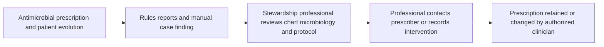
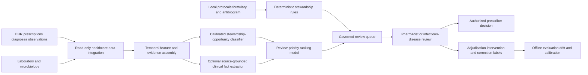

# HEALTH-002 AI-assisted antimicrobial stewardship review prioritization

## Classification

- **Segment:** healthcare
- **Primary market / jurisdiction:** Brazil
- **Evidence reference date:** 2026-07-19; PeGASUS page published 2026-01-28 and updated 2026-01-29; national study active in 2025-2026; cited research published in 2025-2026.
- **Index summary:** Brazilian hospitals can combine prescriptions, microbiology, laboratory, vital-sign, diagnosis, and local-protocol data to rank antimicrobial reviews and source-grounded intervention candidates under infectious-disease and pharmacy control.
- **Company profile / size:** medium and large Brazilian hospitals with electronic prescribing and an antimicrobial stewardship, infection-control, pharmacy, or infectious-disease team
- **Opportunity type:** operations
- **Status:** hypothesis
- **Confidence:** medium
- **Complexity:** large
- **Horizon:** medium
- **Risk:** regulated
- **Solution evidence level:** pilot
- **Operational maturity:** early
- **Azure fit:** high
- **AI dependency:** core
- **Primary AI role:** ranking-recommendation
- **Intelligent capability:** calibrated prediction and ranking of antimicrobial-review opportunities, including likely de-escalation, intravenous-to-oral switch, duration review, and discordance with microbiology or local protocol
- **Repository alignment:** new-solution

## Problem

Hospital antimicrobial-stewardship teams must repeatedly reconcile prescriptions with diagnoses, allergies, renal function, cultures, susceptibility results, treatment duration, route, clinical trajectory, local protocols, and prior interventions. The process is clinically important but labor-intensive, fragmented across systems, and difficult to apply consistently across all eligible patients. Reviews may occur late, after avoidable broad-spectrum exposure, or focus on easily queried rules while missing context-dependent cases.

## Brazil applicability and current context

Antimicrobial resistance is a current Brazilian public-health and hospital-operations priority. Anvisa's PeGASUS program, active from October 2024 through December 2026, explicitly addresses inadequate antimicrobial use, insufficient surveillance, and the low implementation level of stewardship programs in SUS hospitals. Its nationwide study includes hospitals from all five Brazilian regions and measures program implementation, antimicrobial consumption, accepted interventions, length of stay, mortality, and cost-effectiveness.

Anvisa also maintains current national guidance and reporting structures for antimicrobial stewardship, healthcare-associated infections, and resistance. This prototype therefore supports an existing regulated multidisciplinary process; it does not replace local protocols, prescribers, pharmacists, infectious-disease specialists, microbiology, infection-control committees, or institutional authority.

Local validation is required because formularies, antibiograms, resistance prevalence, laboratory turnaround, prescribing practices, digital maturity, and available stewardship staffing vary materially among Brazilian hospitals.

## Evidence

### Confirmed problem evidence

- Anvisa states that antimicrobial resistance has significant mortality and morbidity effects and associates the problem with inappropriate antimicrobial use, insufficient surveillance, and inefficient or absent stewardship programs.
- PeGASUS was created to promote stewardship implementation in SUS hospitals and is evaluating approximately 54 hospitals across Brazil, indicating a concrete national implementation gap rather than a hypothetical need.
- A 2026 multicenter Brazilian hospital study reports that adherence to antimicrobial stewardship programs remains limited.

### Favorable solution evidence

- A 2025 systematic review found machine-learning applications for empirical antibiotic selection, resistance prediction, dose adjustment, and identification of patients needing therapy changes.
- A 2026 systematic review of digital tools and AI in hospital stewardship supports their use as efficiency and decision-support mechanisms while emphasizing implementation limitations.
- A Brazilian 2026 preliminary hospital study evaluated an AI-generated recommendation for intravenous-to-oral antimicrobial switching using laboratory, vital-sign, prescription, and clinical-note data.
- A Brazilian implementation study describes an electronic tool for auditing broad-spectrum antimicrobials, supporting the feasibility of integrating prescribing data into stewardship workflows.

### Counter-evidence and limitations

- Published studies are heterogeneous, often retrospective or observational, and predictive performance does not by itself prove improved patient outcomes, reduced resistance, or safe prescribing.
- Complex models may not outperform simpler tabular methods consistently; recent benchmarking found that dataset characteristics and target prevalence can matter more than model complexity, while simpler models can calibrate better.
- Alert fatigue, poor timing, missing clinical context, weak interoperability, and low trust can make decision support ineffective or unsafe.
- These limits narrow the first prototype to review prioritization and evidence assembly. It must operate in shadow mode before prospective use, abstain on incomplete or out-of-distribution cases, and never directly change prescriptions.

### Inference

- A calibrated model can add value where deterministic queries produce too many cases or cannot combine temporal trajectory, microbiology, comorbidity, route, duration, and local-practice signals into a review order.
- The highest-value initial use may be finding overlooked review opportunities rather than recommending a specific drug.

### Unknowns

- Availability, quality, and timeliness of local prescribing, microbiology, renal-function, allergy, diagnosis, and clinical-observation data.
- Whether historical intervention records contain sufficiently reliable labels or only reflect team capacity and prior workflow bias.
- Incremental recall and workload reduction relative to a strong rules-based stewardship dashboard.
- Acceptance by prescribers and stewardship teams, local calibration, subgroup performance, operating cost, and effect on antimicrobial exposure without adverse clinical outcomes.

### Sources

- [Programa de Gerenciamento de Antimicrobianos em Hospitais do SUS](https://www.gov.br/anvisa/pt-br/assuntos/servicosdesaude/prevencao-e-controle-de-infeccao-e-resistencia-microbiana/projetos-gvims/pegasus) — Brazil; published 2026-01-28, updated 2026-01-29; current problem, official operating context, study design.
- [Gerenciamento do uso de antimicrobianos em Hospitais](https://www.gov.br/anvisa/pt-br/assuntos/servicosdesaude/prevencao-e-controle-de-infeccao-e-resistencia-microbiana/gerenciamento-de-antimicrobianos-em-servicos-de-saude/gerenciamento-do-uso-de-antimicrobianos-em-servicos-de-saude) — Brazil; updated 2026-01-16; official stewardship context.
- [PeGASUS clinical study record](https://clinicaltrials.gov/study/NCT07514884) — Brazil; updated 2026-04-07; national implementation scope and measured outcomes.
- [Overview of Brazilian hospitals on antimicrobial stewardship implementation](https://www.sciencedirect.com/science/article/pii/S1413867026000887) — Brazil; March 2026; current implementation-gap evidence.
- [Artificial intelligence-driven approaches in antibiotic stewardship programs](https://pubmed.ncbi.nlm.nih.gov/39955846/) — international; 2025; systematic-review solution evidence and structural limitations.
- [The role of digital tools and artificial intelligence in supporting antimicrobial stewardship](https://pubmed.ncbi.nlm.nih.gov/42313419/) — international; June 2026; systematic-review solution evidence and limitations.
- [AI recommendation of oral antimicrobial switch](https://www.sciencedirect.com/science/article/pii/S1413867026001145) — Brazil; March 2026; preliminary local implementation evidence.
- [Benchmarking ML architectures for antimicrobial stewardship in pediatric ICUs](https://arxiv.org/abs/2605.22611) — international; May 2026; counter-evidence on complexity, prevalence, and calibration.

## Current process

## Baseline without AI

- **Current baseline:** manual pharmacist or infectious-disease review, restricted-antimicrobial approval, periodic audit, and spreadsheet or EHR reports.
- **Strongest realistic non-AI alternative:** deterministic stewardship dashboard using local protocols, duration thresholds, duplicate-therapy rules, renal-dose checks, culture-result triggers, intravenous-to-oral criteria, and prioritized queues by drug or unit.
- **Baseline strengths:** transparent, auditable, inexpensive, clinically governable, and effective for explicit criteria.
- **Baseline limitations:** rule explosion, high alert volume, weak temporal synthesis, inability to learn combinations associated with accepted interventions, and limited prioritization when staff cannot review every case.
- **Context where intelligence may add incremental value:** ranking among many rule-eligible cases, finding multivariable cases that do not cross one hard threshold, and estimating which review is most likely to produce an accepted, safe intervention.
- **Condition where the non-AI baseline should be preferred:** insufficient local data, low case volume, unstable interfaces, poor calibration, or no measurable incremental value over protocol rules.

## Proposed solution

Create a stewardship review workbench that ingests current medication orders, diagnoses, allergies, renal and hepatic function, microbiology, susceptibility results, vital signs, selected clinical observations, length of therapy, route, unit, local antibiogram, protocols, and prior reviewed outcomes. Deterministic rules identify mandatory or explicit protocol events. Separate calibrated models predict and rank candidate review opportunities, with reason codes and source evidence.

The system proposes a review category such as culture-treatment discordance, de-escalation candidate, duration review, intravenous-to-oral switch, renal-dose reassessment, duplicate coverage, or unusual broad-spectrum continuation. It does not prescribe, discontinue, substitute, or dose medication. Stewardship professionals inspect the evidence and decide whether to contact the authorized prescriber; the prescriber retains the clinical decision.

## Where AI enters

### AI role map

| Process stage | AI component | AI type / model family | What it does | Runtime mode | Output | Human or deterministic control |
| --- | --- | --- | --- | --- | --- | --- |
| Case finding | Stewardship opportunity classifier | Classical ML, initially calibrated gradient boosting or logistic regression | Estimates the probability that a current case warrants one of a bounded set of stewardship reviews | Asynchronous batch every few hours or event-triggered after material data changes | Calibrated probability, review category, reason features, abstention flag | Mandatory protocol rules bypass ranking; incomplete or out-of-distribution cases abstain; stewardship professional reviews |
| Queue ordering | Review-priority ranker | Learning-to-rank or calibrated gradient boosting | Orders eligible cases by expected review value, urgency, evidence completeness, and likelihood of an accepted intervention | Batch or online queue refresh | Ranked case list with uncertainty and contributing factors | Capacity limits, safety priorities, unit rules, and maximum wait are deterministic; team can reorder |
| Optional note extraction | Clinical evidence extractor | LLM or clinical language model with schema-constrained extraction and source spans | Extracts bounded facts from notes only when structured fields are unavailable, such as documented oral tolerance or infection-source statement | Private asynchronous inference | Structured fields linked to exact source text and confidence | No free-form recommendation; low-confidence extraction is ignored; human verifies source text |

### Required distinctions

- **Primary AI role:** prediction and ranking/recommendation.
- **Model family:** calibrated classical ML and optional learning-to-rank; an optional source-grounded clinical language model performs extraction only.
- **Training requirement:** supervised training on adjudicated historical or prospectively labeled review cases; pretrained inference plus prompt and grounding for optional extraction.
- **Training location and cadence:** initial offline local training, temporal validation, periodic retraining only after drift review and sufficient new adjudicated labels.
- **Inference location:** private cloud or hospital-controlled batch pipeline; event-triggered updates may run as an online service.
- **Agent role:** Agent: not used. No component pursues goals or invokes clinical tools autonomously.
- **LLM role:** optional bounded extraction from clinical notes with source spans; no diagnosis, prescription, therapy selection, or autonomous clinical reasoning.
- **Non-LLM intelligence:** tabular prediction, calibrated classification, and review ranking are the central intelligent capabilities.
- **Not AI:** protocol rules, contraindication checks, dose calculations, medication and laboratory APIs, queue orchestration, dashboards, notifications, access control, audit logs, and all clinical decisions.

## Intelligent capability details

- **Technique / model family:** calibrated gradient boosting or logistic regression for bounded review categories, followed by optional learning-to-rank; schema-constrained language extraction only where needed.
- **Why it is necessary:** a deterministic dashboard can surface explicit violations but cannot efficiently prioritize multivariable, time-dependent cases when stewardship capacity is constrained.
- **Inputs:** medication orders and changes, therapy duration, route, dose, allergies, diagnoses, renal and hepatic markers, microbiology and susceptibilities, vital-sign and laboratory trends, ward, local protocols and antibiogram, prior reviews and accepted interventions.
- **Outputs:** review category, calibrated probability, priority score, evidence completeness, contributing factors, linked source data, uncertainty, and abstention.
- **Training / grounding / optimization assumptions:** local labels from expert adjudication are preferred; historical accepted interventions must not be treated as perfect ground truth; temporal splits and unit-level checks are required.
- **Evaluation:** precision-recall by review type, calibration, top-k yield, missed high-priority cases, subgroup and unit performance, time-to-review, and incremental value over rules.
- **Fallback and controls:** rules-only queue, manual search, abstention, shadow mode, rollback to prior model, and mandatory human clinical authority.

## Data and integration assumptions

- **Data owners and access path:** hospital pharmacy, EHR, laboratory, microbiology, infection-control, data platform, and stewardship program under institutional governance.
- **Expected volume, history, frequency, and coverage:** at least several months of prescription and laboratory history; hourly or near-real-time updates are desirable but a daily prototype is acceptable.
- **Labels, outcomes, feedback, or simulation available:** expert-adjudicated review opportunity, intervention recommendation, prescriber acceptance, prescription change, adverse outcome, and retrospective synthetic scenarios for rare safety boundaries.
- **Known quality, imbalance, missingness, and leakage risks:** accepted interventions reflect staffing and prior policy; culture results arrive late; notes may be copied; discharge and mortality can leak future information; positive review classes may be rare.
- **Brazilian or local-context representativeness:** training and validation must use local formulary, protocols, antibiogram, patient mix, language, and workflow.
- **Privacy, retention, consent, surveillance, or sharing constraints:** health data require strict purpose limitation, least privilege, encryption, audit, retention control, and institutional legal and ethics review where applicable.
- **Integration and synchronization assumptions:** stable identifiers and timestamps across EHR, pharmacy, laboratory, and microbiology; FHIR or controlled extracts may be used.
- **Drift and change sources:** formulary and protocol changes, resistance patterns, seasonal infections, new units, coding changes, laboratory methods, and changes in stewardship staffing.
- **Minimum viable data for a prototype:** timestamped prescriptions, route and duration, key laboratories, microbiology, unit, local protocols, and expert labels for two or three review categories.

## Prototype validation plan

- **Prototype scope / process slice:** one adult inpatient unit or two comparable units; two or three bounded review categories, such as intravenous-to-oral switch, duration review, and culture-treatment discordance.
- **Users, sites, assets, documents, events, or simulated cases:** one hospital, stewardship pharmacists and infectious-disease professionals, retrospective replay followed by shadow mode.
- **Baseline or comparison:** strongest deterministic protocol dashboard plus current manual workflow.
- **Required data and integrations:** read-only extracts from prescribing, laboratory, and microbiology systems; no write-back to medication orders.
- **Model-quality metrics:** PR-AUC, recall at fixed review capacity, precision at top-k, calibration error, abstention rate, and missed expert-priority cases.
- **Business or workflow metrics:** cases reviewed per professional hour, time from qualifying evidence to review, accepted-intervention yield, antimicrobial days of therapy as an exploratory outcome, and queue aging.
- **Human acceptance, correction, or override metrics:** reviewer agreement, category correction, ranking override, reason-code usefulness, prescriber acceptance, and alert dismissal reason.
- **Safety and compliance boundaries:** no autonomous prescription action, no hidden recommendation, no use outside trained population, mandatory audit, and explicit escalation for critical protocol events.
- **Failure or redesign criteria:** no meaningful improvement over rules at fixed capacity; poor calibration; unacceptable misses; alert burden exceeding team capacity; unstable performance across units or patient groups; or inability to produce reviewable evidence.
- **Evidence required before a pilot or broader implementation:** successful temporal replay, shadow-mode safety review, clinician-approved thresholds, data-protection assessment, operating-cost estimate, rollback procedure, and prospective evaluation design.

## Macro architecture

## Capabilities and possible technologies

- Application and workflow capabilities: governed review queue, evidence timeline, reason codes, adjudication, feedback, and audit.
- Data capabilities: healthcare-data normalization, temporal features, microbiology and medication joins, local protocol registry.
- Integration capabilities: read-only EHR, pharmacy, laboratory, and microbiology connectors; FHIR where supported.
- Required AI / ML capabilities: calibrated classification, temporal feature modeling, learning-to-rank, uncertainty and abstention.
- Training, grounding, recognition, or optimization capabilities: temporal validation, expert-label workflow, calibration, drift detection, optional source-grounded extraction.
- Agent and tool-use capabilities, or `not used`: not used.
- LLM / foundation-model capabilities, or `not used`: optional schema-constrained clinical fact extraction only; otherwise not used.
- Evaluation and model-operations capabilities: registry, versioning, replay, shadow deployment, threshold governance, monitoring, rollback.
- Security and governance capabilities: private networking, managed identity, least privilege, encryption, immutable audit, access review.
- Azure services that may fit: Azure Health Data Services, Azure Data Factory or Fabric, Azure Machine Learning, Azure AI Search for protocol retrieval, Azure OpenAI only for optional grounded extraction, Functions or Container Apps, Key Vault, Monitor.
- Non-Azure or open-source alternatives worth considering: HAPI FHIR, PostgreSQL, MLflow, LightGBM or XGBoost, scikit-learn, Feast, Evidently, local language models.

## Possible gains

- Direct scarce stewardship capacity toward cases most likely to benefit from timely expert review.
- Shorten the interval between culture or clinical evidence and human review.
- Improve consistency and auditability of case finding across units and shifts.
- Discover context-dependent review opportunities that rigid rules miss while retaining rules for explicit safety requirements.

## Metrics for validation

### Business and operational metrics

- Review yield and time-to-review versus the current manual workflow and deterministic dashboard.
- Accepted interventions, cases reviewed per hour, queue aging, antimicrobial days of therapy, and monitored patient-safety outcomes.

### Intelligent-capability metrics

- Precision, recall, PR-AUC, top-k yield, calibration, abstention, and performance by unit and review category.
- Human acceptance, category correction, ranking override, evidence usefulness, and false-alert burden.

## Risks, limits, and controls

- Privacy and sensitive data: health data remain within the hospital-controlled environment with strict access, purpose, retention, and audit controls.
- Brazilian regulatory or policy constraints: align with Anvisa stewardship and patient-safety guidance, institutional clinical governance, LGPD, professional authority, and applicable ethics review.
- Human decision boundaries: models only prioritize and assemble evidence; authorized professionals make every clinical and prescription decision.
- Model or policy failure modes: missing data, delayed cultures, protocol drift, poor calibration, treatment-confounding, rare-population errors, and overreliance.
- Agent or tool-execution failure modes, when applicable: not applicable; no agent is used.
- LLM hallucination, grounding, or prompt-injection risks, when applicable: optional extraction must be schema-bound, cite exact source spans, ignore external instructions, and abstain when unsupported.
- Comparable failures and applicable lessons: predictive accuracy alone is insufficient; use shadow mode, compare with rules, measure workflow outcomes, and avoid unnecessary model complexity.
- Bias, drift, weak labels, or insufficient feedback: historical accepted interventions encode capacity and practice bias; require expert adjudication and temporal monitoring.
- Integration and data risks: mismatched identifiers, stale orders, incomplete allergies, delayed microbiology, and inconsistent timestamps.
- Adoption and change-management risks: alert fatigue, prescriber distrust, duplicated work, and unclear ownership; integrate into the existing stewardship workflow rather than creating another alert channel.
- Prototype cost or operational assumptions: integration and expert labeling may dominate model cost; begin with read-only extracts and a narrow unit and category scope.

## Fit score

| Dimension | Score | Rationale |
| --- | ---: | --- |
| Problem evidence and relevance | 19/20 | Current Anvisa program and national Brazilian implementation study establish a specific, regulated, active need. |
| Business or operational value | 18/20 | Better review prioritization could improve stewardship capacity, timeliness, and antimicrobial use, but clinical outcome effect requires prospective evaluation. |
| Technical feasibility | 17/20 | A bounded read-only replay and shadow prototype is feasible with common hospital data; integration, labels, calibration, and safety are substantial. |
| Reuse potential | 18/20 | The architecture and model-governance pattern can be reused across hospitals, protocols, and related medication-safety reviews with local adaptation. |
| Strategic differentiation | 17/20 | Calibrated multivariable ranking can add value beyond rule dashboards, provided it proves incremental yield and manageable alert burden. |
| **Total** | **89/100** | Strong prototype hypothesis with current Brazilian need, local pilot signals, explicit clinical boundaries, and meaningful validation risk. |

## Repository relationship

- Existing references that may be reused: document grounding, healthcare-data integration patterns, model evaluation, governed human-review workflows, observability, and secure Azure foundations.
- Missing capabilities exposed by this opportunity: temporal clinical feature pipeline, calibrated clinical ranking, abstention governance, stewardship adjudication, and healthcare-specific shadow evaluation.
- Potential building blocks: FHIR medication and microbiology normalization, protocol rule engine, calibrated ranking service, evidence timeline, clinical shadow-mode evaluator.
- Potential composed solution: antimicrobial stewardship review prioritization workbench.
- Reasons to keep it outside the current kit, when applicable: no implementation should begin without explicit human approval, clinical governance, data access, and narrow prototype scope.

## Duplicate control

- **Problem keys:** antimicrobial-stewardship-capacity, inpatient-antimicrobial-review, resistance-management, delayed-therapy-review
- **Capability keys:** antimicrobial-review-classification, calibrated-clinical-ranking, culture-treatment-discordance, iv-to-oral-prediction, evidence-grounded-clinical-extraction
- **Research queries used:** `site:gov.br anvisa 2025 segurança do paciente erros de medicação hospitais Brasil`; `site:gov.br saúde 2025 resistência antimicrobiana hospitais Brasil PROA`; `site:gov.br 2025 deterioração clínica hospitalar segurança paciente Brasil`; `site:fiocruz.br 2025 eventos adversos medicamentos hospitais Brasil`; `site:gov.br/anvisa PeGASUS gerenciamento antimicrobianos hospitais SUS 2026`; `antimicrobial stewardship machine learning prescribing decision support systematic review 2024 2025`; `clinical decision support antimicrobial stewardship alert fatigue false positives study 2024`; `Brazil hospital antimicrobial stewardship artificial intelligence study`.
- **Related opportunities:** HEALTH-001, which addresses access regulation and specialist queues rather than inpatient medication review.
- **Uniqueness statement:** This opportunity targets hospital antimicrobial review prioritization and evidence assembly; it does not repeat healthcare access orchestration, general deterioration prediction, diagnosis, or autonomous prescribing.

## Next decision

- prototype candidate

Implementation approval remains an explicit human decision.