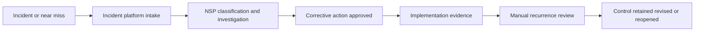
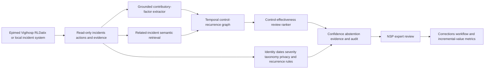

# HEALTH-003 AI-assisted patient-safety control-effectiveness assurance

## Classification

- **Segment:** healthcare
- **Primary market / jurisdiction:** Brazil
- **Evidence reference date:** 2026-07-20
- **Index summary:** Brazilian hospitals can connect incident reports, investigations, corrective actions, operational evidence, and later recurrences to detect when safety controls appear ineffective and prioritize expert review.
- **Company profile / size:** Medium and large hospitals with a formal Núcleo de Segurança do Paciente
- **Opportunity type:** operations
- **Status:** hypothesis
- **Confidence:** medium
- **Complexity:** large
- **Horizon:** medium
- **Risk:** regulated
- **Solution evidence level:** prototype
- **Operational maturity:** unvalidated
- **Existing-solution disposition:** integrate
- **Azure fit:** high
- **AI dependency:** core
- **Primary AI role:** anomaly-detection
- **Intelligent capability:** Evidence-grounded incident linkage, contributory-factor extraction, control-to-recurrence graph analysis, and control-effectiveness review ranking
- **Repository alignment:** extend-kit

## Operational simulation

### Organization and actor

A 250-bed Brazilian hospital with emergency care, wards and ICU. The main actor is a patient-safety analyst in the Núcleo de Segurança do Paciente (NSP), supported by nursing, pharmacy, medical leadership, quality, engineering and unit managers. The NSP may classify, investigate and recommend actions, but clinical, disciplinary and regulatory decisions remain human and institutional.

### Process trigger, objective and completion

The process begins with an adverse event, near miss, complaint, audit finding or recurring operational signal. It ends when the event is investigated, actions are approved, evidence of implementation is recorded and effectiveness is reviewed after a defined observation period.

Inputs include incident narratives, structured notification fields, patient and unit context, medication or device identifiers, staffing and workload snapshots, EHR audit events, maintenance records, protocols, RCA documents, action plans, training evidence and subsequent incidents. Synthetic simulation assumptions below are not factual claims about any specific hospital.

### Scenario variants

#### Normal flow

A near miss involving look-alike medication packaging is reported. The analyst classifies the event, confirms pharmacy and unit evidence, opens an investigation, records contributing factors, approves label and storage changes, and later checks whether similar events recur.

#### Exception flow

Two reports describe apparently different failures: one blames a barcode scanner and another describes a manual override. Device logs are incomplete, timestamps differ and the corrective action from an earlier event was recorded as completed. The analyst must determine whether both events share a failed control or are unrelated.

#### Peak or degraded flow

After a workflow or system change, notifications increase while the NSP has reduced staffing. Similar incidents use inconsistent language across units, corrective actions overlap, evidence arrives late and urgent cases compete with routine reviews.

### Simulated opportunity points

| Operational point | Deterministic response first | Remaining gap |
| --- | --- | --- |
| Intake and routing | Structured forms, mandatory fields, taxonomy and routing rules | Narratives describe the same failure with different terms or omit the true process step |
| Investigation | RCA template, timeline and evidence checklist | Evidence is fragmented across systems and causal links remain uncertain |
| Corrective action tracking | Owner, deadline, completion status and reminders | “Completed” does not prove that the control changed behavior or prevented recurrence |
| Recurrence review | Counts and dashboards by category | Recurrent mechanisms cross categories, units, devices or medications and are not visible through exact grouping |
| Prioritization | Severity and deadline rules | Limited analysts must identify which apparently closed controls deserve re-investigation first |

Potential labels and feedback include expert-confirmed related incidents, accepted or rejected contributory factors, verified control implementation, recurrence windows, reopened investigations and reviewer overrides.

## Brazil applicability and current context

Brazil requires services in scope to maintain patient-safety structures and incident-management practices. In 2026, Anvisa continued the national assessment of patient-safety practices for hospitals with and without ICU, requiring documentary evidence for structure and process indicators. The current 2026-2030 plan emphasizes notification, investigation, risk management and organizational learning.

The hypothesis is local to hospital assurance. It does not replace Notivisa, mandatory notification, the NSP, clinical judgment or regulatory investigation.

## Existing solutions and differentiation

### Existing solutions reviewed

| Solution / platform | Owner or vendor | Current capabilities | Evidence date | Coverage overlap |
| --- | --- | --- | --- | --- |
| Notivisa | Anvisa | National incident notification and regulatory reporting | updated 2026 | External reporting and mandatory workflow |
| Vigihosp | Ebserh | Internal incident notification for university hospitals | current service | Intake and hospital risk workflow |
| Epimed Monitor Segurança do Paciente | Epimed Solutions | Incident management, classification, investigation timing and dashboards | 2026 criteria | Incident workflow and monitoring |
| RLD360 Risk & Safety / Event Analysis | RLDatix | Reporting, routing, RCA, evidence tracking, corrective actions and AI pattern surfacing | current | Broad incident and risk management |
| MEG Healthcare Incident Reporting | MEG | Incident capture, action plans and risk visibility | current | Workflow and reporting |

### Gap and disposition

- **What is already solved:** notification, routing, structured classification, RCA workflow, action ownership, dashboards and regulatory export.
- **Material uncovered gap:** auditable assessment of whether an implemented safety control is followed by semantically related recurrence across different categories, units and evidence sources.
- **Underserved context:** hospitals using existing incident platforms but lacking a reliable control-to-recurrence evidence chain.
- **Disposition:** integrate.
- **Why changing vendor or architecture is insufficient:** another incident-management system would duplicate existing capture and workflow.
- **Differentiation statement:** this is a read-only assurance layer that links incidents, contributory factors, corrective controls, implementation evidence and later recurrences; it does not replace the system of record or generate autonomous root-cause conclusions.

## Evidence

### Confirmed problem evidence

- Anvisa's 2026 assessments require hospitals to demonstrate patient-safety structures and processes with supporting documentation.
- The 2026-2030 national plan emphasizes monitoring, investigation, reporting and improvement of patient safety.
- NSP responsibilities include integrating processes and information that affect patient risk.

### Existing-solution evidence

- Epimed, Vigihosp, RLDatix and MEG already cover incident capture and management.
- RLDatix explicitly supports RCA, evidence collection, action plans and AI-powered pattern surfacing.

### Favorable evidence for the uncovered gap

- Recent studies show LLM-assisted extraction and taxonomy mapping can support incident analysis and cross-case pattern discovery.
- Graph and temporal analysis can represent links among incidents, controls, units, assets and recurrence windows.

### Counter-evidence and limitations

- LLM root-cause analysis can hallucinate; one 2025 study reported hallucination rates ranging from 11% to 51% across models.
- Similarity does not prove causality or control failure.
- Increased reporting after a safety intervention may reflect improved culture rather than worsening safety.
- Therefore the prototype must expose source evidence, abstain when linkage is weak and prohibit automated causal conclusions.

### Inference

A hospital can gain more value by verifying control effectiveness across time than by adding another generic incident dashboard.

### Unknowns

- Availability and quality of action-plan evidence, EHR audit events and device logs.
- Whether experts agree consistently on related incidents and failed controls.
- Integration limits of local incident systems.

### Sources

- [Avaliação Nacional das Práticas de Segurança do Paciente - hospitais com UTI](https://www.gov.br/anvisa/pt-br/assuntos/servicosdesaude/seguranca-do-paciente/avaliacao-nacional-das-praticas-de-seguranca-do-paciente/copy_of_avaliacao-nacional-das-praticas-de-seguranca-do-paciente) — Brazil; updated 2026-07-13; current official context.
- [Autoavaliação Nacional - hospitais sem UTI](https://www.gov.br/anvisa/pt-br/assuntos/servicosdesaude/seguranca-do-paciente/avaliacao-nacional-das-praticas-de-seguranca-do-paciente/autoavaliacao-nacional-das-praticas-de-seguranca-do-paciente-hospitais-sem-uti) — Brazil; updated 2026-06-22; documentary evidence requirements.
- [Plano Integrado 2026-2030](https://www.gov.br/anvisa/pt-br/assuntos/noticias-anvisa/2026/anvisa-aprova-programa-nacional-de-prevencao-e-controle-de-infeccoes-em-servicos-de-saude) — Brazil; 2026-02-06; national operating direction.
- [Epimed Monitor Segurança do Paciente](https://www.epimedsolutions.com/sistema-seguranca-do-paciente/) — Brazil; current product landscape.
- [RLD360 Event Reporting](https://www.rldatix.com/en-nam/risk-and-safety-on-rld360/event-reporting/) — international; current product landscape.
- [Root Cause Analysis of Radiation Oncology Incidents Using LLMs](https://arxiv.org/abs/2508.17201) — international; 2025; plausibility and hallucination limitation.

## Current process and current solution

## Baseline

- **Current manual or system baseline:** incident platform plus NSP investigation and periodic dashboard review.
- **Existing product baseline:** Epimed, Vigihosp, RLDatix or equivalent.
- **Strongest realistic non-AI alternative:** normalized taxonomy, mandatory control IDs, exact incident matching, deterministic recurrence windows and BI dashboards.
- **Baseline strengths:** transparent, auditable and effective for well-coded recurring events.
- **Baseline limitations:** weak when terminology, unit, device, medication or workflow stage changes.
- **Exact context where intelligence adds value:** cross-case semantic linkage and prioritization of controls that appear ineffective despite completed status.
- **Condition where baseline should be preferred:** low volume, stable taxonomy or insufficient evidence for cross-case comparison.

## Proposed solution or extension

Add a private read-only assurance service beside the hospital's incident platform. It ingests incidents, investigations, action plans and evidence snapshots. Deterministic rules validate identifiers, dates, severity, permissions and recurrence windows. Models extract bounded contributory factors, retrieve related cases and build a temporal graph linking incidents to controls and later recurrences. The service ranks control reviews and shows evidence for an NSP analyst. It never closes an incident, changes a clinical protocol, files a regulatory report or declares causality.

## Where AI enters

### AI role map

| Process stage | AI component | AI type / model family | Inputs | What it does | Runtime mode | Output | Human or deterministic control |
| --- | --- | --- | --- | --- | --- | --- | --- |
| Evidence normalization | Grounded factor extractor | LLM or clinical text encoder | Narratives, RCA notes, action plans | Extracts process steps, contributory factors and control references with source spans | asynchronous batch | structured candidates | schema, source citation, confidence threshold, human correction |
| Cross-case comparison | Related-incident retriever | embeddings and cross-encoder | incidents and evidence | retrieves semantically similar incidents across categories and units | batch or online review | ranked related cases | access filters, time windows, analyst confirmation |
| Control analysis | Control-recurrence graph | graph ML and temporal features | incident-control links, implementation dates, later events | estimates whether a control deserves effectiveness review | daily batch | review score and supporting paths | deterministic recurrence windows, minimum evidence, no causal claim |
| Queue prioritization | Review ranker | gradient boosting or learning-to-rank | severity, recurrence, evidence completeness, control age | ranks analyst review queue | daily batch | priority score | severity rules, override, abstention and audit |

### Required distinctions

- **Primary AI role:** extraction, retrieval, anomaly detection and ranking.
- **Model family:** grounded LLM or text encoder, embeddings, cross-encoder, graph ML and gradient boosting.
- **Training requirement:** pretrained grounding initially; supervised calibration with expert-confirmed links and review outcomes.
- **Training location and cadence:** private offline training; quarterly or drift-triggered review.
- **Inference location:** private cloud or hospital-controlled batch pipeline.
- **Agent role:** not used.
- **LLM role:** bounded structured extraction with source spans; no autonomous RCA or action generation.
- **Non-LLM intelligence:** semantic retrieval, graph analysis and ranking.
- **Not AI:** incident intake, Notivisa submission, identifiers, dates, severity rules, RBAC, workflows, dashboards, queues and approvals.

## Intelligent capability details

- **Why necessary:** exact categories and dashboards cannot reliably detect recurrence when narratives and contexts differ.
- **Inputs:** incident narratives, structured fields, RCA notes, controls, implementation evidence, audit events and later incidents.
- **Outputs:** related-case candidates, control-recurrence paths, review priorities, evidence spans and abstention reasons.
- **Training assumptions:** expert-confirmed links can be sampled; taxonomies and controls are versioned.
- **Evaluation:** precision@k for related incidents, calibration, NDCG for review ranking, false-link rate and expert usefulness.
- **Fallback and controls:** deterministic dashboards, manual search, abstention, source display, rollback and independent sampling.

## Data and integration assumptions

- **Data owners:** hospital NSP, quality, pharmacy, engineering and clinical systems under approved access.
- **Expected volume:** thousands of incidents and action records across multiple years.
- **Labels or feedback:** related/not-related, control applicable/not applicable, reopened investigation and confirmed recurrence.
- **Quality risks:** under-reporting, copied narratives, inconsistent taxonomy and missing implementation evidence.
- **Representativeness:** models require institution-specific calibration; cross-hospital transfer is not assumed.
- **Privacy:** minimum necessary data, de-identification, strict RBAC, private processing and retention controls.
- **Existing platform APIs:** export or read-only API from Epimed, Vigihosp, RLDatix or local systems.
- **Drift:** protocol changes, staffing, reporting culture, devices, medications and taxonomy versions.
- **Minimum viable data:** 2,000 incidents, 200 corrective actions and an expert-adjudicated set of at least 100 cross-case links.

## Prototype validation plan

- **Scope:** one incident family, such as medication administration, in one hospital.
- **Users:** 3-6 NSP and quality reviewers.
- **Existing solution baseline:** current incident platform and dashboards.
- **Non-AI baseline:** exact taxonomy plus keyword and deterministic recurrence rules.
- **Required integration:** historical export only; no write-back.
- **Model metrics:** precision@5, false-link rate, calibration, ranking NDCG and abstention.
- **Incremental-value metrics:** confirmed recurring controls found beyond baseline and avoided duplicate investigations.
- **Workflow metrics:** review time, reopened-control rate and analyst effort per confirmed signal.
- **Human metrics:** correction, override, disagreement and evidence-inspection rates.
- **Safety boundaries:** no diagnosis, clinical recommendation, blame, disciplinary action, regulatory submission or autonomous RCA.
- **Failure criteria:** no useful improvement over rules, high false-link burden, low reviewer agreement, privacy risk or unsupported causal interpretations.
- **Scale evidence:** stable temporal performance, security review, successful shadow use and demonstrated incremental findings.

## Macro architecture

## Capabilities and possible technologies

- Existing platform capabilities reused: incident intake, routing, RCA, actions and reporting.
- Application capabilities: read-only review queue and evidence graph.
- Data capabilities: governed event store, lineage and temporal graph.
- Integration: exports/APIs and optional FHIR/audit-event adapters.
- AI/ML: grounded extraction, retrieval, graph analysis and ranking.
- Agent: not used.
- LLM: bounded extraction only.
- Evaluation: Azure Machine Learning or MLflow, temporal evaluation and monitoring.
- Security: Entra ID, managed identity, Key Vault, private networking and audit.
- Azure fit: Azure AI Search, Azure Machine Learning, PostgreSQL/graph representation, Functions or Container Apps and Monitor.
- Open-source alternatives: sentence-transformers, scikit-learn, NetworkX/Neo4j, MLflow and FastAPI.

## Possible gains

- Detect recurring safety mechanisms hidden by inconsistent categories.
- Reopen apparently completed controls sooner when evidence suggests recurrence.
- Reduce repeated manual searches while preserving expert investigation.

## Metrics for validation

### Business and operational metrics

- Confirmed recurrent-control findings beyond baseline.
- Time to review and reopen ineffective controls.

### Intelligent-capability metrics

- Related-case precision@k, ranking NDCG, calibration, false-link and abstention rates.
- Human correction, override and disagreement.

## Risks, limits, and controls

- Existing-solution overlap: must remain an extension, not another incident platform.
- Privacy: minimize patient and professional identifiers.
- Regulation: Notivisa and institutional duties remain authoritative.
- Human boundary: NSP owns investigation, causality and action decisions.
- Model failures: false links, missed recurrences and historical taxonomy bias.
- LLM risks: hallucinated factors; require citations and abstention.
- Comparable lesson: promising RCA outputs still showed material hallucination rates.
- Adoption: analysts may over-trust graph paths; require source inspection.
- Cost assumptions: integration and evidence normalization dominate prototype effort.

## Fit score

| Dimension | Score | Rationale |
| --- | ---: | --- |
| Problem evidence and relevance | 18/20 | Current Brazilian national assessments and plans require incident, risk and evidence practices. |
| Business or operational value | 17/20 | Earlier detection of ineffective controls is measurable and safety-relevant. |
| Technical feasibility | 16/20 | Read-only prototype is feasible, but labels and integration are uncertain. |
| Reuse potential | 16/20 | Pattern applies across hospitals and incident families with local calibration. |
| Strategic differentiation | 17/20 | Focuses on control effectiveness over time rather than generic reporting or RCA workflow. |
| **Total** | **84/100** | Differentiated integration hypothesis with strict human and evidentiary controls. |

## Repository relationship

- Existing references reusable: document extraction, retrieval, graph analysis, evaluation and governed workflow.
- Missing capabilities: temporal control-effectiveness graph and human-adjudicated cross-incident evaluation.
- Potential building blocks: `grounded-incident-factor-extractor`, `temporal-control-recurrence-graph`, `human-reviewed-safety-ranker`.
- Potential composed extension: `patient-safety-control-effectiveness-assurance`.

## Duplicate control

- **Problem keys:** patient safety incident recurrence, corrective-action effectiveness, NSP investigation, hospital controls.
- **Capability keys:** grounded factor extraction, incident semantic linkage, temporal control graph, recurrence ranking.
- **Existing solutions reviewed:** Notivisa, Vigihosp, Epimed, RLDatix and MEG.
- **Research queries used:** Brazilian 2026 patient-safety assessment; hospital incident software Brazil; RLDatix AI safety patterns; LLM RCA hallucination.
- **Related opportunities:** HEALTH-002 antimicrobial stewardship; TECH-002 incident reproduction.
- **External overlap statement:** existing platforms manage reporting and RCA; this extension tests whether completed controls remain effective across later incidents.
- **Uniqueness statement:** it does not replace incident reporting, clinical decision support or generic root-cause analysis.

## Next decision

- prototype candidate

Implementation approval remains an explicit human decision.
