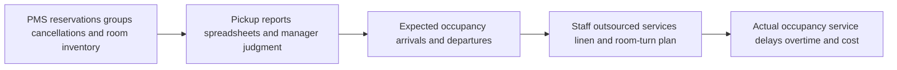
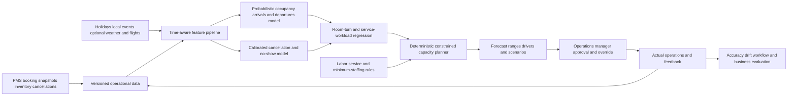

# HOSP-001 AI-assisted hotel occupancy and operations forecasting

## Classification

- **Segment:** Hospitality, tourism, food service, and events
- **Primary market / jurisdiction:** Brazil
- **Evidence reference date:** 2026-07-19; Brazilian operating evidence updated through 2026-07-15; technical evidence reviewed through 2026-07-19.
- **Index summary:** Brazilian hotels can forecast probabilistic occupancy and operational workload from booking curves, cancellations, events, and local demand signals to recommend staffing and housekeeping capacity under manager control.
- **Company profile / size:** Medium and large hotels, resorts, hotel groups, and professionally managed regional networks with PMS and reservation history.
- **Opportunity type:** optimization
- **Status:** hypothesis
- **Confidence:** medium
- **Complexity:** medium
- **Horizon:** short
- **Risk:** medium
- **Solution evidence level:** production
- **Operational maturity:** early
- **Azure fit:** high
- **AI dependency:** core
- **Primary AI role:** prediction
- **Intelligent capability:** Probabilistic occupancy, cancellation, arrival, departure, and operational-workload forecasting with constrained staffing and housekeeping recommendations
- **Repository alignment:** new-solution

## Problem

Hotel operations must commit reception, housekeeping, maintenance, breakfast, linen, and room-turn capacity before final demand is known. Managers usually combine reservations on the books, historical occupancy, events, holidays, weather, group blocks, expected cancellations, and judgment in spreadsheets or PMS reports.

Demand can change rapidly through late bookings, cancellations, no-shows, flight changes, events, weather, and channel behavior. Forecast errors create understaffing and delayed rooms on high-demand days or unnecessary labor and outsourced-service cost on weak days. The problem is not only room revenue: arrivals, departures, occupied rooms, length of stay, room type, and service profile drive different operational workloads.

## Brazil applicability and current context

Brazil recorded 9.3 million international visitors and approximately US$7.9 billion in international-tourism spending during 2025. Tourism employment reached 2.409 million formal jobs in June 2026, and lodging accounted for 268,346 admissions during 2025. These figures establish a large and currently expanding operating environment for accommodation businesses.

The market is also volatile. IBGE reported that tourism activity fell 0.4% month over month and 1.6% year over year in May 2026, with materially different results across states. March 2026 had fallen 4.0% month over month, including pressure from hotels. This variation means national growth does not remove local, property-level forecasting risk.

Brazilian differences include Carnival and local-event calendars, regional school holidays, weather disruption, domestic-road tourism, international arrival patterns, channel concentration, informal competition, and heterogeneous PMS maturity. A model trained on foreign hotels cannot be assumed to transfer without local retraining and temporal evaluation.

## Evidence

### Confirmed problem evidence

- The Ministry of Tourism reported a record 9.3 million international visitors and approximately US$7.9 billion in spending during 2025, affecting accommodation, food, transport, and related services.
- Formal tourism employment reached 2,409,669 workers in June 2026, showing the operational scale of workforce planning in the sector.
- IBGE reported short-term and regional volatility in tourism activity during March and May 2026, including pressure from hotel activity.
- Hotel capacity is perishable: an unsold room-night cannot be stored, while staff and outsourced services must be planned before final occupancy is known.

### Favorable solution evidence

- A 2025 study using Temporal Fusion Transformers and web-search behavior reported that probabilistic forecasts improved daily hotel-demand prediction and explicitly represented uncertainty.
- A 2023 production-data study across three hotels found that clustering booking curves improved demand forecasts across tested horizons compared with traditional trailing-period pickup forecasts.
- A 2024 study using booking curves and principal-component analysis outperformed classical pickup and clustering-based baselines across three hotels and multiple horizons.
- A 2026 study found that combinations of complementary model families can outperform individual hotel-demand forecasts, while also documenting horizon- and shock-dependent error patterns.

### Counter-evidence and limitations

- Historical patterns can lose value during structural breaks, major events, policy changes, airline disruption, epidemics, or sudden changes in channel mix.
- Complex models are not automatically better. Recent comparative work reports that linear models can remain competitive and that ensemble methods may have higher variability at some horizons.
- Realized bookings are censored by room availability and restrictions; treating observed bookings as unconstrained demand can teach the model a property-specific capacity ceiling.
- Forecast accuracy does not prove that staffing recommendations improve cost, service, or employee outcomes. The prototype must measure operational decisions separately.
- Search trends, competitor rates, and event feeds may be incomplete, delayed, expensive, or legally restricted. The first prototype should work with first-party PMS data and add external signals only when they improve temporal holdout performance.

### Inference

- The most defensible first value is not autonomous dynamic pricing. It is a read-only forecast of arrivals, departures, occupied rooms, cancellations, and workload ranges that helps managers plan operations.
- Probabilistic ranges are preferable to a single-point forecast because staffing decisions require visibility into uncertainty and downside risk.
- The model should recommend bounded capacity ranges, while labor rules, minimum staffing, skills, shift constraints, and final schedules remain deterministic or manager-controlled.

### Unknowns

- Availability and quality of historical booking snapshots rather than only final reservations.
- Whether cancellation, no-show, room-status, housekeeping, staffing, and service-delay outcomes are consistently recorded.
- Incremental forecast value over the property’s PMS, revenue-management system, and experienced managers.
- Whether better forecasts translate into lower overtime, fewer delayed rooms, lower outsourcing cost, or improved guest service without harmful workload intensification.
- Cost and reliability of local event, weather, flight, competitor-rate, and web-interest signals.

### Sources

- [Turismo bate recorde com mais de 2,4 milhões de empregos formais](https://www.gov.br/turismo/pt-br/assuntos/noticias/turismo-bate-recorde-com-mais-de-2-4-milhoes-de-empregos-formais-setor-criou-73-4-mil-novas-vagas-em-um-ano) — Brazil; published 2026-07-01; current employment scale.
- [Entrada de dólares no turismo atinge nível recorde em 2025](https://www.gov.br/turismo/pt-br/assuntos/noticias/entrada-de-dolares-no-turismo-atinge-nivel-recorde-em-2025-com-us-7-9-bilhoes-gastos-por-estrangeiros-no-brasil/) — Brazil; published and updated 2026-01-26; visitor and spending context.
- [Brasil registra quase 1,9 milhão de contratações no setor de turismo em 2025](https://www.gov.br/secom/pt-br/acompanhe-a-secom/noticias/2026/01/brasil-registra-quase-1-9-milhao-de-contratacoes-no-setor-de-turismo-em-2025/) — Brazil; published 2026-01-30; lodging-employment context.
- [Volume de serviços recua 0,4% em maio](https://agenciadenoticias.ibge.gov.br/agencia-sala-de-imprensa/2013-agencia-de-noticias/releases/47570-volume-de-servicos-recua-0-4-em-maio) — Brazil; published 2026-07-15; current tourism volatility.
- [Volume de serviços recua 1,2% em março](https://agenciadenoticias.ibge.gov.br/agencia-sala-de-imprensa/2013-agencia-de-noticias/releases/46746-volume-de-servicos-recua-1-2-em-marco) — Brazil; published 2026-05-14; hotel and regional volatility.
- [Transformer-based probabilistic forecasting of daily hotel demand using web search behavior](https://doi.org/10.1016/j.knosys.2025.112966) — international; published 2025-02-15; probabilistic forecasting evidence.
- [Application of machine learning to cluster hotel booking curves](https://doi.org/10.1016/j.ijhm.2023.103455) — international; published 2023; real hotel-data comparison and interpretability limitations.
- [Decoding the future: interpretable hotel occupancy forecasting](https://doi.org/10.1016/j.ijhm.2024.104114) — international; 2024; interpretable booking-curve forecasting.
- [Optimizing hotel demand forecasting through ensemble models](https://doi.org/10.1016/j.tourman.2025.105314) — international; 2026 volume; ensemble evidence and shock-related limitations.

## Current process

## Baseline without AI

- **Current baseline:** PMS occupancy reports, same-day-last-year comparisons, booking pickup, rolling averages, event calendars, staffing ratios, spreadsheets, and manager judgment.
- **Strongest realistic non-AI alternative:** A unified deterministic planning dashboard with clean booking snapshots, cancellation assumptions by channel, event overrides, scenario ranges, staffing rules, and manager-entered adjustments.
- **Baseline strengths:** Transparent, inexpensive, easy to override, and robust when patterns are stable and property managers have strong local knowledge.
- **Baseline limitations:** Manual combination of many changing signals; weak uncertainty calibration; brittle behavior across event types, booking horizons, channels, and structural changes.
- **Context where intelligence may add incremental value:** Properties with several years of booking snapshots, material late-booking or cancellation variation, repeated staffing decisions, and enough scale for forecast errors to affect service or labor cost.
- **Condition where the non-AI baseline should be preferred:** Sparse history, unstable source data, small properties where management already plans accurately, or no measurable operational action connected to the forecast.

## Proposed solution

Build a read-only planning layer connected to one property’s PMS and workforce-planning data. It produces daily probabilistic forecasts for occupied rooms, arrivals, departures, cancellations, no-shows, and room-turn workload at multiple horizons. It then converts these ranges into bounded capacity recommendations for reception, housekeeping, linen, breakfast, and outsourced services.

The forecasting layer learns booking-curve behavior, seasonality, channel mix, room type, length of stay, cancellations, local events, holidays, and optional weather or flight signals. A deterministic planning engine applies minimum staffing, shift duration, skills, labor constraints, service standards, room-cleaning times, and manager-defined buffers. Managers inspect forecast drivers and uncertainty, adjust event assumptions, and approve or ignore recommendations.

The prototype does not change room prices, accept or reject bookings, publish employee schedules, or contact workers automatically.

## Where AI enters

### AI role map

| Process stage | AI component | AI type / model family | What it does | Runtime mode | Output | Human or deterministic control |
| --- | --- | --- | --- | --- | --- | --- |
| Demand estimation | Probabilistic occupancy forecaster | Gradient-boosted regression, classical time series, or Temporal Fusion Transformer | Learns booking curves, seasonality, channel and event effects for multiple horizons | Daily batch with intraday refresh | Quantile forecasts for occupied rooms, arrivals and departures | Compare with naïve and PMS baselines; abstain or widen intervals during drift |
| Reservation attrition | Cancellation and no-show model | Calibrated gradient-boosted classifier or survival model | Estimates reservation-level or cohort-level attrition without deciding overbooking | Daily batch | Calibrated cancellation and no-show probabilities | No automatic booking action; thresholds and aggregate use only |
| Operational workload | Workload forecaster | Supervised regression using occupancy and operational history | Predicts room turns and service workload from forecast demand and property characteristics | Daily batch | Workload ranges by function and shift | Deterministic service-time assumptions and manager overrides |
| Capacity recommendation | Constrained planner | Optimization solver, not a learned agent | Converts forecast ranges into feasible capacity options under labor and service constraints | On demand after forecast | Ranked staffing and outsourcing scenarios | Manager approval; no schedule publication or worker contact |

### Required distinctions

- **Primary AI role:** Probabilistic prediction of hotel demand, reservation attrition, and operational workload.
- **Model family:** Begin with classical time-series and gradient-boosted models; evaluate Temporal Fusion Transformer only when data volume and incremental accuracy justify it. A deterministic optimization solver may translate forecasts into feasible capacity scenarios.
- **Training requirement:** Supervised training on historical booking snapshots and operational outcomes, with pretrained libraries but property-specific fitting.
- **Training location and cadence:** Offline initial training; monthly or drift-triggered retraining after temporal backtesting.
- **Inference location:** Cloud batch pipeline, normally daily, with optional intraday refresh.
- **Agent role:** Agent: not used. No goal-seeking component chooses tools or executes hotel actions.
- **LLM role:** LLM: not used. Event descriptions may be structured manually or through deterministic integrations in the first prototype.
- **Non-LLM intelligence:** Time-series forecasting, gradient-boosted classification and regression, calibration, quantile prediction, and constrained optimization.
- **Not AI:** PMS APIs, booking snapshots, calendars, labor rules, minimum staffing, cleaning-time calculations, dashboards, alerts, workflow, manager approval, and schedule publication remain deterministic.

## Intelligent capability details

- **Technique / model family:** Hierarchical probabilistic forecasting; gradient-boosted cancellation classification; quantile regression or TFT for uncertainty; constrained optimization for capacity scenarios.
- **Why it is necessary:** Static ratios and trailing averages cannot economically represent booking-horizon curves, channel-specific attrition, event interactions, and changing uncertainty across dates and room types.
- **Inputs:** Historical reservation snapshots, booking date, stay date, room type, channel, rate plan, group blocks, cancellations, no-shows, occupancy, arrivals, departures, room status, holidays, events, optional weather and flight indicators, and operational outcomes.
- **Outputs:** Quantile forecasts, cancellation risk, workload ranges, confidence or drift indicators, driver explanations, and feasible capacity scenarios.
- **Training / grounding / optimization assumptions:** At least 18-24 months of snapshots where available; strict temporal splits; no post-stay leakage; event overrides; property-specific calibration; benchmark every complex model against naïve, pickup, and linear alternatives.
- **Evaluation:** WAPE or scaled MAE by horizon, quantile coverage and pinball loss, cancellation calibration, workload error, and incremental operational value versus current planning.
- **Fallback and controls:** Existing PMS reports, rule-based staffing ratios, manager overrides, wide uncertainty ranges, abstention during drift, and no automated workforce or pricing action.

## Data and integration assumptions

- **Data owners and access path:** Revenue management, reservations, front office, housekeeping, finance, HR/workforce planning, and PMS administration.
- **Expected volume, history, frequency, and coverage:** Daily booking snapshots and operational outcomes for one property over 18-36 months; hundreds to thousands of stay-date observations plus reservation-level records.
- **Labels, outcomes, feedback, or simulation available:** Final occupancy, cancellation, no-show, arrival/departure counts, room-ready timestamp, delayed rooms, overtime, outsourcing, and manager overrides.
- **Known quality, imbalance, missingness, and leakage risks:** Missing historical snapshots, overwritten reservations, group-block changes, channel mapping, inconsistent no-show codes, capacity censoring, post-stay fields, and event labels entered after outcomes.
- **Brazilian or local-context representativeness:** Fit and evaluate per property or comparable cluster; explicitly represent Brazilian holidays, Carnival, local events, domestic travel, and regional seasonality.
- **Privacy, retention, consent, surveillance, or sharing constraints:** Minimize guest identity and employee-level data; use aggregated workload outcomes; apply LGPD access, retention, purpose limitation, and audit controls.
- **Integration and synchronization assumptions:** Read-only PMS extraction, versioned snapshots, workforce-plan export, event calendar, and outcome reconciliation.
- **Drift and change sources:** Renovation, room inventory, channel strategy, airline capacity, competitor supply, new events, extreme weather, policy changes, and booking behavior.
- **Minimum viable data for a prototype:** One property, reservation snapshots, final outcomes, room inventory, event and holiday calendar, and at least one measurable operational workload outcome.

## Prototype validation plan

- **Prototype scope / process slice:** One hotel and one planning workflow, preferably housekeeping and reception capacity for the next 1, 7, 14, and 28 days.
- **Users, sites, assets, documents, events, or simulated cases:** Revenue manager, operations manager, housekeeping leader, and historical stay dates for one property.
- **Baseline or comparison:** PMS forecast, same-period-last-year, rolling average, additive pickup, deterministic staffing ratio, and manager plan.
- **Required data and integrations:** Read-only PMS snapshots, room inventory, cancellations/no-shows, operational workload, and event calendar.
- **Model-quality metrics:** WAPE or MASE by horizon, bias, pinball loss, prediction-interval coverage, cancellation Brier score, calibration error, and performance during events.
- **Business or workflow metrics:** Planning time, forecast-driven changes, overtime, outsourced hours, room-ready delays, front-desk queue incidents, and cost per occupied room without invented targets.
- **Human acceptance, correction, or override metrics:** Recommendation inspection, acceptance, adjustment, override reason, and perceived planning effort.
- **Safety and compliance boundaries:** No autonomous pricing, overbooking, booking rejection, employee scheduling, worker contact, or punitive employee evaluation.
- **Failure or redesign criteria:** No material accuracy gain over a simple baseline; unstable event performance; poorly calibrated intervals; missing snapshots; recommendations increase delays or workload; or managers spend more time correcting outputs.
- **Evidence required before a pilot or broader implementation:** Repeatable temporal performance, stable interval coverage, usable manager workflow, measured operational effect in shadow mode, and acceptable data and inference cost.

## Macro architecture

## Capabilities and possible technologies

- Application and workflow capabilities: Forecast dashboard, scenario comparison, event overrides, manager approval, and outcome capture.
- Data capabilities: Versioned reservation snapshots, temporal features, event calendar, room inventory, workload outcomes, and feature history.
- Integration capabilities: PMS read-only connector, workforce-planning export, event/weather feed, and operational outcome ingestion.
- Required AI / ML capabilities: Probabilistic time-series forecasting, calibrated cancellation prediction, workload regression, and model comparison.
- Training, grounding, recognition, or optimization capabilities: Temporal cross-validation, quantile calibration, drift detection, champion-challenger evaluation, and constrained capacity planning.
- Agent and tool-use capabilities, or `not used`: not used.
- LLM / foundation-model capabilities, or `not used`: not used.
- Evaluation and model-operations capabilities: Horizon-specific monitoring, event-slice evaluation, interval coverage, data drift, and shadow-mode business measurement.
- Security and governance capabilities: LGPD minimization, role-based access, private networking, audit, retention, and separation of guest and workforce data.
- Azure services that may fit: Azure Data Factory or Functions, Azure Data Lake Storage, Azure Databricks or Azure Machine Learning, Azure SQL, Azure Container Apps, Power BI, Azure Monitor, Key Vault, and Microsoft Purview.
- Non-Azure or open-source alternatives worth considering: Airbyte, dbt, PostgreSQL, DuckDB, Prophet, statsmodels, LightGBM, XGBoost, PyTorch Forecasting, OR-Tools, MLflow, Grafana, and Kubernetes.

## Possible gains

- More accurate and transparent planning across booking horizons.
- Lower risk of understaffing, unnecessary overtime, or avoidable outsourcing.
- Earlier preparation for event-driven demand and cancellation shifts.
- Better alignment between room demand and reception, housekeeping, linen, and food-service capacity.
- Auditable separation between forecast, deterministic constraints, and manager decisions.

## Metrics for validation

### Business and operational metrics

- Planning time and number of manual data consolidations.
- Overtime, outsourced hours, room-ready delays, service incidents, and cost per occupied room.
- Forecast-driven plan changes and realized value versus the manager baseline.

### Intelligent-capability metrics

- WAPE, MASE, bias, and error by forecast horizon and event class.
- Pinball loss and prediction-interval coverage.
- Cancellation/no-show precision, recall, Brier score, and calibration.
- Manager acceptance, adjustment, override, and abstention rates.

## Risks, limits, and controls

- Privacy and sensitive data: Minimize guest and employee identifiers; aggregate workforce outcomes where possible.
- Brazilian regulatory or policy constraints: Apply LGPD purpose limitation, access control, retention, transparency, and human accountability; obtain labor review before using outputs in workforce decisions.
- Human decision boundaries: Managers retain authority over staffing, outsourcing, bookings, prices, and service policies.
- Model or policy failure modes: Event shock, capacity censoring, stale booking snapshots, biased channel data, undercoverage of uncertainty, and unstable workload relationships.
- Agent or tool-execution failure modes, when applicable: not applicable; no agent is used.
- LLM hallucination, grounding, or prompt-injection risks, when applicable: not applicable; no LLM is used.
- Comparable failures and applicable lessons: Complex models can underperform simple linear or pickup baselines and become unreliable under regime shifts; maintain champion-challenger comparison and abstention.
- Bias, drift, weak labels, or insufficient feedback: Measure by season, event, channel, room type, horizon, weekday, and property; require versioned outcomes.
- Integration and data risks: PMS systems may not retain point-in-time booking curves; snapshot ingestion is a prerequisite.
- Adoption and change-management risks: Managers may reject opaque forecasts; expose drivers, intervals, baseline comparison, and editable event assumptions.
- Prototype cost or operational assumptions: Limit the first scope to one property and first-party data; external signals must earn their integration cost through measured improvement.

## Fit score

| Dimension | Score | Rationale |
| --- | ---: | --- |
| Problem evidence and relevance | 17/20 | Current Brazilian tourism scale and short-term regional volatility establish a relevant planning environment, though public sources do not quantify property-level forecast error. |
| Business or operational value | 17/20 | Occupancy, arrivals, room turns, overtime, delays, and outsourcing are measurable against current planning. |
| Technical feasibility | 18/20 | One-property historical replay is bounded, mature baselines exist, and model families and evaluation are well established; booking-snapshot availability is the main risk. |
| Reuse potential | 18/20 | The pattern transfers to resorts, serviced apartments, events, restaurants, transport, and other perishable-capacity operations. |
| Strategic differentiation | 16/20 | Probabilistic multi-horizon workload forecasts can outperform static ratios when local data is adequate, but strong deterministic and commercial PMS baselines exist. |
| **Total** | **86/100** | Strong, testable medium-confidence prototype hypothesis. |

## Repository relationship

- Existing references that may be reused: Streaming/batch ingestion, feature pipelines, model evaluation, dashboards, identity, audit, and optimization building blocks.
- Missing capabilities exposed by this opportunity: Versioned booking-curve ingestion, probabilistic forecast evaluation, event override workflow, and forecast-to-capacity scenario translation.
- Potential building blocks: PMS snapshot contract, hierarchical forecast service, quantile calibration evaluator, drift-aware event calendar, and constrained capacity planner.
- Potential composed solution: Hospitality operations forecasting reference solution connecting PMS data, probabilistic models, deterministic planning, manager approval, and shadow-mode evaluation.
- Reasons to keep it outside the current kit, when applicable: Vendor-specific PMS adapters, hotel labor rules, and property service-time assumptions should remain solution-level integrations.

## Duplicate control

- **Problem keys:** hotel-occupancy-forecast, booking-curves, cancellations, room-turn-workload, hospitality-staffing
- **Capability keys:** probabilistic-time-series, cancellation-calibration, workload-regression, constrained-capacity-planning
- **Research queries used:** Brazil tourism hotel occupancy demand 2025 2026; Brazilian tourism regional volatility IBGE 2026; hotel demand forecasting machine learning limitations; probabilistic occupancy forecasting; booking-curve clustering; hotel forecast structural breaks and cost.
- **Related opportunities:** HEALTH-001 also forecasts demand and capacity but concerns regulated SUS access and clinical queues; this opportunity concerns commercial accommodation and operational workload.
- **Uniqueness statement:** This opportunity forecasts property-level lodging demand and converts uncertainty into bounded hotel operations capacity scenarios; it does not perform healthcare allocation, retail replenishment, or generic workforce prediction.

## Next decision

- shortlist for review.

The shortlist recommendation means the hypothesis is specific and testable. It does not approve implementation or claim proven Brazilian production outcomes.