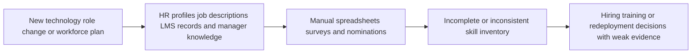
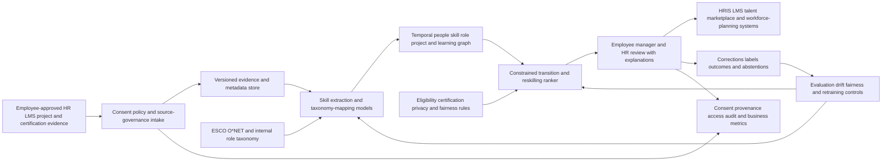

# HR-001 AI skills-evidence graph for internal mobility and reskilling

## Classification

- **Segment:** human-resources
- **Index summary:** Organizations can convert employee-approved work evidence into a governed skills graph that identifies capability gaps, ranks internal transition paths, and recommends targeted reskilling without making autonomous employment decisions.
- **Company profile / size:** Medium and large organizations with multiple job families, fragmented learning systems, recurring workforce transformation, and enough project or training evidence to support validated skill inference.
- **Opportunity type:** platform
- **Status:** researched
- **Confidence:** high
- **Complexity:** large
- **Horizon:** medium
- **Risk:** regulated
- **Azure fit:** high
- **AI dependency:** core
- **Intelligent capability:** Evidence-grounded skill extraction, taxonomy mapping, gap inference, and internal transition-path ranking
- **Repository alignment:** new-solution

## Problem

Workforce-planning, talent-management, and learning teams often need to redeploy employees as roles and technologies change, but their internal skill inventories depend on static job descriptions, self-declared profiles, manager memory, course completion records, and disconnected HR systems. These sources do not reliably show which capabilities an employee has demonstrated, which skills are missing for a target role, or which training sequence would create a realistic transition.

The affected process is not merely employee search. HR and business leaders must repeatedly compare changing role requirements against available internal capability, identify credible adjacent roles, prioritize reskilling investments, and explain recommendations to employees and managers. Manual review does not scale across thousands of workers, projects, certifications, learning records, and evolving skill taxonomies.

## Evidence

### Confirmed

- The World Economic Forum's Future of Jobs Report 2025, based on more than 1,000 employers representing over 14 million workers, reports that skill gaps are the largest barrier to business transformation for 63% of employers.
- The same report estimates that 39% of workers' existing skill sets will change or become outdated by 2030, and that 59 of every 100 workers would need training; employers expect some workers to be redeployed internally after upskilling.
- The International Labour Organization describes skills mismatch as the difference between skills sought by employers and those possessed by workers, and emphasizes systematic anticipation, reskilling, and upskilling for transitions within labour markets.
- ESCO provides a multilingual, machine-readable classification that links occupations with skills and competences. Its current classification contains thousands of occupation and skill concepts and can provide a controlled taxonomy rather than relying only on model-generated labels.
- ESCO itself reports using customised AI models to extract occupation and skill terminology from job advertisements, courses, qualifications, classifications, and sector publications, demonstrating that model-assisted skill extraction and taxonomy linkage is technically plausible.
- The European Commission identifies AI systems used for employment and worker-management tasks as potentially high-risk. Systems that influence recruitment, promotion, task allocation, or evaluation require strong risk management, data quality, transparency, and human oversight.

### Inference

- Organizations with fragmented HR, learning, project, and certification data are likely to underuse internal talent because evidence of transferable skills is difficult to normalize and compare manually.
- A governed skill-inference system can create value before making any employment recommendation by exposing uncertain mappings, missing evidence, and realistic training gaps for employee and manager validation.
- The safest initial deployment is decision support for workforce planning and voluntary internal mobility, not autonomous hiring, promotion, compensation, termination, or performance evaluation.

### Sources

- [World Economic Forum — The Future of Jobs Report 2025](https://www.weforum.org/publications/the-future-of-jobs-report-2025/digest/) — employer evidence on skill disruption, training, redeployment, and transformation barriers, published January 2025.
- [International Labour Organization — Skills mismatches](https://www.ilo.org/skills-mismatches) — definition and policy context for skills mismatch, reskilling, and transitions.
- [ESCO — About ESCO](https://esco.ec.europa.eu/en/about-esco) — official European occupation and skills classification and downloadable dataset.
- [ESCO v1.2](https://esco.ec.europa.eu/en/about-esco/escopedia/escopedia/esco-v12) — official description of AI-assisted extraction and linkage used to improve the taxonomy.
- [European Commission — Navigating the AI Act](https://digital-strategy.ec.europa.eu/en/faqs/navigating-ai-act) — official classification examples for employment and worker-management AI.
- [European Commission — AI Act regulatory framework](https://digital-strategy.ec.europa.eu/en/policies/regulatory-framework-ai) — official high-risk obligations and implementation timeline.

## Current process

## Proposed solution

Create a governed workforce skills-evidence platform that ingests only approved sources such as role profiles, certifications, completed learning, project assignments, work products, employee-submitted evidence, and manager-validated capability records. The platform extracts skill claims, maps them to controlled taxonomies such as ESCO or O*NET, records provenance and confidence, and builds a temporal graph connecting people, demonstrated skills, roles, projects, and training assets.

For a workforce-planning scenario, deterministic rules first define eligible roles, policy constraints, required certifications, location or schedule restrictions, and prohibited uses. The intelligent layer then ranks plausible transition paths by demonstrated transferable skills, missing capabilities, evidence strength, and training effort. Employees and authorized managers review inferred skills before they become usable. HR retains responsibility for workforce decisions, and the system must abstain when evidence is weak or fairness controls fail.

The solution should present explanations at the evidence level: which approved artifact supported each skill, which required skills remain missing, what training would close the gap, and why a transition was ranked. It must not infer protected characteristics, personality, emotion, loyalty, or performance from private communications or passive surveillance.

## Intelligent capability

- **Technique / model family:** Document and text classification, entity and skill extraction, embedding-based taxonomy matching, knowledge-graph inference, and learning-to-rank or constrained recommendation for role-transition pathways.
- **Why it is necessary:** Static rules can compare already normalized skills, but organizations do not possess a complete, consistently labelled inventory. The model is necessary to extract candidate skill evidence from heterogeneous approved artifacts, resolve synonyms against a controlled taxonomy, and rank multi-step transition paths. Removing it reduces the solution to another manually maintained skills database.
- **Inputs:** Employee-approved project descriptions and work artifacts, certifications, course outcomes, role profiles, competency frameworks, validated manager assessments, historical transitions, taxonomy definitions, and explicit policy constraints.
- **Outputs:** Skill claims with provenance and confidence, taxonomy mappings, evidence gaps, candidate adjacent roles, ranked transition paths, recommended training modules, uncertainty flags, and abstentions.
- **Training / grounding / optimization:** Begin with pretrained language embeddings and extraction models grounded against ESCO or O*NET. Create a reviewed golden set of artifact-to-skill mappings and role-transition judgments. Fine-tuning or learning-to-rank should occur only after enough consented, representative labels exist. Feedback from employee corrections and expert review must be versioned and screened before retraining.
- **Evaluation:** Precision, recall, and F1 for skill extraction; top-k taxonomy mapping accuracy; normalized discounted cumulative gain or precision@k for transition ranking; calibration of confidence scores; coverage and abstention rates; subgroup error and exposure analysis; reviewer acceptance and correction rates; and downstream training-completion or successful-transition metrics without treating correlation as causal proof.
- **Fallback and controls:** Employee confirmation before inferred skills are activated; human approval for transition recommendations; deterministic eligibility and certification checks; minimum evidence thresholds; explicit abstention; immutable provenance; model and taxonomy versioning; manual skills assessment path; appeal and correction process; and the ability to disable ranking while retaining verified records.

## Macro architecture

## Capabilities and possible technologies

- **Application and workflow capabilities:** Employee evidence review, skill correction and approval, role-path exploration, workforce-planning workspace, training-gap workflow, appeals, and controlled exports.
- **Data capabilities:** Versioned evidence store, temporal skill graph, taxonomy registry, provenance, consent state, feature and label snapshots, and deletion or retention workflows.
- **Integration capabilities:** HRIS, learning-management systems, project portfolio tools, credential providers, identity systems, and internal talent marketplaces.
- **Required AI / ML capabilities:** Skill and entity extraction, semantic taxonomy mapping, confidence calibration, graph features, constrained recommendation, and transition-path ranking.
- **Training, fine-tuning, grounding, recognition, or optimization capabilities:** Golden-set annotation, taxonomy-grounded inference, active-learning review queues, optional fine-tuning, ranking optimization, and governed feedback ingestion.
- **Evaluation and model-operations capabilities:** Offline evaluation, subgroup analysis, model and taxonomy versioning, drift monitoring, abstention analysis, human-correction tracking, and rollback.
- **Security and governance capabilities:** Purpose limitation, role-based access, consent and transparency, protected-attribute separation, audit trails, data minimization, retention, appeal, and high-risk AI governance where applicable.
- **Azure services that may fit:** Azure Machine Learning, Azure AI Language or Azure OpenAI for controlled extraction, Azure AI Search for hybrid retrieval, Azure Cosmos DB or another graph-capable data layer, Microsoft Purview, Microsoft Entra ID, Azure Functions, and Azure Monitor.
- **Non-Azure or open-source alternatives worth considering:** sentence-transformers, spaCy, GLiNER, Neo4j, PostgreSQL with pgvector, OpenSearch, MLflow, Feast, Evidently, and open ESCO or O*NET datasets.

## Possible gains

- More credible visibility into transferable internal capability than self-declared profiles alone.
- Faster identification of employees who may transition into growing roles after targeted training.
- Better alignment between learning investment and explicit role or project gaps.
- Reduced dependence on external hiring when suitable internal pathways exist.
- Explainable workforce-planning scenarios with evidence, uncertainty, and policy constraints.
- Greater employee agency through review, correction, and voluntary exploration of inferred capabilities.

## Metrics for validation

### Business and operational metrics

- Time required to produce a reviewed skills inventory for a business unit.
- Share of inferred skill claims confirmed, corrected, rejected, or left unreviewed by employees and experts.
- Number and proportion of internal vacancies with at least one reviewed transition pathway.
- Training recommendations accepted, completed, and linked to later validated capability evidence.
- Internal mobility rate, time to fill, external hiring dependency, and retention for participating cohorts, reported cautiously and compared with suitable baselines.
- Appeal, complaint, and recommendation-withdrawal rates.

### Intelligent-capability metrics

- Skill-extraction precision, recall, and F1 on a reviewed golden set.
- Top-k taxonomy mapping accuracy and unmapped-skill rate.
- Ranking precision@k or NDCG against expert-reviewed transition candidates.
- Confidence calibration, false-positive rate, evidence coverage, and abstention rate.
- Error, ranking-exposure, acceptance, correction, and abstention differences across legally permitted audit groups.
- Human override rate and reasons, monitored by model and taxonomy version.

## Risks, limits, and controls

- **Privacy and sensitive data:** Work artifacts can contain personal, customer, confidential, or regulated information. Only approved excerpts or metadata should be processed, with consent, minimization, redaction, retention limits, and strict access controls.
- **Regulatory or policy constraints:** Employment and worker-management AI may be high-risk under the EU AI Act and subject to local employment, privacy, labour, and anti-discrimination law. Classification and obligations require jurisdiction-specific legal review.
- **Human decision boundaries:** The system must not autonomously hire, reject, promote, demote, compensate, terminate, allocate punitive work, or evaluate performance. It supplies evidence and voluntary pathways for authorized human review.
- **Model, retrieval, recognition, or policy failure modes:** Models may infer skills from superficial mentions, confuse team output with individual contribution, overvalue well-documented office work, map emerging skills incorrectly, or create overly narrow career paths.
- **Bias, drift, weak labels, or insufficient feedback:** Historical transitions and manager labels may encode unequal access to visible projects or training. Fairness review must examine evidence availability, error rates, ranking exposure, and correction opportunity rather than relying only on aggregate accuracy.
- **Integration and data availability risks:** HRIS, LMS, project, and credential data may be incomplete, inconsistent, stale, or legally unavailable for this purpose. The design must degrade to explicit verified records and abstain rather than manufacture completeness.
- **Adoption and change-management risks:** Employees may reasonably view hidden inference as surveillance. Participation, evidence sources, intended use, explanations, correction, and appeal must be transparent and jointly governed with employee representatives where applicable.

## Fit score

| Dimension | Score | Rationale |
| --- | ---: | --- |
| Problem evidence and relevance | 19/20 | Major international sources identify skills mismatch and reskilling as material workforce and transformation problems. |
| Business or operational value | 18/20 | The solution can improve workforce visibility, internal mobility, and training allocation, although realized value depends on adoption and actual transition capacity. |
| Technical feasibility | 16/20 | Taxonomies, extraction models, embeddings, ranking methods, and enterprise data sources exist, but reliable evidence attribution, labels, privacy, and fairness evaluation are substantial constraints. |
| Reuse potential | 18/20 | The architecture applies across organizations with multiple job families and can reuse public taxonomies while supporting internal extensions. |
| Strategic differentiation | 18/20 | Evidence-level provenance, employee validation, constrained graph ranking, abstention, and governed reskilling pathways go materially beyond a generic talent marketplace or profile chatbot. |
| **Total** | **89/100** | High-value and reusable opportunity with core AI contribution, but large implementation and governance complexity. |

## Repository relationship

- **Existing references that may be reused:** Observability, security, storage, portal, Functions, AI gateway, and general Azure AI reference patterns already present in the kit.
- **Missing capabilities exposed by this opportunity:** Governed skill extraction, taxonomy mapping, temporal knowledge graphs, recommendation and ranking evaluation, fairness monitoring, consent-aware evidence ingestion, and high-risk employment-AI controls.
- **Potential building blocks:** Taxonomy-grounded entity extraction, evidence-provenance contract, graph feature pipeline, constrained ranker, human correction workflow, model evaluation scorecard, and consent-aware data intake.
- **Potential composed solution:** `solutions/workforce-skills-mobility-platform`.
- **Reasons to keep it outside the current kit, when applicable:** A production deployment requires substantial HR policy, labour relations, legal review, integration, data governance, and organization-specific validation beyond a generic reference implementation.

## Duplicate control

- **Problem keys:** workforce-skills-inventory, internal-mobility, reskilling-pathways, skills-mismatch, learning-investment
- **Capability keys:** skill-extraction, taxonomy-mapping, knowledge-graph, recommendation-ranking, learning-to-rank, confidence-calibration, fairness-evaluation, human-validation
- **Research queries used:** `2025 workforce skills gaps employers internal mobility skills-based organization report official`; `site:oecd.org skills-first internal mobility workforce skills 2025`; `site:weforum.org Future of Jobs Report 2025 skills gap workforce transformation`; `site:ilo.org skills mismatch workforce digital skills 2025`; `European Commission AI Act employment worker management high-risk official 2026`; `site:esco.ec.europa.eu skills occupations taxonomy official ESCO`; `site:onetcenter.org O*NET skills taxonomy official`
- **Related opportunities:** None.
- **Uniqueness statement:** This opportunity is specifically about governed extraction of demonstrated skill evidence and explainable ranking of internal transition and reskilling pathways. It is not a recruiting screener, generic learning recommender, employee-policy assistant, or performance-evaluation system.

## Next decision

- Continue research through an organization-specific data audit, employee-consent design, legal classification, and small offline evaluation before shortlisting.
