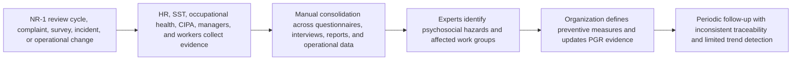
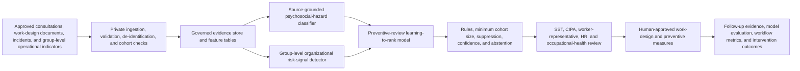

# HR-002 AI-assisted psychosocial-risk prevention and work-design assurance

## Classification

- **Segment:** human-resources
- **Primary market / jurisdiction:** Brazil
- **Evidence reference date:** 2026-07-19; NR-1 wording effective 2026-05-26; Brazilian official evidence published 2026-01 through 2026-05.
- **Index summary:** Brazilian employers can combine worker consultation, work-design evidence, absence trends, incidents, and operational signals to identify group-level psychosocial hazards and prioritize preventive actions without profiling individual mental health.
- **Company profile / size:** Medium and large employers with structured HR, occupational-health, safety, compliance, or people-analytics functions; adaptable to smaller organizations through aggregated questionnaires and workshops.
- **Opportunity type:** operations
- **Status:** hypothesis
- **Confidence:** medium
- **Complexity:** medium
- **Horizon:** medium
- **Risk:** regulated
- **Solution evidence level:** conceptual
- **Operational maturity:** unvalidated
- **Azure fit:** high
- **AI dependency:** core
- **Primary AI role:** classification
- **Intelligent capability:** Evidence-grounded classification of psychosocial work hazards, group-level anomaly detection, and risk-ranked preventive-action recommendations
- **Repository alignment:** extend-kit

## Problem

Brazilian employers must identify and manage psychosocial factors arising from work organization, including excessive demands, poor role clarity, harassment, weak support, low autonomy, and unstable work arrangements. Today, evidence is commonly fragmented across worker consultations, risk inventories, incident reports, absence records, occupational-health observations, surveys, shift data, overtime, turnover, and operational performance.

The recurring problem is not simply lack of data. It is the difficulty of converting heterogeneous and partly qualitative evidence into a traceable group-level risk inventory, detecting changes early, distinguishing organizational hazards from individual health conditions, and prioritizing preventive redesign actions. Manual reviews are necessary but can be slow, inconsistent, and difficult to repeat across units and periods.

## Brazil applicability and current context

The revised NR-1 entered into force on 26 May 2026 and explicitly requires occupational risk management to include work-related psychosocial risk factors. Fundacentro's current guidance emphasizes analysis of work organization and management, worker participation, and preventive intervention rather than individual diagnosis.

Brazil also recorded 4,126,110 temporary-incapacity benefits in 2025, 15.19% more than in 2024. Fundacentro reported in March 2026 that benefits related to mental and behavioral disorders had more than doubled after the pandemic, while work-related causation remained under-recognized.

This opportunity is therefore designed around Brazilian occupational-risk governance. It does not infer psychiatric conditions, score individual employability, monitor keystrokes, analyze private messages, or automate disciplinary, compensation, promotion, dismissal, or medical decisions.

## Evidence

### Confirmed problem evidence

- The revised NR-1, effective 26 May 2026, includes work-related psychosocial factors in occupational risk management and is accompanied by current official interpretation material.
- Fundacentro's May 2026 guidance frames psychosocial prevention around organization and management of work, worker participation, and protective measures.
- Brazil granted 4.126 million temporary-incapacity benefits in 2025, up 15.19% from 2024.
- Fundacentro reported in March 2026 that benefits for mental and behavioral disorders had grown by more than 100% after the pandemic and that occupational causation is often not recognized.

### Favorable solution evidence

- A 2025 peer-reviewed pilot using a historical Brazilian absenteeism dataset showed that classical ML can identify patterns associated with prolonged absence, demonstrating technical feasibility while also exposing limitations in duration prediction.
- Qualitative risk evidence can be converted into structured, source-linked classifications using embeddings or language models, provided outputs remain traceable and are reviewed by occupational-safety professionals and worker representatives.
- Group-level time-series monitoring can identify changes in overtime, turnover, incidents, queue pressure, staffing gaps, and absence patterns without creating individual health-risk scores.

### Counter-evidence and limitations

- The absenteeism pilot used only 740 historical records from one Brazilian company, excluded extreme absences, and achieved weak regression performance for duration prediction. It does not establish generalizable causal prevention value.
- Workplace surveillance and individual activity scoring can create discrimination, distrust, and legal risk, especially when protected leave or health-related absences affect performance or employment decisions.
- Psychosocial hazards cannot be reduced to automated sentiment analysis or productivity telemetry. Worker consultation, contextual interpretation, and organizational intervention remain essential.
- These limitations narrow the solution to group-level hazard assurance, source-linked evidence synthesis, abstention, and human governance. Individual prediction is outside scope.

### Inference

- A governed system that joins structured operational trends with worker-approved qualitative evidence may improve consistency and review coverage of psychosocial risk inventories, but only a bounded prototype can determine whether it adds value beyond questionnaires, workshops, and conventional dashboards.

### Unknowns

- Whether participating organizations have sufficiently stable organizational-unit definitions and historical data.
- Whether worker representatives and occupational-health teams consider the proposed aggregation and privacy controls acceptable.
- Which hazard categories can be classified reliably from local Portuguese-language evidence.
- Whether ranked preventive actions improve review quality or merely restate existing expert guidance.

### Sources

- [Norma Regulamentadora No. 1](https://www.gov.br/trabalho-e-emprego/pt-br/acesso-a-informacao/participacao-social/conselhos-e-orgaos-colegiados/comissao-tripartite-partitaria-permanente/normas-regulamentadoras/normas-regulamentadoras-vigentes/nr-1) — Brazil; current page includes NR-1 effective 26 May 2026 and May 2026 interpretation materials; regulation and problem context.
- [Fundacentro lança diretrizes para aplicar NR-1 com inclusão dos riscos psicossociais](https://www.gov.br/fundacentro/pt-br/comunicacao/noticias/noticias/2026/maio/fundacentro-lanca-diretrizes-para-aplicar-nr-1-com-inclusao-dos-riscos-psicossociais) — Brazil; 26 May 2026; official operating guidance.
- [Concessão de benefícios por transtornos mentais e comportamentais cresce mais de 100% após pandemia](https://www.gov.br/fundacentro/pt-br/comunicacao/noticias/noticias/2026/marco/concessao-de-beneficios-por-transtornos-mentais-e-comportamentais-cresce-mais-de-100-apos-pandemia) — Brazil; 13 March 2026; problem evidence and under-recognition limitation.
- [Previdência Social concede 4,1 milhões de benefícios por incapacidade temporária em 2025](https://www.gov.br/previdencia/pt-br/noticias/2026/janeiro/previdencia-social-protege-segurados-ao-conceder-4-1-milhoes-de-beneficios-por-incapacidade-temporaria-em-2025) — Brazil; 27 January 2026; national operating evidence.
- [Predicting workplace absenteeism using machine learning: a pilot study in occupational health](https://pubmed.ncbi.nlm.nih.gov/41214757/) — international research using historical Brazilian-company data; November 2025; prototype plausibility and limitations.
- [Emotion AI in Workplace Environments: A Case Study](https://arxiv.org/abs/2412.09251) — Finland; December 2024; worker acceptance, transparency, and surveillance limitation.

## Current process

## Baseline without AI

- **Current baseline:** Expert-led questionnaires, interviews, workshops, risk matrices, spreadsheets, incident review, and periodic PGR updates.
- **Strongest realistic non-AI alternative:** Standardized validated questionnaires, predefined hazard taxonomy, deterministic thresholds for overtime and absence trends, structured workshops, and a conventional BI dashboard.
- **Baseline strengths:** Transparent, understandable, participatory, legally defensible, and feasible with limited data.
- **Baseline limitations:** Manual coding of qualitative evidence, inconsistent classification across units, weak source traceability, delayed detection of interacting operational signals, and high review effort at scale.
- **Context where intelligence may add incremental value:** Large volumes of Portuguese-language consultation evidence, many organizational units, repeated review cycles, and multiple weak signals that require source-linked synthesis rather than a single threshold.
- **Condition where the non-AI baseline should be preferred:** Small organizations, sparse evidence, unstable unit structures, low worker trust, or any context where aggregation cannot adequately protect individuals.

## Proposed solution

Create a governed psychosocial-risk assurance workspace for occupational-safety, HR, CIPA, worker representatives, and occupational-health teams. The workflow ingests approved questionnaires, workshop notes, incident narratives, job-design documentation, aggregated absence trends, overtime, staffing, turnover, queue pressure, shift instability, and organizational-change events.

A source-grounded classifier maps qualitative evidence to an explicit psychosocial-hazard taxonomy and links every finding to supporting excerpts. A group-level anomaly model detects material changes in operational indicators over time. A ranking component combines evidence strength, recurrence, affected population, existing controls, and uncertainty to prioritize expert review and candidate preventive actions.

Rules enforce minimum group size, suppress sparse cohorts, exclude medical diagnoses and protected leave details, prevent individual scoring, and maintain a complete audit trail. Humans confirm hazards, consult workers, select controls, update the PGR, and evaluate whether interventions improved work conditions.

## Where AI enters

### AI role map

| Process stage | AI component | AI type / model family | What it does | Runtime mode | Output | Human or deterministic control |
| --- | --- | --- | --- | --- | --- | --- |
| Evidence structuring | Source-grounded hazard classifier | Portuguese embeddings plus constrained LLM or supervised text classifier | Maps approved qualitative evidence to psychosocial-hazard categories and extracts supporting passages | Asynchronous batch, human-in-the-loop | Category candidates, evidence excerpts, confidence, abstention | Taxonomy rules, source citation requirement, confidence threshold, expert confirmation |
| Group trend review | Organizational risk-signal detector | Robust time-series anomaly detection and classical ML | Detects group-level changes in overtime, staffing instability, incidents, turnover, absence, and workload proxies | Scheduled batch | Group-period anomaly and contributing signals | Minimum cohort size, no individual output, deterministic quality checks, expert interpretation |
| Review prioritization | Preventive-review ranker | Gradient boosting or learning-to-rank | Orders hazard reviews using evidence strength, recurrence, exposure, existing controls, and uncertainty | Batch after evidence refresh | Ranked review queue with factors | No automatic action, fairness review, override, documented rationale |

### Required distinctions

- **Primary AI role:** Classification, anomaly detection, and ranking/recommendation.
- **Model family:** Embeddings/retrieval with a constrained LLM or supervised Portuguese text classifier; robust time-series anomaly detection; classical learning-to-rank.
- **Training requirement:** Begin with prompt-and-grounding or pretrained embeddings; calibrate on an expert-reviewed Portuguese golden set; supervised training only after adequate labels exist.
- **Training location and cadence:** Offline per-customer calibration, followed by periodic retraining only after drift and label-quality review.
- **Inference location:** Private cloud batch pipeline inside the employer's governed environment.
- **Agent role, when any:** Agent: not used.
- **LLM role, when any:** LLM may classify and extract source-linked evidence under a fixed schema; it does not diagnose workers, infer emotions, select employment actions, or execute interventions.
- **Non-LLM intelligence:** Group-level anomaly detection and review ranking use classical statistical or ML models.
- **Not AI:** Consent and access controls, minimum cohort sizes, suppression, taxonomies, thresholds, workflow, PGR records, dashboards, approvals, consultation, and intervention decisions are deterministic or human-led.

## Intelligent capability details

- **Technique / model family:** Portuguese semantic classification, retrieval-grounded extraction, robust group-level anomaly detection, and calibrated learning-to-rank.
- **Why it is necessary:** The main incremental value is consistent, source-traceable synthesis of heterogeneous qualitative evidence and interacting group-level trends at a scale that manual coding alone may not cover.
- **Inputs:** Approved consultation text, structured hazard questionnaires, work-design documents, incident narratives, aggregated organizational indicators, control inventory, and prior expert decisions.
- **Outputs:** Hazard candidates, supporting excerpts, group-period anomalies, ranked review queue, uncertainty, and abstention states.
- **Training / grounding / optimization assumptions:** Expert-reviewed local taxonomy mappings; no use of private messages or raw employee monitoring; labels represent hazard evidence, not health diagnoses.
- **Evaluation:** Macro-F1 and per-category recall for hazard classification, evidence-span precision, calibration error, anomaly precision at review capacity, ranking NDCG, abstention quality, subgroup and unit stability, and comparison with deterministic questionnaires and dashboards.
- **Fallback and controls:** Rules-only dashboard, manual coding, mandatory review, minimum group sizes, sparse-cohort suppression, source citation, abstention, rollback, and prohibition of individual employment use.

## Data and integration assumptions

- **Data owners and access path:** HR, SST, occupational health, CIPA, legal/privacy, worker representatives, operations, and approved survey owners.
- **Expected volume, history, frequency, and coverage:** At least several review cycles or 12-24 months of group-level operational history; qualitative evidence may begin with one bounded business unit.
- **Labels, outcomes, feedback, or simulation available:** Expert hazard annotations, accepted/rejected findings, completed interventions, and follow-up survey or operational outcomes; synthetic cases may test controls but cannot prove effectiveness.
- **Known quality, imbalance, missingness, and leakage risks:** Sparse categories, inconsistent unit names, organizational reorganizations, under-reporting, manager-influenced survey participation, and leakage from post-event outcomes.
- **Brazilian or local-context representativeness:** Portuguese language, local work organization, collective arrangements, sector practices, and worker-participation processes require customer-specific validation.
- **Privacy, retention, consent, surveillance, or sharing constraints:** No diagnosis inference, emotion recognition, keystroke tracking, private-message analysis, or individual risk score; strict purpose limitation, aggregation, access control, retention rules, and worker transparency.
- **Integration and synchronization assumptions:** Survey tools, incident systems, HRIS aggregates, time-and-attendance aggregates, SST records, and controlled document repositories.
- **Drift and change sources:** Reorganizations, seasonal demand, policy changes, new schedules, acquisitions, remote-work changes, and revised hazard taxonomy.
- **Minimum viable data for a prototype:** One business unit, approved qualitative evidence, an expert taxonomy, at least 12 months of aggregated operational indicators, and a manual baseline review.

## Prototype validation plan

- **Prototype scope / process slice:** One business unit and one NR-1 psychosocial-risk review cycle; no individual outputs.
- **Users, sites, assets, documents, events, or simulated cases:** SST professionals, CIPA or worker representatives, HR, occupational health, 100-500 approved evidence items, and aggregated monthly indicators.
- **Baseline or comparison:** Validated questionnaire plus manual expert coding, deterministic thresholds, and BI dashboard.
- **Required data and integrations:** Controlled document upload, approved survey export, group-level HR/operations aggregates, hazard taxonomy, and review workflow.
- **Model-quality metrics:** Hazard macro-F1, evidence-span precision, calibration error, anomaly precision at fixed review capacity, NDCG, abstention rate, and category-level error analysis.
- **Business or workflow metrics:** Review effort, duplicate findings, time to assemble evidence, traceability completeness, accepted high-priority hazards, and intervention follow-up completion.
- **Human acceptance, correction, or override metrics:** Acceptance by SST and worker representatives, correction rate, override reasons, trust survey, and perceived surveillance risk.
- **Safety and compliance boundaries:** Group-level outputs only; minimum cohort size; no individual diagnosis, performance, promotion, dismissal, compensation, or disciplinary use.
- **Failure or redesign criteria:** Poor evidence grounding, unstable results across equivalent groups, high sparse-cohort exposure risk, low worker trust, no improvement over manual coding, or systematic omission of important hazards.
- **Evidence required before a pilot or broader implementation:** Local privacy and labor review, worker-representation approval, reproducible benchmark against baseline, documented non-use controls, and an intervention-evaluation design.

## Macro architecture

## Capabilities and possible technologies

- Application and workflow capabilities: Evidence intake, hazard review queue, source-linked findings, approval, intervention tracking, and audit trail.
- Data capabilities: De-identification, aggregation, feature pipelines, time-series storage, document evidence, and model feedback.
- Integration capabilities: HRIS aggregates, survey platforms, incident systems, time-and-attendance aggregates, document repositories, and BI.
- Required AI / ML capabilities: Text classification, evidence extraction, anomaly detection, calibration, and learning-to-rank.
- Training, grounding, recognition, or optimization capabilities: Golden-set management, prompt/schema evaluation, supervised calibration, temporal validation, drift monitoring, and model registry.
- Agent and tool-use capabilities, or `not used`: not used.
- LLM / foundation-model capabilities, or `not used`: Optional constrained Portuguese extraction and classification with source grounding.
- Evaluation and model-operations capabilities: Azure Machine Learning or MLflow, batch evaluation, responsible-AI analysis, drift and data-quality monitoring.
- Security and governance capabilities: Private networking, managed identities, encryption, role-based access, audit logs, retention, and purpose controls.
- Azure services that may fit: Azure Functions or Container Apps, Azure AI Search, Azure OpenAI for constrained extraction when approved, Azure Machine Learning, Azure SQL or PostgreSQL, Blob Storage, Data Factory, Key Vault, Monitor, and Power BI.
- Non-Azure or open-source alternatives worth considering: sentence-transformers, spaCy, scikit-learn, XGBoost or LightGBM, MLflow, PostgreSQL with pgvector, Great Expectations, and Superset.

## Possible gains

- More consistent and source-traceable psychosocial-hazard reviews across organizational units.
- Earlier identification of group-level changes requiring worker consultation or work-design review.
- Reduced manual effort for repetitive evidence coding while preserving expert and worker authority.
- Better linkage between identified hazards, preventive actions, and follow-up evidence.

## Metrics for validation

### Business and operational metrics

- Review time and evidence-traceability completeness versus manual baseline.
- Accepted hazard findings, intervention follow-up completion, and time from signal to reviewed preventive action.
- Worker-representative acceptance, trust, complaints, and opt-out or contestation patterns.

### Intelligent-capability metrics

- Hazard classification macro-F1, evidence-span precision, calibration, anomaly precision, ranking NDCG, and abstention quality.
- Expert acceptance, correction, override, and missed-hazard rates by category and organizational unit.

## Risks, limits, and controls

- Privacy and sensitive data: Use aggregation and approved evidence only; exclude diagnosis, private communications, biometrics, emotion recognition, and individual surveillance.
- Brazilian regulatory or policy constraints: Align with NR-1, occupational-health confidentiality, LGPD purpose and minimization principles, worker consultation, and legal review.
- Human decision boundaries: Models cannot diagnose, determine fitness for work, score performance, or recommend promotion, dismissal, compensation, discipline, or benefits decisions.
- Model or policy failure modes: False reassurance, over-alerting, taxonomy mismatch, under-reporting bias, spurious seasonal correlations, and organizational-unit instability.
- Agent or tool-execution failure modes, when applicable: Agent not used.
- LLM hallucination, grounding, or prompt-injection risks, when applicable: Fixed schema, approved sources only, exact evidence excerpts, abstention, no external tools, and expert review.
- Comparable failures and applicable lessons: Individual productivity or leave-based scoring can penalize protected absences and create discrimination claims; therefore individual ranking and employment actions are forbidden.
- Bias, drift, weak labels, or insufficient feedback: Worker participation and error review are required; accepted expert findings are not automatically causal truth.
- Integration and data risks: Inconsistent units, missing survey coverage, reorganizations, and hidden operational changes.
- Adoption and change-management risks: Workers may perceive the system as surveillance unless governance, data boundaries, and outputs are transparent and jointly reviewed.
- Prototype cost or operational assumptions: Main costs are secure integration, qualitative annotation, worker consultation, evaluation, and governance rather than model inference alone.

## Fit score

| Dimension | Score | Rationale |
| --- | ---: | --- |
| Problem evidence and relevance | 19/20 | Current Brazilian regulation and official 2026 evidence create a specific, timely operating need. |
| Business or operational value | 18/20 | Better review consistency and prevention prioritization are valuable, though intervention impact must be demonstrated locally. |
| Technical feasibility | 17/20 | A bounded group-level prototype is testable with common survey, document, and aggregate operational data; qualitative labels and governance remain material unknowns. |
| Reuse potential | 18/20 | Document extraction, classification, anomaly detection, ranking, evaluation, privacy controls, and workflow blocks are reusable across sectors. |
| Strategic differentiation | 17/20 | Source-linked synthesis and interacting group-level signals add value beyond questionnaires, but only if they outperform a strong deterministic dashboard without creating surveillance. |
| **Total** | **89/100** | Strong prototype candidate with strict non-individual scope and worker governance. |

## Repository relationship

- Existing references that may be reused: Document processing, retrieval, workflow, model-evaluation, private networking, identity, audit, and data-platform building blocks.
- Missing capabilities exposed by this opportunity: Group-privacy enforcement, cohort suppression, source-grounded classification benchmark, worker-governance workflow, and intervention-evaluation pattern.
- Potential building blocks: Governed evidence intake, minimum-cohort policy engine, Portuguese hazard classifier, time-series anomaly service, review ranker, golden-set evaluator, and human review workspace.
- Potential composed solution: Private psychosocial-risk evidence assurance and preventive-action review platform.
- Reasons to keep it outside the current kit, when applicable: None at hypothesis stage, provided individual employee scoring remains explicitly excluded.

## Duplicate control

- **Problem keys:** psychosocial-risk-management, NR-1, work-organization, occupational-safety, worker-consultation, preventive-intervention
- **Capability keys:** source-grounded-classification, group-anomaly-detection, learning-to-rank, cohort-privacy, human-review
- **Research queries used:** `site:gov.br 2025 2026 riscos psicossociais NR-1 trabalho Brasil afastamentos saúde mental`; `site:gov.br 2025 acidentes de trabalho Brasil dados afastamentos observatório segurança saúde trabalho`; `site:gov.br 2025 absenteísmo trabalho Brasil afastamentos INSS saúde mental`; `occupational psychosocial risk machine learning workplace absenteeism counter evidence bias employee monitoring 2024 2025`
- **Related opportunities:** HR-001 addresses skills evidence and internal mobility; it does not address occupational-risk management, work design, or psychosocial prevention.
- **Uniqueness statement:** This opportunity manages group-level evidence about work organization under current Brazilian NR-1 requirements; it explicitly excludes individual mental-health, performance, or employment scoring.

## Next decision

Prototype candidate.

Implementation approval remains an explicit human decision.