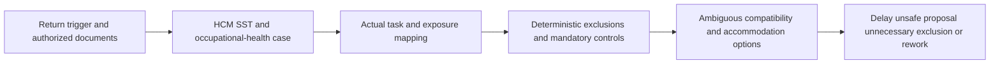
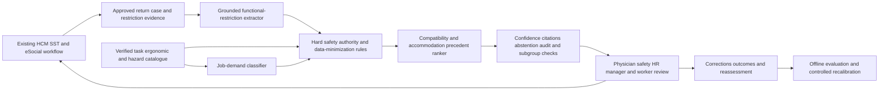

# HR-003 AI-assisted return-to-work accommodation assurance

## Classification

- **Segment:** human-resources
- **Primary market / jurisdiction:** Brazil
- **Evidence reference date:** 2026-07-20
- **Index summary:** Brazilian employers can map medically authorized functional restrictions to real job demands, using grounded extraction and compatibility ranking to propose auditable return-to-work accommodations without making medical or employment decisions.
- **Organization archetype / size:** Brazilian industrial, logistics, healthcare, or service employer with 500–10,000 employees and internal HR/SST
- **Primary actor:** occupational-health case coordinator, with occupational physician, safety engineer, HR, manager, and worker approval boundaries
- **Simulated process:** coordinate return after extended health-related absence or INSS rehabilitation
- **Opportunity type:** integration
- **Status:** hypothesis
- **Confidence:** medium
- **Complexity:** large
- **Horizon:** medium
- **Risk:** regulated
- **Solution evidence level:** conceptual
- **Operational maturity:** unvalidated
- **Existing-solution disposition:** integrate
- **Azure fit:** high
- **AI dependency:** core
- **Primary AI role:** ranking-recommendation
- **Intelligent capability:** grounded restriction and job-demand extraction, compatibility classification, accommodation retrieval, and risk-ranked human review
- **Repository alignment:** new-solution

## Operational simulation

### Operating archetype

- **Organization type and approximate size:** multi-site employer with 2,000 employees, mixed office and operational roles, occupational-health provider, HCM, SST system, and eSocial integration.
- **Primary actor and authority:** case coordinator assembles the case but cannot issue medical fitness, disclose diagnoses, alter employment unilaterally, or assign work without authorized approval.
- **Process trigger:** expected return after absence, occupational examination, INSS rehabilitation communication, or new functional restriction.
- **Actor objective and completion condition:** produce an approved, understandable, time-bounded work plan whose tasks respect authorized restrictions and whose follow-up is scheduled.
- **Inputs, systems, documents, devices, or physical context:** ASO and authorized restriction statements, rehabilitation documents, job descriptions, task inventories, ergonomic assessments, exposure records, schedules, workplace accessibility, training requirements, HCM/SST/eSocial status, and worker feedback.
- **Rules, deadlines, safety, cost, and compliance constraints:** NR-7 medical authority, accessibility and reasonable adaptation duties, LGPD treatment of health data, collective agreements, safety controls, operational staffing, and prohibition of autonomous adverse employment decisions.
- **Upstream and downstream handoffs:** worker/INSS/physician → occupational health → safety/ergonomics → HR/manager → worker approval and monitored execution.

### Assumptions

- **Known operating facts already available:** eSocial records absence and return events; NR-7 governs occupational health examinations; Brazilian inclusion rules require accessible and inclusive work and reasonable adaptations; INSS operates professional rehabilitation.
- **Simulation assumptions requiring validation:** job descriptions are often too generic to represent real task demands; restrictions arrive in inconsistent language; feasible temporary tasks exist but are dispersed across teams; follow-up outcomes are weakly structured.
- **Synthetic events or cases introduced:** lifting restriction omitted from a generic job description; a warehouse peak eliminates the initially selected light-duty station; two documents use conflicting duration language; remote work reduces commuting demand but introduces unsuitable sustained-screen exposure.

### Workflow simulation

| Stage | Trigger / available information | Actor and system action | Decision or uncertainty | Current handling | Friction, risk, or missed outcome | Feedback signal |
| --- | --- | --- | --- | --- | --- | --- |
| Intake | return date, ASO, INSS or medical document | coordinator opens case and reconciles dates | which restrictions may be operationalized and for how long | email, spreadsheet, SST/HCM records | missing document, excess diagnosis exposure, inconsistent dates | corrected case and accepted restriction set |
| Demand mapping | job title, manager description, ergonomic and safety records | team enumerates actual tasks and exposures | whether documented role matches real work | interviews and generic descriptions | hidden lifting, posture, pace, travel, cognitive or sensory demand | validated task-demand profile |
| Accommodation search | restrictions plus available tasks and controls | HR, safety, manager explore changes | which combinations are compatible and operationally feasible | meetings and precedent search | slow search, inconsistent precedent, unnecessary exclusion from work | accepted/rejected accommodation with reason |
| Approval | proposed plan and residual risks | physician, safety, HR, manager, worker review within authority | whether evidence is sufficient; when to abstain | sequential approvals | unclear accountability and late rework | approval, correction, abstention, escalation |
| Follow-up | work execution, symptoms or difficulty reported without diagnosis inference | coordinator reviews adherence and operational fit | continue, adjust, reassess, or stop | calendar reminders and informal feedback | restrictions drift, task substitution, recurrence | outcome, override, incident, early reassessment |

### Scenario variants

#### Normal flow

A complete restriction statement and current task inventory are available. Deterministic rules remove prohibited demands. The team selects a previously used accommodation, confirms training and schedule, obtains approvals, and reviews the arrangement after two weeks.

#### Exception flow

The ASO permits return but supporting documents describe limitations differently; the job description omits manual handling performed during peak periods. The case must abstain from automatic compatibility and request physician clarification and task observation before assignment.

#### Peak or degraded flow

Several workers return during a production peak while occupational-health staffing is reduced. Previously suitable stations are unavailable, managers propose improvised tasks, and approval queues grow. The system must rank only evidence-supported options, expose capacity conflicts, and preserve a safe no-assignment fallback.

### Opportunity points derived from the simulation

| Decision, exception, or uncertainty | Strongest deterministic response | Remaining gap | Candidate intelligent role | Expected incremental outcome | Main risk |
| --- | --- | --- | --- | --- | --- |
| reconcile dates and required documents | schema, required fields, eSocial/HCM integration | little remains | reject AI | fewer clerical errors | overengineering |
| identify actual job demands | structured task catalogue and periodic validation | free text, local variants, and changing work remain difficult | extraction and classification | more complete demand profiles | inferred demand treated as fact |
| match restrictions to tasks | hard exclusion rules | combinations, partial accommodations, precedents, and uncertainty remain | compatibility ranking and retrieval | faster, more consistent review | discriminatory or unsafe recommendation |
| monitor plan execution | reminders, checklists, worker reporting | weak signals across changes and outcomes | anomaly detection for case review | earlier reassessment | surveillance and health inference |

Selected candidate: compatibility assurance after deterministic exclusions, with abstention and multi-role approval. Monitoring is limited to explicit case events and worker-approved feedback, not productivity surveillance.

## Selected problem and opportunity hypothesis

Return-to-work coordination joins medical-authority outputs, real task demands, accessibility, safety, staffing, and worker participation. Systems can register absence and documents, but the material decision is whether a concrete task-and-accommodation combination is supported by current evidence. Generic job descriptions and inconsistent language create manual reconciliation and unsafe or unnecessarily restrictive outcomes.

The hypothesis is an integration layer that extracts only authorized functional restrictions, maps actual task demands, applies deterministic prohibitions, retrieves comparable approved accommodations, and ranks reviewable options. It never determines fitness, diagnoses, dismisses, disciplines, or assigns work autonomously.

## Brazil applicability and current context

The INSS described professional rehabilitation in February 2026 as a path for workers with lasting limitations to acquire capacity for another occupation and return to work. A 2025 federal evaluation also defines the service around skills and supports for re-entry. The Ministry of Labour's inclusion page, updated in May 2026, confirms the legal quota mechanism for people with disabilities and rehabilitated beneficiaries. Fundacentro stated in March 2026 that Brazilian law recognizes reasonable adaptation for entry, permanence, and return, while employers still lack effective support strategies.

NR-7's official page was updated in June 2025 and remains the occupational-health regulatory context. The Brazilian Inclusion Law requires accessible and inclusive workplaces, prohibits discrimination in permanence and professional rehabilitation, and requires reasonable adaptation and individualized support. These sources confirm the coordination problem but do not prove that any ranking model improves outcomes; that remains a prototype question.

## Existing solutions and differentiation

### Existing solutions reviewed

| Solution / platform | Owner or vendor | Current capabilities | Evidence date | Coverage overlap |
| --- | --- | --- | --- | --- |
| eSocial S-2230 and return workflow | Brazilian government | absence start/end records and consistency rules | 2026 | records administrative status, not task compatibility or accommodation quality |
| Senior HCM absence management | Senior Sistemas | absence histories, recurrence handling, eSocial submission, retroactive corrections | current documentation | covers HR/eSocial process and data, not evidence-grounded work-demand matching |
| INSS Professional Rehabilitation | INSS | rehabilitation assessment, qualification, assistive resources, and re-entry support | 2025–2026 | authoritative rehabilitation service; does not provide an employer-side cross-system compatibility assurance layer |
| Occupational-health/SST suites | multiple vendors | medical records, ASO, exams, risks, HCM and eSocial integration | current market | usually manage records and workflows; public evidence found did not establish auditable semantic matching of restrictions to real tasks and accommodations |

### Gap and disposition

- **What is already solved:** absence registration, medical examination workflow, compliance records, standard task restrictions, eSocial transmission, and human approvals.
- **Overlap with the simulated candidate:** HCM/SST platforms contain many required records and workflow extension points.
- **Material uncovered gap:** auditable reconciliation of authorized functional restrictions, actual task demands, feasible accommodations, and changing operational availability.
- **Underserved actor, scenario, exception, integration, decision, or outcome:** coordinators handling ambiguous documents, generic job descriptions, multi-site task variants, and degraded staffing conditions.
- **Disposition:** integrate
- **Why changing vendor, cloud, model, UI, or architecture is insufficient:** differentiation comes from the bounded evidence contract, deterministic exclusions, calibrated compatibility review, and worker/medical/safety authority boundaries.
- **Differentiation statement:** add a governed assurance layer to existing HCM/SST systems that ranks evidence-supported accommodation options and missing-evidence escalations without making medical or employment decisions.

## Evidence map

### Simulated observations

- Generic job descriptions can omit temporary or peak-period demands.
- Accommodation feasibility changes with shift, site, equipment, training, and staffing.
- Ambiguous restriction language can cause either unsafe assignment or unnecessary exclusion.

### Confirmed problem evidence

- INSS continues operating professional rehabilitation for workers with lasting limitations and occupational change needs.
- Fundacentro identifies an implementation gap in employer support for adaptation and return to work.
- Brazilian labour inspection continues to supervise inclusion of people with disabilities and rehabilitated beneficiaries.

### Existing-solution evidence

- eSocial and Senior HCM support detailed absence status and return-event administration.
- Existing official rehabilitation and occupational-health processes retain human professional authority.

### Favorable evidence for the uncovered gap

- Current research associates fully granted accommodations with materially narrower disability gaps in work experience, supporting accommodation quality as a meaningful outcome rather than mere case closure.
- Constraint filtering plus human-reviewed ranking is technically testable using historical approved cases and synthetic exceptions.

### Counter-evidence and limitations

- A rules-and-catalogue solution may be sufficient where jobs and restrictions are standardized; such organizations should not deploy a model.
- Employment AI can penalize protected leave or disability when productivity, absence, or performance data enter the model. These features are prohibited.
- Suggested “light duty” can still be unsuitable when real work differs from catalogued demands; task verification and worker feedback are mandatory.

### Inference

- Better evidence reconciliation may reduce coordination delay and unsuitable proposals, but causal effects on sustainable return require controlled evaluation.

### Unknowns

- availability and quality of task-demand catalogues;
- proportion of cases needing semantic reasoning after rules;
- subgroup error rates and worker acceptance;
- legal basis, retention, and access design for each data source;
- integration depth of target HCM/SST vendors.

### Sources

- [INSS — Reabilitação Profissional possibilita reinserção](https://www.gov.br/inss/pt-br/reabilitacao-profissional-do-inss-possibilita-reinsercao-de-trabalhadores-no-mercado-de-trabalho) — Brazil; 2026-02-19; current problem and operating context.
- [CMAP — Serviço de Reabilitação Profissional](https://www.gov.br/planejamento/pt-br/assuntos/avaliacao-de-politicas-publicas/conselho-de-monitoramento-e-avaliacao-de-politicas-publicas-cmap/avaliacoes/servico-de-reabilitacao-profissional) — Brazil; 2025, modified 2026-01-19; policy evaluation context.
- [MTE — Inclusão de pessoa com deficiência](https://www.gov.br/trabalho-e-emprego/pt-br/assuntos/inspecao-do-trabalho/areas-de-atuacao/inclusao-de-pessoa-com-deficiencia) — Brazil; updated 2026-05-18; inspection and quota context.
- [Fundacentro — inclusão e retorno ao trabalho](https://www.gov.br/fundacentro/pt-br/comunicacao/noticias/noticias/2026/marco/inclusao-de-pessoas-com-deficiencia-no-trabalho-e-condicao-para-alcancar-objetivos-de-desenvolvimento-sustentavel) — Brazil; 2026-03-10; unmet employer-support context.
- [MTE — NR-7](https://www.gov.br/trabalho-e-emprego/pt-br/acesso-a-informacao/participacao-social/conselhos-e-orgaos-colegiados/comissao-tripartite-partitaria-permanente/normas-regulamentadora/normas-regulamentadoras-vigentes/norma-regulamentadora-no-7-nr-7) — Brazil; updated 2025-06-02; regulatory context.
- [Lei Brasileira de Inclusão](https://www.planalto.gov.br/ccivil_03/_ato2015-2018/2015/lei/l13146.htm) — Brazil; stable law; accessibility, nondiscrimination, rehabilitation, and reasonable adaptation.
- [eSocial Manual — retorno de afastamentos](https://www.gov.br/esocial/pt-br/empregador-domestico/manual-do-empregador-domestico) — Brazil; updated 2026; existing administrative workflow.
- [Senior — Afastamentos S-2230](https://documentacao.senior.com.br/gestao-de-pessoas-hcm/esocial/manual-processos/afastamentos.htm) — Brazil; current product documentation; existing-solution evidence.
- [Rodgers et al. — Disability, Job Satisfaction, and Workplace Accommodations](https://arxiv.org/abs/2602.20327) — international; 2026; favorable and limitation evidence.
- [Microsoft Learn — Responsible AI dashboard](https://learn.microsoft.com/en-us/azure/machine-learning/how-to-responsible-ai-dashboard?view=azureml-api-2) — 2026; model evaluation tooling.
- [Microsoft Learn — Azure AI Search vector search](https://learn.microsoft.com/en-us/azure/search/vector-search-overview) — 2026; retrieval capability.

## Current process and remaining gap

## Baselines

- **Current manual or system baseline:** coordinator-led case management across HCM, SST, documents, spreadsheets, meetings, and medical/safety approvals.
- **Existing product or platform baseline:** HCM/SST absence and occupational-health modules with eSocial integration.
- **Strongest realistic non-AI alternative:** standardized functional restriction vocabulary, verified task-demand catalogue, decision tables, accommodation library, and explicit approval workflow.
- **Baseline strengths:** transparent, cheap, safe for common cases, and easy to audit.
- **Baseline limitations:** weak handling of free text, local task variation, incomplete evidence, precedent retrieval, and multi-constraint combinations.
- **Exact simulated condition where intelligence may add incremental value:** after deterministic exclusions, multiple plausible accommodations or missing-evidence paths remain and the evidence is heterogeneous.
- **Condition where adoption, process redesign, or deterministic automation should be preferred:** standardized roles and restrictions with complete structured data and few exceptions.

## Proposed solution or extension

Integrate an accommodation-assurance service with current HCM/SST systems. It ingests only authorized restriction statements and verified task demands, normalizes them into a controlled ontology, applies hard safety and authority rules, retrieves comparable approved cases, and ranks options or clarification requests. Every output cites source evidence and exposes uncertainty. The occupational physician controls fitness and restrictions; safety validates hazards; management confirms operational feasibility; the worker participates and can challenge the proposal.

## Where AI enters

### AI role map

| Process stage | AI component | Primary role and model family | Inputs | What it does | Training / grounding | Runtime | Output | Deterministic or human control |
| --- | --- | --- | --- | --- | --- | --- | --- | --- |
| restriction intake | authorized restriction extractor | extraction; document model and constrained LLM | ASO/restriction text excluding diagnosis where unnecessary | extracts duration, prohibited/limited demands, uncertainty, and source span | pretrained plus schema grounding; quarterly error review | asynchronous private service | cited structured restriction candidate | physician-approved schema; abstain on ambiguity |
| task mapping | job-demand classifier | classification; embeddings and cross-encoder | verified task catalogue, ergonomic and exposure records | maps task text to controlled physical, cognitive, sensory, schedule, and environment demands | supervised corrections; versioned catalogue | batch and on-demand | evidence-linked demand profile | safety/ergonomics validation |
| accommodation review | compatibility and precedent ranker | ranking; learning-to-rank plus retrieval | approved restrictions, demands, hard rules, accommodation precedents, site availability | ranks compatible options and missing-evidence requests after exclusions | historical accepted/rejected proposals; synthetic edge cases; monthly calibration | on-demand | ranked review packet with confidence | no autonomous assignment; multi-role approval |

### Required distinctions

- **Primary AI role:** grounded extraction, classification, retrieval, and compatibility ranking.
- **Model family:** document extraction, constrained LLM, embeddings, cross-encoder, and learning-to-rank.
- **Training requirement and cadence:** pretrained inference and grounding initially; supervised calibration only from reviewed outcomes; periodic subgroup/error review.
- **Inference location and runtime:** private asynchronous service; no employee-device monitoring.
- **Agent role:** not used.
- **LLM role:** restricted structured extraction with source spans; not used for medical reasoning, fitness decisions, or autonomous communication.
- **Non-LLM intelligence:** embeddings, cross-encoder classification, retrieval, and ranking.
- **Not AI:** eSocial/HCM integration, dates, access control, hard exclusions, safety rules, workflow, queues, audit, approval, and notification.

## Intelligent capability details

- **Why it is necessary for the selected simulation gap:** free-text restrictions, local task variants, and multi-constraint precedents cannot be fully captured by practical decision tables without excessive manual search.
- **Inputs:** authorized functional restrictions, verified job demands, hazards, accommodations, availability, training prerequisites, and reviewed outcomes.
- **Outputs:** structured evidence map, ranked compatible options, missing-evidence requests, confidence, and abstention.
- **Training, grounding, simulation, or optimization assumptions:** no diagnosis or productivity prediction; synthetic contradictions and unavailable-task cases supplement sparse failure labels.
- **Evaluation against existing-product and non-AI baselines:** compare to HCM/SST plus deterministic catalogue and workflow, not to email-only work.
- **Fallback, abstention, rollback, and human controls:** rules-only path, clarification queue, manual case conference, output withdrawal, and complete audit.

## Data, feedback, and integration assumptions

- **Data owners and access path:** occupational health owns restriction evidence; safety owns hazards and ergonomics; HR owns role data; operations owns task availability; worker owns participation feedback.
- **Expected volume, history, frequency, and coverage:** tens to hundreds of cases yearly per large employer; task catalogue changes more often than restriction ontology.
- **Labels, outcomes, reviewer corrections, rewards, or simulation available:** accepted/rejected options, reason codes, corrections, reassessment, early plan termination, incidents, and synthetic exceptions.
- **Quality, imbalance, missingness, and leakage risks:** rare unsafe outcomes, historical inconsistency, generic job descriptions, and leakage of diagnosis or protected leave into ranking.
- **Brazilian or local-context representativeness:** models require Brazilian Portuguese and local occupational vocabulary; each site needs verified demand data.
- **Privacy, retention, consent, surveillance, or sharing constraints:** health data is sensitive; strict purpose limitation, minimization, separation from performance management, role-based access, retention policy, and worker transparency are required.
- **Existing platform APIs, exports, extension points, and limits:** prototype may use controlled exports before vendor-specific APIs; write-back only after approval.
- **Integration and synchronization assumptions:** source version and approval status accompany every record; stale task profiles invalidate ranking.
- **Drift and change sources:** job redesign, equipment, production peaks, regulation, restriction vocabulary, and accommodation availability.
- **Minimum viable data, observation, or simulation for a prototype:** 50–100 de-identified reviewed cases, 20 verified job-demand profiles, 30 accommodation patterns, and synthetic normal/exception/degraded cases.

## Prototype validation plan

- **Prototype scope and simulated process slice:** one site, return cases with physical or schedule restrictions, recommendation only after deterministic exclusions.
- **Users, sites, assets, documents, events, or synthetic cases:** occupational physician, coordinator, safety specialist, HR, managers, worker representatives; 20 roles and at least 60 cases.
- **Normal, exception, and degraded scenarios included:** complete case, conflicting duration/missing demand, and unavailable accommodation during peak.
- **Existing-solution baseline:** current HCM/SST case workflow.
- **Non-AI baseline:** controlled vocabulary, task catalogue, hard rules, accommodation lookup, and manual review.
- **Required data, observation, simulation, and integrations:** read-only exports, verified task observation, outcome reason codes, and synthetic edge cases.
- **Model-quality metrics:** field-level extraction precision/recall, demand-classification macro-F1, top-k recall of accepted options, calibration, abstention quality, and subgroup error analysis.
- **Incremental-value metrics beyond the existing solution:** additional supported incompatibilities found, reduction in unsupported proposals, and reviewer time after subtracting correction effort.
- **Business or workflow metrics:** time from complete intake to approved plan, clarification cycles, reassessments, plan interruption, and sustainable return checkpoints.
- **Human acceptance, correction, or override metrics:** physician/safety/worker acceptance, correction rate, override reason, automation-bias test, and appeal resolution.
- **Safety and compliance boundaries:** no diagnosis, fitness, termination, performance scoring, or autonomous assignment; no use of absence duration as a negative employment feature.
- **Failure or redesign criteria:** any unsafe false compatibility in retrospective review; unsupported source citation; material subgroup disparity; low added value over rules; or users treating rankings as decisions.
- **Scale criteria:** safe retrospective results, calibrated abstention, measurable incremental value over deterministic baseline, complete governance approval, and worker participation.
- **Evidence required before pilot or broader implementation:** legal/privacy review, occupational-medical approval, verified task catalogue, prospective shadow-mode evaluation, and independent safety review.

## Macro architecture

## Capabilities and possible technologies

- Existing platform capabilities reused: HCM/SST case, occupational records, eSocial, document storage, workflow, and identity.
- Application and workflow capabilities: evidence packet, source citations, clarification queue, multi-role approval, worker participation, and audit.
- Data, feedback, and simulation capabilities: controlled ontology, versioned task catalogue, de-identification, synthetic edge cases, and reviewed outcome store.
- Integration and extension capabilities: APIs or controlled exports, event synchronization, read-only prototype, approved write-back.
- Required AI / ML capabilities: document extraction, semantic classification, retrieval, calibrated ranking, and abstention.
- Training, grounding, recognition, optimization, or RL capabilities: grounding and supervised calibration; no reinforcement learning.
- Agent and tool-use capabilities, or `not used`: not used.
- LLM / foundation-model capabilities, or `not used`: constrained extraction only.
- Evaluation and model-operations capabilities: MLflow, cohort/error analysis, drift, lineage, versioning, and human-feedback review.
- Security and governance capabilities: private endpoints, managed identity, encryption, RBAC, audit, purpose separation, and health-data retention controls.
- Azure services that may fit: Azure AI Document Intelligence or constrained model endpoint, Azure AI Search, Azure Machine Learning, Azure SQL/PostgreSQL, Blob Storage, Functions/Container Apps, Key Vault, Monitor, and Entra ID.
- Non-Azure or open-source alternatives: PostgreSQL/pgvector, OpenSearch, MLflow, Presidio, document parsers, sentence-transformers, and standard workflow engines.

## Possible gains

- More complete and auditable accommodation review than HCM/SST workflow alone.
- Faster clarification and option search without weakening medical, safety, or worker authority.

## Metrics for validation

### Business and operational metrics

- complete-intake-to-approved-plan time versus HCM/SST and deterministic catalogue baselines;
- unsupported proposal rate, clarification cycles, reassessment frequency, and sustainable-return checkpoints.

### Intelligent-capability metrics

- extraction and classification quality, top-k recall, calibration, unsafe false-compatibility count, abstention, subgroup errors;
- acceptance, override, correction, appeal, and automation-bias measures.

## Risks, limits, and controls

- **Simulation assumption risk:** real organizations may already have mature task-demand matrices; validate before building.
- **Existing-solution overlap and roadmap risk:** HCM/SST vendors may add accommodation matching; integrate or adopt if actor/process/outcome coverage becomes sufficient.
- **Privacy and sensitive data:** health and disability data require strict minimization and purpose isolation.
- **Brazilian regulatory or policy constraints:** occupational physician authority, NR-7, LBI, LGPD, collective rules, and eSocial obligations must be reviewed.
- **Human decision boundaries:** model cannot determine fitness, diagnosis, compensation, discipline, dismissal, or assignment.
- **Model or policy failure modes:** unsafe compatibility, excessive abstention, stale task demands, copied historical discrimination, and unavailable accommodation.
- **Agent or tool-execution failure modes, when applicable:** not applicable.
- **LLM hallucination, grounding, or prompt-injection risks, when applicable:** extraction accepts only authorized documents, schema-constrained output, source spans, and abstention; document text cannot issue tool instructions.
- **Comparable failures and lessons:** productivity or leave-derived employment scoring can discriminate; those data are forbidden. Nominal “light duty” may still violate real restrictions; verified task demands are mandatory.
- **Bias, drift, weak labels, or insufficient feedback:** audit by restriction and job-demand cohorts without inferring unnecessary sensitive traits; unsafe errors dominate optimization.
- **Integration and vendor/platform dependency risks:** begin read-only and retain portable schemas.
- **Adoption and change-management risks:** professionals may distrust or over-trust rankings; show evidence and require explicit independent judgment.
- **Prototype cost or operational assumptions:** task observation and catalogue maintenance may cost more than model development.

## Fit score

| Dimension | Score | Rationale |
| --- | ---: | --- |
| Process-opportunity fit | 18/20 | Simulation exposes a concrete, repeated multi-party compatibility decision with exception and degraded flows. |
| Business or operational value | 17/20 | Safer, faster, more consistent coordination is meaningful, but ROI is unproven. |
| Technical feasibility | 16/20 | A read-only retrospective prototype is feasible; labels, task quality, and safety thresholds are major unknowns. |
| Reuse potential | 18/20 | Pattern applies across large employers and occupational-health platforms while requiring local task catalogues. |
| Strategic differentiation | 17/20 | Existing systems manage records; the bounded evidence-to-task compatibility assurance gap remains plausible. |
| **Total** | **86/100** | Publishable regulated hypothesis for controlled prototype validation. |

## Repository relationship

- Existing references that may be reused: document extraction, retrieval, model evaluation, RBAC, audit, workflow, and human-approval building blocks.
- Missing capabilities exposed by the differentiated gap: controlled functional-demand ontology, hard-rule plus ranking contract, source-cited compatibility packet, and employment-AI safeguards.
- Potential building blocks: document extraction, vector retrieval, calibrated ranker, responsible-AI evaluation, and approval workflow.
- Potential composed solution or extension: HCM/SST return-to-work assurance integration.
- Reasons to keep it outside the current kit: regulated occupational workflows and ontology need domain validation before implementation.

## Duplicate control

- **Problem keys:** return-to-work, professional-rehabilitation, workplace-accommodation, occupational-health-case, job-demand-compatibility
- **Capability keys:** grounded-restriction-extraction, job-demand-classification, accommodation-retrieval, compatibility-ranking, calibrated-abstention
- **Existing solutions reviewed:** eSocial, Senior HCM, INSS Professional Rehabilitation, occupational-health/SST suites
- **Research queries used:** Brazil return-to-work 2025/2026; NR-7 return examination; INSS professional rehabilitation; disability inclusion and reasonable adaptation; eSocial S-2230; Brazilian SST/HCM absence products; international accommodation case management; counter-evidence on discriminatory employment AI and unsuitable light duty
- **Related repository opportunities:** HR-001 and HR-002 share governance concerns but address skills mobility and group-level psychosocial hazards, not individual return-case compatibility.
- **External overlap statement:** record and workflow platforms cover absence and occupational health; no reviewed source established the same evidence-grounded task-compatibility outcome with bounded human authority.
- **Uniqueness statement:** the opportunity is specifically the post-rule assurance of a worker-authorized restriction against verified real task demands and feasible accommodations, not generic absence management, health prediction, or talent matching.

## Next decision

- prototype candidate

Implementation approval remains an explicit human decision.