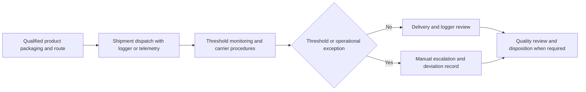

# LOG-001 AI-assisted pharmaceutical cold-chain excursion assurance

## Classification

- **Segment:** logistics-transport
- **Primary market / jurisdiction:** Brazil
- **Evidence reference date:** 2026-07-19; Brazilian regulatory and operating sources updated in 2025-2026
- **Index summary:** Brazilian pharmaceutical logistics operators can combine sensor telemetry, route context, equipment state, and shipment constraints to predict thermal-excursion risk and prioritize human intervention without automating product release or disposal.
- **Company profile / size:** pharmaceutical manufacturers, distributors, specialized carriers, clinical-research logistics providers, and hospital or laboratory distribution operations with temperature-sensitive shipments
- **Opportunity type:** industry-solution
- **Status:** hypothesis
- **Confidence:** medium
- **Complexity:** large
- **Horizon:** medium
- **Risk:** regulated
- **Solution evidence level:** prototype
- **Operational maturity:** unvalidated
- **Azure fit:** high
- **AI dependency:** core
- **Primary AI role:** prediction
- **Intelligent capability:** multivariate thermal-excursion prediction, sensor-quality anomaly detection, and intervention-priority ranking
- **Repository alignment:** new-solution

## Problem

Quality and logistics teams transporting temperature-sensitive medicines currently rely on validated packaging, route qualification, data loggers, static thresholds, carrier procedures, and post-trip review. These controls detect many excursions only after a threshold has been crossed or after delivery, when remaining corrective options are limited.

The recurring operational problem is not merely recording temperature. It is deciding, early enough, which shipment is progressing toward a material excursion because of route delay, ambient conditions, refrigeration degradation, door events, packaging configuration, sensor behavior, or an interaction among these factors. Delayed or excessive alerts create product-risk, investigation workload, avoidable quarantine, service disruption, and potential waste.

## Brazil applicability and current context

Brazil has long distances, heterogeneous infrastructure, climatic variation, and regulated pharmaceutical distribution. Anvisa's current inspection procedure, updated on 27 June 2025, explicitly covers compliance with good practices for distribution, storage, and transport of medicines. Anvisa also updated its operating guidance on 29 December 2025 confirming that medicine transport companies generally require an AFE, with additional authorization for controlled substances.

RDC 430/2020 remains the central good-practice framework for distribution, storage, and transport of medicines. The opportunity does not reinterpret that regulation. It adds an early-warning and evidence layer beneath the existing quality system, validated routes, temperature limits, deviation management, and responsible-pharmacist authority.

A Brazilian study published on 7 May 2026 describes the operational importance of refrigerated transport for thermolabile medicines and the need to preserve product integrity across national distribution. Local validation is still required for product stability profiles, qualified packaging, routes, fleets, seasons, sensor placement, and organizational deviation procedures.

## Evidence

### Confirmed problem evidence

- Anvisa's revised 2025 inspection procedure covers good practices for medicine distribution, storage, and transportation, confirming that transport conditions and documented quality controls remain an active Brazilian compliance concern.
- Anvisa guidance updated in December 2025 confirms authorization requirements for companies transporting medicines, reinforcing the regulated nature of the operating process.
- Brazilian research published in May 2026 identifies temperature control, storage infrastructure, geographic coverage, and compliance with RDC 430/2020 as central to thermolabile medicine logistics.

### Favorable solution evidence

- A 2024 open-access pharmaceutical cold-chain study presents a risk-assessment and early-warning architecture combining temperature, humidity, location, and machine-learning risk scoring, supporting bounded technical plausibility.
- Modern telemetry, route feeds, packaging qualification records, and shipment outcomes provide a plausible supervised, semi-supervised, or simulation-assisted prototype path.
- Existing threshold alarms and validated lanes provide a strong deterministic baseline and safe fallback against which incremental warning lead time and alert precision can be measured.

### Counter-evidence and limitations

- Static thresholds may already be sufficient for stable, short, qualified routes; a model would add cost and complexity without material benefit there.
- Data sharing remains incomplete across shippers, carriers, warehouses, and smaller fleets. Missing or delayed telemetry can invalidate predictions.
- Sensor drift, bad placement, logger replacement, network gaps, door events, and refrigeration-mode changes may look like product-risk signals and create false alerts.
- Published technical performance may not transfer to Brazilian routes, products, packaging systems, seasons, or operational response times.
- A prediction cannot determine product disposition. Stability assessment, deviation investigation, and quality release remain governed processes.

These limitations narrow the prototype to shadow-mode warning on selected qualified lanes, require explicit sensor-quality checks and abstention, and prohibit automated product release, rejection, disposal, or route intervention.

### Inference

- Combining rate-of-change, remaining thermal buffer, route delay, ambient forecast, refrigeration state, and lane history may provide useful lead time before a simple threshold alarm.
- The greatest incremental value is likely on long, variable, multi-stop, high-value, or operationally fragile lanes rather than uniformly across all shipments.

### Unknowns

- Whether historical data links telemetry to adjudicated deviation outcomes with sufficient consistency.
- Achievable warning lead time and false-alert burden by product, packaging profile, route, season, and carrier.
- Whether operations teams can act within the predicted window.
- Cost and reliability of real-time telemetry coverage across the selected lane.
- Whether a global model, lane model, packaging-family model, or hybrid hierarchy transfers best.

### Sources

- [POP-O-SNVS-011, revision 3](https://www.gov.br/anvisa/pt-br/centraisdeconteudo/publicacoes/certificacao-e-fiscalizacao/compilado-procedimentos-SNVS/011) — Brazil; updated 2025-06-27; current official inspection procedure supporting the regulated problem.
- [Anvisa FAQ: authorization for medicine transport companies](https://www.gov.br/anvisa/pt-br/acessoainformacao/perguntasfrequentes/administrativo/autorizacao-de-funcionamento-afe-ou-ae/distribuidora-importadora-e-transportadora/10-empresas-que-trabalham-com) — Brazil; updated 2025-12-29; current official operating context.
- [Nova resolução sobre medicamentos começa a valer em 16/3](https://www.gov.br/anvisa/pt-br/assuntos/noticias-anvisa/2021/nova-resolucao-sobre-medicamentos-comeca-a-valer-em-16-3/) — Brazil; RDC 430/2020 background and effective framework.
- [Logística farmacêutica: a importância da cadeia do frio no transporte de medicamentos termolábeis](https://fatecrl.edu.br/revistaconecta/index.php/rc/article/view/399) — Brazil; published 2026-05-07; current local operational evidence.
- [Development of a Risk Assessment and Early Warning System for Pharmaceutical Cold Chain Transportation Based on Big Data](https://www.sciencedirect.com/science/article/pii/S1877050924028138) — international; 2024; prototype plausibility, not Brazilian production proof.

## Current process

## Baseline without AI

- **Current baseline:** qualified packaging and lanes, calibrated loggers, fixed temperature thresholds, route tracking, SOPs, carrier escalation, and post-trip quality review.
- **Strongest realistic non-AI alternative:** deterministic multi-signal rules using temperature slope, threshold proximity, delay duration, ambient conditions, refrigeration alarms, door events, and product-specific limits.
- **Baseline strengths:** explainable, auditable, aligned with validated procedures, inexpensive to operate, and reliable for known conditions.
- **Baseline limitations:** rule interactions grow difficult to maintain; fixed thresholds may warn late; route and packaging context is weakly personalized; alert volume can become excessive.
- **Context where intelligence may add incremental value:** long or variable routes where interacting telemetry and context can indicate an emerging excursion before fixed limits are crossed.
- **Condition where the non-AI baseline should be preferred:** stable qualified lanes with sparse data, low alert burden, limited response options, or no measured model improvement.

## Proposed solution

Add a shadow-mode assurance service to selected temperature-sensitive shipments. The service validates sensor data, computes deterministic thermal and route features, predicts excursion risk over a bounded future horizon, and ranks shipments for operations or quality review. Every alert includes contributing signals, confidence, data-quality status, expected time window, and the applicable deterministic limit.

The existing quality-management system, validated packaging, product specifications, route qualification, SOPs, and responsible professional remain authoritative. The prototype does not control refrigeration, reroute vehicles, contact drivers, quarantine stock, or decide product disposition automatically.

## Where AI enters

### AI role map

| Process stage | AI component | AI type / model family | What it does | Runtime mode | Output | Human or deterministic control |
| --- | --- | --- | --- | --- | --- | --- |
| Telemetry intake | Sensor-quality anomaly detector | classical ML anomaly detection or robust time-series model | Identifies implausible jumps, frozen values, drift patterns, missing sequences, and sensor disagreement | streaming or asynchronous cloud inference | quality flags and abstention recommendation | calibration records, range checks, duplicate sensors, hard validation rules, manual logger review |
| In-transit monitoring | Thermal-excursion risk predictor | gradient boosting or multivariate time-series model | Estimates probability and time-to-risk for a product-specific excursion window from telemetry and route context | asynchronous near-real-time service | calibrated risk, horizon, confidence, contributing factors | product limits, packaging qualification, alert thresholds, abstention, existing alarms |
| Operations triage | Intervention-priority ranker | learning-to-rank or calibrated gradient boosting | Orders at-risk shipments using predicted risk, remaining response window, product criticality, route state, and actionability | event-driven queue ranking | prioritized human-review queue | deterministic severity rules, SLA, quality escalation matrix, operator approval |

### Required distinctions

- **Primary AI role:** prediction, anomaly detection, and ranking/recommendation.
- **Model family:** classical ML and multivariate time-series models; learning-to-rank is optional after a reliable prediction baseline exists.
- **Training requirement:** supervised training on adjudicated excursions and near-excursions, supplemented by self-supervised normal-pattern learning or physically plausible simulation when labels are sparse.
- **Training location and cadence:** offline initial training by lane or packaging family; periodic retraining only after drift and quality review, likely quarterly or seasonally.
- **Inference location:** cloud or private batch/streaming pipeline; deterministic telemetry validation may run at the gateway or edge.
- **Agent role:** Agent: not used.
- **LLM role:** LLM: not used.
- **Non-LLM intelligence:** sensor anomaly detection, thermal-risk prediction, and review ranking.
- **Not AI:** sensor ingestion, databases, product-limit lookup, route APIs, calculations, workflow, dashboards, alert delivery, deviation records, approvals, and product disposition.

## Intelligent capability details

- **Technique / model family:** calibrated gradient boosting or temporal model for risk prediction, robust anomaly detection for sensor quality, and optional learning-to-rank.
- **Why it is necessary:** the value hypothesis depends on learning interactions among telemetry trajectory, remaining thermal buffer, route delay, ambient conditions, packaging, refrigeration state, and lane history that fixed thresholds do not represent well.
- **Inputs:** timestamped temperature and optional humidity; sensor identity and calibration; product and packaging profile; allowed range; route and stop plan; GPS and ETA; ambient weather; door and refrigeration events; carrier and lane history; adjudicated deviation outcomes.
- **Outputs:** data-quality status, risk probability, forecast horizon, confidence, top contributing factors, abstention state, and ranked review priority.
- **Training / grounding / optimization assumptions:** at least several hundred representative trips for the selected lane or family, with enough normal variation and expert-adjudicated excursions; synthetic perturbations may test robustness but cannot replace local validation.
- **Evaluation:** calibration error, precision-recall at operational alert capacity, warning lead time, false alerts per trip, missed material excursions, ranking gain over rules, and performance by lane, product, packaging, carrier, and season.
- **Fallback and controls:** existing threshold alarms and SOPs always remain active; low-quality or out-of-distribution data causes abstention; humans approve every intervention and quality decision.

## Data and integration assumptions

- **Data owners and access path:** quality, supply-chain, carrier-management, fleet or IoT, warehouse, packaging-validation, weather, and QMS teams.
- **Expected volume, history, frequency, and coverage:** minute-level or finer telemetry across at least one full seasonal cycle is preferable; a smaller retrospective dataset can support initial feasibility testing.
- **Labels, outcomes, feedback, or simulation available:** deviation records, logger reviews, product disposition, route incidents, refrigeration maintenance, and expert adjudication; simulated excursions only supplement sparse events.
- **Known quality, imbalance, missingness, and leakage risks:** true harmful excursions are rare; disposition may depend on information unavailable at alert time; sensor replacement, route changes, manual notes, and post-event data can leak outcomes.
- **Brazilian or local-context representativeness:** selected Brazilian lanes, climates, packaging configurations, carriers, and response procedures must be represented.
- **Privacy, retention, consent, surveillance, or sharing constraints:** driver tracking must be minimized to operational necessity; access, retention, labor consultation, contracts, and LGPD responsibilities require review.
- **Integration and synchronization assumptions:** telemetry and route events have consistent shipment identifiers and timestamps; QMS outcomes can be joined retrospectively.
- **Drift and change sources:** season, packaging redesign, fleet or refrigeration changes, sensor vendor, routes, traffic, operating SOPs, products, and carrier behavior.
- **Minimum viable data for a prototype:** one product or packaging family, two or three representative lanes, telemetry plus route events, and expert review of excursions and sampled normal trips.

## Prototype validation plan

- **Prototype scope / process slice:** retrospective replay followed by shadow-mode monitoring for one thermolabile product or packaging family on two or three Brazilian lanes.
- **Users, sites, assets, documents, events, or simulated cases:** quality reviewers, control-tower operators, selected carriers, trips across representative seasonal and operational conditions.
- **Baseline or comparison:** fixed thresholds plus a deterministic multi-signal rule set designed by logistics and quality specialists.
- **Required data and integrations:** historical logger telemetry, trip and route events, packaging and product limits, ambient weather, operational exceptions, and adjudicated deviation outcomes.
- **Model-quality metrics:** PR-AUC, calibration, sensitivity for material excursions, false alerts per 100 trips, warning lead time, abstention rate, and subgroup performance.
- **Business or workflow metrics:** actionable warning lead time, investigation queue volume, response completion before threshold crossing, avoidable quarantine signals, and reviewer time.
- **Human acceptance, correction, or override metrics:** alert acceptance, dismissal reason, corrected data-quality flags, intervention adoption, and reviewer trust by explanation type.
- **Safety and compliance boundaries:** no automated product disposition, release, rejection, disposal, route change, refrigeration control, or driver instruction.
- **Failure or redesign criteria:** no material lead-time gain over rules; unmanageable false-alert burden; missed critical excursions; poor calibration; inability to join outcomes; low telemetry reliability; or systematic underperformance on important lanes.
- **Evidence required before a pilot or broader implementation:** stable shadow-mode performance across season and lane variation, documented QMS integration, approved governance, and a response playbook showing that alerts are operationally actionable.

## Macro architecture

```mermaid
flowchart LR
  Sensors[Calibrated temperature humidity GPS and equipment telemetry] --> Intake[IoT or carrier telemetry intake]
  Route[Route ETA weather product packaging and limits] --> Core[Deterministic validation and feature pipeline]
  Intake --> Core
  Core --> QualityModel[Sensor-quality anomaly model]
  QualityModel --> RiskModel[Calibrated thermal-excursion prediction model]
  RiskModel --> Ranker[Human-review priority ranker]
  Core --> Rules[Product limits route rules and existing threshold alarms]
  Ranker --> Validation[Confidence abstention and policy validation]
  Rules --> Validation
  Validation --> Queue[Operations and quality review queue]
  Queue --> Human[Human-approved intervention and QMS deviation workflow]
  Human --> Outcomes[Adjudicated outcomes and feedback]
  Outcomes --> Evaluation[Offline evaluation drift and retraining gate]
```

## Capabilities and possible technologies

- Application and workflow capabilities: shipment monitoring, alert queue, evidence view, acknowledgment, escalation, and QMS linkage.
- Data capabilities: telemetry ingestion, time-series storage, shipment master data, feature engineering, label curation, and replay.
- Integration capabilities: carrier and IoT APIs, TMS, WMS, route and weather feeds, refrigeration events, and QMS.
- Required AI / ML capabilities: anomaly detection, calibrated prediction, time-series feature extraction, explainability, and optional ranking.
- Training, grounding, recognition, or optimization capabilities: offline supervised training, self-supervised normal-pattern learning, simulation-assisted stress testing, temporal validation, and calibration.
- Agent and tool-use capabilities, or `not used`: not used.
- LLM / foundation-model capabilities, or `not used`: not used.
- Evaluation and model-operations capabilities: experiment tracking, drift monitoring, subgroup evaluation, shadow deployment, model registry, and rollback.
- Security and governance capabilities: private networking, managed identity, RBAC, encryption, audit logs, retention controls, and model-approval gates.
- Azure services that may fit: Azure IoT Hub or Event Hubs, Azure Functions or Container Apps, Azure Data Explorer, Azure Machine Learning, Azure Monitor, Key Vault, and Power BI.
- Non-Azure or open-source alternatives worth considering: MQTT, Kafka, TimescaleDB, MLflow, LightGBM, XGBoost, PyTorch, Evidently, and Grafana.

## Possible gains

- Earlier identification of shipments that are progressing toward a material thermal excursion.
- Better prioritization of limited control-tower and quality-review capacity.
- Fewer non-actionable alerts than broad threshold escalation, when validated.
- More consistent evidence for deviation investigation and lane or packaging improvement.
- Better separation of sensor failure from probable product-temperature risk.

## Metrics for validation

### Business and operational metrics

- Median actionable warning lead time against fixed thresholds and deterministic rules.
- Alerts reviewed, actions completed, deviation workload, avoidable quarantine indicators, and response SLA adherence.
- Performance and workload by lane, carrier, product, packaging, and season.

### Intelligent-capability metrics

- Calibration, PR-AUC, sensitivity, precision at queue capacity, false alerts per trip, missed material excursions, abstention, and ranking quality.
- Human acceptance, override, correction, dismissal reasons, and actionability.

## Risks, limits, and controls

- Privacy and sensitive data: minimize driver-level tracking, separate operational telemetry from HR use, and review LGPD roles and retention.
- Brazilian regulatory or policy constraints: maintain RDC 430/2020-aligned quality controls, current Anvisa authorization requirements, validated procedures, and responsible-professional authority.
- Human decision boundaries: quality and logistics professionals retain all intervention and disposition decisions.
- Model or policy failure modes: false reassurance, late warning, excessive alerts, sensor artifacts, route drift, weak calibration, and out-of-distribution products or packaging.
- Agent or tool-execution failure modes, when applicable: not applicable; no agent is used.
- LLM hallucination, grounding, or prompt-injection risks, when applicable: not applicable; no LLM is used.
- Comparable failures and applicable lessons: cross-company data gaps and manual processes limit model usefulness; the system must abstain rather than infer through missing telemetry.
- Bias, drift, weak labels, or insufficient feedback: rare events and conservative quality decisions can distort labels; use expert adjudication and temporal evaluation.
- Integration and data risks: inconsistent identifiers, clock skew, sensor vendor changes, intermittent connectivity, and incomplete QMS outcomes.
- Adoption and change-management risks: alert fatigue and unclear response ownership can erase model value; prototype the operating playbook with users.
- Prototype cost or operational assumptions: real-time connectivity, calibrated sensors, storage, labeling, and 24-hour response coverage may dominate model cost.

## Fit score

| Dimension | Score | Rationale |
| --- | ---: | --- |
| Problem evidence and relevance | 18/20 | Current Brazilian regulatory and local operational evidence supports a specific temperature-controlled medicine transport problem. |
| Business or operational value | 18/20 | Earlier actionable warnings could protect product quality and prioritize scarce review capacity, but realized value depends on response options. |
| Technical feasibility | 17/20 | A bounded replay and shadow prototype is feasible with telemetry and adjudicated outcomes; rare labels, integration, and transfer remain material risks. |
| Reuse potential | 18/20 | The pattern can transfer across pharmaceutical lanes and later to other regulated cold-chain products with separate validation. |
| Strategic differentiation | 17/20 | Contextual prediction and sensor-quality modeling may materially improve on thresholds, but must prove incremental lead time and alert precision. |
| **Total** | **88/100** | Publishable medium-confidence prototype hypothesis with regulated controls and explicit failure criteria. |

## Repository relationship

- Existing references that may be reused: event ingestion, time-series processing, model serving, monitoring, secure integration, and human-review workflow patterns.
- Missing capabilities exposed by this opportunity: cold-chain telemetry replay, calibrated time-to-excursion prediction, sensor-quality abstention, and regulated QMS feedback integration.
- Potential building blocks: telemetry intake, time-series feature pipeline, anomaly detector, calibrated predictor, model evaluation, and governed review queue.
- Potential composed solution: pharmaceutical cold-chain excursion assurance reference solution.
- Reasons to keep it outside the current kit, when applicable: product stability and quality-disposition logic must remain customer-specific and professionally governed.

## Duplicate control

- **Problem keys:** pharmaceutical-cold-chain, thermolabile-medicine-transport, temperature-excursion, shipment-quality-assurance, logistics-control-tower
- **Capability keys:** time-series-prediction, sensor-anomaly-detection, risk-ranking, calibrated-alerting, human-in-the-loop
- **Research queries used:** `Brasil 2025 cadeia fria transporte medicamentos Anvisa logística`; `site:gov.br/anvisa transporte medicamentos temperatura RDC 430 2025 atualização`; `Brasil cadeia fria medicamentos perdas excursão temperatura 2025`; `cold chain excursion prediction machine learning pharmaceutical transport false alarms`; `AI cold chain monitoring limitations sensor drift false positives logistics`
- **Related opportunities:** MANUF-001 shares time-series anomaly detection but addresses industrial equipment condition rather than regulated shipment integrity; HEALTH-002 concerns clinical antimicrobial review rather than logistics.
- **Uniqueness statement:** This opportunity predicts regulated in-transit thermal risk and sensor reliability for pharmaceutical shipments; it is not generic fleet optimization, equipment predictive maintenance, or warehouse demand forecasting.

## Next decision

Prototype candidate. Implementation approval remains an explicit human decision.