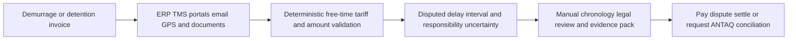

# LOG-002 AI-assisted container-overstay causation evidence assurance

## Classification

- **Segment:** logistics-transport
- **Primary market / jurisdiction:** Brazil
- **Evidence reference date:** 2026-07-25; Brazilian regulatory and operating evidence from 2025-07-31 through 2026-01-30
- **Index summary:** Brazilian importers can reconstruct container-overstay timelines from operational evidence and flag which intervals may not be attributable to the user before human dispute or conciliation review.
- **Organization archetype / size:** Mid-sized Brazilian importer handling 300–2,000 containers per year through several carriers, terminals, depots, brokers, and road hauliers
- **Primary actor:** Import logistics cost-and-claims analyst, with legal and customs review authority retained by specialists
- **Simulated process:** Validate a demurrage or detention invoice and assemble evidence for payment, dispute, or ANTAQ conciliation
- **Opportunity type:** integration
- **Status:** hypothesis
- **Confidence:** medium
- **Complexity:** medium
- **Horizon:** short
- **Risk:** regulated
- **Solution evidence level:** conceptual
- **Operational maturity:** unvalidated
- **Existing-solution disposition:** integrate
- **Azure fit:** high
- **AI dependency:** core
- **Primary AI role:** extraction
- **Intelligent capability:** Evidence-grounded event extraction, temporal reconciliation, responsibility-candidate classification, contradiction detection, and review-priority ranking for container-overstay intervals
- **Repository alignment:** extend-kit

## Operational simulation

### Operating archetype

- **Organization type and approximate size:** Importer with 10–25 logistics and foreign-trade staff, several customs brokers, 300–2,000 annual containers, and mixed ERP, TMS, email, carrier portals, terminal portals, and spreadsheets.
- **Primary actor and authority:** Logistics cost-and-claims analyst may validate records, request missing evidence, recommend payment or dispute, and assemble a case file. Legal interpretation, settlement, complaint, and payment authority remain human.
- **Process trigger:** A carrier, agent, or logistics provider sends a demurrage or detention invoice, or an approaching free-time deadline creates a prevention review.
- **Actor objective and completion condition:** Determine the accepted charge period, identify unsupported or potentially non-user-attributable intervals, and produce a traceable evidence pack for approval.
- **Inputs, systems, documents, devices, or physical context:** Bill of lading, free-time agreement, tariff, invoice, carrier notices, terminal and depot appointments, gate events, customs holds, inspection releases, trucking records, emails, messages, photos, GPS events, ERP/TMS records, and ANTAQ rules.
- **Rules, deadlines, safety, cost, and compliance constraints:** Contract terms, Resolução ANTAQ nº 62/2021, Acórdão nº 521/2025, dispute and payment deadlines, document retention, trade secrecy, LGPD, legal privilege, and prohibition on autonomous legal conclusions.
- **Upstream and downstream handoffs:** Carrier, freight forwarder, customs broker, terminal, empty-container depot, trucking provider, finance/AP, legal, and ANTAQ conciliation when applicable.

### Assumptions

- **Known operating facts already available:** Free-time and charge calculations depend on dates, tariffs, and container events; current ANTAQ guidance makes event attribution material; Brazilian conciliation reviewed hundreds of disputes in late 2025.
- **Simulation assumptions requiring validation:** A mid-sized importer receives evidence across at least four systems; event timestamps and identifiers are not consistently normalized; analysts spend material effort reconstructing responsibility intervals.
- **Synthetic events or cases introduced:** Depot refuses return because it is full; the carrier redirects the empty container through email; the terminal API posts a late event; the trucker supplies a geotagged attempt; a peak week creates 40 simultaneous invoices.

### Workflow simulation

| Stage | Trigger / available information | Actor and system action | Decision or uncertainty | Current handling | Friction, risk, or missed outcome | Feedback signal |
| --- | --- | --- | --- | --- | --- | --- |
| Intake | Invoice, BL and container identifiers arrive | Analyst opens ERP/TMS record and collects attachments | Are all containers, tariffs and periods represented? | Manual checklist and spreadsheet | Missing evidence discovered late | Completeness correction |
| Contract and tariff check | Free-time terms and charge table | Analyst recalculates dates and tiers | Which tariff version and start event apply? | Formula, lookup and email confirmation | Wrong tariff or period accepted | Approved calculation |
| Event reconstruction | Portal events, emails, GPS, appointments and releases | Analyst builds a timeline | Which records describe the same event and which timestamp is authoritative? | Manual chronology | Duplicates, conflicting timestamps, omitted attempts | Human-linked events |
| Responsibility review | Timeline and ANTAQ criteria | Analyst identifies intervals requiring legal review | Was delay caused by user, carrier, terminal, depot, authority, force majeure, or mixed causes? | Narrative analysis | Inconsistent treatment and weak evidence packs | Human interval classification |
| Decision | Findings and charge amount | Finance/legal approve payment, dispute, settlement, or escalation | Is evidence sufficient and material? | Email and workflow approval | Deadline pressure and uneven documentation | Final disposition and recovered amount |

### Scenario variants

#### Normal flow

Contract, invoice, terminal events, return appointment, and gate-in records agree. Deterministic calculation confirms the charge. The system should abstain from semantic analysis beyond completeness checks and route the invoice for ordinary approval.

#### Exception flow

The depot rejects a return attempt, the carrier later redirects the container, and the invoice charges the full interval. Evidence is split between an appointment screenshot, truck GPS, driver message, depot email, and carrier portal. The analyst must determine whether the first failed attempt is credible and which interval requires suspension analysis under current ANTAQ guidance.

#### Peak or degraded flow

A port disruption and staff shortage produce dozens of invoices while carrier and terminal APIs lag. Analysts prioritize by value and deadline, but incomplete cases may be paid or disputed without adequate support. The model must expose missing sources, uncertainty, and deadline risk rather than fabricate a complete timeline.

### Opportunity points derived from the simulation

| Decision, exception, or uncertainty | Strongest deterministic response | Remaining gap | Candidate intelligent role | Expected incremental outcome | Main risk |
| --- | --- | --- | --- | --- | --- |
| Calculate free time and tariff | Contract table, event rules, formula engine | None when records are structured | Reject AI candidate | Accurate repeatable calculation | Configuration error |
| Detect missing documents | Required-document matrix and identifiers | Semantic equivalents and informal evidence may be missed | Retrieval and extraction | Earlier completeness review | Irrelevant matches |
| Reconstruct event timeline | Normalize timestamps and event codes | Cross-document event identity and contradictory narratives | Event extraction and temporal reconciliation | Less manual chronology work | Invented or misordered events |
| Identify responsibility-review intervals | Deterministic ANTAQ matrix | Causal attribution depends on evidence dispersed across parties | Grounded classification and ranking | Focus specialists on material disputed intervals | Treating correlation as legal causation |
| Prepare evidence pack | Template and document links | Selecting the strongest evidence and explaining conflicts | Evidence ranking and constrained generation | Faster, more auditable review | Hallucinated argument |

## Selected problem and opportunity hypothesis

Brazilian importers can already calculate free time and monitor containers with specialized platforms. The selected gap appears after a charge is generated: operational events and communications must be reconstructed to determine which intervals may be attributable to the user and which require specialist review under Brazilian regulatory guidance.

A read-only assurance layer can extract event claims with source coordinates, reconcile identifiers and timestamps, expose contradictions, apply deterministic regulatory predicates, and rank disputed intervals by amount, evidence completeness, deadline, and uncertainty. It does not decide legal responsibility, submit complaints, negotiate, or approve payment.

## Brazil applicability and current context

On 31 July 2025, ANTAQ published an updated regulatory understanding for container overstay. The agency stated that charges should not apply when delay results from acts, omissions, or logistical failures attributable to the carrier, terminal, or empty-container depot. Acórdão nº 521/2025 further states that counting may be suspended from the first proven failed return attempt until effective receipt conditions are restored.

On 16 January 2026, ANTAQ reported that conciliation had prevented R$ 23.088 million in improper charges between August and December 2025. There were 240 meetings and agreements in 176 cases. This confirms both current materiality and an evidence-intensive multi-party process.

The simulation assumption that responsibility must be reconstructed across parties is supported. The actual prevalence of fragmented evidence, analyst effort, and recoverable value at a specific importer remains unknown and must be measured.

## Existing solutions and differentiation

### Existing solutions reviewed

| Solution / platform | Owner or vendor | Current capabilities | Evidence date | Coverage overlap |
| --- | --- | --- | --- | --- |
| DemurrageNet / FollowNet One | e.Mix | Free-time monitoring, tariff hierarchy, alerts, automated calculation, evidence trail, invoicing and Brazilian trade-system integrations | accessed 2026-07-25 | Strong overlap in prevention, calculation, documents, events and audit trail |
| ComexOS | ComexOS | Container tracking, free-time dashboard, document extraction, cross-document checking, financial reconciliation and audit trail | accessed 2026-07-25 | Overlap in document intelligence and process visibility |
| Intelligent Audit | Intelligent Audit | Freight-invoice validation, contract comparison, discrepancy detection and reporting | accessed 2026-07-25 | Overlap in invoice audit and cost recovery |
| Dockline / AuditDray / AuditCargo | Commercial vendors | Invoice extraction, rate and event validation, evidence-backed findings and dispute drafts | accessed 2026-07-25 | Strong overlap in charge validation and dispute support |
| Windward D&D Automation | Windward | Contract ingestion, cost calculation, risk flagging, alerts and automated billing | accessed 2026-07-25 | Overlap in high-volume D&D workflow automation |

### Gap and disposition

- **What is already solved:** Free-time tracking, tariff calculation, alerts, container visibility, invoice matching, duplicate detection, contract checking, document extraction, audit trails, and dispute drafting.
- **Overlap with the simulated candidate:** Existing systems can identify calculation errors and missing or inconsistent events.
- **Material uncovered gap:** Evidence-grounded reconstruction of responsibility intervals under the Brazilian ANTAQ causation framework, including failed-return attempts, depot availability, redirects, carrier omissions, terminal events, contradictory timestamps, and explicit uncertainty.
- **Underserved actor, scenario, exception, integration, decision, or outcome:** Importer-side analyst preparing a human-reviewed Brazilian regulatory evidence pack when the amount is mathematically correct but attribution of delay is disputed.
- **Disposition:** integrate.
- **Why changing vendor, cloud, model, UI, or architecture is insufficient:** Value comes only from linking source evidence to a Brazilian responsibility matrix and measuring incremental case-review quality beyond existing D&D and invoice-audit products.
- **Differentiation statement:** This is not another demurrage calculator or invoice auditor; it is a read-only causation-evidence assurance layer for disputed intervals under current Brazilian rules.

## Evidence map

### Simulated observations

- Evidence arrives across portals, email, messages, GPS, appointments and documents.
- Peak periods increase the chance that weakly supported charges are paid or disputed inconsistently.
- The hardest decision is not arithmetic but whether a disputed interval has sufficient source evidence for specialist review.

### Confirmed problem evidence

- ANTAQ reported R$ 23.088 million in improper charges avoided through conciliation between August and December 2025.
- The agency conducted 240 meetings and reached agreement in 176 cases during that period.
- Current ANTAQ guidance makes the cause of delay and the first proven failed return attempt material to charge applicability and suspension.

### Existing-solution evidence

- Current Brazilian and international products already provide free-time control, tariff calculation, alerts, invoice validation, container tracking, document extraction, discrepancy flags and dispute support.

### Favorable evidence for the uncovered gap

- Event extraction, temporal reconciliation and evidence-linked classification can be evaluated against specialist-built timelines.
- Structured event schemas, deterministic date rules and source-bound outputs can constrain model behavior.

### Counter-evidence and limitations

- Temporal reasoning over legal and operational narratives remains imperfect; a 2025 legal-event benchmark reported persistent difficulty with complex and nested language.
- Similarity and temporal proximity do not prove responsibility or causation.
- Existing products may add this capability through roadmap changes, reducing differentiation.
- Therefore the prototype must never generate unsupported events, must display every source, must abstain on conflicts, and must compare against trained human review plus deterministic software.

### Inference

- A material subset of disputes may involve valid arithmetic but contested attribution, creating an incremental assurance opportunity beyond ordinary invoice validation.

### Unknowns

- Frequency of attribution disputes per importer, source-system accessibility, data quality, legal-review effort, false-positive tolerance, and whether vendors already expose sufficient event-level APIs.

### Sources

- [ANTAQ approves regulatory understanding on container overstay](https://www.gov.br/antaq/pt-br/noticias/2025/antaq-aprova-entendimento-regulatorio-acerca-da-cobranca-de-sobrestadia-de-conteiner/) — Brazil; published 2025-07-31, updated 2025-08-01; current regulatory context.
- [Acórdão nº 521/2025-ANTAQ](https://juris.antaq.gov.br/index.php/2025/08/06/ac-521-2025/) — Brazil; 2025-08-06; responsibility and suspension criteria.
- [ANTAQ prevents R$ 23 million in improper overstay charges](https://www.gov.br/antaq/pt-br/noticias/2026/atuacao-da-antaq-barra-cobranca-indevida-de-r-23-milhoes-em-sobre-estadia/) — Brazil; updated 2026-01-16; current scale and operating process.
- [Acórdão nº 20/2026-ANTAQ](https://juris.antaq.gov.br/index.php/2026/01/30/ac-20-2026/) — Brazil; 2026-01-30; current regulatory agenda and sector concerns.
- [DemurrageNet](https://emix.com.br/software/demurragenet/) — Brazil; accessed 2026-07-25; existing solution.
- [ComexOS](https://www.comexos.com.br/) — Brazil; accessed 2026-07-25; existing solution.
- [Intelligent Audit D&D invoice validation](https://www.intelligentaudit.com/case-studies/reducing-demurrage-and-detention-costs-through-invoice-validation) — international; accessed 2026-07-25; existing pattern.
- [Dockline](https://docklineai.com/) — international; accessed 2026-07-25; existing invoice-audit capability.
- [Windward D&D Automation](https://windward.ai/solutions/demurrage-detention-automation/) — international; accessed 2026-07-25; existing product.
- [LexTime](https://aclanthology.org/2025.findings-emnlp.280/) — international research; 2025; temporal-reasoning limitation.

## Current process and remaining gap

## Baselines

- **Current manual or system baseline:** Spreadsheet chronology, portal searches, email review, tariff recalculation, and legal review.
- **Existing product or platform baseline:** D&D monitoring, control tower, document extraction, invoice validation, rate checking, alerts, and dispute drafts.
- **Strongest realistic non-AI alternative:** Unified event schema, required evidence matrix, deterministic responsibility predicates, immutable timestamps, portal/API integration, and standardized evidence-pack templates.
- **Baseline strengths:** Transparent, auditable, inexpensive for structured events, and reliable for tariff arithmetic.
- **Baseline limitations:** Weak when evidence is unstructured, contradictory, duplicated, differently identified, or spread across organizations.
- **Exact simulated condition where intelligence may add incremental value:** High-value disputed intervals whose charge amount is correct but cause and responsibility depend on reconciling cross-document event claims.
- **Condition where adoption, process redesign, or deterministic automation should be preferred:** Complete structured events, stable API coverage, low dispute volume, or existing software already producing the same source-grounded responsibility timeline.

## Proposed solution or extension

Integrate with existing D&D, control-tower, ERP/TMS and document systems. Deterministic services normalize identifiers, calculate free time and tariffs, apply explicit ANTAQ predicates, and track deadlines. Model-based components extract event claims, link duplicate or related events, reconcile temporal conflicts, classify candidate responsibility categories with evidence, and rank intervals for specialist review.

The output is a proposed timeline and evidence matrix, never a legal conclusion. The analyst may accept, correct, reject, or mark evidence insufficient. Legal and finance teams retain all authority over payment, dispute, settlement and regulatory submission.

## Where AI enters

### AI role map

| Process stage | AI component | Primary role and model family | Inputs | What it does | Training / grounding | Runtime | Output | Deterministic or human control |
| --- | --- | --- | --- | --- | --- | --- | --- | --- |
| Evidence intake | Event-claim extractor | Extraction; document model and constrained LLM | Emails, notices, appointments, PDFs, screenshots and messages | Extracts actor, event, timestamp, container, location, claim and source span | Pretrained model, Brazilian logistics schema, no unsupported fields | Private asynchronous batch | Structured event claims with confidence and source coordinates | Schema validation, PII minimization, source required, abstention |
| Timeline assembly | Event linker and temporal reconciler | Retrieval and ranking; embeddings, cross-encoder and temporal model | Extracted claims plus structured portal and GPS events | Links equivalent events, orders claims and exposes conflicts | Local golden set and synthetic timestamp conflicts | Private asynchronous | Candidate timeline, duplicate links and unresolved conflicts | Deterministic timestamps win when authoritative; analyst correction |
| Responsibility review | Interval review classifier | Classification; calibrated classical ML or NLI model | Timeline, ANTAQ predicates, party roles, documents and missing evidence | Proposes responsibility-review category without making a legal finding | Supervised only on adjudicated intervals; quarterly or drift-triggered | Private batch | Ranked categories, confidence, evidence and missing-data reasons | Regulatory rule matrix, threshold, abstention and legal approval |
| Queue management | Materiality ranker | Ranking; gradient boosting | Amount, deadline, uncertainty, evidence completeness and prior outcomes | Prioritizes analyst review | Historical reviewed cases; monthly calibration | Hourly batch | Review priority and factors | Deadline rules, value thresholds and manager override |

### Required distinctions

- **Primary AI role:** evidence extraction, temporal reconciliation, classification and ranking.
- **Model family:** document intelligence, constrained LLM, embeddings, cross-encoder, temporal relation model, calibrated classical ML and gradient boosting.
- **Training requirement and cadence:** Pretrained extraction initially; local golden-set evaluation; supervised calibration only from adjudicated analyst and legal corrections; quarterly or drift-triggered retraining.
- **Inference location and runtime:** Private cloud, asynchronous per case, with hourly queue ranking.
- **Agent role:** not used.
- **LLM role:** constrained event extraction and source-linked structuring only; it does not interpret law, decide responsibility, negotiate or draft unsupported claims.
- **Non-LLM intelligence:** embedding retrieval, temporal relation ranking, calibrated classification and review-priority ranking.
- **Not AI:** APIs, databases, identifier matching rules, tariff calculations, free-time arithmetic, ANTAQ predicates, workflow, queues, deadlines, evidence retention, audit and approvals.

## Intelligent capability details

- **Why it is necessary for the selected simulation gap:** Deterministic systems handle structured dates and tariffs but not reliable cross-document event identity, temporal conflicts and evidence completeness across parties.
- **Inputs:** Container IDs, BLs, contracts, tariffs, invoices, appointments, portal events, gate records, customs events, GPS, emails, messages, screenshots and specialist corrections.
- **Outputs:** Source-linked event claims, reconciled timeline, conflicts, missing evidence, candidate responsibility-review category, priority and abstention reason.
- **Training, grounding, simulation, or optimization assumptions:** Brazilian Portuguese and English trade documents; synthetic failed-return and timestamp-conflict cases; adjudicated corrections are separated from unreviewed model proposals.
- **Evaluation against existing-product and non-AI baselines:** Compare timeline accuracy, evidence completeness, disputed-interval recall, false escalation and analyst time against current D&D software plus deterministic event rules.
- **Fallback, abstention, rollback, and human controls:** Rule-only calculation, original documents always visible, no generated facts, confidence thresholds, conflict abstention, versioned model rollback, and mandatory analyst/legal approval.

## Data, feedback, and integration assumptions

- **Data owners and access path:** Importer, carrier, terminal, depot, customs broker, freight forwarder and trucking provider through contracts, exports, APIs or submitted documents.
- **Expected volume, history, frequency, and coverage:** 500–5,000 historical invoices and 100–500 disputed or adjusted intervals for a first prototype.
- **Labels, outcomes, reviewer corrections, rewards, or simulation available:** Paid, adjusted, disputed, settled, withdrawn or escalated outcome; accepted timeline links; corrected event dates; legal-review category; synthetic exception cases.
- **Quality, imbalance, missingness, and leakage risks:** Few adjudicated disputes, missing carrier/depot data, late portal events, duplicated notices, timezone errors, outcome notes leaking final decisions, and inconsistent container IDs.
- **Brazilian or local-context representativeness:** Brazilian carrier, terminal, depot and customs workflows plus current ANTAQ categories are mandatory; foreign labels do not define responsibility.
- **Privacy, retention, consent, surveillance, or sharing constraints:** Trade secrets, personal contact data, driver location and legal communications require minimization, RBAC, purpose limitation and retention controls.
- **Existing platform APIs, exports, extension points, and limits:** Requires read-only integration with D&D/control-tower, ERP/TMS, email archive and selected carrier/terminal APIs; API completeness is unknown.
- **Integration and synchronization assumptions:** Event lineage preserves source, retrieval time and later corrections; no write-back during prototype.
- **Drift and change sources:** ANTAQ rules, carrier contracts, depot practices, portal schemas, terminal event codes and organizational handoffs.
- **Minimum viable data, observation, or simulation for a prototype:** 100 historical cases, including at least 30 human-reviewed attribution disputes, plus 50 synthetic normal, exception and degraded cases.

## Prototype validation plan

- **Prototype scope and simulated process slice:** Read-only review of import-container detention/demurrage invoices for one port corridor and three carriers.
- **Users, sites, assets, documents, events, or synthetic cases:** 3–6 analysts, one legal reviewer, 100 historical cases and 50 synthetic cases.
- **Normal, exception, and degraded scenarios included:** Clean charge; failed return/depot unavailability; conflicting timestamps; missing evidence; peak queue and delayed APIs.
- **Existing-solution baseline:** Current control-tower or D&D platform plus its invoice and alert capabilities.
- **Non-AI baseline:** Unified event table, deterministic rules, required-evidence checklist and manual specialist chronology.
- **Required data, observation, simulation, and integrations:** Historical files, read-only exports, contract/tariff versions, event dictionaries and specialist adjudication.
- **Model-quality metrics:** Event extraction precision/recall, source-groundedness, temporal-order accuracy, event-link precision@k, calibration, disputed-interval recall, false-escalation rate and abstention.
- **Incremental-value metrics beyond the existing solution:** Additional valid disputed intervals found, unsupported findings avoided, evidence-pack completeness and analyst time after accounting for corrections.
- **Business or workflow metrics:** Review cycle time, missed deadline rate, rework, amount reviewed, amount adjusted or recovered, and legal-review effort.
- **Human acceptance, correction, or override metrics:** Event-link correction, interval-category correction, evidence-inspection rate, disagreement and override reason.
- **Safety and compliance boundaries:** No autonomous legal conclusion, dispute, complaint, settlement, payment hold, carrier communication or regulatory filing.
- **Failure or redesign criteria:** No measurable improvement over deterministic rules; unsupported event rate above agreed threshold; temporal errors in material cases; excessive abstention; or reviewers over-trusting proposals.
- **Scale criteria:** Stable temporal-split performance, acceptable cost per case, repeatable API coverage, documented rule updates, legal approval and positive shadow-mode workflow results.
- **Evidence required before pilot or broader implementation:** Independent sample review, security and LGPD assessment, current ANTAQ legal validation, model card, rollback, source-lineage tests and measured incremental value.

## Macro architecture

```mermaid
flowchart LR
  Existing[D&D control tower ERP TMS email and portals] --> Normalize[Deterministic IDs tariffs free time events and deadlines]
  Normalize --> Gap[Disputed interval with fragmented responsibility evidence]
  Gap --> Extractor[Source-grounded event-claim extraction model]
  Extractor --> Timeline[Event linking and temporal reconciliation models]
  Timeline --> Rules[ANTAQ responsibility predicates and calculation rules]
  Timeline --> Classifier[Calibrated responsibility-review classifier]
  Classifier --> Ranker[Materiality and uncertainty ranker]
  Rules --> Review[Analyst and legal evidence review]
  Ranker --> Review
  Review --> Decision[Human pay dispute settle or escalate decision]
  Review --> Feedback[Corrections outcomes and abstention labels]
  Feedback --> Evaluation[Offline evaluation and governed retraining]
```

## Capabilities and possible technologies

- Existing platform capabilities reused: D&D monitoring, container tracking, tariff calculation, invoice management, document archive and workflow.
- Application and workflow capabilities: Case intake, timeline viewer, source evidence panel, conflict resolution, review queue and evidence-pack export.
- Data, feedback, and simulation capabilities: Event schema, immutable lineage, adjudicated labels, synthetic failed-return scenarios and temporal test sets.
- Integration and extension capabilities: ERP/TMS, email archive, carrier/terminal/depot APIs and document exports.
- Required AI / ML capabilities: Document extraction, embeddings, cross-encoder retrieval, temporal relation modeling, calibrated classification and ranking.
- Training, grounding, recognition, optimization, or RL capabilities: Pretrained inference, local golden set, supervised calibration and drift evaluation; no RL.
- Agent and tool-use capabilities, or `not used`: not used.
- LLM / foundation-model capabilities, or `not used`: constrained, source-grounded event extraction only.
- Evaluation and model-operations capabilities: Dataset versioning, offline evaluation, calibration, model registry, monitoring and rollback.
- Security and governance capabilities: Entra ID, managed identities, private endpoints, Key Vault, RBAC, encryption, audit and retention policies.
- Azure services that may fit: Azure AI Document Intelligence, Azure OpenAI with structured outputs, Azure AI Search, Azure Machine Learning, Azure Functions or Container Apps, Azure SQL/PostgreSQL, Blob Storage, Service Bus, Monitor and Power BI.
- Non-Azure or open-source alternatives: Unstructured/Tika, sentence-transformers, temporal relation models, PostgreSQL/pgvector, MLflow, FastAPI and a rules engine.

## Possible gains

- Reduce manual chronology construction and repeated evidence searches in disputed high-value cases.
- Improve consistency and completeness of evidence packs while avoiding unsupported automated conclusions.
- Detect potentially non-user-attributable intervals earlier and prioritize cases before dispute deadlines.

## Metrics for validation

### Business and operational metrics

- Review time and rework versus existing D&D software plus deterministic checklist.
- Evidence-pack completeness, deadline misses, specialist effort and adjusted or recovered amount.

### Intelligent-capability metrics

- Event and temporal accuracy, groundedness, calibration, false escalation, abstention and ranking quality.
- Human correction, override, evidence-inspection and disagreement rates.

## Risks, limits, and controls

- Simulation assumption risk: Actual evidence fragmentation or dispute volume may be lower than assumed.
- Existing-solution overlap and roadmap risk: D&D and freight-audit vendors may already support or add responsibility timelines.
- Privacy and sensitive data: Driver location, communications, commercial terms and legal material require strict minimization and access controls.
- Brazilian regulatory or policy constraints: Current ANTAQ rules and specialist legal interpretation remain authoritative.
- Human decision boundaries: Payment, dispute, settlement, complaint and legal responsibility are exclusively human.
- Model or policy failure modes: Missing events, wrong event links, timestamp inversion, unsupported responsibility category and poor calibration.
- Agent or tool-execution failure modes, when applicable: Agent not used.
- LLM hallucination, grounding, or prompt-injection risks, when applicable: Documents are untrusted input; extraction must be schema constrained, source linked and unable to issue instructions or actions.
- Comparable failures and lessons: Legal temporal reasoning remains imperfect; use models to assemble review evidence, not adjudicate.
- Bias, drift, weak labels, or insufficient feedback: Settlements do not necessarily establish legal responsibility; only adjudicated specialist labels train the classifier.
- Integration and vendor/platform dependency risks: Portal changes, inaccessible depot evidence and inconsistent timestamps can limit coverage.
- Adoption and change-management risks: Analysts may distrust abstention or over-trust polished timelines; require source inspection and sampled audits.
- Prototype cost or operational assumptions: Main costs are document integration, label adjudication, secure storage, model inference and legal review.

## Fit score

| Dimension | Score | Rationale |
| --- | ---: | --- |
| Process-opportunity fit | 18/20 | The simulation exposes a specific high-friction decision: reconstructing evidence for responsibility intervals after arithmetic validation. |
| Business or operational value | 18/20 | Current ANTAQ conciliation values show material exposure, while the prototype measures importer-specific incremental value. |
| Technical feasibility | 16/20 | A read-only prototype is testable, but temporal reasoning, sparse adjudicated labels and multi-party data access are meaningful risks. |
| Reuse potential | 17/20 | Event-evidence assurance generalizes across carriers, ports, importers and other logistics accessorial disputes. |
| Strategic differentiation | 16/20 | The Brazilian responsibility-evidence layer is distinct from ordinary tracking and invoice audit, but vendor roadmap overlap is possible. |
| **Total** | **85/100** | Strong prototype candidate with clear controls and meaningful data/integration uncertainty. |

## Repository relationship

- Existing references that may be reused: Document extraction, grounded retrieval, contradiction detection, evidence-chain assurance, workflow, identity and model evaluation.
- Missing capabilities exposed by the differentiated gap: Source-grounded temporal event reconciliation and regulation-linked evidence matrices.
- Potential building blocks: `event-claim-extractor`, `temporal-evidence-reconciler`, `regulatory-predicate-engine`, `human-review-ranking` and `evidence-pack-exporter`.
- Potential composed solution or extension: `container-overstay-causation-assurance` integrated with a D&D control tower.
- Reasons to keep it outside the current kit: Carrier, terminal, depot and ANTAQ adapters should remain solution-specific.

## Duplicate control

- **Problem keys:** container overstay dispute, demurrage detention responsibility, failed empty return, depot unavailability, carrier omission, evidence timeline
- **Capability keys:** source-grounded event extraction, temporal reconciliation, responsibility-review classification, contradiction detection, evidence ranking
- **Existing solutions reviewed:** DemurrageNet, FollowNet One, ComexOS, Intelligent Audit, Dockline, AuditDray, AuditCargo and Windward D&D Automation
- **Research queries used:** `Brasil 2025 demurrage detention contêiner custos disputa importadores ANTAQ`; `site:gov.br/antaq sobrestadia contêiner responsabilidade usuário evento causador 2025`; `demurrage detention invoice audit software platform AI`; `demurrage dispute evidence timeline software causation`; `LLM event timeline extraction legal evidence temporal reasoning limitations 2025`
- **Related repository opportunities:** LOG-001 cold-chain excursion assurance; CROSS-003 tax-reform configuration assurance; NONPROFIT-002 evidence-chain assurance
- **External overlap statement:** Existing products cover tracking, calculations, alerts, document extraction and invoice audit; none of the reviewed public materials established the same Brazilian regulation-linked causation-evidence workflow.
- **Uniqueness statement:** LOG-002 addresses responsibility-evidence reconstruction for disputed container-overstay intervals, not temperature excursion prediction, generic invoice audit, container tracking or legal adjudication.

## Next decision

- prototype candidate

Implementation approval remains an explicit human decision.

## Solution family mapping

- **Family:** [`FAMILY-007 — Evidence-grounded timeline and obligation reconstruction`](../../solution-families/FAMILY-007-evidence-grounded-timeline-obligation-reconstruction.md)
- **Disposition:** `fit-with-extension`
- **Reused architecture:** Provenance-preserving source ingestion, grounded event/party extraction, deterministic interval reconciliation, ambiguity/abstention, human chronology confirmation, and downstream case action.
- **Case-specific adapters:** Terminal, carrier, customs, port, transport, email, contract/free-time, invoice, and dispute-system adapters.
- **Case-specific extension:** Responsibility-candidate classification and cross-party contradiction findings for attributable intervals.
- **Why no separate architecture yet:** Responsibility candidates remain non-binding evidence layered on the same grounded chronology and deterministic temporal engine.
