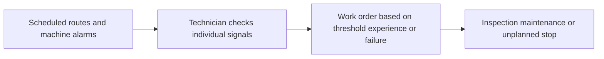
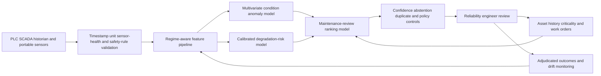

# MANUF-001 AI-assisted condition monitoring for aging industrial equipment

## Classification

- **Segment:** manufacturing
- **Primary market / jurisdiction:** Brazil
- **Evidence reference date:** 2026-07-19; principal Brazilian evidence published 2026-04-23 and technical evidence published 2025-08-01
- **Index summary:** Brazilian plants can combine multi-sensor condition signals, maintenance history, and production context to detect equipment degradation and rank human-approved inspections for aging rotating and hydraulic assets.
- **Company profile / size:** medium and large manufacturers operating pumps, motors, compressors, gearboxes, hydraulic systems, or similar critical equipment
- **Opportunity type:** operations
- **Status:** hypothesis
- **Confidence:** medium
- **Complexity:** large
- **Horizon:** medium
- **Risk:** medium
- **Solution evidence level:** prototype
- **Operational maturity:** unvalidated
- **Azure fit:** high
- **AI dependency:** core
- **Primary AI role:** anomaly-detection
- **Intelligent capability:** multivariate condition anomaly detection, degradation forecasting, and maintenance-review ranking
- **Repository alignment:** new-solution

## Problem

Maintenance and reliability teams in Brazilian plants frequently manage aging heterogeneous equipment through fixed schedules, route-based inspection, threshold alarms, and corrective work after failure. These controls remain essential, but they can miss gradual multivariate degradation or produce many isolated alarms without explaining which asset deserves limited specialist attention first.

## Brazil applicability and current context

A CNI survey reported in April 2026 found that Brazilian industrial machinery is 14 years old on average and that 38% is near or beyond the manufacturer-indicated ideal life cycle. Aging assets increase maintenance demands, parts-availability problems, and operational-failure exposure. Brazil also has a large industrial base representing 23.4% of GDP in 2025, making reliability improvements reusable across multiple subsectors.

The hypothesis does not assume a modern greenfield plant. It targets a bounded set of critical assets where sensor history can be obtained from existing PLC, SCADA, historian, portable instruments, or temporary retrofit sensors.

## Evidence

### Confirmed problem evidence

- The Brazilian industrial machinery fleet averages 14 years, with 38% near or beyond the manufacturer-indicated ideal life cycle, increasing maintenance and life-cycle-management difficulty.
- Brazilian industrial production slowed materially in 2025, strengthening the need to protect capacity and avoid preventable downtime without assuming new capital replacement.

### Favorable solution evidence

- A 2025 Brazilian study on hydraulic machinery demonstrated continuous pressure, temperature, and particulate monitoring with trend analysis that identified an abnormal temperature increase associated with a cooling-system valve problem.
- Current SENAI research treats predictive maintenance as a relevant Industry 4.0 capability requiring both technical and analytical competence.

### Counter-evidence and limitations

- Recent reviews identify weak labels, poor transfer across plants, out-of-distribution behavior, limited explainability, false alerts, and difficult integration into maintenance planning as major adoption barriers.
- Fixed thresholds, route inspections, vibration analysis, oil analysis, and reliability-centered maintenance may outperform ML where failures are simple, data coverage is sparse, or asset count is small.
- Therefore the prototype uses hybrid rules plus models, shadow mode, asset-specific calibration, abstention, and human confirmation. It does not promise remaining-useful-life precision without sufficient failure history.

### Inference

- A narrow model that ranks inspection candidates from several weak signals may deliver useful value earlier than a broad system attempting autonomous failure prediction for every machine.

### Unknowns

- Sensor coverage and timestamp quality; availability of confirmed failure and work-order outcomes; economic cost of false alerts; transferability across asset models; technician trust; and integration effort with CMMS/EAM.

### Sources

- [Parque industrial antigo: máquinas da indústria brasileira têm em média 14 anos](https://www2.rn.senai.br/parque-industrial-antigo-maquinas-da-industria-brasileira-tem-em-media-14-anos/) — Brazil; 2026-04-23; current problem evidence based on CNI research.
- [Mapa da Indústria](https://www.mapadaindustria.cni.com.br/web/portal-da-industria) — Brazil; current portal, 2025 GDP data; sector scale.
- [Monitoramento Inteligente e Análise de Tendências para Predição de Falhas em Máquinas Hidráulicas](https://www.sba.org.br/open_journal_systems/index.php/sbai/article/view/5464) — Brazil; 2025-08-01; prototype plausibility.
- [Competências essenciais para a formação de profissionais em manutenção preditiva](https://periodicos.sp.senai.br/index.php/rcsenaisp/article/view/152) — Brazil; 2025-06-26; operating capability context.
- [Neuro-symbolic AI for Predictive Maintenance — review and recommendations](https://arxiv.org/abs/2602.00731) — international; 2026-01-31; limitations and hybrid-design evidence.

## Current process

## Baseline without AI

- **Current baseline:** preventive schedules, threshold alarms, route inspections, vibration and oil analysis, and corrective maintenance.
- **Strongest realistic non-AI alternative:** reliability-centered maintenance with well-designed thresholds, criticality matrices, SPC trends, and CMMS discipline.
- **Baseline strengths:** explainable, familiar, low model risk, and effective for known failure modes.
- **Baseline limitations:** isolated signals, manual cross-correlation, threshold tuning burden, and weak prioritization across many assets.
- **Context where intelligence may add incremental value:** assets with multiple time-aligned signals, recurring degradation patterns, scarce reliability specialists, and enough history or simulated anomalies to evaluate ranking quality.
- **Condition where the non-AI baseline should be preferred:** sparse data, few assets, obvious threshold-detectable failure modes, or unacceptable sensor and model operating cost.

## Proposed solution

Create a condition-review service for a bounded family of critical rotating or hydraulic assets. Deterministic ingestion validates timestamps, units, sensor health, operating state, and hard safety limits. A multivariate anomaly model learns normal operating envelopes by asset and regime. A degradation model estimates trend direction or near-term risk only where labels support it. A ranking model combines anomaly persistence, asset criticality, production context, maintenance history, and evidence quality to propose an inspection queue.

The service never starts, stops, derates, or services equipment. Reliability engineers review traces, explanations, rules, and maintenance history before creating or changing work orders.

## Where AI enters

### AI role map

| Process stage | AI component | AI type / model family | What it does | Runtime mode | Output | Human or deterministic control |
| --- | --- | --- | --- | --- | --- | --- |
| Condition monitoring | Operating-regime anomaly detector | time-series model / classical ML | Learns normal multivariate behavior for each asset and operating regime and detects persistent deviations | edge or cloud batch/near-real-time | anomaly score, affected signals, confidence | hard safety thresholds, sensor-health rules, abstention, engineer review |
| Degradation assessment | Degradation-risk estimator | gradient boosting or temporal model | Estimates bounded near-term inspection need when adjudicated outcomes exist | daily batch | calibrated risk band and contributing factors | no RUL claim without validated labels; manual fallback |
| Work prioritization | Maintenance-review ranker | learning-to-rank or gradient boosting | Orders candidate inspections using model signals, criticality, production state, and maintenance evidence | daily batch | ranked review queue | CMMS rules, asset criticality policy, planner approval |

### Required distinctions

- **Primary AI role:** anomaly detection, prediction, and ranking/recommendation.
- **Model family:** time-series anomaly models plus classical gradient boosting or learning-to-rank.
- **Training requirement:** self-supervised normal-behavior learning initially; supervised training only where adjudicated outcomes exist.
- **Training location and cadence:** offline per asset family, monthly or drift-triggered review; no uncontrolled continuous learning.
- **Inference location:** edge for high-frequency feature extraction when necessary; private cloud batch or near-real-time scoring.
- **Agent role:** Agent: not used.
- **LLM role:** LLM: not used.
- **Not AI:** PLC/SCADA collection, unit conversion, threshold alarms, safety interlocks, CMMS workflow, dashboards, criticality rules, approvals, and work execution.

## Intelligent capability details

- **Technique / model family:** multivariate time-series anomaly detection, calibrated gradient boosting, and learning-to-rank.
- **Why it is necessary:** the value depends on identifying combinations and trajectories that individual thresholds and manual review do not reliably prioritize.
- **Inputs:** vibration, temperature, pressure, current, speed, oil or particulate measurements, operating regime, alarms, work orders, failure codes, asset criticality, and production schedule.
- **Outputs:** anomaly evidence, degradation-risk band, confidence, affected signals, abstention reason, and ranked inspection candidate.
- **Training assumptions:** at least several weeks of representative healthy operation per asset; supervised labels optional for the first anomaly prototype.
- **Evaluation:** event-level precision/recall, alert lead time, false-alert burden, calibration, ranking precision at available inspection capacity, and comparison with thresholds plus RCM baseline.
- **Fallback and controls:** existing alarms and inspection routes remain authoritative; model can abstain; engineers approve all maintenance actions.

## Data and integration assumptions

- **Data owners and access path:** operations, maintenance, OT, and reliability teams through historian, PLC/SCADA exports, portable instruments, and CMMS/EAM.
- **Expected volume:** high-frequency sensor data for 10–30 assets over 8–12 weeks, plus available historical work orders.
- **Labels or feedback:** confirmed inspections, failure codes, replaced components, no-fault-found outcomes, and engineer disposition.
- **Quality risks:** clock drift, missing periods, regime changes, sensor replacement, maintenance-induced leakage, and class imbalance.
- **Brazilian representativeness:** prototype data must come from the target plant and equipment family.
- **Privacy and sharing:** mainly industrial operational data; protect plant topology, production rates, and vendor-sensitive information.
- **Integration assumptions:** read-only historian/CMMS integration initially; no control-loop connection.
- **Drift sources:** maintenance, process recipes, load, season, sensor calibration, component replacement, and operating policy.
- **Minimum viable data:** synchronized signals from at least 10 comparable assets or one asset with several representative regimes, plus technician-reviewed events.

## Prototype validation plan

- **Scope:** one asset family in one plant, shadow mode for 8–12 weeks.
- **Users and assets:** reliability engineers and maintenance planners; 10–30 critical pumps, motors, compressors, or hydraulic units.
- **Baseline:** existing thresholds, RCM criticality, and current inspection route.
- **Required integrations:** read-only historian/export and optionally CMMS history.
- **Model-quality metrics:** event precision/recall, precision at top-k, calibration, lead time, false alerts per asset-week, and abstention rate.
- **Workflow metrics:** engineer review time, accepted inspection candidates, duplicate alerts, no-fault-found inspections, and missed baseline incidents.
- **Human metrics:** acceptance, override reason, explanation usefulness, and technician-reported burden.
- **Safety boundaries:** no automated machine control or work-order execution; existing safety systems remain independent.
- **Failure or redesign criteria:** no improvement over the threshold/RCM baseline; unsustainable false-alert burden; unstable scores across normal regimes; sensor retrofit cost disproportionate to asset criticality; or inability to trace each recommendation to evidence.
- **Evidence before pilot:** stable shadow-mode performance across regimes, documented alert economics, approved OT security design, and reliability-team acceptance.

## Macro architecture

## Capabilities and possible technologies

- Application and workflow: evidence dashboard, review queue, feedback capture.
- Data: time-series ingestion, feature store, historian export, CMMS synchronization.
- Required AI / ML: anomaly detection, calibrated prediction, ranking, drift monitoring.
- Agent: not used.
- LLM: not used.
- Azure possibilities: Azure IoT Operations or Event Hubs, Data Explorer, Machine Learning, Functions, Container Apps, and Monitor; service selection requires current Microsoft documentation during implementation.
- Alternatives: MQTT, OPC UA, TimescaleDB, InfluxDB, MLflow, scikit-learn, PyTorch, River, and Grafana.

## Possible gains

- Earlier and better-prioritized inspection of degrading critical equipment.
- Lower specialist time spent correlating isolated alarms.
- Better evidence for maintenance planning, spares, and replacement decisions.
- A reusable condition-monitoring pattern for heterogeneous aging plants.

## Metrics for validation

### Business and operational metrics

- avoided or shortened unplanned stops confirmed against the baseline;
- inspection yield, no-fault-found rate, maintenance backlog age, and review time;
- cost per monitored critical asset and per accepted intervention.

### Intelligent-capability metrics

- precision/recall, precision at top-k, calibration, lead time, false alerts per asset-week, drift, abstention, human acceptance, and override rate.

## Risks, limits, and controls

- Industrial telemetry and topology require strict access controls and network segmentation.
- Safety decisions remain in certified deterministic controls and qualified personnel.
- Models may confuse process changes with degradation, fail on unseen regimes, or overfit rare failures.
- Weak labels and sensor changes can create silent drift.
- Alert burden and sensor retrofit cost can erase value.
- Adoption requires technicians to see evidence and record outcomes without turning the system into extra clerical work.

## Fit score

| Dimension | Score | Rationale |
| --- | ---: | --- |
| Problem evidence and relevance | 18/20 | Current CNI evidence identifies a materially aging Brazilian industrial asset base. |
| Business or operational value | 18/20 | Reliability and inspection prioritization can protect constrained capacity and maintenance resources. |
| Technical feasibility | 17/20 | A bounded read-only shadow prototype is testable with local or temporary sensors, but labels and regime coverage remain material risks. |
| Reuse potential | 18/20 | The hybrid pattern applies to several rotating and hydraulic asset families and industrial subsectors. |
| Strategic differentiation | 17/20 | Multivariate regime-aware ranking adds material value beyond isolated thresholds when data coverage is sufficient. |
| **Total** | **88/100** | Strong prototype hypothesis with meaningful data, integration, and false-alert uncertainty. |

## Repository relationship

- Existing references that may be reused: ingestion, event processing, model evaluation, monitoring, and human-review patterns.
- Missing capabilities: industrial time-series features, edge collection, anomaly evaluation, and CMMS feedback contracts.
- Potential building blocks: regime-aware feature pipeline, industrial anomaly evaluator, maintenance review queue.
- Potential composed solution: industrial condition and maintenance assurance.

## Duplicate control

- **Problem keys:** aging-industrial-equipment, unplanned-downtime, maintenance-prioritization, multi-sensor-condition-monitoring
- **Capability keys:** time-series-anomaly-detection, degradation-risk-prediction, learning-to-rank, drift-monitoring
- **Research queries used:** Brasil indústria 2025 retrabalho refugo qualidade manufatura CNI SENAI; Brasil 2025 manutenção preditiva indústria falhas máquinas SENAI; Brasil 2025 inspeção visual qualidade indústria manufatura inteligência artificial; Brazil manufacturing defect detection predictive maintenance 2025 limitations false positives.
- **Related opportunities:** ENERGY-001 uses acoustic and hydraulic signals for water-network leak localization, but not machine-condition maintenance inside manufacturing plants.
- **Uniqueness statement:** This opportunity is specifically about regime-aware condition monitoring and maintenance-review ranking for aging industrial machines, not infrastructure leaks, generic anomaly detection, or autonomous plant control.

## Next decision

Prototype candidate. Implementation approval remains an explicit human decision.
