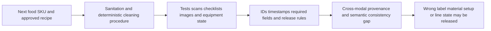
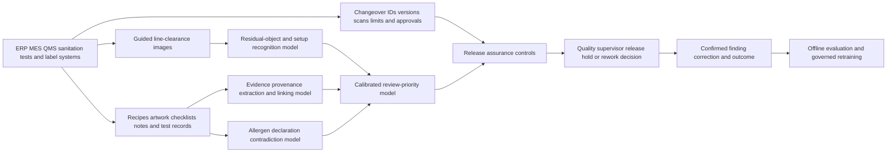

# MANUF-002 AI-assisted allergen changeover release assurance

## Classification

- **Segment:** manufacturing
- **Primary market / jurisdiction:** Brazil
- **Evidence reference date:** 2026-07-25; Brazilian official evidence from 2025-07-10 through 2026-06-19
- **Index summary:** Brazilian food plants can reconcile recipes, labels, cleaning evidence, line images, test results, and equipment state to flag unsafe allergen-changeover releases before quality approval.
- **Organization archetype / size:** Mid-sized Brazilian food manufacturer operating shared lines with 100–500 employees
- **Primary actor:** Quality supervisor responsible for line release after product changeover
- **Simulated process:** Change a shared production and packaging line from an allergen-containing SKU to another SKU and authorize production restart
- **Opportunity type:** industry-solution
- **Status:** hypothesis
- **Confidence:** medium
- **Complexity:** large
- **Horizon:** medium
- **Risk:** regulated
- **Solution evidence level:** prototype
- **Operational maturity:** unvalidated
- **Existing-solution disposition:** integrate
- **Azure fit:** high
- **AI dependency:** core
- **Primary AI role:** multimodal
- **Intelligent capability:** Multimodal line-clearance recognition, evidence-to-recipe contradiction detection, and risk-ranked human release review
- **Repository alignment:** extend-kit

## Operational simulation

### Operating archetype

- **Organization type and approximate size:** A mid-sized manufacturer of snacks, confectionery, or powdered foods using shared mixers, conveyors, fillers, and packaging lines for multiple SKUs.
- **Primary actor and authority:** A quality supervisor may approve or block restart; sanitation, production, laboratory, warehouse, and packaging teams provide evidence but do not independently release the line.
- **Process trigger:** Completion of a production order containing an allergen, followed by setup for a SKU with a different allergen declaration.
- **Actor objective and completion condition:** Confirm that materials, equipment, cleaning, labels, packaging, tests, and digital configuration are coherent before authorizing the first production lot.
- **Inputs, systems, documents, devices, or physical context:** ERP recipe and bill of materials, MES order, sanitation checklist, cleaning procedure, rapid-test result, line photographs, barcode scans, label artwork, printer configuration, lot genealogy, retained samples, and operator notes.
- **Rules, deadlines, safety, cost, and compliance constraints:** Production should restart quickly, but undeclared allergen exposure can harm consumers and trigger recall; release must remain traceable and quality-controlled.
- **Upstream and downstream handoffs:** Planning schedules the changeover; warehouse stages ingredients and packaging; sanitation cleans; production configures equipment; laboratory or quality performs verification; quality releases; distribution receives the lot.

### Assumptions

- **Known operating facts already available:** Shared-line allergen control uses cleaning, labeling, traceability, verification, and release controls; Brazilian authorities continue to enforce allergen-label and manufacturing compliance.
- **Simulation assumptions requiring validation:** Evidence is fragmented across ERP, MES, paper or mobile checklists, images, rapid tests, and packaging systems; supervisors often reconcile it manually.
- **Synthetic events or cases introduced:** An old packaging reel remains near the line; a rapid test is negative but linked to the prior equipment ID; a recipe revision changes an allergen declaration shortly before restart; network delay hides the latest label version.

### Workflow simulation

| Stage | Trigger / available information | Actor and system action | Decision or uncertainty | Current handling | Friction, risk, or missed outcome | Feedback signal |
| --- | --- | --- | --- | --- | --- | --- |
| Changeover planning | Next SKU, recipe, prior SKU, schedule | Planner and supervisor review change requirements | Which equipment, ingredients, labels, and cleaning steps differ? | ERP/MES comparison and checklist | Revision mismatches or hidden shared components | Approved plan and later deviation |
| Line clearance | Cleaning complete, physical line available | Sanitation and production inspect equipment and surrounding area | Are residues, tools, labels, or materials from the prior SKU still present? | Visual inspection, checklist, swab/test | Small residual items or partially hidden surfaces can be missed | Reinspection, photo evidence, test result |
| Setup reconciliation | Ingredients, packaging, recipe, printer and machine settings staged | Operators scan or select materials and parameters | Do staged materials and system versions match the intended SKU? | Barcode and rule validation | Semantically inconsistent versions can all be technically valid | Corrected material, rejected setup, deviation record |
| First-piece verification | First units and labels produced | Quality checks package, label, code and sample | Does physical output match recipe, allergen declaration and approved artwork? | Manual comparison and measurements | Text, artwork, recipe and physical state are reviewed in separate tools | Release, hold, correction, recall precursor |
| Release decision | All evidence available or apparently complete | Supervisor approves, holds or requests rework | Is evidence complete, correctly linked and mutually consistent? | Checklist completion and professional judgment | Green individual checks may belong to the wrong SKU, line, revision or timestamp | Final decision and confirmed finding |

### Scenario variants

#### Normal flow

The prior allergen-containing SKU finishes, sanitation executes the approved cleaning method, the correct test is negative, staged ingredients and packaging match the active recipe, first-piece labels are correct, and the supervisor releases the line. The proposed assurance layer should remain quiet or show a low-risk, fully traceable evidence bundle.

#### Exception flow

The rapid test is negative, but its equipment identifier refers to a parallel filler; a photograph still shows a prior packaging reel; the label artwork is current, while the MES recipe uses an earlier revision. Each system contains a plausible artifact, but their combined provenance is contradictory. The supervisor must identify which evidence is invalid and block release until corrected.

#### Peak or degraded flow

Several changeovers occur during a promotion-driven production peak. One quality technician covers two lines, Wi-Fi delays image uploads, and packaging revisions were issued the same day. Deterministic systems confirm scans and checklist completion, but the supervisor cannot inspect every cross-system relationship before the restart target.

### Opportunity points derived from the simulation

| Decision, exception, or uncertainty | Strongest deterministic response | Remaining gap | Candidate intelligent role | Expected incremental outcome | Main risk |
| --- | --- | --- | --- | --- | --- |
| Confirm that all evidence belongs to the same SKU, line, equipment, revision and time window | Required IDs, barcode scans, schemas and timestamp rules | Legacy notes, images and partially structured evidence may not carry reliable identifiers | Extraction and evidence-link classification | Fewer incorrectly linked release artifacts | False linkage blocks safe production |
| Detect residual material, label or tool after clearance | Fixed cameras, checklists and object allowlists | Variable viewpoints, packaging designs and occlusion weaken fixed rules | Computer vision and multimodal recognition | Earlier discovery of visible line-clearance exceptions | Vision misses hidden contamination |
| Compare recipe, artwork, declaration and observed package | Version control, text diff and approved master data | Semantically equivalent or contradictory wording spans documents and images | Grounded extraction and contradiction detection | Fewer label/recipe mismatches reaching production | Model invents or overstates a contradiction |
| Prioritize release review during peak activity | Complete/incomplete rules and FIFO queue | Several complete cases can carry very different combined risk | Calibrated risk ranking | Supervisor attention moves to the most suspicious release bundles | Automation bias or poor calibration |

## Selected problem and opportunity hypothesis

During allergen-related product changeovers, quality supervisors must release a physical process using evidence produced by multiple teams and systems. The load-bearing problem is not the absence of checklists or tests; it is the possibility that individually valid artifacts describe different equipment, recipes, label revisions, time windows, or physical states. A bounded read-only assurance layer could detect cross-evidence contradictions and visible line-clearance exceptions, then rank the release bundle for human review. It does not detect microscopic allergen residue, replace validated cleaning, or authorize production.

## Brazil applicability and current context

Brazilian enforcement shows that allergen and label failures remain operationally material. On 10 July 2025, Anvisa ordered recall and suspension of food products that omitted required allergen-related information. On 12 June 2026, Anvisa suspended popcorn whose label simultaneously claimed absence of gluten and warned of cross-contact with wheat. In 2025 Anvisa also conducted sector dialogues to revise allergen-label rules, confirming that requirements and implementation details remain active subjects of regulatory attention. Broader 2026 manufacturing actions against supplement producers also demonstrate that serious production-control failures can trigger suspension of all affected production. These sources confirm the consequence and current regulatory context, but they do not prove the frequency of cross-system release mismatches inside a typical plant. citeturn662471search1turn662471search8turn662471search7turn662471search2

## Existing solutions and differentiation

### Existing solutions reviewed

| Solution / platform | Owner or vendor | Current capabilities | Evidence date | Coverage overlap |
| --- | --- | --- | --- | --- |
| Rapid allergen testing portfolio | Neogen | Surface, ingredient and product tests supporting cleaning verification and allergen control | Current page reviewed 2026-07-25 | Confirms residue or protein presence; does not reconcile the full digital and visual release bundle |
| First Article Inspection and Shift Handover | MachineMetrics | Digital first-piece inspection and machine-grounded shift handover in its MES suite | 2026-05-18 | Covers release workflow, inspection and operational context, but not food-allergen evidence coherence across recipe, label, test and line state |
| Instrumental Manufacturing AI and Data Platform | Instrumental/Siemens marketplace | Image traceability, visual defect detection and root-cause correlation | Current page reviewed 2026-07-25 | Covers visual inspection and assembly-data correlation, mainly serialized manufacturing rather than allergen changeover release |
| Conventional QMS/MES and sanitation systems | Multiple vendors | Checklists, electronic signatures, material scans, recipes, holds, deviations and audit trails | Current category | Cover deterministic control and workflow; the proposed layer depends on and extends them |

### Gap and disposition

- **What is already solved:** Cleaning procedures, allergen tests, barcode validation, electronic checklists, recipe/version control, first-piece inspection, visual defect detection and release workflow.
- **Overlap with the simulated candidate:** Existing platforms capture evidence and can enforce known identifiers, required fields and deterministic release rules.
- **Material uncovered gap:** Cross-modal assurance that the physical line, test, recipe, packaging artwork, label declaration and system configuration all refer to the same intended release context.
- **Underserved actor, scenario, exception, integration, decision, or outcome:** Quality supervisors handling high-mix shared food lines, particularly contradictory-but-complete release bundles during rapid changeovers.
- **Disposition:** integrate.
- **Why changing vendor, cloud, model, UI, or architecture is insufficient:** Value depends on connecting existing control systems and exposing evidence provenance; a standalone vision or QMS replacement would duplicate mature capabilities.
- **Differentiation statement:** The opportunity is a read-only, evidence-linked release-assurance layer for allergen changeovers, not an allergen sensor, generic visual inspection system, MES, QMS, or autonomous release engine.

## Evidence map

### Simulated observations

- A negative test can be operationally misleading if linked to the wrong equipment, timestamp or changeover.
- During peak production, supervisors may receive complete evidence bundles whose relationships are not fully checked.
- Visible leftover packaging or tools can contradict otherwise complete digital clearance records.

### Confirmed problem evidence

- Anvisa ordered a 2025 recall where products failed to declare allergen-related information. citeturn662471search1
- Anvisa suspended a 2026 popcorn product for contradictory gluten and wheat cross-contact labeling. citeturn662471search8
- Current Brazilian regulatory discussions continue to review allergen-label requirements. citeturn662471search7turn662471search10

### Existing-solution evidence

- Neogen supports direct allergen-control verification through rapid tests and swabs. citeturn662471search12
- MachineMetrics released digital FAI and AI-supported shift handover capabilities in 2026. citeturn297936search7
- Instrumental provides image traceability, visual anomaly detection and root-cause correlation. citeturn297936search3

### Favorable evidence for the uncovered gap

- First-article inspection explicitly verifies production-intent materials, tooling, settings and methods before volume production, supporting the bounded release-gate pattern. citeturn297936search0turn297936search9
- Multistage vision, OCR and anomaly methods have been demonstrated for industrial identification and defect checks, supporting a scoped visual component. citeturn297936academia50

### Counter-evidence and limitations

- Visual models cannot prove absence of microscopic allergens or validate inaccessible surfaces; laboratory or rapid tests remain authoritative for their defined purpose.
- New packaging, lighting, occlusion and line rearrangement can create false alerts and drift.
- Product platforms increasingly add FAI, handover, visual inspection and data correlation, so the gap may narrow or be better implemented as an extension.
- Multimodal outputs can appear persuasive despite incorrect evidence linkage; every finding must expose source, timestamp and confidence.

### Inference

- Combining provenance checks, visual clearance evidence and semantic consistency may catch a subset of release errors that isolated QMS, MES, testing and vision tools miss.

### Unknowns

- Actual frequency and cost of contradictory release bundles.
- Availability and retention of labeled line images and confirmed near misses.
- Whether plants permit cameras and centralized evidence processing in production areas.
- Incremental detection performance beyond strict identifiers, scans and improved workflow design.

### Sources

- [Anvisa determina recolhimento de alimento que não informava presença de alergênicos](https://www.gov.br/anvisa/pt-br/assuntos/noticias-anvisa/2025/anvisa-determina-recolhimento-de-alimento-que-nao-informava-presenca-de-alergenicos) — Brazil; 2025-07-10; problem evidence.
- [Anvisa suspende milho para pipoca Provatti e suplementos Nutricost](https://www.gov.br/anvisa/pt-br/assuntos/noticias-anvisa/2026/anvisa-suspende-pipoca-provatti-e-suplementos-nutricost) — Brazil; 2026-06-12; contradictory allergen-label evidence.
- [Diálogo setorial sobre rotulagem de alimentos alergênicos](https://www.gov.br/anvisa/pt-br/assuntos/noticias-anvisa/2025/disponiveis-gravacao-e-materiais-do-dialogo-setorial-sobre-rotulagem-de-alimentos-alergenicos/) — Brazil; 2025-09-18; regulatory context.
- [Rapid Allergen Detection](https://engage.neogen.com/allergen-detection-food-safety) — international vendor; current; existing solution.
- [Smarter Inspections, Stronger Shift Handoffs](https://www.machinemetrics.com/blog/april-product-releases-smarter-inspections-stronger-shift-handoffs) — international vendor; 2026-05-18; existing solution.
- [Instrumental](https://www.siemens.com/en-us/products/instrumental/) — international vendor; current; existing solution.
- [Automating First Article Inspection](https://www.circuitsassembly.com/ca/features-itemid-fix/401-getting-lean/42350-automating-first-article-inspection-to-improve-accuracy-and-speed-changeover.html) — international industry publication; 2025-06-30; favorable pattern.

## Current process and remaining gap

## Baselines

- **Current manual or system baseline:** Supervisor reviews sanitation completion, rapid-test result, material and packaging scans, recipe, first-piece label and deviations.
- **Existing product or platform baseline:** QMS/MES sanitation workflow, allergen tests, barcode systems, digital FAI and visual inspection platforms.
- **Strongest realistic non-AI alternative:** Enforce immutable changeover IDs on every artifact, mandatory scans, camera-position checklists, version locks, rule-based recipe/label comparison and dual approval.
- **Baseline strengths:** Transparent, auditable and reliable when identifiers and structured master data are complete.
- **Baseline limitations:** Weak for images, free-text notes, legacy artifacts, subtle semantic contradictions and evidence captured outside the primary system.
- **Exact simulated condition where intelligence may add incremental value:** A release bundle is technically complete but contains visually or semantically conflicting evidence that cannot be resolved by exact identifiers alone.
- **Condition where adoption, process redesign, or deterministic automation should be preferred:** Low-mix lines with dedicated equipment, complete identifiers, stable labels and few manual artifacts.

## Proposed solution or extension

Integrate a read-only assurance service with the existing MES/QMS release workflow. Deterministic validation first checks changeover IDs, versions, timestamps, test limits, required approvals and material scans. A vision component compares approved line-clearance references with current images; document and language components extract allergen declarations and link evidence to recipe and label versions; a calibrated ranker combines only validated signals into review priority. The service proposes findings with sources and abstains when evidence is insufficient. Quality personnel remain the sole release authority.

## Where AI enters

### AI role map

| Process stage | AI component | Primary role and model family | Inputs | What it does | Training / grounding | Runtime | Output | Deterministic or human control |
| --- | --- | --- | --- | --- | --- | --- | --- | --- |
| Line clearance | Residual-object and setup recognizer | Recognition; computer vision or multimodal model | Guided line images, approved reference images, equipment zones | Flags likely leftover packaging, tools, materials or incorrect setup state | Pretrained model with site-specific fine-tuning and synthetic occlusion cases; drift review by packaging revision | Edge-assisted or private asynchronous inference | Bounding regions, class, confidence and source image | Fixed capture protocol, zone allowlists, confidence threshold and human inspection |
| Evidence reconciliation | Evidence provenance linker | Extraction/classification; document model, embeddings and cross-encoder | Checklists, test certificates, notes, IDs, timestamps and changeover context | Proposes which release, line, equipment and revision each artifact belongs to | Grounded schemas plus supervised calibration from accepted/rejected links | Private batch or event-driven | Ranked links, missing-link and contradiction findings | Deterministic IDs override model; abstention and reviewer confirmation |
| Recipe-label assurance | Allergen declaration consistency checker | Extraction and contradiction detection; grounded LLM or encoder/NLI model | Approved recipe, ingredient statements, artwork, OCR text and SKU master | Extracts declarations and flags unsupported or contradictory statements | Grounded on approved internal documents; no open-ended generation; periodic regression set | Private asynchronous | Structured fields, evidence spans and contradiction score | Exact master-data rules, source display and quality approval |
| Release queue | Changeover review ranker | Ranking; calibrated gradient boosting or learning-to-rank | Deterministic rule outcomes, model findings, history and scenario context | Prioritizes release bundles for supervisor attention | Supervised only on adjudicated findings; temporal validation and periodic retraining | Near-real-time private service | Priority score, factors and abstention state | Never auto-releases or auto-rejects; supervisor owns disposition |

### Required distinctions

- **Primary AI role:** Multimodal recognition, extraction, contradiction detection and ranking.
- **Model family:** Computer vision or multimodal model, document extraction, embeddings/cross-encoder, grounded LLM or NLI encoder, and calibrated tabular ranking.
- **Training requirement and cadence:** Pretrained inference plus site-specific supervised calibration; synthetic exception cases; retraining only after drift review and adjudicated labels.
- **Inference location and runtime:** Edge-assisted image preprocessing with private asynchronous or event-driven inference before line release.
- **Agent role:** not used.
- **LLM role:** Optional, restricted to source-grounded extraction and contradiction classification; no autonomous action or release decision.
- **Non-LLM intelligence:** Vision recognition, embedding retrieval, cross-encoder linkage, NLI and calibrated ranking.
- **Not AI:** Allergen tests, cleaning procedures, barcode scans, schema validation, timestamps, recipe calculations, MES/QMS workflow, queues, dashboards, audit logs and approvals.

## Intelligent capability details

- **Why it is necessary for the selected simulation gap:** Deterministic systems cannot reliably interpret all visual and unstructured artifacts or determine whether semantically plausible evidence belongs to the same release context.
- **Inputs:** Recipe and allergen master, packaging artwork, OCR text, guided images, test and sanitation records, equipment IDs, scans, timestamps, deviations and approved outcomes.
- **Outputs:** Evidence links, visible exception regions, structured allergen statements, contradiction findings, confidence, abstention and review priority.
- **Training, grounding, simulation, or optimization assumptions:** A plant can provide approved examples, rejected changeovers, packaging revisions and synthetic contradiction scenarios without exposing consumer data.
- **Evaluation against existing-product and non-AI baselines:** Compare with strict IDs/scans plus dual review and with any current QMS/MES/vision alerts.
- **Fallback, abstention, rollback, and human controls:** Rule-only workflow, manual visual inspection, laboratory/rapid tests, abstention on poor images or missing provenance, model rollback and no automated release.

## Data, feedback, and integration assumptions

- **Data owners and access path:** Quality, food-safety, production, sanitation, laboratory, packaging and enterprise-application owners.
- **Expected volume, history, frequency, and coverage:** Hundreds to thousands of changeovers per year across selected shared lines; event-driven evidence collection.
- **Labels, outcomes, reviewer corrections, rewards, or simulation available:** Released/held/reworked outcome, confirmed mismatch type, corrected evidence link, recall or complaint precursor, and synthetic contradiction sets.
- **Quality, imbalance, missingness, and leakage risks:** Few confirmed severe events, inconsistent image capture, post-release data leakage, changing packaging and underreported near misses.
- **Brazilian or local-context representativeness:** Portuguese labels, Brazilian allergen declarations, local recipes, plant-specific equipment and procedures are required.
- **Privacy, retention, consent, surveillance, or sharing constraints:** Avoid worker biometric identification; limit cameras to equipment zones; define retention and access; audit all views.
- **Existing platform APIs, exports, extension points, and limits:** MES/QMS events, ERP recipe exports, label-management APIs, barcode systems, test result imports and image object storage.
- **Integration and synchronization assumptions:** Every candidate release receives an immutable changeover ID; model findings never overwrite source records.
- **Drift and change sources:** New products, seasonal packaging, camera moves, equipment maintenance, recipe changes, supplier substitutions and regulatory updates.
- **Minimum viable data, observation, or simulation for a prototype:** 100–300 historical changeovers, 30–50 adjudicated exception cases or synthetic variants, current master data and guided images from one line.

## Prototype validation plan

- **Prototype scope and simulated process slice:** One shared packaging/filling line, one high-risk allergen transition family and read-only release review.
- **Users, sites, assets, documents, events, or synthetic cases:** One plant, 3–6 quality/sanitation users, 100–300 historical changeovers and controlled staged exceptions.
- **Normal, exception, and degraded scenarios included:** Clean routine release; wrong evidence/label/material linkage; peak queue with delayed uploads and new artwork.
- **Existing-solution baseline:** Current QMS/MES, rapid tests, scans, digital FAI and any visual inspection alerts.
- **Non-AI baseline:** Immutable IDs, strict version locks, exact diffs, mandatory guided photos, dual review and rule-based queue priority.
- **Required data, observation, simulation, and integrations:** Sanitized exports, approved master data, guided image capture, synthetic exception injection and read-only workflow link.
- **Model-quality metrics:** Precision/recall by finding type, calibration error, evidence-link precision@k, contradiction accuracy, visible-object recall and abstention rate.
- **Incremental-value metrics beyond the existing solution:** Confirmed exceptions uniquely found beyond deterministic controls; false holds per 100 changeovers.
- **Business or workflow metrics:** Review time, restart delay, reinspection rate, wrongly linked evidence rate and changeovers released with later correction.
- **Human acceptance, correction, or override metrics:** Reviewer confirmation, correction, ignored-source, override and inter-reviewer agreement.
- **Safety and compliance boundaries:** No claim of allergen absence from images; no autonomous release, rejection, sanitation instruction or test interpretation beyond approved limits.
- **Failure or redesign criteria:** No incremental true findings; excessive false holds; poor image robustness; inability to establish provenance; reviewers over-trust scores; or integration cost exceeds operational benefit.
- **Scale criteria:** Stable performance across packaging revisions and time splits, acceptable false-hold burden, verified privacy controls and measurable reduction in reconciliation effort.
- **Evidence required before pilot or broader implementation:** Food-safety and legal review, validated capture protocol, golden set, shadow-mode results, rollback plan and documented human decision procedure.

## Macro architecture

## Capabilities and possible technologies

- Existing platform capabilities reused: ERP recipes, MES orders, QMS release/deviation workflow, sanitation records, label management, barcode scans and allergen tests.
- Application and workflow capabilities: Read-only evidence bundle, source viewer, finding queue, abstention, override and audit.
- Data, feedback, and simulation capabilities: Versioned master data, object storage, staged image anomalies, synthetic evidence-link contradictions and adjudication store.
- Integration and extension capabilities: Event ingestion, APIs, export adapters, immutable changeover identity and workflow deep links.
- Required AI / ML capabilities: Vision recognition, document extraction, semantic linkage, contradiction detection and calibrated ranking.
- Training, grounding, recognition, optimization, or RL capabilities: Pretrained models, constrained grounding, supervised calibration, temporal tests and drift monitoring; no RL required.
- Agent and tool-use capabilities, or `not used`: not used.
- LLM / foundation-model capabilities, or `not used`: Optional grounded extraction/classification only.
- Evaluation and model-operations capabilities: Golden sets, model registry, batch replay, calibration, per-revision monitoring and rollback.
- Security and governance capabilities: Managed identity, least privilege, private networking, encryption, immutable audit and camera-zone governance.
- Azure services that may fit: Azure AI Document Intelligence, Azure AI Vision or Azure Machine Learning, Azure AI Search, Blob Storage, Event Grid, Functions or Container Apps, Azure SQL/PostgreSQL, Entra ID, Key Vault and Monitor.
- Non-Azure or open-source alternatives: OpenCV, Ultralytics/YOLO, PyTorch, sentence-transformers, MLflow, PostgreSQL/pgvector and FastAPI.

## Possible gains

- Detect a subset of cross-system and visual release contradictions before a production lot expands the impact.
- Reduce manual evidence reconciliation during complex or peak changeovers without weakening validated cleaning and testing controls.
- Create traceable feedback about recurrent setup, packaging, master-data and evidence-capture failures.

## Metrics for validation

### Business and operational metrics

- Confirmed changeover exceptions found beyond current controls, false holds, review time and restart delay.
- Rework, evidence relinking, post-release correction and complaint/recall precursor counts.

### Intelligent-capability metrics

- Per-class precision/recall, calibration, evidence-link precision@k, contradiction accuracy, visible-object recall and abstention.
- Human confirmation, correction, override, source-inspection and automation-bias audit rates.

## Risks, limits, and controls

- Simulation assumption risk: Plants may already enforce complete immutable evidence linkage, eliminating much of the proposed gap.
- Existing-solution overlap and roadmap risk: MES/QMS, machine-vision and food-safety vendors may add equivalent cross-evidence assurance.
- Privacy and sensitive data: Cameras must avoid worker identification and unnecessary recording.
- Brazilian regulatory or policy constraints: Current Anvisa food-label, allergen, traceability, good-practice and recall requirements remain authoritative.
- Human decision boundaries: Quality and food-safety personnel retain release, hold, rework and recall authority.
- Model or policy failure modes: Missed residual objects, wrong document links, false contradictions, poor calibration and drift.
- Agent or tool-execution failure modes, when applicable: Agent not used.
- LLM hallucination, grounding, or prompt-injection risks, when applicable: Treat every source document as data, constrain outputs to schemas, show evidence and abstain.
- Comparable failures and lessons: Inspection AI can create false positives and redundant findings; combine model outputs with deterministic controls and specialist review.
- Bias, drift, weak labels, or insufficient feedback: Severe events are rare; use near misses, staged exceptions and temporal validation without claiming production effectiveness.
- Integration and vendor/platform dependency risks: Inconsistent identifiers and delayed events can undermine the central evidence graph.
- Adoption and change-management risks: Operators may stage photographs or treat the score as permission; require capture controls and explicit supervisor ownership.
- Prototype cost or operational assumptions: Main costs are integration, guided capture, labeling, staged tests and quality-review time.

## Fit score

| Dimension | Score | Rationale |
| --- | ---: | --- |
| Process-opportunity fit | 18/20 | Simulation exposes a specific release decision where individually valid evidence can be mutually inconsistent. |
| Business or operational value | 18/20 | Preventing even a bounded subset of unsafe or mislabeled production releases has material safety and recall value. |
| Technical feasibility | 16/20 | A read-only single-line prototype is testable, but rare labels, image variability and integration are meaningful constraints. |
| Reuse potential | 17/20 | The pattern generalizes to shared food, cosmetic and regulated packaging lines while preserving domain adapters. |
| Strategic differentiation | 16/20 | Existing tools cover tests, workflow, FAI and vision; differentiation rests on cross-modal provenance and semantic release coherence. |
| **Total** | **85/100** | Strong prototype candidate with regulated boundaries and unproven incremental detection. |

## Repository relationship

- Existing references that may be reused: Document extraction, evidence grounding, vision inspection, human review, event integration, model evaluation and private Azure architecture patterns.
- Missing capabilities exposed by the simulated gap: Cross-modal evidence provenance, guided industrial capture and contradiction-aware release assurance.
- Potential building blocks: `guided-line-capture`, `evidence-provenance-linker`, `grounded-contradiction-checker`, `calibrated-review-ranker` and `human-assurance-workbench`.
- Potential composed solution or extension: `food-allergen-changeover-release-assurance` integrated with customer MES/QMS.
- Reasons to keep it outside the current kit: Plant-specific sanitation, test interpretation, recipe rules and release procedures must remain adapters and customer controls.

## Duplicate control

- **Actor and process keys:** food quality supervisor, shared production line, allergen changeover, first-piece and line-release approval
- **Decision, exception, or uncertainty keys:** contradictory release evidence, wrong revision or equipment linkage, residual packaging/material, semantically inconsistent allergen declaration
- **Capability keys:** multimodal line-clearance recognition, evidence provenance linking, grounded contradiction detection, release-review ranking
- **Existing solutions reviewed:** Neogen allergen testing; MachineMetrics FAI and Shift Handover; Instrumental visual quality; conventional MES/QMS/sanitation systems
- **Simulation variants used:** routine release; contradictory evidence and residual packaging; peak multi-line changeovers with delayed uploads
- **Research queries used:** `Brasil indústria 2025 perdas qualidade retrabalho setup troca produto`; `manufacturing changeover first article inspection AI setup verification`; `site:gov.br Anvisa 2025 recolhimento alimento alergênico`; `food manufacturing allergen changeover line clearance computer vision existing solution`
- **Related repository opportunities:** MANUF-001 condition monitoring; RETAIL-003 promotion terms and execution assurance; NONPROFIT-002 program evidence-chain assurance
- **External overlap statement:** Existing tools cover allergen detection, workflow, digital FAI and visual inspection, but no reviewed source established the complete proposed cross-modal allergen release-assurance outcome.
- **Uniqueness statement:** This opportunity targets the coherence of physical, test, recipe, label and system evidence at a food-line allergen changeover release gate, not generic defect detection, predictive maintenance or label-document review alone.

## Next decision

- prototype candidate

Implementation approval remains an explicit human decision.
